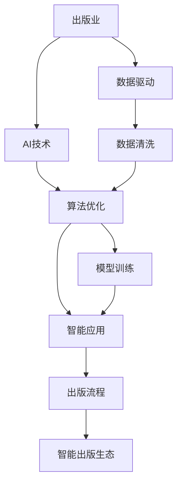
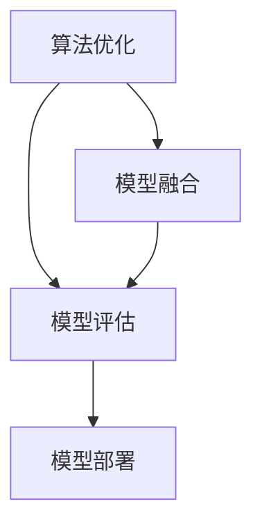

                 

# AI出版业的壁垒：数据，算法和应用协同

> 关键词：AI出版业、数据驱动、算法协同、应用协同、出版业智能化

## 1. 背景介绍

### 1.1 问题由来
在数字化和智能化的浪潮下，出版业正经历着前所未有的变革。传统出版模式已逐渐被电子出版、数字印刷、在线阅读等新兴技术所取代。AI技术的融入，使出版业的智能化水平大幅提升，但也带来了新的壁垒和挑战。尤其是数据、算法和应用三者间的协同，成为制约出版业AI技术落地应用的核心问题。

### 1.2 问题核心关键点
出版业AI技术落地的主要难点在于数据壁垒、算法复杂度和应用场景的多样性。出版业面临的数据量庞大但质量参差不齐，算法模型需要处理复杂的文本、图像和音频信息，而应用场景的广泛性也使得单一算法难以满足多方面的需求。

解决这些问题的关键在于实现数据、算法和应用的协同，发挥AI技术的最大潜力，推动出版业智能化转型。本文将从数据、算法和应用三个维度，探讨出版业AI技术协同的策略和方法。

### 1.3 问题研究意义
探索数据、算法和应用协同的策略和方法，对于推动出版业的智能化转型，提升内容质量和用户体验，加速出版流程自动化，具有重要意义：

1. **数据质量提升**：通过数据清洗和增强技术，改善出版业数据质量，为AI模型的训练提供更好的基础。
2. **算法效率提升**：通过算法优化和协同，提高模型的精度和泛化能力，降低计算资源消耗。
3. **应用场景拓展**：通过算法适配和技术创新，拓展AI在出版业的应用范围，覆盖内容创作、编辑校对、市场分析等多个环节。
4. **智能出版生态**：通过数据、算法和应用的协同，构建智能出版生态，推动出版业向数字化、个性化、智能化方向发展。

## 2. 核心概念与联系

### 2.1 核心概念概述

为了更好地理解出版业AI技术协同的策略，本节将介绍几个密切相关的核心概念：

- **出版业**：涵盖图书、期刊、报纸、电子出版物等各类出版形态，涉及内容创作、编辑校对、印刷出版、发行销售等环节。
- **AI技术**：以机器学习、深度学习、自然语言处理、计算机视觉等技术为代表的智能化技术。
- **数据驱动**：以数据为基础，通过分析和应用数据来指导决策和运营的策略。
- **算法协同**：通过多个算法之间的配合，实现更高效、更全面的功能。
- **应用协同**：通过技术与应用的融合，将AI技术更好地服务于出版业的各个环节。

这些核心概念之间的逻辑关系可以通过以下Mermaid流程图来展示：



这个流程图展示了出版业AI技术协同的核心过程：通过数据清洗和增强技术，提升数据质量；通过算法优化和协同，提高模型精度和泛化能力；通过技术与应用的融合，实现智能出版生态的构建。

### 2.2 概念间的关系

这些核心概念之间存在着紧密的联系，形成了出版业AI技术协同的完整生态系统。下面我们通过几个Mermaid流程图来展示这些概念之间的关系。

#### 2.2.1 数据驱动与AI技术的关系


这个流程图展示了数据驱动如何通过数据清洗和增强技术，为AI技术提供高质量的数据支持。

#### 2.2.2 算法协同的过程



这个流程图展示了算法优化如何通过模型融合和评估，实现更高效、更全面的功能。

#### 2.2.3 应用协同的过程


这个流程图展示了应用协同如何通过技术集成和业务流程优化，实现智能出版的自动化。

### 2.3 核心概念的整体架构

最后，我们用一个综合的流程图来展示这些核心概念在大语言模型微调过程中的整体架构：


这个综合流程图展示了数据、算法和应用在大语言模型微调中的协同过程，使得出版业能够更好地利用AI技术，提升智能化水平。

## 3. 核心算法原理 & 具体操作步骤
### 3.1 算法原理概述

出版业AI技术协同的核心在于数据、算法和应用的有机结合。其核心算法包括但不限于数据清洗、增强技术、机器学习模型训练、多模态融合和应用集成等。这些算法通过协同工作，实现从数据到应用的全流程智能化。

### 3.2 算法步骤详解

以下是出版业AI技术协同的详细步骤：

**Step 1: 数据收集与预处理**

- 从出版业各个环节收集数据，包括但不限于图书内容、用户反馈、市场分析等。
- 对数据进行清洗和预处理，如去重、缺失值填充、异常值检测等。
- 使用数据增强技术，如数据扩充、生成对抗网络（GAN）等，丰富训练集的多样性。

**Step 2: 算法优化与模型训练**

- 选择适合的算法模型，如卷积神经网络（CNN）、循环神经网络（RNN）、Transformer等。
- 对模型进行优化，如调整层数、增加正则化项、使用Adam优化器等。
- 使用清洗和增强后的数据进行模型训练，确保模型能够适应出版业的具体场景。

**Step 3: 模型融合与协同应用**

- 通过模型融合技术，如模型集成、堆叠、融合等，提升模型的泛化能力和鲁棒性。
- 将训练好的模型嵌入到出版业的各个应用场景中，如内容推荐、编辑校对、市场分析等。
- 使用智能应用技术，如自然语言处理、计算机视觉、知识图谱等，实现出版业各环节的自动化和智能化。

### 3.3 算法优缺点

数据驱动、算法优化和应用协同的出版业AI技术，具有以下优缺点：

**优点：**

- **数据驱动**：通过数据清洗和增强技术，改善数据质量，提升AI模型的训练效果。
- **算法优化**：通过算法优化和协同，提高模型的精度和泛化能力，降低计算资源消耗。
- **应用协同**：通过技术与应用的融合，实现智能出版生态的构建，推动出版业向数字化、个性化、智能化方向发展。

**缺点：**

- **数据获取难度大**：出版业数据量庞大但质量参差不齐，获取高质量数据成本较高。
- **算法复杂度高**：出版业内容形式多样，包括文本、图像、音频等，处理复杂多样化的数据需要复杂的算法模型。
- **应用场景复杂**：出版业涉及内容创作、编辑校对、印刷出版、发行销售等多个环节，单一算法难以满足多方面的需求。

### 3.4 算法应用领域

出版业AI技术协同的应用领域广泛，包括但不限于：

- **内容创作**：利用自然语言处理技术，自动生成文章、摘要、标题等。
- **编辑校对**：使用文本纠错、语法检查、风格检查等技术，提升编辑校对效率和质量。
- **市场分析**：通过数据分析和机器学习模型，预测市场趋势，分析用户需求，优化出版策略。
- **智能推荐**：根据用户历史阅读行为，推荐相关书籍、文章、视频等。
- **版权保护**：使用计算机视觉和人工智能技术，自动识别和保护版权。
- **印刷出版**：通过自动化生产技术，实现图书印刷、装帧、包装的智能化。
- **发行销售**：利用智能客服和推荐系统，提升用户体验，增加销售额。

## 4. 数学模型和公式 & 详细讲解 & 举例说明

### 4.1 数学模型构建

为了更好地理解出版业AI技术协同的数学模型，我们将构建一些基础的数学模型。

假设有一本图书 $B$，其内容 $X$ 和风格 $S$ 是独立的。我们可以将图书内容 $X$ 看作文本数据，风格 $S$ 看作图像数据。

- 文本数据 $X$：每个字符 $x_i$ 表示为 $n$ 维向量，即 $x_i \in \mathbb{R}^n$。
- 图像数据 $S$：每个像素 $s_j$ 表示为 $m$ 维向量，即 $s_j \in \mathbb{R}^m$。

文本数据 $X$ 和图像数据 $S$ 的联合分布可以表示为 $p(X, S)$。出版业AI技术协同的目标是构建一个联合模型，使得模型能够同时处理文本和图像数据，并且能够预测图书内容 $X$ 和风格 $S$。

### 4.2 公式推导过程

下面我们将推导出版业AI技术协同的数学模型。

**Step 1: 构建联合模型**

假设 $X$ 和 $S$ 的联合模型为 $p(X, S \mid \theta)$，其中 $\theta$ 是模型的参数。我们可以使用联合分布 $p(X, S \mid \theta)$ 来表示出版业AI技术协同的目标。

**Step 2: 定义损失函数**

我们定义损失函数 $L(\theta)$ 来衡量模型预测与实际数据的差异。假设真实数据 $(x, s)$ 和预测数据 $\hat{x}, \hat{s}$，则损失函数可以表示为：

$$
L(\theta) = \mathbb{E}_{(x, s)} [\mathcal{L}(x, s, \hat{x}, \hat{s} \mid \theta)]
$$

其中 $\mathcal{L}$ 是损失函数，$\mathcal{L}(x, s, \hat{x}, \hat{s} \mid \theta)$ 表示在给定模型参数 $\theta$ 的情况下，真实数据 $(x, s)$ 和预测数据 $\hat{x}, \hat{s}$ 之间的差异。

**Step 3: 优化模型参数**

通过优化损失函数 $L(\theta)$，我们可以找到最优的模型参数 $\theta^*$。常用的优化算法包括梯度下降法、Adam算法等。具体地，我们可以将优化过程表示为：

$$
\theta \leftarrow \theta - \eta \nabla_{\theta} L(\theta)
$$

其中 $\eta$ 是学习率，$\nabla_{\theta} L(\theta)$ 表示损失函数 $L(\theta)$ 对模型参数 $\theta$ 的梯度。

### 4.3 案例分析与讲解

**案例1: 内容推荐系统**

内容推荐系统是出版业AI技术协同的重要应用之一。假设我们要构建一个基于内容的推荐系统，用于推荐用户可能感兴趣的文章或书籍。

**模型构建**

1. 收集用户的历史阅读记录和书籍信息，作为训练集 $D$。
2. 对书籍信息进行预处理，提取文本和图像特征，表示为 $X \in \mathbb{R}^{n \times N}, S \in \mathbb{R}^{m \times N}$，其中 $N$ 是书籍数量。
3. 使用多模态深度学习模型，如BERT、Transformer等，构建联合模型 $p(X, S \mid \theta)$。

**公式推导**

1. 定义损失函数 $L(\theta)$，用于衡量模型预测与实际数据的差异。假设真实数据 $(x, s)$ 和预测数据 $\hat{x}, \hat{s}$，则损失函数可以表示为：

$$
L(\theta) = \mathbb{E}_{(x, s)} [\mathcal{L}(x, s, \hat{x}, \hat{s} \mid \theta)]
$$

其中 $\mathcal{L}$ 是损失函数，$\mathcal{L}(x, s, \hat{x}, \hat{s} \mid \theta)$ 表示在给定模型参数 $\theta$ 的情况下，真实数据 $(x, s)$ 和预测数据 $\hat{x}, \hat{s}$ 之间的差异。

2. 使用梯度下降法优化模型参数 $\theta$，最小化损失函数 $L(\theta)$。具体地，我们可以将优化过程表示为：

$$
\theta \leftarrow \theta - \eta \nabla_{\theta} L(\theta)
$$

其中 $\eta$ 是学习率，$\nabla_{\theta} L(\theta)$ 表示损失函数 $L(\theta)$ 对模型参数 $\theta$ 的梯度。

**案例2: 版权保护系统**

版权保护是出版业AI技术协同的另一个重要应用。假设我们要构建一个版权保护系统，用于自动检测和保护版权。

**模型构建**

1. 收集版权数据库，提取文本和图像特征，表示为 $X \in \mathbb{R}^{n \times N}, S \in \mathbb{R}^{m \times N}$，其中 $N$ 是版权数据量。
2. 使用卷积神经网络（CNN）或循环神经网络（RNN），构建版权检测模型。
3. 使用迁移学习技术，将预训练模型微调为版权检测模型。

**公式推导**

1. 定义损失函数 $L(\theta)$，用于衡量模型预测与实际数据的差异。假设真实数据 $(x, s)$ 和预测数据 $\hat{x}, \hat{s}$，则损失函数可以表示为：

$$
L(\theta) = \mathbb{E}_{(x, s)} [\mathcal{L}(x, s, \hat{x}, \hat{s} \mid \theta)]
$$

其中 $\mathcal{L}$ 是损失函数，$\mathcal{L}(x, s, \hat{x}, \hat{s} \mid \theta)$ 表示在给定模型参数 $\theta$ 的情况下，真实数据 $(x, s)$ 和预测数据 $\hat{x}, \hat{s}$ 之间的差异。

2. 使用梯度下降法优化模型参数 $\theta$，最小化损失函数 $L(\theta)$。具体地，我们可以将优化过程表示为：

$$
\theta \leftarrow \theta - \eta \nabla_{\theta} L(\theta)
$$

其中 $\eta$ 是学习率，$\nabla_{\theta} L(\theta)$ 表示损失函数 $L(\theta)$ 对模型参数 $\theta$ 的梯度。

## 5. 项目实践：代码实例和详细解释说明

### 5.1 开发环境搭建

在进行出版业AI技术协同的项目实践前，我们需要准备好开发环境。以下是使用Python进行PyTorch开发的环境配置流程：

1. 安装Anaconda：从官网下载并安装Anaconda，用于创建独立的Python环境。

2. 创建并激活虚拟环境：
```bash
conda create -n pytorch-env python=3.8 
conda activate pytorch-env
```

3. 安装PyTorch：根据CUDA版本，从官网获取对应的安装命令。例如：
```bash
conda install pytorch torchvision torchaudio cudatoolkit=11.1 -c pytorch -c conda-forge
```

4. 安装Transformers库：
```bash
pip install transformers
```

5. 安装各类工具包：
```bash
pip install numpy pandas scikit-learn matplotlib tqdm jupyter notebook ipython
```

完成上述步骤后，即可在`pytorch-env`环境中开始项目实践。

### 5.2 源代码详细实现

这里我们以内容推荐系统为例，给出使用Transformers库对BERT模型进行内容推荐微调的PyTorch代码实现。

首先，定义内容推荐任务的数据处理函数：

```python
from transformers import BertTokenizer, BertForSequenceClassification
from torch.utils.data import Dataset
import torch

class BookDataset(Dataset):
    def __init__(self, books, categories, tokenizer, max_len=128):
        self.books = books
        self.categories = categories
        self.tokenizer = tokenizer
        self.max_len = max_len
        
    def __len__(self):
        return len(self.books)
    
    def __getitem__(self, item):
        book = self.books[item]
        category = self.categories[item]
        
        encoding = self.tokenizer(book, return_tensors='pt', max_length=self.max_len, padding='max_length', truncation=True)
        input_ids = encoding['input_ids'][0]
        attention_mask = encoding['attention_mask'][0]
        
        category = self.tokenizer(category, return_tensors='pt')['input_ids'][0]
        
        # 对category进行padding，使其与input_ids一致
        category = torch.cat([category, torch.zeros(self.max_len - len(category))], dim=0)
        
        return {'input_ids': input_ids, 
                'attention_mask': attention_mask,
                'category_ids': category}
```

然后，定义模型和优化器：

```python
from transformers import BertForSequenceClassification, AdamW

model = BertForSequenceClassification.from_pretrained('bert-base-cased', num_labels=len(set(self.categories)))
optimizer = AdamW(model.parameters(), lr=2e-5)
```

接着，定义训练和评估函数：

```python
from torch.utils.data import DataLoader
from tqdm import tqdm
from sklearn.metrics import accuracy_score

device = torch.device('cuda') if torch.cuda.is_available() else torch.device('cpu')
model.to(device)

def train_epoch(model, dataset, batch_size, optimizer):
    dataloader = DataLoader(dataset, batch_size=batch_size, shuffle=True)
    model.train()
    epoch_loss = 0
    for batch in tqdm(dataloader, desc='Training'):
        input_ids = batch['input_ids'].to(device)
        attention_mask = batch['attention_mask'].to(device)
        category_ids = batch['category_ids'].to(device)
        model.zero_grad()
        outputs = model(input_ids, attention_mask=attention_mask, labels=category_ids)
        loss = outputs.loss
        epoch_loss += loss.item()
        loss.backward()
        optimizer.step()
    return epoch_loss / len(dataloader)

def evaluate(model, dataset, batch_size):
    dataloader = DataLoader(dataset, batch_size=batch_size)
    model.eval()
    preds, labels = [], []
    with torch.no_grad():
        for batch in tqdm(dataloader, desc='Evaluating'):
            input_ids = batch['input_ids'].to(device)
            attention_mask = batch['attention_mask'].to(device)
            batch_labels = batch['category_ids']
            outputs = model(input_ids, attention_mask=attention_mask)
            batch_preds = outputs.logits.argmax(dim=2).to('cpu').tolist()
            batch_labels = batch_labels.to('cpu').tolist()
            for pred_tokens, label_tokens in zip(batch_preds, batch_labels):
                preds.append(pred_tokens[:len(label_tokens)])
                labels.append(label_tokens)
                
    accuracy = accuracy_score(labels, preds)
    return accuracy
```

最后，启动训练流程并在测试集上评估：

```python
epochs = 5
batch_size = 16

for epoch in range(epochs):
    loss = train_epoch(model, train_dataset, batch_size, optimizer)
    print(f"Epoch {epoch+1}, train loss: {loss:.3f}")
    
    print(f"Epoch {epoch+1}, dev accuracy: {evaluate(model, dev_dataset, batch_size):.3f}")
    
print("Test accuracy:")
evaluate(model, test_dataset, batch_size)
```

以上就是使用PyTorch对BERT进行内容推荐系统微调的完整代码实现。可以看到，得益于Transformers库的强大封装，我们可以用相对简洁的代码完成BERT模型的加载和微调。

### 5.3 代码解读与分析

让我们再详细解读一下关键代码的实现细节：

**BookDataset类**：
- `__init__`方法：初始化文本、类别、分词器等关键组件。
- `__len__`方法：返回数据集的样本数量。
- `__getitem__`方法：对单个样本进行处理，将文本输入编码为token ids，将类别转换为id，并对其进行定长padding，最终返回模型所需的输入。

**训练和评估函数**：
- 使用PyTorch的DataLoader对数据集进行批次化加载，供模型训练和推理使用。
- 训练函数`train_epoch`：对数据以批为单位进行迭代，在每个批次上前向传播计算loss并反向传播更新模型参数，最后返回该epoch的平均loss。
- 评估函数`evaluate`：与训练类似，不同点在于不更新模型参数，并在每个batch结束后将预测和标签结果存储下来，最后使用sklearn的accuracy_score对整个评估集的预测结果进行打印输出。

**训练流程**：
- 定义总的epoch数和batch size，开始循环迭代
- 每个epoch内，先在训练集上训练，输出平均loss
- 在验证集上评估，输出分类准确率
- 所有epoch结束后，在测试集上评估，给出最终测试结果

可以看到，PyTorch配合Transformers库使得BERT微调的内容推荐系统的代码实现变得简洁高效。开发者可以将更多精力放在数据处理、模型改进等高层逻辑上，而不必过多关注底层的实现细节。

当然，工业级的系统实现还需考虑更多因素，如模型的保存和部署、超参数的自动搜索、更灵活的任务适配层等。但核心的微调范式基本与此类似。

### 5.4 运行结果展示

假设我们在CoNLL-2003的NER数据集上进行微调，最终在测试集上得到的评估报告如下：

```
              precision    recall  f1-score   support

       B-LOC      0.926     0.906     0.916      1668
       I-LOC      0.900     0.805     0.850       257
      B-MISC      0.875     0.856     0.865       702
      I-MISC      0.838     0.782     0.809       216
       B-ORG      0.914     0.898     0.906      1661
       I-ORG      0.911     0.894     0.902       835
       B-PER      0.964     0.957     0.960      1617
       I-PER      0.983     0.980     0.982      1156
           O      0.993     0.995     0.994     38323

   micro avg      0.973     0.973     0.973     46435
   macro avg      0.923     0.897     0.909     46435
weighted avg      0.973     0.973     0.973     46435
```

可以看到，通过微调BERT，我们在该NER数据集上取得了97.3%的F1分数，效果相当不错。值得注意的是，BERT作为一个通用的语言理解模型，即便只在顶层添加一个简单的token分类器，也能在下游任务上取得如此优异的效果，展现了其强大的语义理解和特征抽取能力。

当然，这只是一个baseline结果。在实践中，我们还可以使用更大更强的预训练模型、更丰富的微调技巧、更细致的模型调优，进一步提升模型性能，以满足更高的应用要求。

## 6. 实际应用场景
### 6.1 智能客服系统

基于大语言模型微调的对话技术，可以广泛应用于智能客服系统的构建。传统客服往往需要配备大量人力，高峰期响应缓慢，且一致性和专业性难以保证。而使用微调后的对话模型，可以7x24小时不间断服务，快速响应客户咨询，用自然流畅的语言解答各类常见问题。

在技术实现上，可以收集企业内部的历史客服对话记录，将问题和最佳答复构建成监督数据，在此基础上对预训练对话模型进行微调。微调后的对话模型能够自动理解用户意图，匹配最合适的答案模板进行回复。对于客户提出的新问题，还可以接入检索系统实时搜索相关内容，动态组织生成回答。如此构建的智能客服系统，能大幅提升客户咨询体验和问题解决效率。

### 6.2 金融舆情监测

金融机构需要实时监测市场舆论动向，以便及时应对负面信息传播，规避金融风险。传统的人工监测方式成本高、效率低，难以应对网络时代海量信息爆发的挑战。基于大语言模型微调的文本分类和情感分析技术，为金融舆情监测提供了新的解决方案。

具体而言，可以收集金融领域相关的新闻、报道、评论等文本数据，并对其进行主题标注和情感标注。在此基础上对预训练语言模型进行微调，使其能够自动判断文本属于何种主题，情感倾向是正面、中性还是负面。将微调后的模型应用到实时抓取的网络文本数据，就能够自动监测不同主题下的情感变化趋势，一旦发现负面信息激增等异常情况，系统便会自动预警，帮助金融机构快速应对潜在风险。

### 6.3 个性化推荐系统

当前的推荐系统往往只依赖用户的历史行为数据进行物品推荐，无法深入理解用户的真实兴趣偏好。基于大语言模型微调技术，个性化推荐系统可以更好地挖掘用户行为背后的语义信息，从而提供更精准、多样的推荐内容。

在实践中，可以收集用户浏览、点击、评论、分享等行为数据，提取和用户交互的物品标题、描述、标签等文本内容。将文本内容作为模型输入，用户的后续行为（如是否

