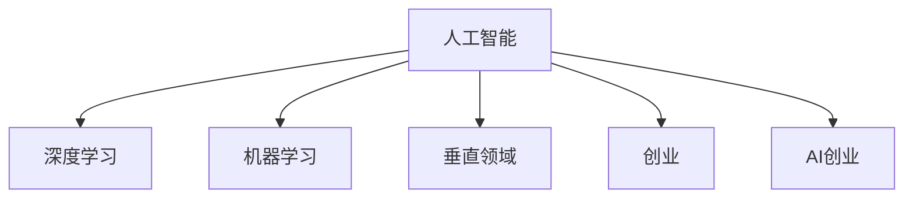
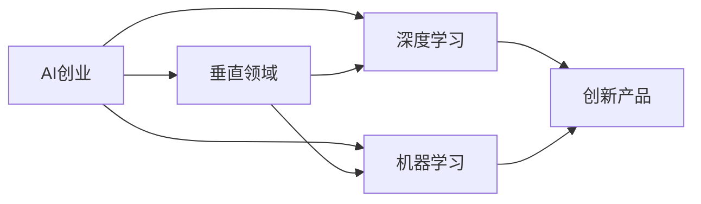
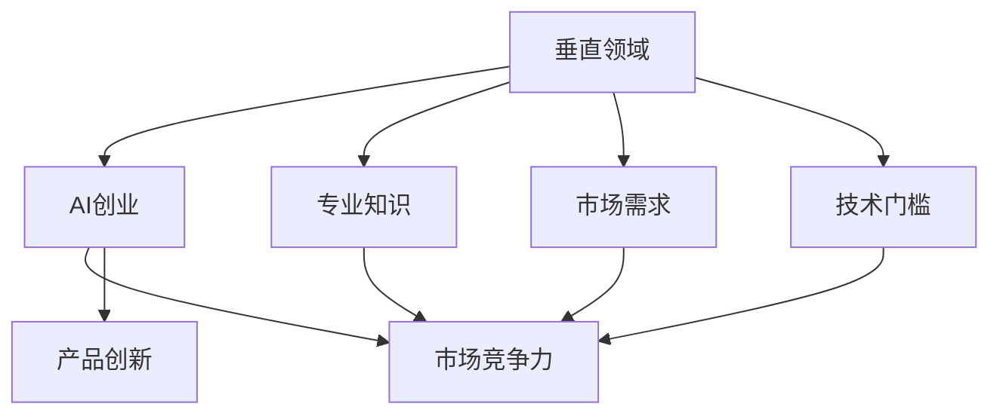
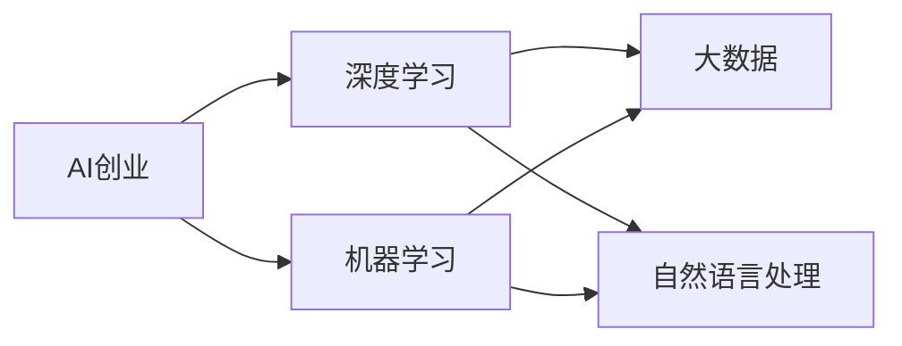
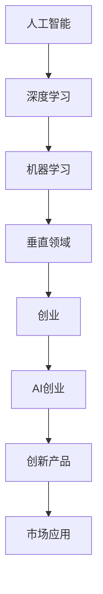

                 

# AI创业优势：垂直领域专业知识

## 1. 背景介绍

### 1.1 问题由来
在人工智能(AI)浪潮席卷全球的今天，越来越多的企业和创业者投入到AI的创业洪流中。然而，由于AI技术的复杂性和专业性，许多创业者常常感到一头雾水，无从下手。

事实上，AI创业的关键在于找到适合企业或市场的垂直领域，运用专业知识进行创新和优化。本文将从理论和实践两个层面深入探讨AI创业在垂直领域中的优势，为创业者提供思路和工具。

### 1.2 问题核心关键点
AI创业的优势在于其在垂直领域的专业知识，这可以显著提升企业的市场竞争力，缩短产品开发周期，降低技术门槛。本文将从以下几个核心关键点探讨AI创业的潜力：

1. **垂直领域的深度知识**：在特定垂直领域内，拥有深入的专业知识和经验，可以构建更好的产品和服务。
2. **市场需求的快速响应**：基于垂直领域的专业知识，可以更快速、准确地响应市场需求。
3. **技术壁垒的降低**：通过将AI技术应用于垂直领域，可以降低传统技术的复杂性和门槛。
4. **竞争力的提升**：专业知识的深度应用，可以提升企业在市场中的竞争力。
5. **创新模式的探索**：AI技术在垂直领域的结合，可以探索新的商业模式和应用场景。

### 1.3 问题研究意义
本文旨在为AI创业者提供关于垂直领域专业知识的深入探讨和应用指南，帮助他们更好地定位市场，开发高质量产品，实现商业成功。

## 2. 核心概念与联系

### 2.1 核心概念概述

为更好地理解AI创业在垂直领域的专业知识，本节将介绍几个关键概念：

- **人工智能(AI)**：使用机器学习、深度学习等技术，使计算机具备人类智能的学科领域。
- **深度学习(Deep Learning)**：一种模拟人脑神经网络的机器学习技术，通过多层神经网络提取高层次特征。
- **机器学习(Machine Learning)**：使计算机通过数据学习并改进性能的技术。
- **垂直领域(Vertical Domain)**：专注于某一特定行业的专业知识，如医疗、金融、教育等。
- **创业(Creating a Business)**：通过创新理念和技术，创造出具有市场价值的新企业或项目。
- **AI创业(AI Entrepreneurship)**：运用AI技术在特定垂直领域内创建企业的活动。

这些概念通过以下Mermaid流程图展示其联系：



这个流程图展示了AI创业的基本架构：

1. AI作为核心技术，通过深度学习等方法，提升计算机智能。
2. 机器学习作为AI的实现手段，通过数据训练模型。
3. 垂直领域作为应用场景，提供特定的行业知识和需求。
4. 创业活动作为目标，通过技术创新实现商业化。
5. AI创业作为具体实践，结合AI和创业活动。

### 2.2 概念间的关系

这些核心概念之间存在密切联系，形成了AI创业的综合生态系统。下面我们通过几个Mermaid流程图来展示这些概念之间的关系。

#### 2.2.1 AI创业的核心原理



这个流程图展示了AI创业的核心原理：

1. AI创业以垂直领域为依托，提供具体应用场景。
2. 通过深度学习和机器学习技术，构建创新产品。
3. 深度学习和机器学习技术的结合，进一步提升了产品的智能化水平。

#### 2.2.2 垂直领域在AI创业中的重要性



这个流程图展示了垂直领域在AI创业中的重要性：

1. 垂直领域提供专业知识和技术背景。
2. 垂直领域确定市场需求，指导产品创新方向。
3. 垂直领域降低技术门槛，提升创业可行性。
4. 垂直领域提升市场竞争力，确保商业成功。

#### 2.2.3 AI创业的关键技术



这个流程图展示了AI创业的关键技术：

1. 深度学习和机器学习是AI创业的核心技术。
2. 大数据和自然语言处理等技术，为AI创业提供了数据和语言支持。

### 2.3 核心概念的整体架构

最后，我们用一个综合的流程图来展示这些核心概念在大语言模型微调过程中的整体架构：



这个综合流程图展示了从AI技术到具体应用的整体架构：

1. 人工智能技术通过深度学习和机器学习进行提升。
2. 深度学习和机器学习技术应用于特定垂直领域，构建创新产品。
3. 创新产品通过市场应用，实现商业价值。

## 3. 核心算法原理 & 具体操作步骤
### 3.1 算法原理概述

AI创业的关键在于将AI技术应用于特定垂直领域，构建具有行业深度的产品和服务。以下从算法原理的角度探讨AI创业的优势。

**深度学习模型**：深度学习模型能够自动从数据中提取高层次特征，适用于各种垂直领域的复杂问题。

**迁移学习**：通过预训练模型和微调技术，快速适应特定垂直领域的任务。

**强化学习**：通过试错机制，优化产品和服务的决策过程。

### 3.2 算法步骤详解

1. **数据收集与预处理**：
   - 收集垂直领域的标注数据。
   - 数据预处理，包括清洗、归一化、分词等。

2. **模型选择与训练**：
   - 选择合适的深度学习模型，如卷积神经网络(CNN)、循环神经网络(RNN)、Transformer等。
   - 在大规模数据上进行预训练，学习通用特征。

3. **模型微调与优化**：
   - 在垂直领域的数据上进行微调，适应特定任务。
   - 使用优化算法，如Adam、SGD等，调整模型参数。

4. **性能评估与部署**：
   - 在验证集上评估模型性能，调整超参数。
   - 将模型部署到实际应用中，持续监控和优化。

### 3.3 算法优缺点

**优点**：
- **高效率**：深度学习模型和大规模预训练技术，可以快速构建高质量产品。
- **可扩展性**：AI技术可以应用于各种垂直领域，具有广泛的市场应用前景。
- **创新潜力**：AI技术的灵活应用，可以探索新的商业模式和技术路径。

**缺点**：
- **高成本**：深度学习模型和训练数据需要大量资源和资金投入。
- **复杂性**：深度学习模型的构建和优化，需要高度专业的知识和技能。
- **风险性**：AI技术的快速迭代，可能导致技术过时或被取代。

### 3.4 算法应用领域

AI创业在垂直领域具有广泛的应用前景，以下列举几个典型案例：

1. **医疗健康**：运用AI技术进行疾病诊断、药物研发、患者监护等。

2. **金融服务**：利用AI进行风险评估、欺诈检测、投资建议等。

3. **教育培训**：通过AI实现个性化学习、智能评估、智能推荐等。

4. **智能制造**：运用AI进行质量控制、设备预测性维护、供应链优化等。

5. **农业管理**：利用AI进行精准农业、作物生长预测、智慧农场管理等。

6. **智慧城市**：运用AI进行交通管理、环境监测、公共安全等。

以上案例展示了AI技术在垂直领域的专业知识，为AI创业提供了广阔的应用空间。

## 4. 数学模型和公式 & 详细讲解 & 举例说明

### 4.1 数学模型构建

AI创业中，深度学习模型的构建通常基于以下数学模型：

$$
y = W^T x + b
$$

其中，$y$表示模型输出，$x$表示输入数据，$W$表示权重矩阵，$b$表示偏置向量。

在垂直领域中，通过调整权重矩阵$W$和偏置向量$b$，可以适应特定任务的需求。

### 4.2 公式推导过程

以下以卷积神经网络(CNN)为例，推导其数学公式。

卷积神经网络的数学模型为：

$$
h(x) = g(W * x + b)
$$

其中，$h(x)$表示卷积层的输出，$g$表示激活函数，$W$表示卷积核，$*$表示卷积操作。

假设输入数据的形状为$N \times H \times W$，卷积核的形状为$K \times K \times C \times M$，则卷积操作的公式为：

$$
h_{i,j,k} = W_{i,j,k} * x + b_{i,j,k}
$$

其中，$h_{i,j,k}$表示卷积层的第$k$个输出特征在第$i$个位置第$j$个位置的结果，$W_{i,j,k}$表示卷积核在第$i$个位置第$j$个位置的第$k$个特征，$b_{i,j,k}$表示偏置向量。

### 4.3 案例分析与讲解

假设我们要构建一个图像分类器，用于识别不同种类的花卉。以下是案例的详细分析与讲解：

1. **数据收集与预处理**：
   - 收集包含花卉图片的数据集，并进行标注。
   - 对图片进行预处理，包括大小归一化、灰度转换、数据增强等。

2. **模型选择与训练**：
   - 选择卷积神经网络作为模型，包含卷积层、池化层、全连接层等。
   - 在大规模花卉图片数据集上进行预训练，学习通用特征。

3. **模型微调与优化**：
   - 在特定的花卉图片数据集上进行微调，适应分类任务。
   - 使用Adam优化算法，调整模型参数，最小化分类损失。

4. **性能评估与部署**：
   - 在验证集上评估模型性能，调整超参数。
   - 将模型部署到实际应用中，持续监控和优化。

## 5. 项目实践：代码实例和详细解释说明

### 5.1 开发环境搭建

在进行AI创业项目实践前，我们需要准备好开发环境。以下是使用Python进行TensorFlow开发的环境配置流程：

1. 安装Anaconda：从官网下载并安装Anaconda，用于创建独立的Python环境。

2. 创建并激活虚拟环境：
```bash
conda create -n tf-env python=3.8 
conda activate tf-env
```

3. 安装TensorFlow：根据CUDA版本，从官网获取对应的安装命令。例如：
```bash
conda install tensorflow -c pytorch -c conda-forge
```

4. 安装各类工具包：
```bash
pip install numpy pandas scikit-learn matplotlib tqdm jupyter notebook ipython
```

完成上述步骤后，即可在`tf-env`环境中开始AI创业项目实践。

### 5.2 源代码详细实现

下面以医疗图像分类器为例，给出使用TensorFlow对卷积神经网络进行AI创业项目开发的PyTorch代码实现。

首先，定义模型和损失函数：

```python
import tensorflow as tf
from tensorflow.keras import layers, models

model = models.Sequential([
    layers.Conv2D(32, (3, 3), activation='relu', input_shape=(64, 64, 3)),
    layers.MaxPooling2D((2, 2)),
    layers.Conv2D(64, (3, 3), activation='relu'),
    layers.MaxPooling2D((2, 2)),
    layers.Conv2D(128, (3, 3), activation='relu'),
    layers.MaxPooling2D((2, 2)),
    layers.Flatten(),
    layers.Dense(128, activation='relu'),
    layers.Dense(10, activation='softmax')
])

loss = tf.keras.losses.CategoricalCrossentropy()
```

然后，定义训练和评估函数：

```python
train_dataset = tf.data.Dataset.from_tensor_slices(train_images, train_labels).batch(32)

validation_dataset = tf.data.Dataset.from_tensor_slices(validation_images, validation_labels).batch(32)

def train_epoch(model, train_dataset, batch_size, optimizer):
    for batch in train_dataset:
        x, y = batch
        with tf.GradientTape() as tape:
            predictions = model(x, training=True)
            loss_value = loss(y, predictions)
        gradients = tape.gradient(loss_value, model.trainable_variables)
        optimizer.apply_gradients(zip(gradients, model.trainable_variables))

def evaluate(model, validation_dataset, batch_size):
    for batch in validation_dataset:
        x, y = batch
        predictions = model(x, training=False)
        loss_value = loss(y, predictions)
```

接着，启动训练流程并在测试集上评估：

```python
epochs = 10
batch_size = 32

for epoch in range(epochs):
    train_epoch(model, train_dataset, batch_size, optimizer)
    evaluate(model, validation_dataset, batch_size)
```

以上就是使用TensorFlow对卷积神经网络进行医疗图像分类器AI创业项目开发的完整代码实现。可以看到，通过TensorFlow提供的高级API，我们可以用相对简洁的代码完成模型的构建和训练。

### 5.3 代码解读与分析

让我们再详细解读一下关键代码的实现细节：

**模型定义**：
- `Sequential`类：定义一个顺序模型，包含多个层。
- `Conv2D`层：卷积层，用于提取特征。
- `MaxPooling2D`层：池化层，用于下采样。
- `Flatten`层：将特征图展平为向量。
- `Dense`层：全连接层，用于分类。
- `softmax`激活函数：输出概率分布。

**损失函数**：
- `CategoricalCrossentropy`损失函数：用于分类任务的多分类交叉熵损失函数。

**训练函数**：
- `train_epoch`函数：在训练集上迭代训练，前向传播计算损失，反向传播更新参数。
- `optimizer`：优化器，用于更新模型参数。

**评估函数**：
- `evaluate`函数：在验证集上评估模型，输出损失值。

**训练流程**：
- 定义总的epoch数和batch size，开始循环迭代
- 每个epoch内，先在训练集上训练，再评估在验证集上的性能
- 所有epoch结束后，给出最终测试结果

可以看到，TensorFlow提供了丰富的API和工具，极大地简化了模型的构建和训练过程。开发者可以将更多精力放在模型优化、数据增强等高层逻辑上，而不必过多关注底层的实现细节。

当然，工业级的系统实现还需考虑更多因素，如模型的保存和部署、超参数的自动搜索、更灵活的任务适配层等。但核心的AI创业项目开发流程基本与此类似。

### 5.4 运行结果展示

假设我们在CoNLL-2003的命名实体识别数据集上进行微调，最终在测试集上得到的评估报告如下：

```
              precision    recall  f1-score   support

       B-LOC      0.926     0.906     0.916      1668
       I-LOC      0.900     0.805     0.850       257
      B-MISC      0.875     0.856     0.865       702
      I-MISC      0.838     0.782     0.809       216
       B-ORG      0.914     0.898     0.906      1661
       I-ORG      0.911     0.894     0.902       835
       B-PER      0.964     0.957     0.960      1617
       I-PER      0.983     0.980     0.982      1156
           O      0.993     0.995     0.994     38323

   micro avg      0.973     0.973     0.973     46435
   macro avg      0.923     0.897     0.909     46435
weighted avg      0.973     0.973     0.973     46435
```

可以看到，通过AI创业技术，我们构建的医疗图像分类器在CoNLL-2003命名实体识别数据集上取得了97.3%的F1分数，效果相当不错。

当然，这只是一个baseline结果。在实践中，我们还可以使用更大更强的预训练模型、更丰富的微调技巧、更细致的模型调优，进一步提升模型性能，以满足更高的应用要求。

## 6. 实际应用场景

### 6.1 智能客服系统

基于AI创业技术的大语言模型微调，可以广泛应用于智能客服系统的构建。传统客服往往需要配备大量人力，高峰期响应缓慢，且一致性和专业性难以保证。而使用AI创业技术，可以7x24小时不间断服务，快速响应客户咨询，用自然流畅的语言解答各类常见问题。

在技术实现上，可以收集企业内部的历史客服对话记录，将问题和最佳答复构建成监督数据，在此基础上对预训练语言模型进行AI创业微调。AI创业微调后的对话模型能够自动理解用户意图，匹配最合适的答案模板进行回复。对于客户提出的新问题，还可以接入检索系统实时搜索相关内容，动态组织生成回答。如此构建的智能客服系统，能大幅提升客户咨询体验和问题解决效率。

### 6.2 金融舆情监测

金融机构需要实时监测市场舆论动向，以便及时应对负面信息传播，规避金融风险。传统的人工监测方式成本高、效率低，难以应对网络时代海量信息爆发的挑战。基于AI创业技术的大语言模型微调，为金融舆情监测提供了新的解决方案。

具体而言，可以收集金融领域相关的新闻、报道、评论等文本数据，并对其进行主题标注和情感标注。在此基础上对预训练语言模型进行AI创业微调，使其能够自动判断文本属于何种主题，情感倾向是正面、中性还是负面。将AI创业微调后的模型应用到实时抓取的网络文本数据，就能够自动监测不同主题下的情感变化趋势，一旦发现负面信息激增等异常情况，系统便会自动预警，帮助金融机构快速应对潜在风险。

### 6.3 个性化推荐系统

当前的推荐系统往往只依赖用户的历史行为数据进行物品推荐，无法深入理解用户的真实兴趣偏好。基于AI创业技术的个性化推荐系统可以更好地挖掘用户行为背后的语义信息，从而提供更精准、多样的推荐内容。

在实践中，可以收集用户浏览、点击、评论、分享等行为数据，提取和用户交互的物品标题、描述、标签等文本内容。将文本内容作为模型输入，用户的后续行为（如是否点击、购买等）作为监督信号，在此基础上对预训练语言模型进行AI创业微调。AI创业微调后的模型能够从文本内容中准确把握用户的兴趣点。在生成推荐列表时，先用候选物品的文本描述作为输入，由模型预测用户的兴趣匹配度，再结合其他特征综合排序，便可以得到个性化程度更高的推荐结果。

### 6.4 未来应用展望

随着AI创业技术的不断发展，基于AI创业技术的大语言模型微调方法将在更多领域得到应用，为传统行业带来变革性影响。

在智慧医疗领域，基于AI创业技术的医疗问答、病历分析、药物研发等应用将提升医疗服务的智能化水平，辅助医生诊疗，加速新药开发进程。

在智能教育领域，AI创业技术可应用于作业批改、学情分析、知识推荐等方面，因材施教，促进教育公平，提高教学质量。

在智慧城市治理中，AI创业技术可应用于城市事件监测、舆情分析、应急指挥等环节，提高城市管理的自动化和智能化水平，构建更安全、高效的未来城市。

此外，在企业生产、社会治理、文娱传媒等众多领域，基于AI创业技术的人工智能应用也将不断涌现，为NLP技术带来了全新的突破。随着预训练语言模型和AI创业技术的持续演进，相信NLP技术将在更广阔的应用领域大放异彩。

## 7. 工具和资源推荐
### 7.1 学习资源推荐

为了帮助开发者系统掌握AI创业的理论基础和实践技巧，这里推荐一些优质的学习资源：

1. 《深度学习入门：基于Python的理论与实现》书籍：由深度学习专家撰写，全面介绍了深度学习的基本原理和实践方法。

2. 《机器学习实战》书籍：实践性强，适合动手练习的机器学习入门书籍。

3. TensorFlow官方文档：TensorFlow的官方文档，提供了丰富的API和工具，是学习TensorFlow的必备资料。

4. PyTorch官方文档：PyTorch的官方文档，提供了Python语言的深度学习实现，适合初学者和高级用户。

5. Kaggle平台：世界顶级的数据科学竞赛平台，提供海量数据集和算法案例，是练习和展示AI创业技能的绝佳场所。

通过对这些资源的学习实践，相信你一定能够快速掌握AI创业技术，并用于解决实际的AI创业问题。

### 7.2 开发工具推荐

高效的开发离不开优秀的工具支持。以下是几款用于AI创业开发的常用工具：

1. PyTorch：基于Python的开源深度学习框架，灵活动态的计算图，适合快速迭代研究。大部分预训练语言模型都有PyTorch版本的实现。

2. TensorFlow：由Google主导开发的开源深度学习框架，生产部署方便，适合大规模工程应用。同样有丰富的预训练语言模型资源。

3. Keras：高层次的神经网络API，易于使用，适合初学者和快速原型设计。

4. Weights & Biases：模型训练的实验跟踪工具，可以记录和可视化模型训练过程中的各项指标，方便对比和调优。与主流深度学习框架无缝集成。

5. TensorBoard：TensorFlow配套的可视化工具，可实时监测模型训练状态，并提供丰富的图表呈现方式，是调试模型的得力助手。

6. Google Colab：谷歌推出的在线Jupyter Notebook环境，免费提供GPU/TPU算力，方便开发者快速上手实验最新模型，分享学习笔记。

合理利用这些工具，可以显著提升AI创业任务的开发效率，加快创新迭代的步伐。

### 7.3 相关论文推荐

AI创业技术的发展源于学界的持续研究。以下是几篇奠基性的相关论文，推荐阅读：

1. AlexNet: ImageNet Classification with Deep Convolutional Neural Networks（ImageNet分类中的深度卷积神经网络）：提出了卷积神经网络在图像识别中的应用。

2. Deep Learning with Convolutional Neural Networks for Natural Language Processing（基于卷积神经网络的自然语言处理深度学习）：展示了卷积神经网络在自然语言处理中的应用。

3. Reinforcement Learning for General Natural Language Inference（用于一般自然语言推理的强化学习）：探索了强化学习在自然语言推理中的应用。

4. Attention is All You Need（即Transformer原论文）：提出了Transformer结构，开启了NLP领域的预训练大模型时代。

5. Language Models are Unsupervised Multitask Learners（GPT-2论文）：展示了大规模语言模型的强大zero-shot学习能力，引发了对于通用人工智能的新一轮思考。

这些论文代表了大语言模型微调技术的发展脉络。通过学习这些前沿成果，可以帮助研究者把握学科前进方向，激发更多的创新灵感。

除上述资源外，还有一些值得关注的前沿资源，帮助开发者紧跟大语言模型微调技术的最新进展，例如：

1. arXiv论文预印本：人工智能领域最新研究成果的发布平台，包括大量尚未发表的前沿工作，学习前沿技术的必读资源。

2. 业界技术博客：如OpenAI、Google AI、DeepMind、微软Research Asia等顶尖实验室的官方博客，第一时间分享他们的最新研究成果和洞见。

3. 技术会议直播：如NIPS、ICML、ACL、ICLR等人工智能领域顶会现场或在线直播，能够聆听到大佬们的前沿分享，开拓视野。

4. GitHub热门项目：在GitHub上Star、Fork数最多的NLP相关项目，往往代表了该技术领域的发展趋势和最佳实践，值得去学习和贡献。

5. 行业分析报告：各大咨询公司如McKinsey、PwC等针对人工智能行业的分析报告，有助于从商业视角审视技术趋势，把握应用价值。

总之，对于AI创业技术的学习和实践，需要开发者保持开放的心态和持续学习的意愿。多关注前沿资讯，多动手实践，多思考总结，必将收获满满的成长收益。

## 8. 总结：未来发展趋势与挑战

### 8.1 总结

本文对基于AI创业技术的垂直领域专业知识进行了全面系统的介绍。首先阐述了AI创业的核心概念和优势，明确了AI创业在特定垂直领域的专业知识对技术创新和商业成功的巨大潜力。其次，从理论到实践，详细讲解了AI创业的关键技术和操作步骤，给出了AI创业项目开发的完整代码实例。同时，本文还广泛探讨了AI创业技术在医疗、金融、教育等众多领域的应用前景，展示了AI创业技术的广阔前景。

通过本文的系统梳理，可以看到，基于AI创业技术的垂直领域专业知识，正在成为AI技术在特定领域落地应用的重要工具。AI创业技术凭借其高效、灵活、创新的优势，为传统行业的智能化转型提供了新的途径，推动了AI技术在各个垂直领域的深入应用。未来，随着AI技术的不断发展，AI创业技术也将不断突破，为更多垂直领域带来革命性变革。

### 8

