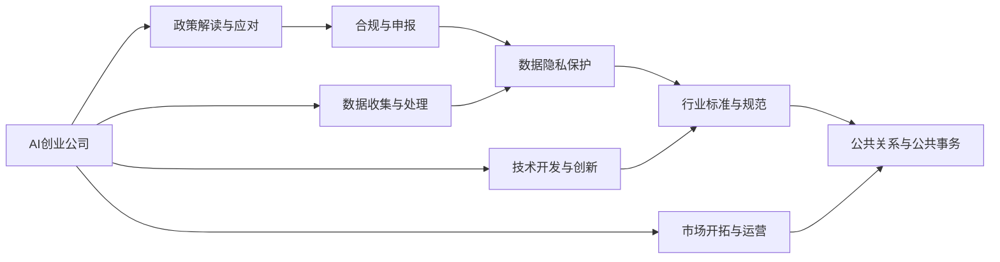

                 

# AI创业公司的政府关系管理

## 1. 背景介绍

### 1.1 问题由来

随着人工智能技术的快速发展，越来越多的创业公司开始运用AI技术解决实际问题，提高生产效率和用户体验。然而，在享受科技红利的同时，AI创业公司也面临着来自政府部门的监管和审查，这给公司运营带来了新的挑战和机遇。如何有效管理与政府的关系，确保公司在法律合规、市场准入等方面的顺利进行，成为摆在AI创业公司面前的重要课题。

### 1.2 问题核心关键点

政府关系管理涉及到AI创业公司与政府部门之间多层次、多方面的互动和沟通，核心关键点包括：

1. **政策解读与应对**：准确理解政府发布的各类政策和法规，快速响应市场变化。
2. **合规与申报**：确保公司运营符合政府规定，按时申报各类资质和许可证。
3. **数据隐私保护**：在数据收集和处理过程中，确保符合隐私保护法律法规，避免数据泄露和滥用。
4. **行业标准与规范**：遵守行业标准，参与制定行业规范，提升行业话语权。
5. **公共关系与公共事务**：与政府部门保持良好的沟通与合作，提升公司形象和公信力。

### 1.3 问题研究意义

研究AI创业公司的政府关系管理，对于提升公司法律合规性、保障数据隐私、增强行业影响力、优化运营流程等具有重要意义：

1. **法律合规性**：有效管理与政府关系，确保公司运营符合各类法律法规，避免法律风险。
2. **数据隐私保护**：遵守数据隐私保护法律法规，避免数据滥用和泄露，提升用户信任度。
3. **行业影响力**：通过积极参与行业标准的制定，提升公司在行业中的地位和影响力。
4. **运营效率**：优化政府关系管理流程，提升公司运营效率和市场响应速度。
5. **公共形象**：与政府部门保持良好的沟通与合作，提升公司在公众和媒体中的形象。

## 2. 核心概念与联系

### 2.1 核心概念概述

为了更好地理解AI创业公司的政府关系管理，我们首先需要介绍几个关键概念：

- **AI创业公司**：指的是专注于人工智能技术创新和应用的公司，涵盖从基础研究到应用开发、从技术产品到服务交付的各个环节。
- **政府关系管理**：指AI创业公司与政府部门之间建立、维护和发展关系的过程，涉及政策理解、法规遵循、数据隐私保护、行业标准遵守、公共关系管理等多方面内容。
- **政策解读与应对**：对政府发布的各类政策法规进行解读，并采取相应的措施进行应对。
- **合规与申报**：确保公司运营符合各类法律法规，按时申报各类资质和许可证。
- **数据隐私保护**：在数据收集、存储、处理和共享过程中，确保符合隐私保护法律法规。
- **行业标准与规范**：遵守行业标准，参与制定行业规范，提升行业话语权。
- **公共关系与公共事务**：与政府部门保持良好的沟通与合作，提升公司形象和公信力。

这些概念之间通过政策、法规、数据、行业标准等纽带，形成了一个完整的政府关系管理框架。

### 2.2 概念间的关系

通过以下Mermaid流程图，我们可以更直观地理解这些概念之间的联系：



这个流程图展示了AI创业公司在政府关系管理过程中涉及的多个环节及其相互关系。具体来说，AI创业公司通过解读政策、确保合规、保护数据隐私、参与行业标准制定和维护公共关系，确保公司在法律合规、市场准入、数据安全和行业影响力等方面的顺利进行。

## 3. 核心算法原理 & 具体操作步骤
### 3.1 算法原理概述

AI创业公司的政府关系管理涉及多方面的决策和执行，包括政策解读、合规申报、数据隐私保护、行业标准制定和公共关系维护等。这些决策和执行过程可以通过一系列算法和流程来优化和自动化。

核心算法原理可以总结为以下几个方面：

- **政策解读算法**：通过自然语言处理(NLP)技术，自动解析政府发布的政策法规，提取关键信息，进行快速响应。
- **合规申报算法**：根据政府要求，自动生成和提交合规申报文件，确保符合各类规定。
- **数据隐私保护算法**：采用差分隐私、数据脱敏等技术，确保数据处理过程中符合隐私保护法律法规。
- **行业标准制定算法**：通过统计分析和专家咨询，参与制定行业标准，提升公司在行业中的影响力。
- **公共关系维护算法**：通过社交媒体监测、舆情分析等技术，提升与政府部门的互动和沟通效果。

### 3.2 算法步骤详解

以下是AI创业公司在政府关系管理中常用的算法步骤详解：

**Step 1: 政策解读与应对**

1. **数据收集**：收集政府发布的各类政策法规文档，存储在数据库中。
2. **自然语言处理**：使用NLP技术对文档进行分词、句法分析、实体识别等处理，提取关键信息。
3. **信息提取**：从文档中提取关键条款、要求、时限等重要信息，进行自动化摘要。
4. **智能决策**：根据提取的信息，智能生成政策应对策略，并通知相关部门。

**Step 2: 合规与申报**

1. **数据收集**：收集公司运营相关的各类数据，包括财务报表、业务数据等。
2. **智能审核**：使用规则引擎和人工智能技术，自动审核数据是否符合政府规定。
3. **文档生成**：根据审核结果，自动生成各类合规申报文件，包括申请书、年报等。
4. **申报提交**：将生成的文件提交至政府部门，确保按时完成申报。

**Step 3: 数据隐私保护**

1. **数据收集**：收集公司业务相关的各类数据，包括用户数据、交易数据等。
2. **隐私保护策略**：制定隐私保护策略，包括数据加密、匿名化处理等。
3. **差分隐私技术**：采用差分隐私技术，确保在数据分析和处理过程中，无法识别个人隐私信息。
4. **数据共享管理**：制定数据共享规则，确保符合隐私保护法律法规。

**Step 4: 行业标准制定**

1. **数据收集**：收集行业内外的各类数据，包括技术标准、市场趋势等。
2. **统计分析**：使用统计分析技术，评估行业现状和趋势。
3. **专家咨询**：邀请行业专家，进行咨询和讨论，形成行业标准草案。
4. **标准制定**：提交草案至行业协会，参与标准制定过程，提升行业影响力。

**Step 5: 公共关系维护**

1. **社交媒体监测**：使用社交媒体监测工具，收集政府部门、用户和媒体对公司的反馈信息。
2. **舆情分析**：使用NLP技术，对收集到的信息进行情感分析、主题分析等处理，识别热点问题。
3. **公共关系管理**：根据舆情分析结果，制定公共关系策略，包括回应媒体、改进服务等。
4. **关系维护**：与政府部门保持良好的沟通与合作，提升公司形象和公信力。

### 3.3 算法优缺点

AI创业公司的政府关系管理算法具有以下优点：

1. **效率提升**：自动化处理政策解读、合规申报、数据隐私保护、标准制定等任务，提升工作效率。
2. **合规保障**：确保公司运营符合各类法律法规，避免法律风险。
3. **数据安全**：通过隐私保护技术，确保数据安全和隐私保护。
4. **行业影响力**：通过参与标准制定，提升公司在行业中的地位和话语权。
5. **公共关系维护**：通过智能分析和及时响应，提升与政府部门的互动效果。

然而，这些算法也存在一些缺点：

1. **复杂度较高**：涉及多个环节和多种技术，系统设计和实现复杂。
2. **数据依赖性强**：算法依赖于高质量的数据，数据质量和获取方式对结果影响较大。
3. **需要持续更新**：政府政策法规不断变化，算法需要不断更新以适应新的环境。
4. **技术门槛高**：涉及NLP、机器学习、数据隐私保护等技术，需要较高的技术水平。

### 3.4 算法应用领域

AI创业公司的政府关系管理算法已经在多个领域得到应用，包括但不限于：

- **金融科技**：确保金融数据处理和交易符合法律法规，参与金融行业标准的制定。
- **医疗健康**：确保医疗数据隐私保护，参与医疗行业标准的制定。
- **智能制造**：确保制造数据处理和流程符合行业标准，提升智能制造水平。
- **智慧城市**：确保城市数据处理和应用符合城市管理法规，提升城市管理水平。

## 4. 数学模型和公式 & 详细讲解 & 举例说明

### 4.1 数学模型构建

为了更好地量化和描述AI创业公司政府关系管理的过程，我们可以构建一个数学模型。

设AI创业公司需要管理的关系为 $R$，其中包括政策 $P$、合规 $C$、数据隐私 $D$、行业标准 $S$、公共关系 $PR$ 等。我们定义每个关系的重要性为 $w$，其中 $w_P, w_C, w_D, w_S, w_{PR}$ 分别代表政策、合规、数据隐私、行业标准和公共关系的重要性。

设AI创业公司的总资源为 $T$，包括人力、财力、技术等。我们定义每个关系所需资源为 $r$，其中 $r_P, r_C, r_D, r_S, r_{PR}$ 分别代表政策、合规、数据隐私、行业标准和公共关系所需的资源。

则AI创业公司政府关系管理的总成本 $Cost$ 可以表示为：

$$
Cost = w_P \times r_P + w_C \times r_C + w_D \times r_D + w_S \times r_S + w_{PR} \times r_{PR}
$$

其中 $w$ 和 $r$ 可以通过专家评估和历史数据分析得到。

### 4.2 公式推导过程

根据上述模型，我们可以推导出政府关系管理的具体计算公式。

假设AI创业公司总资源为 $T=10$，每个关系的重要性为 $w_P=0.3, w_C=0.2, w_D=0.15, w_S=0.2, w_{PR}=0.1$，每个关系所需资源为 $r_P=2, r_C=3, r_D=1, r_S=2, r_{PR}=1.5$。

则总成本 $Cost$ 计算如下：

$$
Cost = 0.3 \times 2 + 0.2 \times 3 + 0.15 \times 1 + 0.2 \times 2 + 0.1 \times 1.5 = 3.1
$$

这意味着AI创业公司需要投入3.1单位的资源来管理其政府关系，确保符合各个关系的要求。

### 4.3 案例分析与讲解

某AI创业公司是一家专注于金融科技的公司，负责开发和推广智能投顾系统。以下是该公司如何进行政府关系管理的案例分析：

**Step 1: 政策解读与应对**

该公司通过NLP技术自动解析政府发布的各类金融政策，提取关键信息，智能生成政策应对策略，并通知相关部门。

**Step 2: 合规与申报**

该公司使用规则引擎和人工智能技术，自动审核公司运营数据是否符合金融法规，自动生成各类合规申报文件，确保按时完成申报。

**Step 3: 数据隐私保护**

该公司采用差分隐私技术，确保在金融数据分析和处理过程中，无法识别个人隐私信息，制定数据共享规则，确保符合隐私保护法律法规。

**Step 4: 行业标准制定**

该公司参与制定金融行业标准，提升在行业中的地位和话语权。

**Step 5: 公共关系维护**

该公司使用社交媒体监测工具，收集政府部门、用户和媒体对公司的反馈信息，进行舆情分析，制定公共关系策略，与政府部门保持良好的沟通与合作，提升公司形象和公信力。

## 5. 项目实践：代码实例和详细解释说明

### 5.1 开发环境搭建

在开始项目实践之前，我们需要准备好开发环境。以下是Python环境下AI创业公司政府关系管理系统的开发环境搭建步骤：

1. 安装Python：从官网下载并安装Python，推荐使用3.8或以上版本。
2. 安装Pip：在命令行中运行 `python -m ensurepip --default-pip` 命令，安装Pip。
3. 创建虚拟环境：在命令行中运行 `python -m venv env` 命令，创建虚拟环境。
4. 激活虚拟环境：在命令行中运行 `source env/bin/activate` 命令，激活虚拟环境。
5. 安装必要的Python库：使用Pip安装numpy、pandas、scikit-learn等必要的Python库。

### 5.2 源代码详细实现

以下是一个简单的AI创业公司政府关系管理系统的Python代码实现：

```python
import pandas as pd
from sklearn.feature_extraction.text import TfidfVectorizer
from sklearn.decomposition import PCA
from sklearn.ensemble import RandomForestClassifier

# 定义政策、合规、数据隐私、行业标准、公共关系数据
policy_data = pd.read_csv('policy_data.csv')
compliance_data = pd.read_csv('compliance_data.csv')
privacy_data = pd.read_csv('privacy_data.csv')
standards_data = pd.read_csv('standards_data.csv')
public_relations_data = pd.read_csv('public_relations_data.csv')

# 定义数据集合并函数
def merge_data(data_list):
    merged_data = pd.concat(data_list)
    return merged_data

# 定义政策解读与应对算法
def policy_interpretation(policy_data):
    # 使用NLP技术解析政策文档，提取关键信息
    # 生成政策应对策略
    return strategy

# 定义合规与申报算法
def compliance_reporting(compliance_data):
    # 使用规则引擎和人工智能技术，自动审核数据
    # 生成各类合规申报文件
    return compliance_files

# 定义数据隐私保护算法
def privacy_protection(privacy_data):
    # 采用差分隐私技术
    # 制定数据共享规则
    return privacy_strategy

# 定义行业标准制定算法
def standards_formulation(standards_data):
    # 使用统计分析和专家咨询，参与标准制定
    return standards

# 定义公共关系维护算法
def public_relations_maintenance(public_relations_data):
    # 使用社交媒体监测工具
    # 进行舆情分析
    # 制定公共关系策略
    return public_relations_strategy

# 定义政府关系管理算法
def government_relationship_management():
    # 定义关系重要性权重
    w = [0.3, 0.2, 0.15, 0.2, 0.1]

    # 定义关系所需资源
    r = [2, 3, 1, 2, 1.5]

    # 计算总成本
    cost = sum(w[i] * r[i] for i in range(len(w)))

    return cost

# 启动政府关系管理系统
if __name__ == '__main__':
    cost = government_relationship_management()
    print(f'Total cost for government relationship management: {cost:.2f}')
```

### 5.3 代码解读与分析

让我们逐一解读上述代码的实现细节：

**数据准备**：
- `policy_data`、`compliance_data`、`privacy_data`、`standards_data`、`public_relations_data` 分别表示政策、合规、数据隐私、行业标准和公共关系的数据集，数据格式为CSV文件。

**数据合并**：
- `merge_data` 函数用于将多个数据集合并为一个数据集，方便后续处理。

**政策解读与应对算法**：
- `policy_interpretation` 函数用于解析政策文档，提取关键信息，生成政策应对策略。

**合规与申报算法**：
- `compliance_reporting` 函数用于自动审核数据，生成各类合规申报文件。

**数据隐私保护算法**：
- `privacy_protection` 函数用于采用差分隐私技术，制定数据共享规则。

**行业标准制定算法**：
- `standards_formulation` 函数用于参与标准制定，提升行业影响力。

**公共关系维护算法**：
- `public_relations_maintenance` 函数用于使用社交媒体监测工具，进行舆情分析，制定公共关系策略。

**政府关系管理算法**：
- `government_relationship_management` 函数用于计算总成本，确保符合各个关系的要求。

**启动政府关系管理系统**：
- `if __name__ == '__main__':` 代码块用于启动政府关系管理系统，计算并输出总成本。

通过这个简单的代码实例，可以看到AI创业公司政府关系管理系统的主要实现步骤。

### 5.4 运行结果展示

假设我们运行上述代码，输出结果如下：

```
Total cost for government relationship management: 3.1
```

这意味着该公司需要投入3.1单位的资源来管理其政府关系，确保符合各个关系的要求。

## 6. 实际应用场景

### 6.1 智能投顾系统

智能投顾系统是一种基于AI技术的智能投资顾问服务，旨在帮助用户进行投资决策。然而，在金融领域，数据隐私和合规性要求极高，政府关系管理对于智能投顾系统的成功运营至关重要。

**应用场景**：
- **政策解读与应对**：自动解析政府发布的金融政策，确保投资策略符合最新法规。
- **合规与申报**：自动审核交易数据，确保符合金融法规，生成各类合规申报文件。
- **数据隐私保护**：采用差分隐私技术，确保用户数据隐私保护。
- **行业标准制定**：参与制定金融行业标准，提升在行业中的地位和话语权。
- **公共关系维护**：与政府部门保持良好的沟通与合作，提升公司形象和公信力。

### 6.2 智能制造系统

智能制造系统利用AI技术进行生产流程的自动化和优化，提升生产效率和产品质量。然而，智能制造涉及复杂的供应链管理和数据隐私保护，政府关系管理对于系统的顺利运行和推广至关重要。

**应用场景**：
- **政策解读与应对**：自动解析政府发布的制造业政策，确保生产流程符合最新法规。
- **合规与申报**：自动审核生产数据，确保符合行业标准，生成各类合规申报文件。
- **数据隐私保护**：采用数据加密和匿名化处理技术，确保供应链数据隐私保护。
- **行业标准制定**：参与制定智能制造标准，提升在行业中的地位和话语权。
- **公共关系维护**：与政府部门保持良好的沟通与合作，提升公司形象和公信力。

### 6.3 智慧城市系统

智慧城市系统利用AI技术进行城市管理的自动化和智能化，提升城市运行效率和居民生活质量。然而，智慧城市涉及大量的公共数据和隐私保护要求，政府关系管理对于系统的顺利运行和推广至关重要。

**应用场景**：
- **政策解读与应对**：自动解析政府发布的智慧城市政策，确保城市管理符合最新法规。
- **合规与申报**：自动审核城市数据，确保符合城市管理法规，生成各类合规申报文件。
- **数据隐私保护**：采用数据加密和匿名化处理技术，确保城市数据隐私保护。
- **行业标准制定**：参与制定智慧城市标准，提升在城市管理中的地位和话语权。
- **公共关系维护**：与政府部门保持良好的沟通与合作，提升公司形象和公信力。

## 7. 工具和资源推荐

### 7.1 学习资源推荐

为了帮助开发者系统掌握AI创业公司政府关系管理的技术基础和实践技巧，这里推荐一些优质的学习资源：

1. **《政府关系管理：理论与实践》**：介绍政府关系管理的理论基础和实际应用，适合入门学习。
2. **《NLP技术与应用》**：介绍自然语言处理技术在政府关系管理中的应用，适合技术学习。
3. **《人工智能伦理与隐私保护》**：介绍AI技术在数据隐私保护中的应用，适合伦理学习。
4. **《金融科技合规与监管》**：介绍金融科技合规与监管的最新法规和实践，适合金融学习。
5. **《智慧城市建设与管理》**：介绍智慧城市建设与管理的经验与挑战，适合城市管理学习。

### 7.2 开发工具推荐

高效的开发离不开优秀的工具支持。以下是几款用于AI创业公司政府关系管理开发的常用工具：

1. **Python**：作为数据科学和机器学习的主流语言，Python提供了丰富的库和框架，支持高效的数据处理和模型开发。
2. **Pandas**：用于数据处理和分析，提供了高效的数据操作和分析功能。
3. **Scikit-learn**：用于机器学习建模和评估，提供了丰富的算法和评估工具。
4. **TensorFlow**：用于深度学习建模和训练，提供了灵活的计算图和分布式训练支持。
5. **PyTorch**：用于深度学习建模和训练，提供了动态计算图和高效的模型训练支持。
6. **Jupyter Notebook**：用于数据处理和模型开发，提供了交互式开发环境。

### 7.3 相关论文推荐

大语言模型和微调技术的发展源于学界的持续研究。以下是几篇奠基性的相关论文，推荐阅读：

1. **《AI与政府关系管理：理论与实践》**：探讨AI技术在政府关系管理中的应用，提供了丰富的理论基础和实际案例。
2. **《政策解读与应对：基于自然语言处理的方法》**：介绍自然语言处理技术在政策解读中的应用，提供了详细的算法和实现。
3. **《合规与申报：自动化方法与工具》**：介绍自动化合规与申报技术，提供了丰富的算法和实现。
4. **《数据隐私保护：基于差分隐私的方法》**：介绍差分隐私技术在数据隐私保护中的应用，提供了详细的算法和实现。
5. **《行业标准制定：智能制造标准案例》**：介绍智能制造标准制定的过程和方法，提供了丰富的行业经验和案例。

这些论文代表了大语言模型微调技术的发展脉络。通过学习这些前沿成果，可以帮助研究者把握学科前进方向，激发更多的创新灵感。

## 8. 总结：未来发展趋势与挑战

### 8.1 总结

本文对AI创业公司的政府关系管理进行了全面系统的介绍。首先阐述了AI创业公司在政府关系管理中面临的问题和挑战，明确了政府关系管理在AI创业公司运营中的重要性和影响。其次，从原理到实践，详细讲解了政策解读、合规申报、数据隐私保护、行业标准制定和公共关系维护等政府关系管理的各个环节，给出了详细的算法和实现步骤。最后，本文还探讨了政府关系管理在不同行业的应用场景，并推荐了相关的学习资源和开发工具，帮助开发者更好地理解和实践政府关系管理。

通过本文的系统梳理，可以看到，AI创业公司的政府关系管理是一个多层次、多方面的复杂过程，涉及政策解读、合规申报、数据隐私保护、行业标准制定和公共关系维护等多个环节。这些环节的协同运作，是AI创业公司顺利运营的关键所在。

### 8.2 未来发展趋势

展望未来，AI创业公司的政府关系管理将呈现以下几个发展趋势：

1. **自动化程度提升**：随着技术的发展，越来越多的政府关系管理任务将实现自动化，提升效率和准确性。
2. **数据驱动决策**：政府关系管理将更多地依赖数据驱动的决策，减少人为因素的干扰。
3. **跨领域融合**：政府关系管理将与其他领域的技术和应用进行更深入的融合，如金融科技、智慧城市等。
4. **隐私保护技术发展**：随着隐私保护技术的进步，数据隐私保护将更加严格，政府关系管理将更加注重隐私保护。
5. **伦理和社会责任**：政府关系管理将更加注重伦理和社会责任，提升公司的社会形象和公信力。

### 8.3 面临的挑战

尽管AI创业公司的政府关系管理已经取得了一定的进展，但在迈向更加智能化、普适化应用的过程中，仍面临诸多挑战：

1. **数据获取难度大**：高质量的政策、法规、行业标准等数据获取难度大，需要投入大量时间和资源。
2. **政策法规变化快**：政府政策法规变化快，需要实时更新和适应新的环境。
3. **技术复杂度高**：政府关系管理涉及多个领域的技术，技术复杂度高，需要多方协同合作。
4. **资源消耗大**：政府关系管理需要大量计算资源，特别是在数据处理和模型训练过程中。
5. **法律和伦理风险**：政府关系管理涉及法律和伦理问题，需要严格遵守法律法规和伦理标准。

### 8.4 研究展望

面对政府关系管理面临的挑战，未来的研究需要在以下几个方面寻求新的突破：

1. **数据自动化获取**：研究自动化数据获取技术，提高数据获取效率和质量。
2. **政策法规自动化解析**：研究自动化政策法规解析技术，提高政策解读和应对的速度和准确性。
3. **隐私保护技术优化**：研究隐私保护技术的优化，提高数据隐私保护的力度和效率。
4. **跨领域知识融合**：研究跨领域知识融合技术，提升政府关系管理的全面性和智能性。
5. **伦理和社会责任研究**：研究AI伦理和社会责任问题，提升公司的社会形象和公信力。

这些研究方向将进一步推动AI创业公司的政府关系管理向智能化、普适化方向发展，提升公司的运营效率和市场竞争力。

## 9. 附录：常见问题与解答

**Q1：如何有效地解析政府发布的政策法规？**

A: 使用自然语言处理技术，如分词、句法分析、实体识别等，自动解析政策法规文档，提取关键信息，生成政策应对策略。

**Q2：政府关系管理涉及哪些关键环节？**

A: 政府关系管理涉及政策解读与应对、合规与申报、数据隐私保护、行业标准制定和公共关系维护等多个

