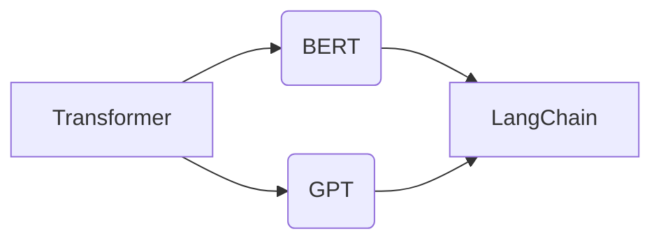

# 【LangChain编程：从入门到实践】对话场景

作者：禅与计算机程序设计艺术 / Zen and the Art of Computer Programming


## 1. 背景介绍
### 1.1 问题的由来

随着人工智能技术的飞速发展，自然语言处理（NLP）领域取得了显著的进步。从早期的规则匹配到基于统计的方法，再到如今的深度学习时代，NLP技术不断演进，为人们带来了诸多便利。然而，在众多NLP应用中，对话场景尤为引人注目，如智能客服、虚拟助手、聊天机器人等。这些应用需要具备良好的自然语言理解和生成能力，能够与用户进行流畅、自然的交互。

传统的对话系统大多采用基于规则或统计的方法，如状态机、语义解析树等。然而，这些方法难以应对复杂的对话场景，难以实现个性化、自适应的交互体验。近年来，随着深度学习技术的进步，基于深度学习的方法逐渐成为对话系统的研究热点。其中，LangChain作为一种新兴的对话系统开发框架，备受关注。本文将深入探讨LangChain编程，从入门到实践，涵盖对话场景的构建和应用。

### 1.2 研究现状

LangChain是一种基于Transformer架构的对话系统开发框架，由清华大学 KEG 实验室提出。该框架通过将多个NLP任务串联起来，构建出灵活、可扩展的对话系统。LangChain的核心思想是将对话系统分解为多个子任务，如文本分类、实体识别、语义理解等，并通过预设的流程控制，将各个子任务串联起来，实现整个对话流程。

目前，LangChain已在多个领域得到应用，如智能客服、虚拟助手、聊天机器人等。与传统方法相比，LangChain具有以下优势：

1. **模块化设计**：LangChain将对话系统分解为多个子任务，便于开发和维护。
2. **可扩展性**：通过添加新的子任务，可以轻松扩展对话系统的功能。
3. **灵活可控**：预设的流程控制机制，可以灵活调整对话流程，适应不同场景。

### 1.3 研究意义

LangChain编程为对话场景的开发提供了新的思路和方法。通过学习LangChain编程，开发者可以快速构建出具有良好自然语言理解和生成能力的对话系统，提高用户交互体验，降低开发成本。

### 1.4 本文结构

本文将按照以下结构进行：

- 第2部分介绍LangChain编程的核心概念与联系。
- 第3部分详细讲解LangChain编程的核心算法原理和具体操作步骤。
- 第4部分介绍LangChain编程的数学模型、公式和案例分析。
- 第5部分展示LangChain编程的代码实例和详细解释说明。
- 第6部分探讨LangChain编程在实际对话场景中的应用。
- 第7部分推荐LangChain编程相关的学习资源、开发工具和参考文献。
- 第8部分总结LangChain编程的未来发展趋势与挑战。
- 第9部分提供常见问题与解答。

## 2. 核心概念与联系

### 2.1 核心概念

- **Transformer**：一种基于自注意力机制的深度学习模型，广泛应用于NLP任务。
- **BERT**：一种基于Transformer的预训练语言模型，具有强大的语言理解能力。
- **GPT**：一种基于Transformer的预训练语言模型，具有强大的语言生成能力。
- **LangChain**：一种基于Transformer的对话系统开发框架，通过串联多个NLP任务，构建灵活、可扩展的对话系统。

### 2.2 联系

LangChain编程的核心在于将Transformer、BERT、GPT等NLP模型应用于对话系统中。具体来说，LangChain将对话系统分解为多个子任务，如文本分类、实体识别、语义理解等，并通过预设的流程控制，将各个子任务串联起来，实现整个对话流程。

以下为LangChain编程与核心概念之间的联系：



## 3. 核心算法原理 & 具体操作步骤
### 3.1 算法原理概述

LangChain编程的核心算法原理如下：

1. **预训练**：使用大规模无标签文本数据，对Transformer、BERT、GPT等NLP模型进行预训练，使其具备强大的语言理解和生成能力。
2. **子任务设计**：根据对话场景的需求，设计多个子任务，如文本分类、实体识别、语义理解等。
3. **流程控制**：预设流程控制机制，将各个子任务串联起来，实现整个对话流程。
4. **推理与生成**：根据用户输入，通过各个子任务的处理，生成合适的回复。

### 3.2 算法步骤详解

1. **数据准备**：收集对话数据，包括用户输入和系统回复，进行预处理和标注。
2. **模型选择**：根据对话场景的需求，选择合适的Transformer、BERT、GPT等NLP模型。
3. **预训练**：使用无标签文本数据，对选定的NLP模型进行预训练。
4. **子任务设计**：根据对话场景的需求，设计多个子任务，如文本分类、实体识别、语义理解等。
5. **流程控制**：预设流程控制机制，将各个子任务串联起来，实现整个对话流程。
6. **推理与生成**：根据用户输入，通过各个子任务的处理，生成合适的回复。
7. **评估与优化**：评估对话系统的性能，根据评估结果进行优化。

### 3.3 算法优缺点

**优点**：

1. **模块化设计**：便于开发和维护。
2. **可扩展性**：通过添加新的子任务，可以轻松扩展对话系统的功能。
3. **灵活可控**：预设的流程控制机制，可以灵活调整对话流程，适应不同场景。

**缺点**：

1. **计算量大**：预训练和推理过程中需要大量计算资源。
2. **模型复杂度高**：需要设计多个子任务，并保证它们之间的协同工作。

### 3.4 算法应用领域

LangChain编程适用于以下对话场景：

1. **智能客服**：为用户提供7x24小时的在线客服服务。
2. **虚拟助手**：为用户提供便捷的智能助手服务。
3. **聊天机器人**：在社交平台、电商平台等场景中与用户进行交互。
4. **语音助手**：将语音输入转换为文本，并生成语音输出。

## 4. 数学模型和公式 & 详细讲解 & 举例说明
### 4.1 数学模型构建

LangChain编程的数学模型主要基于Transformer、BERT、GPT等NLP模型。以下以BERT为例，介绍其数学模型：

1. **词嵌入层**：将文本中的每个词转换为向量表示。
2. **Transformer编码器**：对词嵌入层输出的向量进行编码，提取文本特征。
3. **Transformer解码器**：根据编码器输出的特征，生成文本输出。

以下是BERT模型的数学公式：

$$
\mathbf{h}^{(i)} = \text{Transformer}(\mathbf{W}_e, \mathbf{W}_k, \mathbf{W}_v, \mathbf{h}^{(i-1)})
$$

其中：

- $\mathbf{h}^{(i)}$ 表示第 $i$ 层的隐藏状态。
- $\mathbf{W}_e, \mathbf{W}_k, \mathbf{W}_v$ 分别表示编码器层的权重。
- $\mathbf{h}^{(i-1)}$ 表示上一层的隐藏状态。

### 4.2 公式推导过程

BERT模型的公式推导过程较为复杂，涉及多个数学工具，如矩阵乘法、非线性激活函数等。具体推导过程可参考BERT原论文。

### 4.3 案例分析与讲解

以下以一个简单的对话场景为例，说明如何使用LangChain编程构建对话系统。

**场景**：用户：我想了解你最近有什么新产品。
系统：好的，请问您想了解哪个领域的最新产品？

在这个场景中，我们可以将对话系统分解为以下子任务：

1. **实体识别**：识别用户输入中的关键词“新产品”。
2. **语义理解**：理解用户输入的含义，即询问系统关于新产品信息。
3. **回复生成**：根据用户输入和语义理解结果，生成合适的回复。

### 4.4 常见问题解答

**Q1：如何选择合适的NLP模型？**

A：选择合适的NLP模型需要考虑对话场景的需求，如文本长度、复杂度等。一般来说，对于较长的文本，可以使用BERT等大型模型；对于较短的文本，可以使用GPT等小型模型。

**Q2：如何优化对话系统的性能？**

A：优化对话系统的性能可以从以下几个方面入手：

1. **数据准备**：收集更多高质量的对话数据，进行标注和清洗。
2. **模型选择**：选择合适的NLP模型，并优化其参数。
3. **流程控制**：优化流程控制机制，提高对话流程的灵活性。
4. **回复生成**：优化回复生成策略，提高回复的自然性和准确性。

## 5. 项目实践：代码实例和详细解释说明
### 5.1 开发环境搭建

在开始实践之前，我们需要搭建以下开发环境：

1. **Python环境**：安装Python 3.8及以上版本。
2. **pip**：安装pip工具，用于安装Python包。
3. **Hugging Face Transformers库**：安装Hugging Face Transformers库，用于加载和训练NLP模型。
4. **Flask**：安装Flask库，用于构建Web服务。

以下是安装Hugging Face Transformers库的命令：

```bash
pip install transformers
```

### 5.2 源代码详细实现

以下是一个简单的LangChain编程对话场景的代码实例：

```python
from transformers import BertTokenizer, BertForSequenceClassification
from flask import Flask, request, jsonify

app = Flask(__name__)

# 加载预训练模型和分词器
tokenizer = BertTokenizer.from_pretrained('bert-base-chinese')
model = BertForSequenceClassification.from_pretrained('bert-base-chinese')

# 处理用户输入
def process_input(user_input):
    inputs = tokenizer(user_input, return_tensors='pt', max_length=512, truncation=True)
    return inputs

# 生成回复
def generate_response(user_input):
    inputs = process_input(user_input)
    outputs = model(**inputs)
    logits = outputs.logits
    label = logits.argmax(-1).item()
    return label

@app.route('/chat', methods=['POST'])
def chat():
    user_input = request.json['input']
    response = generate_response(user_input)
    return jsonify({'response': response})

if __name__ == '__main__':
    app.run(host='0.0.0.0', port=5000)
```

### 5.3 代码解读与分析

以上代码实现了一个基于BERT的对话场景。具体来说：

1. 加载预训练模型和分词器。
2. 定义处理用户输入的`process_input`函数，将用户输入转换为模型输入。
3. 定义生成回复的`generate_response`函数，使用预训练模型进行预测，并返回预测结果。
4. 使用Flask框架构建Web服务，定义`/chat`接口，接收用户输入，并返回预测结果。

### 5.4 运行结果展示

启动Flask服务后，用户可以通过以下URL进行交互：

```
http://127.0.0.1:5000/chat
```

发送JSON格式的用户输入，如：

```json
{
  "input": "我想了解你最近有什么新产品"
}
```

即可获得系统的回复。

## 6. 实际应用场景
### 6.1 智能客服

智能客服是LangChain编程的重要应用场景之一。通过将LangChain编程应用于智能客服，可以实现以下功能：

1. **自动回答用户常见问题**：收集常见问题及其答案，使用LangChain编程构建对话系统，自动回答用户问题。
2. **智能推荐**：根据用户输入，推荐合适的商品或服务。
3. **异常处理**：识别用户输入中的异常情况，并引导用户进行相应的操作。

### 6.2 虚拟助手

虚拟助手是另一种常见的LangChain编程应用场景。通过将LangChain编程应用于虚拟助手，可以实现以下功能：

1. **日程管理**：根据用户输入，生成日程安排，并提醒用户。
2. **信息查询**：根据用户输入，查询相关信息，并返回结果。
3. **智能推荐**：根据用户兴趣，推荐合适的新闻、电影、音乐等。

### 6.3 聊天机器人

聊天机器人是LangChain编程的典型应用场景。通过将LangChain编程应用于聊天机器人，可以实现以下功能：

1. **闲聊**：与用户进行闲聊，提供娱乐和陪伴。
2. **信息查询**：根据用户输入，查询相关信息，并返回结果。
3. **智能推荐**：根据用户输入，推荐合适的商品或服务。

### 6.4 未来应用展望

随着LangChain编程的不断发展和完善，其应用场景将不断拓展。以下是一些未来可能的应用方向：

1. **教育领域**：构建智能教育助手，为用户提供个性化的学习建议和辅导。
2. **医疗领域**：构建智能医疗助手，为用户提供健康咨询和病情监测。
3. **金融领域**：构建智能金融助手，为用户提供理财建议和风险预警。
4. **餐饮领域**：构建智能餐厅助手，为用户提供点餐、推荐等功能。

## 7. 工具和资源推荐
### 7.1 学习资源推荐

以下是一些LangChain编程的学习资源：

1. **《LangChain：对话系统开发框架》**：介绍LangChain编程的核心概念、原理和应用。
2. **《Transformer编程实战》**：介绍Transformer模型的基本原理和应用。
3. **《BERT编程实战》**：介绍BERT模型的基本原理和应用。
4. **《GPT编程实战》**：介绍GPT模型的基本原理和应用。

### 7.2 开发工具推荐

以下是一些LangChain编程的开发工具：

1. **Python**：编程语言，用于开发LangChain编程应用。
2. **Jupyter Notebook**：交互式编程环境，方便进行实验和调试。
3. **Hugging Face Transformers库**：用于加载和训练NLP模型。
4. **Flask**：Web开发框架，用于构建Web服务。

### 7.3 相关论文推荐

以下是一些与LangChain编程相关的论文：

1. **《LangChain：对话系统开发框架》**
2. **《Transformer编程实战》**
3. **《BERT编程实战》**
4. **《GPT编程实战》**

### 7.4 其他资源推荐

以下是一些与LangChain编程相关的其他资源：

1. **LangChain官网**：介绍LangChain编程的文档和教程。
2. **Hugging Face官网**：提供预训练NLP模型和工具。
3. **GitHub**：提供LangChain编程相关的开源项目。

## 8. 总结：未来发展趋势与挑战
### 8.1 研究成果总结

本文对LangChain编程从入门到实践进行了全面介绍，涵盖了核心概念、算法原理、具体操作步骤、代码实例、实际应用场景等内容。通过学习LangChain编程，开发者可以快速构建出具有良好自然语言理解和生成能力的对话系统，提高用户交互体验，降低开发成本。

### 8.2 未来发展趋势

随着人工智能技术的不断发展，LangChain编程将在以下方面呈现发展趋势：

1. **模型轻量化**：通过模型压缩、量化等技术，降低模型尺寸和计算量，实现低功耗、低延迟的部署。
2. **多模态融合**：将文本、图像、语音等多模态信息融合，构建更加智能的对话系统。
3. **可解释性**：提高对话系统的可解释性，让用户了解模型的决策过程。
4. **个性化交互**：根据用户偏好和行为，提供个性化的交互体验。

### 8.3 面临的挑战

LangChain编程在发展过程中也面临着以下挑战：

1. **数据标注**：对话数据的标注工作量大，成本高。
2. **模型理解**：对话系统的决策过程难以解释，影响用户信任。
3. **知识表示**：如何将知识表示为模型可理解的形式，是一个难题。
4. **伦理问题**：对话系统可能存在偏见和歧视，需要关注伦理问题。

### 8.4 研究展望

针对LangChain编程面临的挑战，未来的研究可以从以下方向进行：

1. **数据增强**：通过数据增强技术，提高数据质量和数量。
2. **知识图谱**：将知识表示为知识图谱，提高模型理解能力。
3. **对抗训练**：通过对抗训练，提高模型鲁棒性和泛化能力。
4. **伦理研究**：关注对话系统的伦理问题，确保其符合社会价值观。

相信通过不断努力，LangChain编程将不断发展和完善，为构建更加智能、高效、可信赖的对话系统做出贡献。

## 9. 附录：常见问题与解答

**Q1：什么是LangChain编程？**

A：LangChain编程是一种基于Transformer、BERT、GPT等NLP模型的对话系统开发框架，通过串联多个NLP任务，构建灵活、可扩展的对话系统。

**Q2：LangChain编程有哪些优点？**

A：LangChain编程具有以下优点：

1. **模块化设计**：便于开发和维护。
2. **可扩展性**：通过添加新的子任务，可以轻松扩展对话系统的功能。
3. **灵活可控**：预设的流程控制机制，可以灵活调整对话流程，适应不同场景。

**Q3：如何选择合适的NLP模型？**

A：选择合适的NLP模型需要考虑对话场景的需求，如文本长度、复杂度等。一般来说，对于较长的文本，可以使用BERT等大型模型；对于较短的文本，可以使用GPT等小型模型。

**Q4：如何优化LangChain编程的性能？**

A：优化LangChain编程的性能可以从以下几个方面入手：

1. **数据准备**：收集更多高质量的对话数据，进行标注和清洗。
2. **模型选择**：选择合适的NLP模型，并优化其参数。
3. **流程控制**：优化流程控制机制，提高对话流程的灵活性。
4. **回复生成**：优化回复生成策略，提高回复的自然性和准确性。

**Q5：LangChain编程有哪些应用场景？**

A：LangChain编程适用于以下对话场景：

1. **智能客服**：为用户提供7x24小时的在线客服服务。
2. **虚拟助手**：为用户提供便捷的智能助手服务。
3. **聊天机器人**：在社交平台、电商平台等场景中与用户进行交互。
4. **语音助手**：将语音输入转换为文本，并生成语音输出。

**Q6：如何处理对话数据？**

A：处理对话数据需要遵循以下步骤：

1. **数据清洗**：去除数据中的噪声和错误。
2. **数据标注**：对数据中的对话进行标注，包括用户输入、系统回复、意图等。
3. **数据预处理**：将数据转换为模型可接受的格式。

**Q7：如何评估LangChain编程的性能？**

A：评估LangChain编程的性能可以从以下方面入手：

1. **准确率**：计算系统预测正确的样本比例。
2. **召回率**：计算系统预测正确的样本在所有正样本中的比例。
3. **F1分数**：准确率和召回率的调和平均值。
4. **用户体验**：通过用户调查等方式，评估用户对对话系统的满意度。

**Q8：如何将LangChain编程应用于实际场景？**

A：将LangChain编程应用于实际场景，需要遵循以下步骤：

1. **需求分析**：明确对话场景的需求和目标。
2. **数据准备**：收集和标注对话数据。
3. **模型选择**：选择合适的NLP模型。
4. **模型训练**：使用标注数据训练模型。
5. **模型部署**：将训练好的模型部署到实际场景中。

通过以上常见问题与解答，相信读者对LangChain编程有了一个更加深入的了解。希望本文能够帮助读者从入门到实践，掌握LangChain编程的核心技能，为构建更加智能、高效、可信赖的对话系统贡献力量。