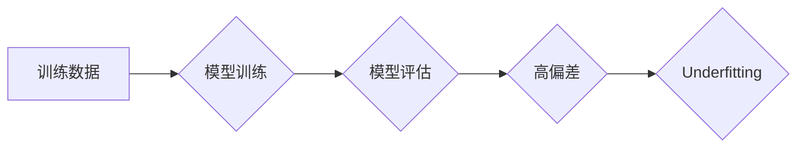

## Underfitting 原理与代码实战案例讲解

> 关键词：Underfitting, 过度简化, 模型训练, 机器学习, 偏差, 误差, 代码实战, 决策树

## 1. 背景介绍

在机器学习领域，我们常常追求模型的**高准确率**，希望模型能够在训练数据上表现出色，并能很好地泛化到未知数据上。然而，模型的训练并非总是那么顺利，有时我们会遇到一个叫做**Underfitting**（过度简化）的问题。

Underfitting 指的是模型过于简单，无法捕捉到训练数据中的复杂模式，导致模型在训练数据上和测试数据上的表现都非常差。 

想象一下，你试图用一根直线来拟合一组散点图，而这些散点图实际上呈现出复杂的曲线趋势。在这种情况下，直线模型（你的模型）过于简单，无法准确地描述数据中的关系，导致拟合效果很差。这就是Underfitting的典型表现。

## 2. 核心概念与联系

Underfitting 与模型的**复杂度**和**偏差**密切相关。

* **模型复杂度**：指的是模型能够学习到的复杂程度。一个复杂度高的模型可以学习到更复杂的模式，而一个复杂度低的模型只能学习到简单的模式。
* **偏差**：指的是模型预测结果与真实结果之间的差距。偏差过高意味着模型对训练数据的理解不足，无法准确地进行预测。

**Mermaid 流程图**



在Underfitting的情况下，模型的复杂度过低，导致模型的偏差过高，无法准确地拟合训练数据。

## 3. 核心算法原理 & 具体操作步骤

### 3.1  算法原理概述

Underfitting 通常出现在模型过于简单，无法捕捉到数据中的复杂模式时。解决Underfitting 的方法主要有以下几种：

* **增加模型复杂度**: 增加模型的层数、节点数量等，使其能够学习到更复杂的模式。
* **增加训练数据**: 更多的训练数据可以帮助模型更好地理解数据中的规律。
* **优化特征工程**: 选择更合适的特征，或者对现有特征进行转换，可以帮助模型更好地学习数据中的信息。
* **调整正则化参数**: 正则化可以防止模型过拟合，但过强的正则化也会导致Underfitting。需要根据实际情况调整正则化参数。

### 3.2  算法步骤详解

1. **数据准备**: 收集和预处理训练数据，确保数据质量和格式正确。
2. **模型选择**: 选择合适的模型类型，例如增加神经网络层数、使用更复杂的决策树等。
3. **模型训练**: 使用训练数据训练模型，并监控模型的性能指标，例如准确率、损失函数等。
4. **模型评估**: 使用测试数据评估模型的性能，观察模型在未知数据上的表现。
5. **模型调优**: 根据模型评估结果，调整模型参数、增加训练数据、优化特征工程等，以提高模型的性能。

### 3.3  算法优缺点

**优点**:

* 容易理解和实现。
* 计算成本相对较低。

**缺点**:

* 容易导致Underfitting，模型性能较差。
* 难以处理复杂的数据模式。

### 3.4  算法应用领域

Underfitting 问题普遍存在于机器学习领域，例如：

* **图像识别**: 当模型过于简单时，难以识别复杂的图像特征。
* **自然语言处理**: 当模型过于简单时，难以理解复杂的语言结构和语义。
* **预测分析**: 当模型过于简单时，难以捕捉到数据中的复杂趋势。

## 4. 数学模型和公式 & 详细讲解 & 举例说明

### 4.1  数学模型构建

在机器学习中，模型的性能通常用**误差**来衡量。误差是指模型预测结果与真实结果之间的差距。

**偏差**和**方差**是误差的主要来源。

* **偏差**: 模型预测结果与真实结果的平均差距。
* **方差**: 模型对训练数据中的波动敏感程度。

**期望误差**可以表示为：

$$
E[Error] = Bias^2 + Variance + Noise
$$

其中，**Noise** 是不可避免的随机误差。

### 4.2  公式推导过程

Underfitting 导致模型的**偏差**过高。

当模型过于简单时，它无法捕捉到训练数据中的复杂模式，导致模型的预测结果与真实结果的平均差距很大。

### 4.3  案例分析与讲解

假设我们有一个简单的线性回归模型，试图拟合一组散点图。如果散点图呈现出复杂的曲线趋势，而我们使用一条直线来拟合，那么模型的偏差就会很高。

**举例说明**:

* **真实数据**: 呈现出复杂的曲线趋势。
* **模型**: 线性回归模型。
* **结果**: 模型的预测结果与真实结果的差距很大，模型的偏差很高。

## 5. 项目实践：代码实例和详细解释说明

### 5.1  开发环境搭建

* Python 3.x
* scikit-learn

### 5.2  源代码详细实现

```python
from sklearn.datasets import load_iris
from sklearn.tree import DecisionTreeClassifier
from sklearn.model_selection import train_test_split
from sklearn.metrics import accuracy_score

# 加载 iris 数据集
iris = load_iris()
X = iris.data
y = iris.target

# 将数据分成训练集和测试集
X_train, X_test, y_train, y_test = train_test_split(X, y, test_size=0.2, random_state=42)

# 创建一个简单的决策树模型
clf = DecisionTreeClassifier(max_depth=2)

# 训练模型
clf.fit(X_train, y_train)

# 预测测试集结果
y_pred = clf.predict(X_test)

# 计算模型准确率
accuracy = accuracy_score(y_test, y_pred)
print(f"模型准确率: {accuracy}")
```

### 5.3  代码解读与分析

* 我们使用 scikit-learn 库加载 iris 数据集，并将其分成训练集和测试集。
* 我们创建了一个简单的决策树模型，其最大深度设置为 2。
* 我们训练模型，并使用测试集进行预测。
* 最后，我们计算模型的准确率。

### 5.4  运行结果展示

运行上述代码，你会得到模型的准确率。如果准确率很低，则可能存在 Underfitting 的问题。

## 6. 实际应用场景

Underfitting 问题在实际应用中非常常见，例如：

* **医疗诊断**: 当模型过于简单时，难以识别复杂的疾病症状。
* **金融预测**: 当模型过于简单时，难以预测复杂的市场趋势。
* **推荐系统**: 当模型过于简单时，难以推荐用户感兴趣的内容。

## 7. 工具和资源推荐

### 7.1  学习资源推荐

* **书籍**:
    * "The Elements of Statistical Learning" by Trevor Hastie, Robert Tibshirani, and Jerome Friedman
    * "Pattern Recognition and Machine Learning" by Christopher M. Bishop
* **在线课程**:
    * Coursera: Machine Learning by Andrew Ng
    * edX: Artificial Intelligence by Columbia University

### 7.2  开发工具推荐

* **Python**: 广泛用于机器学习开发。
* **scikit-learn**: Python 的机器学习库，提供各种算法和工具。
* **TensorFlow**: Google 开发的深度学习框架。
* **PyTorch**: Facebook 开发的深度学习框架。

### 7.3  相关论文推荐

* **"Bias-Variance Tradeoff" by Leo Breiman (1995)**
* **"The Bias-Variance Decomposition" by Gareth James et al. (2013)**

## 8. 总结：未来发展趋势与挑战

### 8.1  研究成果总结

Underfitting 问题是机器学习领域中一个重要的挑战。通过增加模型复杂度、增加训练数据、优化特征工程等方法，我们可以有效地解决 Underfitting 问题。

### 8.2  未来发展趋势

未来，随着机器学习算法和模型的不断发展，Underfitting 问题将会得到进一步的解决。

* **更复杂的模型**: 发展更复杂的模型，例如深度神经网络，可以更好地捕捉到数据中的复杂模式。
* **自动化模型选择**: 自动化模型选择算法可以帮助我们选择最合适的模型类型和参数。
* **数据增强**: 数据增强技术可以增加训练数据的数量和多样性，从而提高模型的泛化能力。

### 8.3  面临的挑战

尽管 Underfitting 问题已经得到一定程度的解决，但仍然面临一些挑战：

* **数据稀缺**: 在某些领域，数据稀缺是一个很大的问题，难以训练出高性能的模型。
* **计算资源**: 训练复杂的模型需要大量的计算资源，这对于一些资源有限的机构来说是一个挑战。
* **模型解释性**: 复杂的模型难以解释，这对于一些需要透明度和可解释性的应用来说是一个问题。

### 8.4  研究展望

未来，研究人员将继续致力于解决 Underfitting 问题，并探索新的方法来提高模型的性能和泛化能力。


## 9. 附录：常见问题与解答

**Q1: 如何判断模型是否 Underfitting?**

**A1:** 如果模型在训练数据和测试数据上的表现都非常差，则可能存在 Underfitting 的问题。

**Q2: 如何解决 Underfitting 的问题?**

**A2:** 可以通过增加模型复杂度、增加训练数据、优化特征工程等方法来解决 Underfitting 的问题。

**Q3: 增加模型复杂度有哪些方法?**

**A3:** 可以增加神经网络层数、节点数量等，或者使用更复杂的决策树等。

**Q4: 增加训练数据有哪些方法?**

**A4:** 可以收集更多的数据，或者使用数据增强技术来增加训练数据的数量和多样性。

**Q5: 如何优化特征工程?**

**A5:** 可以选择更合适的特征，或者对现有特征进行转换，例如特征缩放、特征组合等。


作者：禅与计算机程序设计艺术 / Zen and the Art of Computer Programming 