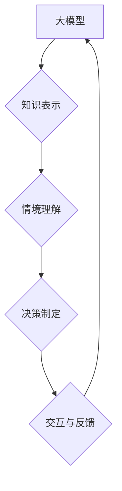

## 【大模型应用开发 动手做AI Agent】其他Agent认知框架

> 关键词：大模型、AI Agent、认知框架、知识图谱、强化学习、对话系统、应用开发

## 1. 背景介绍

近年来，大模型技术取得了飞速发展，其强大的泛化能力和表示能力为构建智能代理（AI Agent）提供了强大的基础。AI Agent是指能够感知环境、做出决策并与环境交互的智能实体。 传统的AI Agent通常依赖于手工设计的规则和知识库，而大模型则可以学习和理解更复杂的知识和模式，从而构建更智能、更灵活的Agent。

然而，仅仅依靠大模型本身并不能构建出真正具有认知能力的AI Agent。AI Agent需要具备以下关键能力：

* **知识表示和推理:**  能够有效地表示和组织知识，并进行逻辑推理和知识发现。
* **情境理解:**  能够理解和分析复杂的场景，识别关键信息和用户意图。
* **决策制定:**  能够根据知识和情境做出合理的决策，并执行相应的行动。
* **交互与反馈:**  能够与用户进行自然流畅的交互，并根据反馈进行学习和调整。

为了解决这些问题，研究者们提出了各种不同的AI Agent认知框架，旨在为大模型提供更丰富的认知能力。

## 2. 核心概念与联系

**2.1 认知框架概述**

认知框架是指AI Agent理解和处理信息的一种结构化模型，它定义了Agent感知、知识表示、推理、决策和交互等方面的机制。不同的认知框架具有不同的设计理念和功能特点，例如：

* **基于规则的框架:**  依赖于预先定义的规则和知识库，通过规则匹配和推理来完成任务。
* **基于模型的框架:**  构建数学模型来模拟Agent的认知过程，例如符号逻辑、概率图模型等。
* **基于案例的框架:**  利用过去的经验案例进行推理和决策，例如案例库、案例推理系统等。
* **基于神经网络的框架:**  利用深度学习模型来学习和表示知识，例如Transformer、BERT等。

**2.2 核心概念与联系**

大模型在AI Agent认知框架中的应用主要体现在以下几个方面：

* **知识表示:**  大模型可以学习和表示复杂的知识关系，例如实体关系、概念关系等，构建更丰富的知识图谱。
* **情境理解:**  大模型可以理解和分析自然语言文本，识别关键信息和用户意图，从而更好地理解Agent所处的场景。
* **决策制定:**  大模型可以学习和预测不同决策的潜在结果，并根据奖励机制进行决策优化，例如强化学习算法。
* **交互与反馈:**  大模型可以生成自然流畅的文本，与用户进行自然语言交互，并根据用户反馈进行学习和调整。

**2.3 Mermaid 流程图**



## 3. 核心算法原理 & 具体操作步骤

**3.1 算法原理概述**

在AI Agent认知框架中，常用的算法包括：

* **知识图谱构建算法:**  例如TransE、RotatE等，用于学习实体关系和构建知识图谱。
* **自然语言理解算法:**  例如BERT、RoBERTa等，用于理解和分析自然语言文本。
* **强化学习算法:**  例如DQN、PPO等，用于训练AI Agent进行决策优化。

**3.2 算法步骤详解**

以知识图谱构建算法为例，其基本步骤如下：

1. **数据预处理:**  收集实体和关系数据，并进行清洗、格式化等预处理操作。
2. **模型训练:**  使用TransE等算法训练知识图谱模型，学习实体关系的嵌入表示。
3. **知识推理:**  利用训练好的模型进行知识推理，例如链接预测、实体分类等。

**3.3 算法优缺点**

不同的算法具有不同的优缺点，需要根据具体应用场景进行选择。例如，TransE算法在链接预测任务上表现良好，但对复杂关系的表达能力有限。

**3.4 算法应用领域**

AI Agent认知框架和相关算法在多个领域都有广泛的应用，例如：

* **对话系统:**  构建更智能、更自然的对话系统，例如聊天机器人、虚拟助手等。
* **搜索引擎:**  提高搜索结果的准确性和相关性，例如知识图谱搜索、实体识别等。
* **推荐系统:**  提供更个性化、更精准的商品推荐，例如基于知识图谱的推荐系统。

## 4. 数学模型和公式 & 详细讲解 & 举例说明

**4.1 数学模型构建**

知识图谱构建算法通常使用嵌入式模型来表示实体和关系。例如，TransE算法将实体和关系映射到一个低维向量空间中，并假设关系可以看作是实体之间的向量差。

**4.2 公式推导过程**

TransE算法的目标是最小化实体和关系的嵌入表示之间的距离。假设实体e和f的嵌入向量分别为e和f，关系r的嵌入向量为r，则TransE的目标函数为：

$$
L = \sum_{h, r, t \in D} \max(0, \gamma + ||h + r - t||_1)
$$

其中，D是训练数据，γ是一个超参数，用于控制模型的margin。

**4.3 案例分析与讲解**

例如，假设我们有一个知识图谱中的三元组：(张三, 工作在, 公司A)。

* 实体张三的嵌入向量为e。
* 关系工作在的嵌入向量为r。
* 实体公司A的嵌入向量为t。

TransE算法的目标是找到一个嵌入空间，使得e + r 尽可能接近 t。

## 5. 项目实践：代码实例和详细解释说明

**5.1 开发环境搭建**

* Python 3.6+
* PyTorch 1.0+
* 其他依赖库：numpy, pandas, tqdm等

**5.2 源代码详细实现**

```python
import torch
import torch.nn as nn

class TransE(nn.Module):
    def __init__(self, embedding_dim, entities, relations):
        super(TransE, self).__init__()
        self.embedding_dim = embedding_dim
        self.entity_embeddings = nn.Embedding(entities, embedding_dim)
        self.relation_embeddings = nn.Embedding(relations, embedding_dim)

    def forward(self, head, relation, tail):
        head_embedding = self.entity_embeddings(head)
        relation_embedding = self.relation_embeddings(relation)
        tail_embedding = self.entity_embeddings(tail)
        return torch.norm(head_embedding + relation_embedding - tail_embedding, p=1)

#... (训练代码省略)
```

**5.3 代码解读与分析**

* TransE模型包含两个嵌入层：实体嵌入层和关系嵌入层。
* 模型的forward函数计算实体和关系的嵌入向量，并通过L1距离计算实体和关系的嵌入表示之间的距离。
* 训练过程使用反向传播算法，最小化目标函数。

**5.4 运行结果展示**

训练完成后，可以利用模型进行链接预测等任务。例如，给定实体张三和关系工作在，模型可以预测出对应的公司A。

## 6. 实际应用场景

**6.1  对话系统**

大模型可以理解用户自然语言输入，并根据知识图谱和对话历史进行推理，生成自然流畅的回复。例如，在问答系统中，大模型可以利用知识图谱快速定位相关信息，并生成准确的答案。

**6.2  搜索引擎**

大模型可以理解用户搜索意图，并根据知识图谱进行实体识别和关系抽取，提高搜索结果的准确性和相关性。例如，用户搜索“张三工作在哪个公司”，大模型可以利用知识图谱快速定位到张三和公司A之间的关系，并返回相关结果。

**6.3  推荐系统**

大模型可以学习用户兴趣和偏好，并根据知识图谱进行物品推荐。例如，用户在电商平台上购买了某款手机，大模型可以利用知识图谱分析手机的类别、品牌、功能等信息，并推荐其他相关商品。

**6.4  未来应用展望**

随着大模型技术的不断发展，AI Agent认知框架将有更广泛的应用场景，例如：

* **个性化教育:**  根据学生的学习情况和兴趣，提供个性化的学习内容和辅导。
* **医疗诊断:**  辅助医生进行疾病诊断，提高诊断准确率。
* **智能家居:**  理解用户的需求，自动控制家居设备，提供更智能的居住体验。

## 7. 工具和资源推荐

**7.1 学习资源推荐**

* **书籍:**

    * 《深度学习》
    * 《自然语言处理》
    * 《人工智能：现代方法》

* **在线课程:**

    * Coursera: 深度学习
    * edX: 自然语言处理
    * fast.ai: 深度学习

**7.2 开发工具推荐**

* **PyTorch:**  开源深度学习框架，支持GPU加速。
* **TensorFlow:**  谷歌开发的开源深度学习框架。
* **HuggingFace Transformers:**  提供预训练的大模型和工具库。

**7.3 相关论文推荐**

* 《TransE: Embedding Entities and Relations for Learning and Inference in Knowledge Bases》
* 《BERT: Pre-training of Deep Bidirectional Transformers for Language Understanding》
* 《Attention Is All You Need》

## 8. 总结：未来发展趋势与挑战

**8.1 研究成果总结**

近年来，大模型在AI Agent认知框架中的应用取得了显著进展，例如：

* 知识表示能力得到提升，能够构建更丰富的知识图谱。
* 情境理解能力得到增强，能够更好地理解用户意图和上下文信息。
* 决策制定能力得到提高，能够进行更智能、更灵活的决策。

**8.2 未来发展趋势**

未来，AI Agent认知框架将朝着以下方向发展：

* **更强大的知识表示:**  探索更灵活、更强大的知识表示方法，例如图神经网络、知识图谱融合等。
* **更深入的情境理解:**  利用多模态信息，例如文本、图像、音频等，进行更深入的情境理解。
* **更智能的决策制定:**  结合强化学习等算法，训练AI Agent进行更智能、更灵活的决策。

**8.3 面临的挑战**

AI Agent认知框架的发展也面临着一些挑战：

* **数据稀缺:**  高质量的知识图谱和训练数据仍然稀缺。
* **可解释性:**  大模型的决策过程难以解释，缺乏透明度。
* **安全性和可靠性:**  AI Agent的决策可能存在偏差和错误，需要保证其安全性和可靠性。

**8.4 研究展望**

未来，我们需要继续探索更有效的知识表示方法、更深入的情境理解机制和更智能的决策算法，以构建出真正具有认知能力的AI Agent。


## 9. 附录：常见问题与解答

**9.1  常见问题**

* **什么是AI Agent？**

AI Agent是指能够感知环境、做出决策并与环境交互的智能实体。

* **大模型在AI Agent认知框架中的作用是什么？**

大模型可以学习和表示复杂的知识关系、理解和分析自然语言文本、进行决策优化等，为AI Agent提供更丰富的认知能力。

* **有哪些常见的AI Agent认知框架？**

常见的AI Agent认知框架包括基于规则的框架、基于模型的框架、基于案例的框架和基于神经网络的框架。

* **如何评估AI Agent的性能？**

AI Agent的性能可以根据其在特定任务上的准确率、效率、鲁棒性等指标进行评估。

**9.2  解答**

* **AI Agent的应用场景有哪些？**

AI Agent的应用场景非常广泛，例如对话系统、搜索引擎