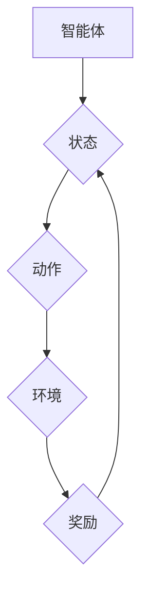

## 一切皆是映射：AI Q-learning在智能安全防护的应用

> 关键词：人工智能、Q-learning、强化学习、安全防护、威胁检测、入侵防御

### 1. 背景介绍

在当今数字时代，网络安全面临着前所未有的挑战。传统安全防护方法往往依赖于预先定义的规则和签名，难以应对不断演变的网络威胁。人工智能（AI）技术，特别是强化学习（RL）算法，为智能安全防护提供了新的思路和方法。

强化学习是一种机器学习范式，它通过让智能体在环境中进行交互，并根据其行为获得奖励或惩罚，从而学习最优策略。Q-learning是强化学习中的一种经典算法，它通过构建一个Q值表，存储每个状态下采取不同动作的期望回报，并通过迭代更新Q值表，最终学习出最优策略。

### 2. 核心概念与联系

**2.1 核心概念**

* **智能体 (Agent):** 在强化学习中，智能体是做出决策并与环境交互的实体。在安全防护场景中，智能体可以是安全系统、入侵检测系统或防火墙等。
* **环境 (Environment):** 环境是指智能体所处的外部世界，它会根据智能体的行为做出相应的反应。在安全防护场景中，环境可以是网络、系统或应用程序等。
* **状态 (State):** 状态描述了智能体与环境交互的当前情况。在安全防护场景中，状态可以是网络流量、系统日志、用户行为等。
* **动作 (Action):** 动作是智能体在特定状态下可以采取的行动。在安全防护场景中，动作可以是封锁连接、隔离主机、记录事件等。
* **奖励 (Reward):** 奖励是智能体根据其行为获得的反馈信号。在安全防护场景中，奖励可以是成功阻止攻击、降低安全风险等。
* **策略 (Policy):** 策略是智能体在不同状态下采取动作的规则。

**2.2 架构图**



**2.3 联系**

Q-learning算法通过不断地与环境交互，学习出最优策略，从而实现智能安全防护的目标。智能体根据当前状态选择动作，执行动作后获得奖励，并根据奖励更新策略，最终学习出能够最大化奖励的策略。

### 3. 核心算法原理 & 具体操作步骤

**3.1 算法原理概述**

Q-learning是一种基于价值函数的强化学习算法，其核心思想是通过学习每个状态下采取不同动作的期望回报（Q值），并根据这些Q值选择最优动作。

**3.2 算法步骤详解**

1. **初始化Q值表:** 创建一个Q值表，用于存储每个状态下采取不同动作的期望回报。
2. **选择动作:** 根据当前状态和策略，选择一个动作。
3. **执行动作:** 在环境中执行选择的动作。
4. **获得奖励:** 根据环境的反馈，获得奖励。
5. **更新Q值:** 根据Bellman方程更新Q值表，即：

$$Q(s,a) = Q(s,a) + \alpha [r + \gamma \max_{a'} Q(s',a') - Q(s,a)]$$

其中：

* $Q(s,a)$ 是状态 $s$ 下采取动作 $a$ 的期望回报。
* $\alpha$ 是学习率，控制着学习速度。
* $r$ 是获得的奖励。
* $\gamma$ 是折扣因子，控制着未来奖励的权重。
* $s'$ 是执行动作后进入的新状态。
* $a'$ 是在新的状态 $s'$ 下采取的最优动作。

6. **重复步骤2-5:** 直到达到终止条件，例如学习完成或时间限制。

**3.3 算法优缺点**

**优点:**

* 能够学习复杂环境下的最优策略。
* 不需要事先定义奖励函数，可以自动学习奖励。
* 能够在线学习，即在与环境交互的过程中不断更新策略。

**缺点:**

* 训练时间较长，需要大量的样本数据。
* 容易陷入局部最优解。
* 对于高维状态空间，Q值表会变得非常庞大。

**3.4 算法应用领域**

Q-learning算法在许多领域都有应用，例如：

* **游戏:** 训练游戏AI，例如AlphaGo。
* **机器人:** 训练机器人进行导航、抓取等任务。
* **推荐系统:** 训练推荐系统，推荐用户感兴趣的内容。
* **安全防护:** 训练智能安全系统，例如入侵检测、恶意软件检测等。

### 4. 数学模型和公式 & 详细讲解 & 举例说明

**4.1 数学模型构建**

在安全防护场景中，我们可以将网络环境建模为一个马尔可夫决策过程（MDP）。

* **状态空间 (S):** 包含网络流量、系统日志、用户行为等信息。
* **动作空间 (A):** 包含封锁连接、隔离主机、记录事件等安全操作。
* **转移概率 (P):** 描述从一个状态到另一个状态的概率。
* **奖励函数 (R):** 描述在特定状态下采取特定动作获得的奖励。

**4.2 公式推导过程**

Q-learning算法的目标是学习一个策略 $\pi(s)$，使得在状态 $s$ 下采取动作 $a$ 的期望回报最大化。

Bellman方程是Q-learning算法的核心公式，它描述了Q值在时间步长 $t$ 的更新规则：

$$Q(s,a) = Q(s,a) + \alpha [r + \gamma \max_{a'} Q(s',a') - Q(s,a)]$$

其中：

* $Q(s,a)$ 是状态 $s$ 下采取动作 $a$ 的期望回报。
* $\alpha$ 是学习率，控制着学习速度。
* $r$ 是获得的奖励。
* $\gamma$ 是折扣因子，控制着未来奖励的权重。
* $s'$ 是执行动作后进入的新状态。
* $a'$ 是在新的状态 $s'$ 下采取的最优动作。

**4.3 案例分析与讲解**

假设一个网络安全系统需要检测恶意流量。我们可以将网络流量作为状态，封锁连接作为动作，成功阻止攻击获得奖励，失败则获得惩罚。

通过Q-learning算法，安全系统可以学习到不同类型流量下采取封锁连接的最佳策略，从而提高恶意流量检测的准确率。

### 5. 项目实践：代码实例和详细解释说明

**5.1 开发环境搭建**

* Python 3.x
* TensorFlow 或 PyTorch 等深度学习框架
* Jupyter Notebook 或其他代码编辑器

**5.2 源代码详细实现**

```python
import numpy as np
from tensorflow.keras.models import Sequential
from tensorflow.keras.layers import Dense

# 定义状态空间、动作空间和奖励函数
#...

# 初始化Q值表
Q_table = np.zeros((num_states, num_actions))

# 设置学习参数
alpha = 0.1
gamma = 0.9
epsilon = 0.1

# Q-learning算法训练
for episode in range(num_episodes):
    state = env.reset()
    done = False
    while not done:
        # 选择动作
        action = choose_action(state, epsilon)

        # 执行动作
        next_state, reward, done, _ = env.step(action)

        # 更新Q值
        Q_table[state, action] = Q_table[state, action] + alpha * (reward + gamma * np.max(Q_table[next_state, :]) - Q_table[state, action])

        # 更新状态
        state = next_state

# 使用训练好的Q值表进行策略评估
#...
```

**5.3 代码解读与分析**

* 代码首先定义了状态空间、动作空间和奖励函数。
* 然后初始化Q值表，并设置学习参数。
* Q-learning算法训练过程包括多个episode，每个episode包含多个时间步长。
* 在每个时间步长，智能体根据当前状态选择动作，执行动作后获得奖励和下一个状态。
* 根据Bellman方程更新Q值表，最终学习出最优策略。

**5.4 运行结果展示**

* 可以通过观察Q值表的变化趋势，以及在测试环境中的性能指标，来评估Q-learning算法的训练效果。

### 6. 实际应用场景

**6.1 入侵检测**

Q-learning可以用于训练入侵检测系统，识别网络流量中的恶意行为。

**6.2 恶意软件检测**

Q-learning可以用于训练恶意软件检测系统，识别恶意软件的特征。

**6.3 防火墙管理**

Q-learning可以用于优化防火墙规则，提高安全防护效率。

**6.4 安全事件响应**

Q-learning可以用于自动化安全事件响应，提高事件处理效率。

**6.5 未来应用展望**

随着人工智能技术的不断发展，Q-learning在智能安全防护领域的应用前景广阔。未来，Q-learning可以应用于更复杂的场景，例如：

* **零信任安全:** 基于用户行为和设备状态，动态分配安全权限。
* **威胁情报分析:** 分析威胁情报数据，预测潜在攻击。
* **安全自动化:** 自动化安全操作，例如漏洞修复、安全配置管理等。

### 7. 工具和资源推荐

**7.1 学习资源推荐**

* **书籍:**

    * Reinforcement Learning: An Introduction by Richard S. Sutton and Andrew G. Barto
    * Deep Reinforcement Learning Hands-On by Maxim Lapan

* **在线课程:**

    * Coursera: Reinforcement Learning Specialization
    * Udacity: Deep Reinforcement Learning Nanodegree

**7.2 开发工具推荐**

* **Python:** 广泛应用于机器学习和深度学习领域。
* **TensorFlow:** Google开发的开源深度学习框架。
* **PyTorch:** Facebook开发的开源深度学习框架。
* **OpenAI Gym:** 提供了多种环境，用于训练强化学习算法。

**7.3 相关论文推荐**

* **Deep Reinforcement Learning for Security: A Survey**
* **Q-Learning for Intrusion Detection**
* **Deep Q-Networks for Malware Detection**

### 8. 总结：未来发展趋势与挑战

**8.1 研究成果总结**

Q-learning算法在智能安全防护领域取得了显著的成果，例如提高了入侵检测的准确率、恶意软件检测的效率等。

**8.2 未来发展趋势**

* **结合深度学习:** 将深度学习技术与Q-learning算法相结合，提高模型的学习能力和泛化能力。
* **迁移学习:** 利用已训练好的模型，快速适应新的安全场景。
* **联邦学习:** 在保护数据隐私的前提下，训练共享的模型。

**8.3 面临的挑战**

* **数据稀缺:** 安全数据往往稀缺，难以训练出鲁棒的模型。
* **黑盒问题:** 强化学习模型的决策过程难以解释，难以获得用户的信任。
* **安全风险:** 恶意攻击者可能利用Q-learning算法训练出更有效的攻击手段。

**8.4 研究展望**

未来，需要进一步研究如何解决Q-learning算法在安全防护领域的挑战，例如：

* 开发新的数据生成方法，解决数据稀缺问题。
* 研究可解释的强化学习算法，提高模型的可信度。
* 研究对抗性强化学习，提高模型的鲁棒性。


### 9. 附录：常见问题与解答

**9.1 Q: Q-learning算法的学习率如何设置？**

**A:** 学习率控制着学习速度，过高会导致模型不稳定，过低会导致学习速度慢。一般建议从0.1开始，根据实际情况进行调整。

**9.2 Q: Q-learning