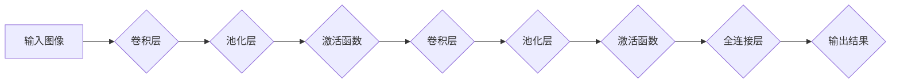

## 一切皆是映射：卷积神经网络(CNNs)在图像处理中的应用

> 关键词：卷积神经网络 (CNN)、图像处理、深度学习、特征提取、分类识别

## 1. 背景介绍

图像处理作为计算机视觉领域的核心，在各个领域都扮演着至关重要的角色。从自动驾驶、医疗诊断到人脸识别、物体检测，图像处理技术无处不在。传统的图像处理方法通常依赖于人工设计的特征提取算法，但这些方法往往难以捕捉图像中的复杂特征，并且对图像的噪声和变化敏感。

深度学习的兴起为图像处理带来了革命性的变革。其中，卷积神经网络 (CNN) 作为深度学习领域最成功的模型之一，凭借其强大的特征提取能力和鲁棒性，在图像处理领域取得了令人瞩目的成就。

## 2. 核心概念与联系

卷积神经网络 (CNN) 是一种专门设计用于处理图像数据的深度神经网络。它借鉴了生物视觉系统的神经元结构和功能，通过一系列卷积、池化、激活和全连接层，从图像中学习到抽象的特征表示。

**CNN 的核心概念：**

* **卷积层 (Convolutional Layer):**  卷积层是 CNN 的核心组成部分，它通过卷积核 (Filter) 对图像进行滑动计算，提取图像局部特征。卷积核可以看作是学习图像特征的模板，通过卷积操作，将图像的不同区域与卷积核进行匹配，从而提取出图像中的边缘、纹理、形状等特征。
* **池化层 (Pooling Layer):** 池化层用于对卷积层的输出进行降维，减少计算量，同时提高模型的鲁棒性。常见的池化操作包括最大池化和平均池化。
* **激活函数 (Activation Function):** 激活函数用于引入非线性，使 CNN 能够学习更复杂的特征表示。常见的激活函数包括 ReLU、Sigmoid 和 Tanh。
* **全连接层 (Fully Connected Layer):** 全连接层将卷积层和池化层的输出进行连接，并进行分类或回归预测。

**CNN 架构流程图:**



## 3. 核心算法原理 & 具体操作步骤

### 3.1  算法原理概述

CNN 的核心算法原理是通过卷积操作和池化操作，逐步提取图像的特征表示。卷积操作通过卷积核对图像进行滑动计算，提取图像局部特征。池化操作则用于对卷积层的输出进行降维，减少计算量，同时提高模型的鲁棒性。

### 3.2  算法步骤详解

1. **输入图像预处理:** 将输入图像转换为适合 CNN 处理的格式，例如调整图像大小、归一化像素值等。
2. **卷积操作:** 使用卷积核对图像进行滑动计算，提取图像局部特征。每个卷积核对应一个特征图，多个卷积核可以提取多个不同类型的特征。
3. **池化操作:** 对卷积层的输出进行池化操作，例如最大池化或平均池化，减少特征图的大小，提高模型的鲁棒性。
4. **激活函数:** 应用激活函数对池化层的输出进行非线性变换，引入非线性，使 CNN 能够学习更复杂的特征表示。
5. **重复步骤 2-4:**  重复卷积、池化和激活操作，逐步提取图像的抽象特征表示。
6. **全连接层:** 将卷积层和池化层的输出连接到全连接层，进行分类或回归预测。

### 3.3  算法优缺点

**优点:**

* **强大的特征提取能力:** CNN 可以自动学习图像中的特征，无需人工设计特征。
* **鲁棒性:** CNN 对图像的噪声和变化具有较强的鲁棒性。
* **参数共享:** 卷积核的参数共享机制，减少了模型参数的数量，提高了模型的效率。

**缺点:**

* **计算量大:** CNN 的训练过程需要大量的计算资源。
* **参数量大:** CNN 的参数量较大，需要大量的训练数据才能有效训练。
* **可解释性差:** CNN 的决策过程比较复杂，难以解释模型的决策结果。

### 3.4  算法应用领域

CNN 在图像处理领域有着广泛的应用，例如：

* **图像分类:**  识别图像中的类别，例如猫、狗、车等。
* **物体检测:**  在图像中定位和识别物体，例如人脸、车辆、交通标志等。
* **图像分割:** 将图像分割成不同的区域，例如分割图像中的前景和背景。
* **图像生成:** 生成新的图像，例如生成人脸图像、风景图像等。
* **医疗图像分析:**  分析医学图像，例如诊断疾病、辅助手术等。

## 4. 数学模型和公式 & 详细讲解 & 举例说明

### 4.1  数学模型构建

CNN 的数学模型主要包括卷积操作、池化操作和激活函数。

**卷积操作:**

卷积操作的数学公式如下:

$$
y(i,j) = \sum_{m=0}^{M-1} \sum_{n=0}^{N-1} x(i+m,j+n) * w(m,n)
$$

其中:

* $y(i,j)$ 是卷积输出的像素值。
* $x(i+m,j+n)$ 是输入图像的像素值。
* $w(m,n)$ 是卷积核的权重值。
* $M$ 和 $N$ 是卷积核的大小。

**池化操作:**

池化操作的数学公式取决于具体的池化操作类型。例如，最大池化操作的公式如下:

$$
y(i,j) = \max_{m=0}^{M-1} \max_{n=0}^{N-1} x(i*s+m,j*s+n)
$$

其中:

* $y(i,j)$ 是池化输出的像素值。
* $x(i*s+m,j*s+n)$ 是输入图像的像素值。
* $s$ 是池化窗口的大小。

**激活函数:**

激活函数的数学公式取决于具体的激活函数类型。例如，ReLU 激活函数的公式如下:

$$
y = max(0,x)
$$

其中:

* $y$ 是激活函数的输出值。
* $x$ 是输入值。

### 4.2  公式推导过程

卷积操作的公式推导过程可以参考相关深度学习教材。

### 4.3  案例分析与讲解

假设我们有一个 3x3 的输入图像，以及一个 2x2 的卷积核。卷积操作的计算过程如下:

1. 将卷积核滑动到图像的左上角位置，对该区域进行卷积计算，得到一个输出值。
2. 将卷积核滑动到图像的下一个位置，重复步骤 1，直到卷积核滑动到图像的右下角位置。
3. 每个卷积核的滑动计算结果对应一个特征图。

## 5. 项目实践：代码实例和详细解释说明

### 5.1  开发环境搭建

* Python 3.x
* TensorFlow 或 PyTorch 深度学习框架
* Jupyter Notebook 或 VS Code 等代码编辑器

### 5.2  源代码详细实现

```python
import tensorflow as tf

# 定义卷积神经网络模型
model = tf.keras.models.Sequential([
    tf.keras.layers.Conv2D(32, (3, 3), activation='relu', input_shape=(28, 28, 1)),
    tf.keras.layers.MaxPooling2D((2, 2)),
    tf.keras.layers.Conv2D(64, (3, 3), activation='relu'),
    tf.keras.layers.MaxPooling2D((2, 2)),
    tf.keras.layers.Flatten(),
    tf.keras.layers.Dense(10, activation='softmax')
])

# 编译模型
model.compile(optimizer='adam',
              loss='sparse_categorical_crossentropy',
              metrics=['accuracy'])

# 加载 MNIST 数据集
(x_train, y_train), (x_test, y_test) = tf.keras.datasets.mnist.load_data()

# 数据预处理
x_train = x_train.astype('float32') / 255.0
x_test = x_test.astype('float32') / 255.0
x_train = x_train.reshape((x_train.shape[0], 28, 28, 1))
x_test = x_test.reshape((x_test.shape[0], 28, 28, 1))

# 训练模型
model.fit(x_train, y_train, epochs=5)

# 评估模型
loss, accuracy = model.evaluate(x_test, y_test)
print('Test loss:', loss)
print('Test accuracy:', accuracy)
```

### 5.3  代码解读与分析

* 代码首先定义了一个卷积神经网络模型，包含卷积层、池化层和全连接层。
* 然后，代码编译了模型，指定了优化器、损失函数和评价指标。
* 接着，代码加载了 MNIST 数据集，并对数据进行了预处理，例如归一化和形状转换。
* 最后，代码训练了模型，并评估了模型的性能。

### 5.4  运行结果展示

训练完成后，代码会输出测试集上的损失值和准确率。

## 6. 实际应用场景

CNN 在图像处理领域有着广泛的应用场景，例如：

* **自动驾驶:**  CNN 可以用于识别道路标志、车辆、行人等，帮助自动驾驶汽车做出决策。
* **医疗诊断:**  CNN 可以用于分析医学图像，例如 X 光片、CT 扫描、MRI 图像，辅助医生诊断疾病。
* **人脸识别:**  CNN 可以用于识别人脸，用于身份验证、安全监控等应用。
* **物体检测:**  CNN 可以用于检测图像中的物体，例如在监控视频中检测入侵者，在零售店中检测商品。
* **图像生成:**  CNN 可以用于生成新的图像，例如生成人脸图像、风景图像等。

### 6.4  未来应用展望

随着深度学习技术的不断发展，CNN 在图像处理领域的应用前景更加广阔。未来，CNN 可能在以下领域得到更广泛的应用:

* **更复杂的图像理解:**  CNN 可以学习更复杂的图像特征，从而实现更复杂的图像理解任务，例如场景理解、图像 Captioning 等。
* **实时图像处理:**  随着硬件性能的提升，CNN 可以实现更快速的图像处理，从而应用于实时图像处理场景，例如自动驾驶、机器人视觉等。
* **跨模态学习:**  CNN 可以与其他模态数据，例如文本、音频等进行融合，实现跨模态学习，从而更好地理解图像信息。

## 7. 工具和资源推荐

### 7.1  学习资源推荐

* **书籍:**
    * 《深度学习》 - Ian Goodfellow, Yoshua Bengio, Aaron Courville
    * 《动手学深度学习》 -  李沐
* **在线课程:**
    * Coursera: 深度学习 Specialization
    * Udacity: Deep Learning Nanodegree
    * fast.ai: Practical Deep Learning for Coders

### 7.2  开发工具推荐

* **TensorFlow:**  Google 开发的开源深度学习框架。
* **PyTorch:**  Facebook 开发的开源深度学习框架。
* **Keras:**  基于 TensorFlow 或 Theano 的高层深度学习 API。

### 7.3  相关论文推荐

* **AlexNet