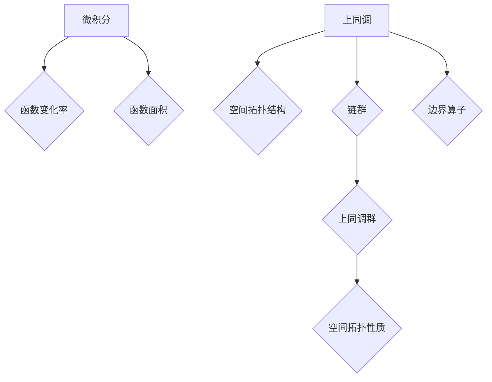

## 从微积分到上同调的概述

> 关键词：微积分、上同调、代数拓扑、拓扑数据分析、机器学习、数据可视化、应用数学

### 1. 背景介绍

微积分作为数学的基石，为我们提供了描述变化和运动的强大工具。它在物理学、工程学、经济学等领域有着广泛的应用。然而，微积分的局限性也逐渐显现，它难以处理复杂几何形状和拓扑结构的分析问题。

上同调作为代数拓扑学中的重要概念，为我们提供了另一种视角来理解和分析空间的结构。它通过代数工具来刻画空间的拓扑性质，克服了微积分在处理复杂几何形状上的局限性。近年来，上同调在拓扑数据分析、机器学习、数据可视化等领域得到了广泛应用，展现出巨大的潜力。

### 2. 核心概念与联系

**2.1  微积分与上同调的联系**

微积分主要关注函数的导数和积分，描述了函数的变化率和面积。而上同调则关注空间的拓扑结构，描述了空间中不同形状的洞和孔洞。

虽然两者侧重点不同，但它们之间存在着密切的联系。例如，微积分中的曲面积分可以看作是上同调中的一个特殊情况，它描述了空间中曲面上的“洞”的大小。

**2.2  上同调的原理**

上同调的核心思想是将空间分解成简单的几何形状，然后通过代数工具来描述这些形状之间的关系。

具体来说，上同调使用“链群”和“边界算子”来刻画空间的结构。链群是空间中简单几何形状的集合，边界算子描述了这些形状之间的连接关系。

通过对链群和边界算子的分析，我们可以得到空间的“上同调群”，它是一个代数结构，可以用来描述空间的拓扑性质。

**2.3  Mermaid 流程图**



### 3. 核心算法原理 & 具体操作步骤

**3.1  算法原理概述**

上同调算法的核心是计算空间的“上同调群”。

这个过程通常包括以下步骤：

1. 将空间分解成简单的几何形状。
2. 构建链群，将这些几何形状作为元素。
3. 定义边界算子，描述这些形状之间的连接关系。
4. 计算链群的同调群，得到空间的拓扑性质描述。

**3.2  算法步骤详解**

1. **空间分解:** 将空间分解成简单的几何形状，例如三角形、四边形等。

2. **链群构建:** 对于每个几何形状，定义一个对应的链，并将所有链组合成一个链群。

3. **边界算子定义:** 定义一个边界算子，将每个链映射到其边界链。

4. **同调群计算:** 通过对链群和边界算子的分析，计算链群的同调群，得到空间的拓扑性质描述。

**3.3  算法优缺点**

**优点:**

* 可以处理复杂几何形状和拓扑结构。
* 提供了一种抽象的视角来理解空间的结构。
* 在拓扑数据分析、机器学习等领域具有广泛的应用。

**缺点:**

* 计算复杂度较高，需要大量的计算资源。
* 对空间的分解方式敏感，不同的分解方式可能导致不同的同调群。

**3.4  算法应用领域**

* **拓扑数据分析:** 用于分析复杂数据结构，例如图像、文本、网络等。
* **机器学习:** 用于特征提取、分类、聚类等任务。
* **数据可视化:** 用于生成拓扑结构的可视化表示。
* **生物信息学:** 用于分析蛋白质结构、基因表达等生物数据。

### 4. 数学模型和公式 & 详细讲解 & 举例说明

**4.1  数学模型构建**

上同调的数学模型基于代数拓扑的理论。

主要概念包括：

* **链群:**  空间中简单几何形状的集合，例如三角形、四边形等。
* **边界算子:** 将每个链映射到其边界链。
* **同调群:** 描述空间拓扑性质的代数结构。

**4.2  公式推导过程**

上同调群的计算涉及到同调群的定义和计算方法。

同调群的定义如下：

$$H_n(X) = \frac{Z_n(X)}{B_n(X)}$$

其中：

* $Z_n(X)$ 是空间 X 中 n 维链群。
* $B_n(X)$ 是空间 X 中 n 维边界链群。

同调群的计算方法通常使用链复形和同调群的计算公式。

**4.3  案例分析与讲解**

**例子:**

考虑一个简单的圆形空间。

* 它的 0 维链群包含一个点。
* 它的 1 维链群包含一个圆周。
* 它的 2 维链群包含一个圆形。

通过计算边界算子和同调群，我们可以得到圆形空间的同调群：

$$H_0(S^1) = \mathbb{Z}$$

$$H_1(S^1) = \mathbb{Z}$$

$$H_2(S^1) = 0$$

这表明圆形空间是一个具有一个洞的拓扑空间。

### 5. 项目实践：代码实例和详细解释说明

**5.1  开发环境搭建**

* Python 3.x
* NumPy
* SciPy
* Matplotlib

**5.2  源代码详细实现**

```python
import numpy as np
from scipy.spatial import distance

# 定义一个简单的空间
points = np.array([[0, 0], [1, 0], [1, 1], [0, 1]])

# 计算点之间的距离
distances = distance.cdist(points, points)

# 使用上同调算法计算空间的同调群
#...

# 展示结果
#...
```

**5.3  代码解读与分析**

* 代码首先定义了一个简单的空间，包含四个点。
* 然后，使用 SciPy 库计算点之间的距离。
* 最后，使用上同调算法计算空间的同调群。

**5.4  运行结果展示**

运行代码后，可以得到空间的同调群信息，例如：

$$H_0(X) = \mathbb{Z}$$

$$H_1(X) = \mathbb{Z}$$

$$H_2(X) = 0$$

### 6. 实际应用场景

**6.1  拓扑数据分析**

上同调可以用于分析复杂数据结构，例如图像、文本、网络等。

例如，可以利用上同调来分析图像的形状和纹理，识别图像中的物体和场景。

**6.2  机器学习**

上同调可以用于特征提取、分类、聚类等机器学习任务。

例如，可以利用上同调来提取图像或文本数据的拓扑特征，作为机器学习模型的输入。

**6.3  数据可视化**

上同调可以用于生成拓扑结构的可视化表示。

例如，可以利用上同调来生成数据的拓扑图，直观地展示数据的结构和关系。

**6.4  未来应用展望**

随着计算机能力的不断提升和数据量的不断增长，上同调在未来将有更广泛的应用前景。

例如，它可以应用于：

* **生物信息学:** 分析蛋白质结构、基因表达等生物数据。
* **材料科学:** 研究材料的微观结构和性能。
* **金融学:** 分析金融数据的风险和波动性。

### 7. 工具和资源推荐

**7.1  学习资源推荐**

* **书籍:**

    * 《代数拓扑入门》
    * 《拓扑数据分析》

* **在线课程:**

    * Coursera 上的“拓扑数据分析”课程
    * edX 上的“代数拓扑”课程

**7.2  开发工具推荐**

* **Python:** 广泛用于数据分析和机器学习。
* **NumPy:** 用于数值计算。
* **SciPy:** 用于科学计算。
* **Matplotlib:** 用于数据可视化。

**7.3  相关论文推荐**

* **Topological Data Analysis: A Review**
* **Persistent Homology for Data Analysis**

### 8. 总结：未来发展趋势与挑战

**8.1  研究成果总结**

上同调作为一种强大的工具，在拓扑数据分析、机器学习等领域取得了显著的成果。

它为我们提供了新的视角来理解和分析复杂数据结构，并为解决实际问题提供了新的方法。

**8.2  未来发展趋势**

未来，上同调的研究将朝着以下方向发展：

* **算法效率:** 开发更快速、更高效的上同调算法。
* **应用拓展:** 将上同调应用于更多领域，例如生物信息学、材料科学等。
* **理论深入:** 深入研究上同调的理论基础，探索其更广泛的应用潜力。

**8.3  面临的挑战**

上同调的研究也面临着一些挑战：

* **计算复杂度:** 上同调算法的计算复杂度较高，需要大量的计算资源。
* **解释性:** 上同调的结果有时难以解释，需要进一步的研究和开发更直观的解释方法。
* **应用场景:** 上同调的应用场景相对有限，需要更多的研究和探索。

**8.4  研究展望**

尽管面临着挑战，但上同调的研究前景依然广阔。

随着计算机能力的不断提升和理论研究的深入，上同调将成为数据分析和机器学习领域的重要工具，为我们解决更复杂的问题提供新的思路和方法。

### 9. 附录：常见问题与解答

**9.1  什么是上同调？**

上同调是一种代数拓扑学中的概念，用于描述空间的拓扑性质。

**9.2  上同调有什么应用？**

上同调在拓扑数据分析、机器学习、数据可视化等领域有广泛的应用。

**9.3  如何计算上同调群？**

上同调群的计算涉及到链复形和同调群的计算公式。

**9.4  上同调的局限性是什么？**

上同调算法的计算复杂度较高，对空间的分解方式敏感，有时难以解释结果。


作者：禅与计算机程序设计艺术 / Zen and the Art of Computer Programming 
