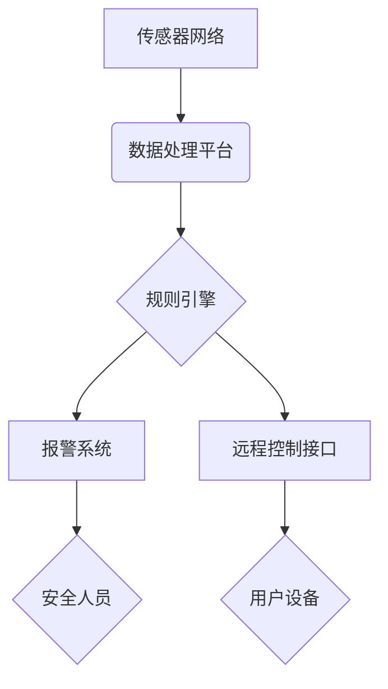

## 基于Java的智能家居设计：用Java实现住宅安全系统的逻辑核心

> 关键词：智能家居、Java、安全系统、传感器、网络通信、数据处理、机器学习

## 1. 背景介绍

智能家居正以惊人的速度发展，它将改变我们与家园的互动方式，带来更加便捷、舒适和安全的居住体验。住宅安全系统作为智能家居的核心组成部分，旨在通过自动化技术和智能感知，有效保护家庭成员和财产安全。

传统的住宅安全系统通常依赖于物理门锁、报警器和监控摄像头等硬件设备，功能相对单一，缺乏智能化和远程控制能力。而基于Java的智能家居安全系统，则可以充分利用Java语言的强大特性和丰富的生态系统，实现更加智能、灵活和高效的安全防护。

## 2. 核心概念与联系

### 2.1 核心概念

* **传感器网络:** 智能家居安全系统依赖于传感器网络来感知环境变化。常见的传感器包括门窗传感器、烟雾传感器、一氧化碳传感器、运动传感器等。这些传感器会实时采集数据，并通过网络传输到安全系统控制中心。
* **数据处理平台:** 数据处理平台负责接收传感器数据，进行数据清洗、分析和处理。它可以利用Java语言和相关框架，实现数据存储、查询、分析和可视化等功能。
* **规则引擎:** 规则引擎根据预先定义的安全规则，对传感器数据进行判断和决策。它可以识别异常事件，并触发相应的安全措施，例如报警、远程控制或自动执行安全程序。
* **远程控制接口:** 远程控制接口允许用户通过手机、平板电脑或其他设备，远程监控和控制安全系统。用户可以通过接口查看实时监控画面、设置安全规则、控制设备开关等。

### 2.2 架构图



## 3. 核心算法原理 & 具体操作步骤

### 3.1 算法原理概述

智能家居安全系统的核心算法主要包括：

* **异常检测算法:** 用于识别传感器数据中的异常事件，例如门窗被打开、烟雾报警、运动异常等。常见的异常检测算法包括统计方法、机器学习方法和深度学习方法。
* **规则匹配算法:** 用于根据预先定义的安全规则，匹配传感器数据中的异常事件，并触发相应的安全措施。规则匹配算法通常采用基于状态机的模型，可以实现灵活的规则定义和事件处理。
* **路径规划算法:** 用于在安全系统中规划最优的巡逻路径，例如机器人巡逻、监控摄像头移动等。常见的路径规划算法包括 Dijkstra 算法、A* 算法和遗传算法。

### 3.2 算法步骤详解

以异常检测算法为例，其具体操作步骤如下：

1. **数据采集:** 传感器收集环境数据，例如温度、湿度、光照、运动等。
2. **数据预处理:** 对采集到的数据进行清洗、转换和归一化，去除噪声和异常值，以便后续算法处理。
3. **特征提取:** 从预处理后的数据中提取关键特征，例如门窗状态、烟雾浓度、运动轨迹等。
4. **异常检测:** 利用异常检测算法对特征数据进行分析，识别异常事件。
5. **规则匹配:** 将检测到的异常事件与预定义的安全规则进行匹配，确定相应的安全措施。
6. **安全措施执行:** 根据规则匹配结果，执行相应的安全措施，例如报警、远程控制、自动执行安全程序等。

### 3.3 算法优缺点

* **优点:** 能够有效识别异常事件，提高安全防护水平。
* **缺点:** 算法的准确性依赖于传感器数据质量和规则定义的准确性。

### 3.4 算法应用领域

* **住宅安全:** 检测门窗入侵、火灾、烟雾、一氧化碳泄漏等异常事件。
* **商业安全:** 保护商店、办公室、仓库等场所的安全。
* **工业安全:** 监控生产设备运行状态，预防设备故障和安全事故。

## 4. 数学模型和公式 & 详细讲解 & 举例说明

### 4.1 数学模型构建

智能家居安全系统的异常检测算法通常基于统计模型或机器学习模型。

* **统计模型:** 例如，可以使用均值和标准差来描述传感器数据的正常分布，并将异常值定义为超出一定标准差的数据点。

* **机器学习模型:** 例如，可以使用支持向量机 (SVM)、决策树、随机森林等机器学习算法，训练一个模型来识别异常事件。

### 4.2 公式推导过程

以均值和标准差作为异常检测模型为例，其公式如下：

* **均值:** $\mu = \frac{1}{n} \sum_{i=1}^{n} x_i$

* **标准差:** $\sigma = \sqrt{\frac{1}{n-1} \sum_{i=1}^{n} (x_i - \mu)^2}$

其中，$x_i$ 表示第 $i$ 个数据点，$n$ 表示数据点的总数。

如果一个数据点 $x$ 的绝对值与均值 $\mu$ 的差值大于 $k$ 倍的标准差 $\sigma$，则认为该数据点为异常值。

* **异常检测规则:** $|x - \mu| > k \sigma$

### 4.3 案例分析与讲解

假设一个智能家居安全系统监测门窗状态，传感器每分钟采集一次数据。经过一段时间的数据积累，我们可以计算出门窗状态的均值和标准差。如果传感器突然检测到门窗打开，并且该事件与历史数据相比明显异常，则系统会触发报警。

## 5. 项目实践：代码实例和详细解释说明

### 5.1 开发环境搭建

* **操作系统:** Windows、macOS 或 Linux
* **Java 开发环境:** JDK 11 或更高版本
* **IDE:** Eclipse、IntelliJ IDEA 或其他 Java IDE
* **网络库:** Apache HttpClient 或其他网络通信库
* **数据库:** MySQL、PostgreSQL 或其他关系型数据库

### 5.2 源代码详细实现

```java
// 异常检测算法示例代码
public class AnomalyDetection {

    private double mean;
    private double stdDev;
    private int threshold;

    public AnomalyDetection(double mean, double stdDev, int threshold) {
        this.mean = mean;
        this.stdDev = stdDev;
        this.threshold = threshold;
    }

    public boolean isAnomaly(double dataPoint) {
        double zScore = (dataPoint - mean) / stdDev;
        return Math.abs(zScore) > threshold;
    }
}
```

### 5.3 代码解读与分析

* `AnomalyDetection` 类实现了异常检测算法。
* `mean`、`stdDev` 和 `threshold` 属性分别存储数据的均值、标准差和异常阈值。
* `isAnomaly` 方法接收一个数据点作为输入，计算其 z 值，并根据阈值判断是否为异常值。

### 5.4 运行结果展示

当传感器数据超过预设的异常阈值时，`isAnomaly` 方法返回 `true`，触发报警或其他安全措施。

## 6. 实际应用场景

基于Java的智能家居安全系统可以应用于各种场景，例如：

* **家庭安全:** 监控门窗、烟雾、一氧化碳、水浸等异常事件，保护家庭成员和财产安全。
* **老人照护:** 监测老人活动轨迹、跌倒情况，及时报警或提供帮助。
* **宠物监控:** 监控宠物活动情况，防止宠物逃离或受伤。
* **商业安全:** 保护商店、办公室、仓库等场所的安全，防止盗窃、火灾等事件发生。

### 6.4 未来应用展望

随着人工智能、物联网和云计算技术的不断发展，智能家居安全系统将更加智能化、个性化和安全可靠。未来，智能家居安全系统可能具备以下功能：

* **主动防御:** 利用机器学习算法，识别潜在的安全威胁，并主动采取防御措施。
* **人脸识别:** 通过人脸识别技术，识别家庭成员和访客，提高安全防护水平。
* **语音控制:** 通过语音控制，方便用户远程监控和控制安全系统。
* **场景联动:** 根据用户需求，实现安全系统与其他智能家居设备的联动，例如灯光、空调、窗帘等。

## 7. 工具和资源推荐

### 7.1 学习资源推荐

* **Java 官方文档:** https://docs.oracle.com/javase/tutorial/
* **Spring Boot 官方文档:** https://spring.io/projects/spring-boot
* **Apache Kafka 官方文档:** https://kafka.apache.org/documentation/
* **机器学习算法教程:** https://www.coursera.org/learn/machine-learning

### 7.2 开发工具推荐

* **Eclipse IDE:** https://www.eclipse.org/
* **IntelliJ IDEA:** https://www.jetbrains.com/idea/
* **Git:** https://git-scm.com/
* **Docker:** https://www.docker.com/

### 7.3 相关论文推荐

* **A Survey of Anomaly Detection Techniques:** https://ieeexplore.ieee.org/document/6919702
* **Deep Learning for Intrusion Detection:** https://arxiv.org/abs/1803.01183

## 8. 总结：未来发展趋势与挑战

### 8.1 研究成果总结

基于Java的智能家居安全系统已经取得了一定的成果，能够有效识别异常事件，提高安全防护水平。

### 8.2 未来发展趋势

未来，智能家居安全系统将朝着更加智能化、个性化和安全可靠的方向发展。

### 8.3 面临的挑战

* **数据安全:** 智能家居安全系统需要处理大量敏感数据，数据安全是一个重要的挑战。
* **算法准确性:** 算法的准确性直接影响到安全系统的可靠性，需要不断改进算法模型和训练方法。
* **系统集成:** 智能家居安全系统需要与其他智能家居设备和平台进行集成，实现互联互通。

### 8.4 研究展望

未来，我们将继续研究智能家居安全系统的算法、架构和应用，致力于打造更加安全、可靠和便捷的智能家居环境。

## 9. 附录：常见问题与解答

* **Q1: 如何选择合适的异常检测算法？**

* **A1:** 选择合适的异常检测算法需要根据具体应用场景和数据特点进行选择。

* **Q2: 如何提高算法的准确性？**

* **A2:** 可以通过增加训练数据量、改进算法模型、优化参数设置等方法提高算法的准确性。

* **Q3: 如何保障数据安全？**

* **A3:** 可以采用数据加密、访问控制、安全审计等措施保障数据安全。


作者：禅与计算机程序设计艺术 / Zen and the Art of Computer Programming 
