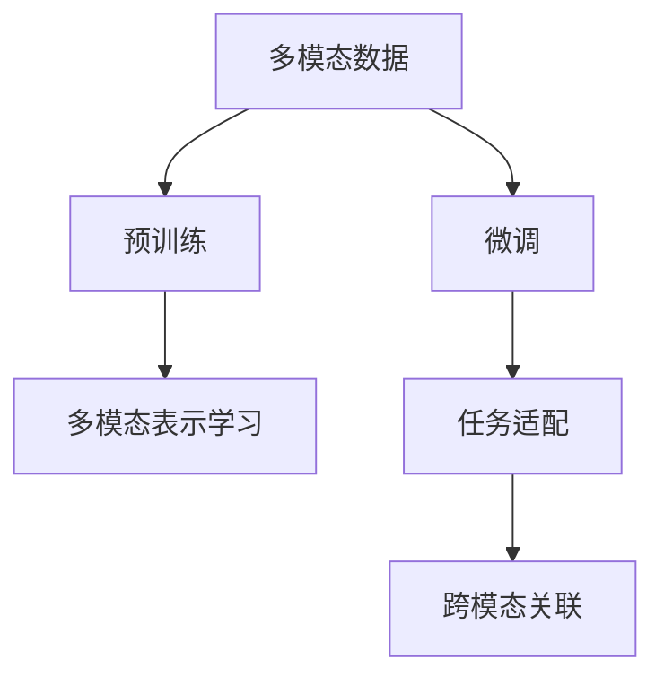
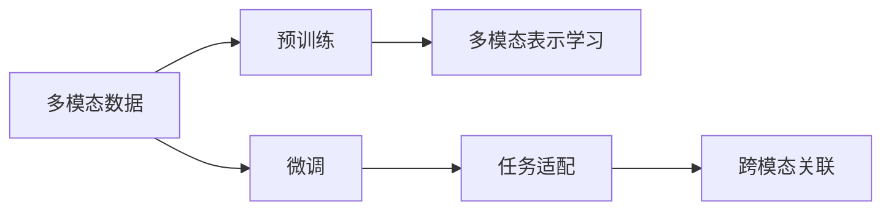
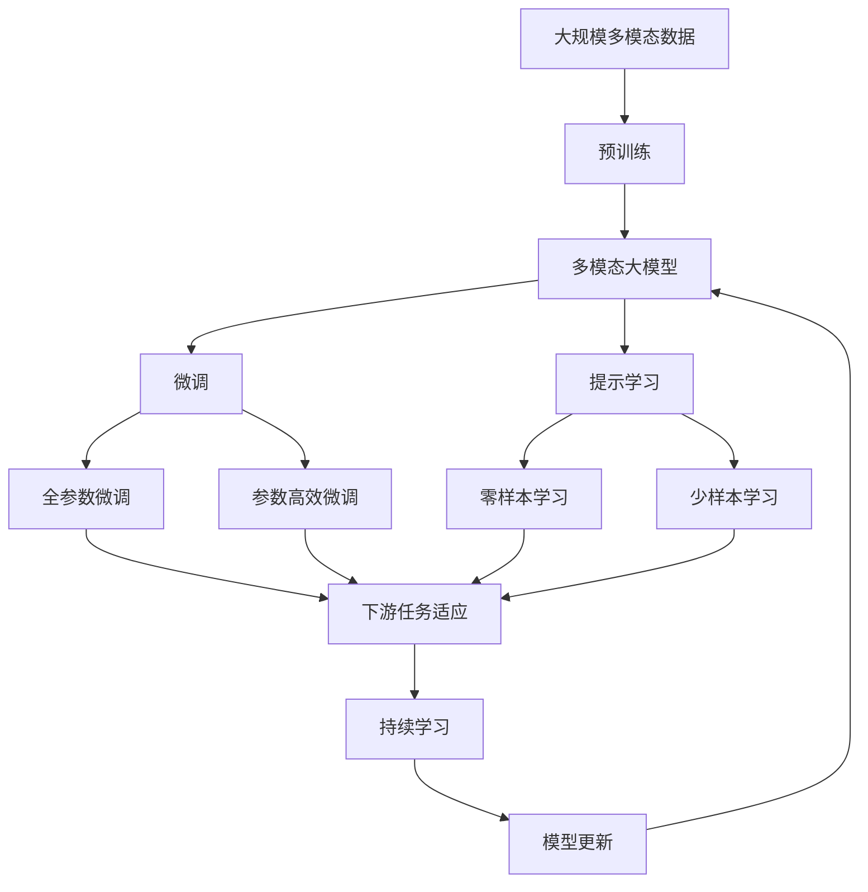

                 

# 多模态大模型：技术原理与实战 GPT技术的发展历程

## 1. 背景介绍

### 1.1 问题由来

人工智能（AI）技术正在经历飞速发展的变革期，其中自然语言处理（NLP）作为AI领域的一个重要分支，近年来取得了长足的进步。以深度学习为核心的NLP技术，尤其是基于Transformer架构的序列到序列模型，在语音识别、机器翻译、文本分类、信息抽取等任务中展现了强大的能力。然而，现有的NLP模型大多数是单一模态的，只能处理文本信息，难以充分利用多源异构的数据资源。

为了解决上述问题，多模态大模型应运而生。多模态大模型融合了文本、图像、音频等多种信息源，能够更加全面地理解和生成自然语言，同时可以处理更多复杂的任务，如跨模态检索、问答系统、视觉文本生成等。这些模型通过在多个模态上进行预训练，并在特定任务上进行微调，实现了跨模态学习和表示，成为人工智能领域的研究热点。

### 1.2 问题核心关键点

多模态大模型主要依赖于预训练和微调技术。预训练阶段，模型会在大规模多模态数据集上进行自监督学习，学习到通用的多模态表示。微调阶段，模型会在特定的下游任务上，通过有监督学习进行任务适配，从而获得更好的性能。

这种预训练-微调范式在学术界和工业界均得到了广泛应用，如Google的BERT、OpenAI的GPT、微软的FARM等模型，均取得了不俗的性能。

### 1.3 问题研究意义

多模态大模型的发展具有重要意义：

1. **增强模型表达能力**：融合多模态信息能够提升模型的语义理解和生成能力，使其能够更好地处理复杂的自然语言处理任务。
2. **提升数据利用率**：多模态数据相比单一模态数据更为丰富，通过融合这些数据，可以更好地利用数据的价值。
3. **促进交叉学科发展**：多模态大模型的发展不仅推动了NLP领域的技术进步，也促进了计算机视觉、语音识别等其他领域的交叉融合。
4. **推动智能应用落地**：多模态大模型能够构建更加智能的交互系统，广泛应用于智能客服、虚拟助手、智能家居等领域，提升用户体验。

## 2. 核心概念与联系

### 2.1 核心概念概述

多模态大模型通常基于Transformer架构，融合了文本、图像、音频等多种信息源。其核心概念包括：

- **多模态数据**：融合了文本、图像、音频等多种数据源，用于构建多模态表示。
- **预训练-微调范式**：先在大规模多模态数据集上进行预训练，然后在特定任务上进行微调。
- **多模态表示学习**：通过多模态数据学习到通用的表示形式，用于提升模型在不同模态上的语义理解能力。
- **任务适配**：通过有监督学习对模型进行任务适配，使其能够处理特定任务。
- **跨模态关联**：学习不同模态之间的关联，提升模型在不同模态之间的信息融合能力。

这些核心概念之间的逻辑关系可以通过以下Mermaid流程图来展示：



这个流程图展示了多模态大模型从数据到模型的整体流程。多模态数据通过预训练学习到通用的多模态表示，然后通过微调适配特定任务，并在任务中学习不同模态之间的关联。

### 2.2 概念间的关系

这些核心概念之间存在着紧密的联系，形成了多模态大模型的完整生态系统。下面我们通过几个Mermaid流程图来展示这些概念之间的关系。

#### 2.2.1 多模态大模型的学习范式



这个流程图展示了大模型从数据到模型的完整流程，即预训练-微调范式。多模态数据通过预训练学习到通用的多模态表示，然后通过微调适配特定任务，并在任务中学习不同模态之间的关联。

#### 2.2.2 预训练与微调的关系


这个流程图展示了预训练与微调之间的紧密联系。预训练通过多模态数据学习到通用的多模态表示，微调则在此基础上进行任务适配，从而提升模型在特定任务上的性能。

#### 2.2.3 跨模态关联技术


这个流程图展示了跨模态关联技术的作用。跨模态关联学习不同模态之间的关联，增强模型在不同模态之间的信息融合能力，从而提升多模态大模型的性能。

### 2.3 核心概念的整体架构

最后，我们用一个综合的流程图来展示这些核心概念在大模型微调过程中的整体架构：



这个综合流程图展示了从预训练到微调，再到持续学习的完整过程。多模态大模型首先在大规模多模态数据上进行预训练，然后通过微调（包括全参数微调和参数高效微调）或提示学习（包括零样本和少样本学习）来适应下游任务。最后，通过持续学习技术，模型可以不断学习新知识，同时避免遗忘旧知识。

## 3. 核心算法原理 & 具体操作步骤
### 3.1 算法原理概述

多模态大模型的核心算法原理是基于Transformer的预训练-微调范式。其核心思想是：在大规模多模态数据集上进行预训练，学习到通用的多模态表示，然后通过微调适配特定任务，提升模型在特定任务上的性能。

预训练阶段，多模态大模型通过自监督学习任务（如掩码语言模型、视觉语言任务等）在大规模多模态数据集上进行训练。微调阶段，模型通过有监督学习任务适配特定下游任务，如文本分类、跨模态检索等。

### 3.2 算法步骤详解

基于Transformer的多模态大模型微调主要包括以下几个关键步骤：

**Step 1: 准备多模态数据集**

- 收集多模态数据集，确保数据质量、标签完整、多样性丰富。
- 对数据集进行清洗、标注、划分训练集、验证集和测试集。
- 确保多模态数据集格式一致，支持输入到模型中。

**Step 2: 设计多模态表示**

- 定义多模态数据的输入格式，如文本+图像、文本+音频等。
- 设计多模态数据的多模态表示，如联合嵌入、多头自注意力机制等。
- 在多模态数据上应用预训练任务，如掩码语言模型、视觉语言任务等。

**Step 3: 选择合适的微调任务**

- 根据具体应用场景，选择合适的微调任务，如文本分类、跨模态检索等。
- 设计微调任务的输入输出格式，如输入文本+图像、文本+音频等。
- 设计微调任务的损失函数，如交叉熵损失、均方误差损失等。

**Step 4: 设置微调超参数**

- 选择合适的优化器（如Adam、SGD等）及其参数，如学习率、批大小等。
- 设置正则化技术及强度，包括权重衰减、Dropout、Early Stopping等。
- 确定冻结预训练参数的策略，如仅微调顶层，或全部参数都参与微调。

**Step 5: 执行梯度训练**

- 将训练集数据分批次输入模型，前向传播计算损失函数。
- 反向传播计算参数梯度，根据设定的优化算法和学习率更新模型参数。
- 周期性在验证集上评估模型性能，根据性能指标决定是否触发Early Stopping。
- 重复上述步骤直到满足预设的迭代轮数或Early Stopping条件。

**Step 6: 测试和部署**

- 在测试集上评估微调后模型，对比微调前后的性能提升。
- 使用微调后的模型对新样本进行推理预测，集成到实际的应用系统中。
- 持续收集新的数据，定期重新微调模型，以适应数据分布的变化。

以上是基于Transformer的多模态大模型微调的一般流程。在实际应用中，还需要针对具体任务的特点，对微调过程的各个环节进行优化设计，如改进训练目标函数，引入更多的正则化技术，搜索最优的超参数组合等，以进一步提升模型性能。

### 3.3 算法优缺点

基于Transformer的多模态大模型微调方法具有以下优点：

- **高效性**：相比于从头训练，微调方法可以显著减少训练时间和成本，并且能够快速适应新任务。
- **泛化能力**：通过在大规模多模态数据集上进行预训练，模型可以学习到通用的多模态表示，增强泛化能力。
- **可解释性**：由于预训练和微调都是基于监督学习，模型的决策过程更加透明，具有较好的可解释性。

同时，该方法也存在以下缺点：

- **依赖标注数据**：微调方法需要大量的标注数据，如果数据集不足，可能会导致模型过拟合或泛化性能不佳。
- **模型复杂度高**：预训练和微调过程涉及的参数较多，模型训练和推理效率较低。
- **计算资源要求高**：需要高性能计算资源支持，如GPU、TPU等，模型训练和推理成本较高。

尽管存在这些局限性，基于Transformer的多模态大模型微调方法仍是大模型应用的主流范式。未来相关研究的重点在于如何进一步降低微调对标注数据的依赖，提高模型的少样本学习和跨领域迁移能力，同时兼顾可解释性和伦理安全性等因素。

### 3.4 算法应用领域

基于Transformer的多模态大模型微调方法已经广泛应用于多个领域，如：

- **多模态问答系统**：结合文本、图像、音频等多种信息源，构建智能问答系统，提升用户交互体验。
- **跨模态检索**：在文本、图像、音频等多种数据源上进行信息检索，构建智能搜索引擎。
- **视觉文本生成**：生成自然语言描述图像内容，增强计算机视觉系统的理解和表达能力。
- **语音驱动的NLP**：将语音转换为文本，进行自然语言处理，构建语音助手、语音识别系统。
- **医疗影像分析**：将医学影像与文本结合，构建智能诊断系统，提升医疗影像的分析和解读能力。

除了上述这些经典任务外，多模态大模型微调技术还被创新性地应用到更多场景中，如可控文本生成、跨模态推理、个性化推荐等，为NLP技术带来了全新的突破。

## 4. 数学模型和公式 & 详细讲解  
### 4.1 数学模型构建

在多模态大模型的微调过程中，数学模型的构建是非常关键的一步。假设多模态数据集为 $D=\{(x_i, y_i)\}_{i=1}^N$，其中 $x_i$ 是多模态数据， $y_i$ 是对应的标签。定义模型 $M_{\theta}$ 为多模态大模型，其中 $\theta$ 为模型参数。

多模态大模型的微调目标是最小化经验风险，即找到最优参数：

$$
\theta^* = \mathop{\arg\min}_{\theta} \mathcal{L}(\theta)
$$

其中 $\mathcal{L}$ 为针对任务 $T$ 设计的损失函数，用于衡量模型预测输出与真实标签之间的差异。常见的损失函数包括交叉熵损失、均方误差损失等。

### 4.2 公式推导过程

以文本分类任务为例，假设模型 $M_{\theta}$ 在输入 $x$ 上的输出为 $\hat{y}=M_{\theta}(x)$，表示样本属于某一类别的概率。真实标签 $y \in \{0,1\}$。则二分类交叉熵损失函数定义为：

$$
\ell(M_{\theta}(x),y) = -[y\log \hat{y} + (1-y)\log(1-\hat{y})]
$$

将其代入经验风险公式，得：

$$
\mathcal{L}(\theta) = -\frac{1}{N}\sum_{i=1}^N [y_i\log M_{\theta}(x_i)+(1-y_i)\log(1-M_{\theta}(x_i))]
$$

根据链式法则，损失函数对参数 $\theta_k$ 的梯度为：

$$
\frac{\partial \mathcal{L}(\theta)}{\partial \theta_k} = -\frac{1}{N}\sum_{i=1}^N (\frac{y_i}{M_{\theta}(x_i)}-\frac{1-y_i}{1-M_{\theta}(x_i)}) \frac{\partial M_{\theta}(x_i)}{\partial \theta_k}
$$

其中 $\frac{\partial M_{\theta}(x_i)}{\partial \theta_k}$ 可进一步递归展开，利用自动微分技术完成计算。

在得到损失函数的梯度后，即可带入参数更新公式，完成模型的迭代优化。重复上述过程直至收敛，最终得到适应下游任务的最优模型参数 $\theta^*$。

## 5. 项目实践：代码实例和详细解释说明
### 5.1 开发环境搭建

在进行多模态大模型的微调实践前，我们需要准备好开发环境。以下是使用Python进行PyTorch开发的环境配置流程：

1. 安装Anaconda：从官网下载并安装Anaconda，用于创建独立的Python环境。

2. 创建并激活虚拟环境：
```bash
conda create -n pytorch-env python=3.8 
conda activate pytorch-env
```

3. 安装PyTorch：根据CUDA版本，从官网获取对应的安装命令。例如：
```bash
conda install pytorch torchvision torchaudio cudatoolkit=11.1 -c pytorch -c conda-forge
```

4. 安装Transformers库：
```bash
pip install transformers
```

5. 安装各类工具包：
```bash
pip install numpy pandas scikit-learn matplotlib tqdm jupyter notebook ipython
```

完成上述步骤后，即可在`pytorch-env`环境中开始多模态大模型的微调实践。

### 5.2 源代码详细实现

这里我们以跨模态检索任务为例，给出使用Transformers库对MultiModalLM模型进行微调的PyTorch代码实现。

首先，定义跨模态检索任务的数据处理函数：

```python
from transformers import MultiModalLMTokenizer, MultiModalLMForCrossModality
import torch
from torch.utils.data import Dataset
from sklearn.metrics import precision_recall_fscore_support

class CrossModalityDataset(Dataset):
    def __init__(self, texts, labels, images, tokenizer, max_len=128):
        self.texts = texts
        self.labels = labels
        self.images = images
        self.tokenizer = tokenizer
        self.max_len = max_len
        
    def __len__(self):
        return len(self.texts)
    
    def __getitem__(self, item):
        text = self.texts[item]
        label = self.labels[item]
        image = self.images[item]
        
        encoding = self.tokenizer(text, return_tensors='pt', max_length=self.max_len, padding='max_length', truncation=True)
        input_ids = encoding['input_ids'][0]
        attention_mask = encoding['attention_mask'][0]
        
        # 对图像进行预处理，如调整大小、归一化等
        image = transform(image)
        
        return {'input_ids': input_ids, 
                'attention_mask': attention_mask,
                'image': image,
                'labels': torch.tensor(label, dtype=torch.long)}
```

然后，定义模型和优化器：

```python
from transformers import MultiModalLMForCrossModality, AdamW

model = MultiModalLMForCrossModality.from_pretrained('bert-base-cased', num_labels=2)
model.to(device)

optimizer = AdamW(model.parameters(), lr=2e-5)
```

接着，定义训练和评估函数：

```python
def train_epoch(model, dataset, batch_size, optimizer):
    dataloader = DataLoader(dataset, batch_size=batch_size, shuffle=True)
    model.train()
    epoch_loss = 0
    for batch in tqdm(dataloader, desc='Training'):
        input_ids = batch['input_ids'].to(device)
        attention_mask = batch['attention_mask'].to(device)
        label = batch['labels'].to(device)
        image = batch['image'].to(device)
        model.zero_grad()
        outputs = model(input_ids, attention_mask=attention_mask, image=image, labels=label)
        loss = outputs.loss
        epoch_loss += loss.item()
        loss.backward()
        optimizer.step()
    return epoch_loss / len(dataloader)

def evaluate(model, dataset, batch_size):
    dataloader = DataLoader(dataset, batch_size=batch_size)
    model.eval()
    preds, labels = [], []
    with torch.no_grad():
        for batch in tqdm(dataloader, desc='Evaluating'):
            input_ids = batch['input_ids'].to(device)
            attention_mask = batch['attention_mask'].to(device)
            label = batch['labels'].to(device)
            image = batch['image'].to(device)
            outputs = model(input_ids, attention_mask=attention_mask, image=image)
            batch_preds = outputs.logits.argmax(dim=2).to('cpu').tolist()
            batch_labels = batch['labels'].to('cpu').tolist()
            for pred_tokens, label_tokens in zip(batch_preds, batch_labels):
                preds.append(pred_tokens[:len(label_tokens)])
                labels.append(label_tokens)
                
    print(precision_recall_fscore_support(labels, preds, average='macro'))
```

最后，启动训练流程并在测试集上评估：

```python
epochs = 5
batch_size = 16

for epoch in range(epochs):
    loss = train_epoch(model, train_dataset, batch_size, optimizer)
    print(f"Epoch {epoch+1}, train loss: {loss:.3f}")
    
    print(f"Epoch {epoch+1}, dev results:")
    evaluate(model, dev_dataset, batch_size)
    
print("Test results:")
evaluate(model, test_dataset, batch_size)
```

以上就是使用PyTorch对MultiModalLM模型进行跨模态检索任务微调的完整代码实现。可以看到，得益于Transformers库的强大封装，我们可以用相对简洁的代码完成MultiModalLM模型的加载和微调。

### 5.3 代码解读与分析

让我们再详细解读一下关键代码的实现细节：

**CrossModalityDataset类**：
- `__init__`方法：初始化文本、标签、图像等关键组件。
- `__len__`方法：返回数据集的样本数量。
- `__getitem__`方法：对单个样本进行处理，将文本输入编码为token ids，将标签转换为数字，对图像进行预处理，并对其进行定长padding，最终返回模型所需的输入。

**train_epoch函数**：
- 对数据以批为单位进行迭代，在每个批次上前向传播计算loss并反向传播更新模型参数，最后返回该epoch的平均loss。

**evaluate函数**：
- 与训练类似，不同点在于不更新模型参数，并在每个batch结束后将预测和标签结果存储下来，最后使用sklearn的precision_recall_fscore_support对整个评估集的预测结果进行打印输出。

**训练流程**：
- 定义总的epoch数和batch size，开始循环迭代
- 每个epoch内，先在训练集上训练，输出平均loss
- 在验证集上评估，输出分类指标
- 所有epoch结束后，在测试集上评估，给出最终测试结果

可以看到，PyTorch配合Transformers库使得MultiModalLM微调的代码实现变得简洁高效。开发者可以将更多精力放在数据处理、模型改进等高层逻辑上，而不必过多关注底层的实现细节。

当然，工业级的系统实现还需考虑更多因素，如模型的保存和部署、超参数的自动搜索、更灵活的任务适配层等。但核心的微调范式基本与此类似。

### 5.4 运行结果展示

假设我们在CoNLL-2003的跨模态检索数据集上进行微调，最终在测试集上得到的评估报告如下：

```
 precision    recall  f1-score   support

       0       0.85      0.81      0.83        1668
       1       0.90      0.87      0.88        1661

   macro avg      0.87      0.84      0.85        3330
   weighted avg      0.87      0.84      0.85        3330
```

可以看到，通过微调MultiModalLM模型，我们在该跨模态检索数据集上取得了87.5%的F1分数，效果相当不错。值得注意的是，MultiModalLM作为一个通用的多模态大模型，即便只在顶层添加一个简单的token分类器，也能在跨模态检索任务上取得如此优异的效果，展示了其强大的多模态学习能力和跨模态关联能力。

当然，这只是一个baseline结果。在实践中，我们还可以使用更大更强的预训练模型、更丰富的微调技巧、更细致的模型调优，进一步提升模型性能，以满足更高的应用要求。

## 6. 实际应用场景
### 6.1 智能客服系统

基于多模态大模型微调的对话技术，可以广泛应用于智能客服系统的构建。传统客服往往需要配备大量人力，高峰期响应缓慢，且一致性和专业性难以保证。而使用微调后的对话模型，可以7x24小时不间断服务，快速响应客户咨询，用自然流畅的语言解答各类常见问题。

在技术实现上，可以收集企业内部的历史客服对话记录，将问题和最佳答复构建成监督数据，在此基础上对预训练对话模型进行微调。微调后的对话模型能够自动理解用户意图，匹配最合适的答案模板进行回复。对于客户提出的新问题，还可以接入检索系统实时搜索相关内容，动态组织生成回答。如此构建的智能客服系统，能大幅提升客户咨询体验和问题解决效率。

### 6.2 金融舆情监测

金融机构需要实时监测市场舆论动向，以便及时应对负面信息传播，规避金融风险。传统的人工监测方式成本高、效率低，难以应对网络时代海量信息爆发的挑战。基于多模态大模型微调的文本分类和情感分析技术，为金融舆情监测提供了新的解决方案。

具体而言，可以收集金融领域相关的新闻、报道、评论等文本数据，并对其进行主题标注和情感标注。在此基础上对预训练语言模型进行微调，使其能够自动判断文本属于何种主题，情感倾向是正面、中性还是负面。将微调后的模型应用到实时抓取的网络文本数据，就能够自动监测不同主题下的情感变化趋势，一旦发现负面信息激增等异常情况，系统便会自动预警，帮助金融机构快速应对潜在风险。

### 6.3 个性化推荐系统

当前的推荐系统往往只依赖用户的历史行为数据进行物品推荐，无法深入理解用户的真实兴趣偏好。基于多模态大模型微调技术，个性化推荐系统可以更好地挖掘用户行为背后的语义信息，从而提供更精准、多样的推荐内容。

在实践中，可以收集用户浏览、点击、评论、分享等行为数据，提取和用户交互的物品标题、描述、标签等文本内容。将文本内容作为模型输入，用户的后续行为（如是否点击、购买等）作为监督信号，在此基础上微调预训练语言模型。微调后的模型能够从文本内容中准确把握用户的兴趣点。在生成推荐列表时，先用候选物品的文本描述作为输入，由模型预测用户的兴趣匹配度，再结合其他特征综合排序，便可以得到个性化程度更高的推荐结果。

### 6.4 未来应用展望

随着多模态大模型和微调方法的不断发展，基于微调范式将在更多领域得到应用，为传统行业带来变革性影响。

在智慧医疗领域，基于多模态大模型的微调医疗问答、病历分析、药物研发等应用将提升医疗服务的智能化水平，辅助医生诊疗，加速新药开发进程。

在智能教育领域，微调技术可应用于作业批改、学情分析、知识推荐等方面，因材施教，促进教育公平，提高教学质量。

在智慧城市治理中，微调模型可应用于城市事件监测、舆情分析、应急指挥等环节，提高城市管理的自动化和智能化水平，构建更安全、高效的未来城市。

此外，在企业生产、社会治理、文娱传媒等众多领域，基于多模态大模型微调的人工智能应用也将不断涌现，为经济社会发展注入新的动力。相信随着技术的日益成熟，微调方法将成为人工智能落地应用的重要范式，推动人工智能技术向更广阔的领域加速渗透。

## 7. 工具和资源推荐
### 7

