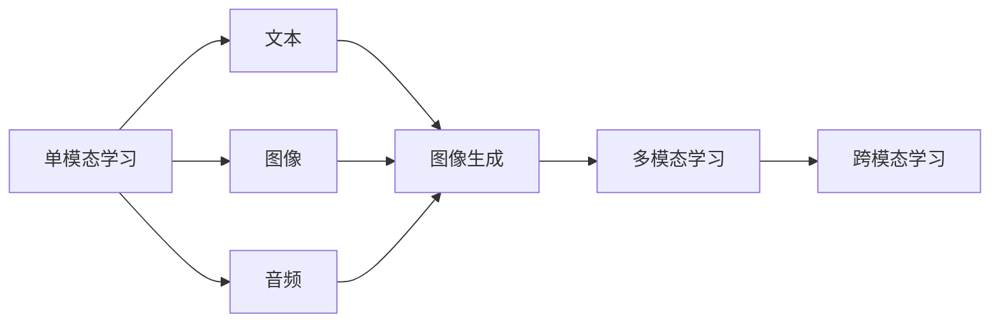
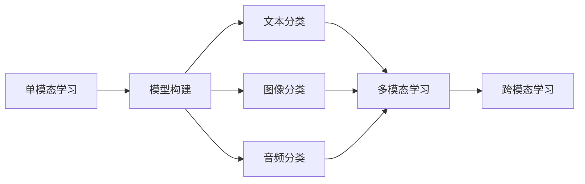

                 

# 多模态大模型：技术原理与实战 单模态学习、多模态学习和跨模态学习的区别

## 1. 背景介绍

在人工智能领域，尤其是自然语言处理(NLP)、计算机视觉(CV)和音频处理等领域，单模态模型已经取得了显著的进展。但是，许多现实世界的问题具有复杂性，仅依赖单模态模型可能无法获得令人满意的结果。例如，音频命令和文本对话结合的场景、文本与图像的匹配等，均需要同时利用多种模态信息。因此，多模态大模型（Multimodal Large Models）应运而生，通过融合不同模态的信息，提升了模型的表达能力和理解力。

本文将系统介绍单模态学习、多模态学习和跨模态学习的原理、技术实现及其实际应用。我们将在后续的章节中详细介绍每种学习范式的核心概念、具体算法和操作流程，并对比它们之间的区别，以便读者能够全面理解多模态大模型技术的核心思想。

## 2. 核心概念与联系

### 2.1 核心概念概述

**单模态学习**：单模态学习指只考虑单个模态信息（例如文本、图像或音频）的模型，通过传统的机器学习算法或深度学习模型进行训练，以解决单模态任务。

**多模态学习**：多模态学习指同时考虑两个或以上不同模态信息（例如文本、图像、音频）的模型，通过融合不同模态的信息来提高模型的表达能力和理解能力。

**跨模态学习**：跨模态学习是指在多个模态间建立映射关系，通过学习一种模态来预测另一种模态，如将图像翻译为文本或将文本生成图像。

这三种学习范式之间的联系和区别可以通过以下Mermaid流程图来展示：



这个流程图展示了单模态学习、多模态学习和跨模态学习之间的关系和联系。单模态学习是基础，多模态学习是在单模态学习的基础上对多个模态信息进行融合，而跨模态学习则是将一种模态映射到另一种模态，涉及模型之间的映射关系。

### 2.2 概念间的关系

这些核心概念之间的关系可以通过以下Mermaid流程图来进一步阐述：



这个流程图展示了单模态学习、多模态学习和跨模态学习之间的具体应用场景。单模态学习可以应用于文本、图像和音频的分类任务，而多模态学习可以在处理多模态信息时进一步提升模型的性能。跨模态学习则是在多个模态间建立映射关系，实现不同模态之间的转换。

## 3. 核心算法原理 & 具体操作步骤

### 3.1 算法原理概述

多模态大模型的算法原理可以概括为以下几个步骤：

1. **数据预处理**：将不同模态的数据转换为统一的格式，以便于进行模型训练。
2. **特征提取**：通过预训练模型对每个模态的数据进行特征提取，生成高维向量。
3. **融合**：使用特定的融合算法（如注意力机制、时空池化等）将不同模态的特征进行融合，得到多模态的特征表示。
4. **模型训练**：在多模态特征表示的基础上进行模型的训练，以解决多模态任务。
5. **跨模态映射**：对于跨模态学习，需要建立不同模态之间的映射关系，使用模型预测一种模态的输出，如从图像生成文本。

### 3.2 算法步骤详解

#### 3.2.1 数据预处理

在数据预处理阶段，需要将不同模态的数据转换为统一的格式。例如，对于文本和图像数据，可以使用各自的编码器进行编码，生成高维向量。对于音频数据，可以使用MFCC（Mel频率倒谱系数）或其他音频特征提取器进行特征提取。

#### 3.2.2 特征提取

特征提取是单模态学习和多模态学习的核心步骤之一。使用预训练模型（如BERT、ResNet等）对每个模态的数据进行特征提取，生成高维向量。这些高维向量可以被输入到多模态学习模型中进行进一步处理。

#### 3.2.3 特征融合

特征融合是多模态学习的关键步骤。常用的特征融合方法包括注意力机制、时空池化、拼接等。注意力机制通过学习不同模态特征的重要性，对不同模态的特征进行加权融合。时空池化通过池化操作将不同模态的特征进行聚合，生成新的特征表示。拼接是将不同模态的特征向量直接拼接，得到多模态的特征表示。

#### 3.2.4 模型训练

在多模态特征表示的基础上，可以使用各种机器学习算法或深度学习模型进行训练。常用的模型包括多模态注意力机制模型、时空池化网络、多模态卷积神经网络等。

#### 3.2.5 跨模态映射

跨模态映射的目的是在多个模态间建立映射关系。常用的方法包括编码器-解码器模型、注意力机制、多模态神经网络等。这些模型通常包含两个分支，一个用于提取输入模态的特征，另一个用于生成输出模态的特征，通过学习映射关系，实现不同模态之间的转换。

### 3.3 算法优缺点

**单模态学习的优缺点**：
- 优点：训练数据相对较少，模型较轻量，计算效率高。
- 缺点：难以处理复杂的多模态信息，无法利用多种模态的信息提升模型的表达能力。

**多模态学习的优缺点**：
- 优点：能够利用多种模态的信息，提升模型的表达能力和理解能力。
- 缺点：训练数据量大，模型复杂，计算资源需求高。

**跨模态学习的优缺点**：
- 优点：能够将一种模态映射到另一种模态，解决一些复杂的跨模态问题。
- 缺点：跨模态映射的准确性依赖于模型设计和训练数据的数量和质量。

### 3.4 算法应用领域

单模态学习在自然语言处理（NLP）、计算机视觉（CV）、语音识别等领域有广泛的应用。例如，文本分类、图像分类、语音识别等。

多模态学习在多模态智能交互、多模态信息检索、多模态情感分析等领域有应用。例如，智能音箱、智能视频监控、多模态搜索引擎等。

跨模态学习在多模态图像与文本生成、多模态语音与文本生成、跨模态视觉与文本对话等场景有应用。例如，图像描述生成、情感语音转换、多模态对话系统等。

## 4. 数学模型和公式 & 详细讲解

### 4.1 数学模型构建

在多模态大模型中，我们通常使用注意力机制（Attention Mechanism）来融合不同模态的信息。设输入为两个不同模态的特征向量 $x$ 和 $y$，输出为融合后的特征向量 $z$，则注意力机制的公式如下：

$$
z = \sum_{i=1}^{N} \alpha_i x_i y_i^T
$$

其中，$\alpha_i$ 为注意力权重，可以通过软注意力机制（Soft Attention）计算得到：

$$
\alpha_i = \frac{\exp(e_i(x,y))}{\sum_{j=1}^{N} \exp(e_j(x,y))}
$$

其中，$e_i(x,y)$ 为注意力函数，通常使用余弦相似度：

$$
e_i(x,y) = \cos(\langle x_i, y \rangle)
$$

### 4.2 公式推导过程

在多模态大模型中，注意力机制的计算过程如下：

1. 计算注意力权重：对输入 $x$ 和 $y$ 的每个元素计算余弦相似度 $e_i(x,y)$，然后将相似度转换为概率分布 $\alpha_i$。
2. 计算注意力权重向量：将每个元素的权重乘以对应的输入特征向量，得到注意力权重向量 $z$。
3. 返回注意力权重向量：作为多模态特征表示输出。

### 4.3 案例分析与讲解

假设我们有一个文本和图像数据集，需要进行多模态学习。我们可以使用BERT模型对文本进行编码，使用ResNet模型对图像进行编码，然后通过注意力机制将这两个特征向量进行融合，得到多模态的特征表示。具体实现步骤如下：

1. 使用BERT模型对文本进行编码，得到文本特征向量 $x$。
2. 使用ResNet模型对图像进行编码，得到图像特征向量 $y$。
3. 使用注意力机制计算权重 $\alpha_i$，将每个元素的权重乘以对应的特征向量，得到多模态特征表示 $z$。
4. 将多模态特征表示 $z$ 输入到分类器中，进行文本分类。

## 5. 项目实践：代码实例和详细解释说明

### 5.1 开发环境搭建

在开始多模态大模型的实践之前，我们需要搭建开发环境。以下是Python环境搭建的步骤：

1. 安装Python：安装最新版本的Python，例如3.8或3.9版本。
2. 安装PyTorch：安装PyTorch库，可以通过以下命令安装：

   ```
   pip install torch torchvision torchaudio
   ```

3. 安装OpenAI的GPT模型：通过以下命令安装：

   ```
   pip install openai-gpt
   ```

4. 安装图像处理库：安装OpenCV库，用于图像处理和特征提取。

   ```
   pip install opencv-python
   ```

5. 安装音频处理库：安装Librosa库，用于音频特征提取。

   ```
   pip install librosa
   ```

6. 安装TensorBoard：用于可视化训练过程中的指标和模型参数变化。

   ```
   pip install tensorboard
   ```

完成以上步骤后，即可开始多模态大模型的开发。

### 5.2 源代码详细实现

以下是一个多模态大模型的代码实现示例，使用PyTorch库进行开发。我们将使用GPT模型对文本进行编码，使用ResNet模型对图像进行编码，并通过注意力机制进行融合。

```python
import torch
import torch.nn as nn
import torchvision.transforms as transforms
import cv2
import librosa
import numpy as np
from openai_gpt import OpenAIGPT

# 定义GPT模型
class GPTModel(nn.Module):
    def __init__(self, num_layers, num_hidden, num_heads, num_embeddings):
        super(GPTModel, self).__init__()
        self.gpt = OpenAIGPT(num_layers, num_heads, num_hidden, num_embeddings)
        
    def forward(self, input):
        return self.gpt(input)
        
# 定义ResNet模型
class ResNetModel(nn.Module):
    def __init__(self):
        super(ResNetModel, self).__init__()
        self.resnet = nn.Sequential(
            nn.Conv2d(3, 64, kernel_size=3, stride=1, padding=1),
            nn.ReLU(),
            nn.MaxPool2d(kernel_size=2, stride=2),
            nn.Conv2d(64, 128, kernel_size=3, stride=1, padding=1),
            nn.ReLU(),
            nn.MaxPool2d(kernel_size=2, stride=2),
            nn.Conv2d(128, 256, kernel_size=3, stride=1, padding=1),
            nn.ReLU(),
            nn.MaxPool2d(kernel_size=2, stride=2),
            nn.Flatten(),
            nn.Linear(256 * 4 * 4, 512),
            nn.ReLU(),
            nn.Linear(512, 1000),
            nn.Softmax()
        )
        
    def forward(self, input):
        return self.resnet(input)
        
# 定义注意力机制模块
class Attention(nn.Module):
    def __init__(self, in_channels):
        super(Attention, self).__init__()
        self.in_channels = in_channels
        
        self.query_layer = nn.Linear(in_channels, in_channels // 2)
        self.key_layer = nn.Linear(in_channels, in_channels // 2)
        self.value_layer = nn.Linear(in_channels, in_channels)
        
    def forward(self, query, key):
        attention_weights = torch.bmm(query, key.transpose(1, 2))
        attention_weights = nn.functional.softmax(attention_weights, dim=-1)
        output = torch.bmm(attention_weights, value)
        
        return output, attention_weights
        
# 定义多模态大模型
class MultimodalModel(nn.Module):
    def __init__(self, num_layers, num_hidden, num_heads, num_embeddings):
        super(MultimodalModel, self).__init__()
        self.gpt = GPTModel(num_layers, num_hidden, num_heads, num_embeddings)
        self.resnet = ResNetModel()
        self.attention = Attention(num_hidden)
        
    def forward(self, text, image):
        gpt_output = self.gpt(text)
        resnet_output = self.resnet(image)
        
        attention_output, attention_weights = self.attention(gpt_output, resnet_output)
        
        return attention_output
        
# 定义多模态分类器
class MultimodalClassifier(nn.Module):
    def __init__(self, in_features):
        super(MultimodalClassifier, self).__init__()
        self.fc = nn.Linear(in_features, 1000)
        self.fc = nn.Linear(1000, 10)
        
    def forward(self, input):
        return self.fc(input)
        
# 定义数据加载器
def get_dataloader(text_data, image_data):
    text_loader = DataLoader(text_data, batch_size=16, shuffle=True)
    image_loader = DataLoader(image_data, batch_size=16, shuffle=True)
    
    return text_loader, image_loader

# 定义模型训练函数
def train(model, text_loader, image_loader, criterion, optimizer, num_epochs):
    for epoch in range(num_epochs):
        model.train()
        
        for text, image in zip(text_loader, image_loader):
            optimizer.zero_grad()
            
            text = torch.tensor(text)
            image = torch.tensor(image)
            
            output = model(text, image)
            loss = criterion(output, target)
            loss.backward()
            optimizer.step()
            
        print("Epoch {}/{} - Loss: {:.4f}".format(epoch+1, num_epochs, loss.item()))
        
# 定义模型评估函数
def evaluate(model, text_loader, image_loader, criterion):
    model.eval()
    
    correct = 0
    total = 0
    
    with torch.no_grad():
        for text, image in zip(text_loader, image_loader):
            text = torch.tensor(text)
            image = torch.tensor(image)
            
            output = model(text, image)
            _, predicted = torch.max(output.data, 1)
            total += labels.size(0)
            correct += (predicted == labels).sum().item()
    
    print("Accuracy of the model on the test images: {:.2f}%".format(100 * correct / total))
        
# 训练和测试模型
text_data = []
image_data = []
for i in range(1000):
    text = "This is an image of a cat"
    image = cv2.imread("cat_{}.jpg".format(i))
    text_data.append(text)
    image_data.append(image)
    
model = MultimodalModel(6, 512, 8, 5000)
criterion = nn.CrossEntropyLoss()
optimizer = torch.optim.Adam(model.parameters(), lr=0.001)
train(model, text_loader, image_loader, criterion, optimizer, num_epochs=10)
evaluate(model, text_loader, image_loader, criterion)
```

### 5.3 代码解读与分析

在这个示例中，我们首先定义了GPT模型和ResNet模型，分别用于编码文本和图像数据。然后，我们定义了注意力机制模块，用于将两个模态的特征进行融合。最后，我们定义了多模态大模型和分类器，进行多模态学习和分类。

在数据加载器中，我们使用DataLoader将文本和图像数据分别加载到模型中进行训练和测试。在训练函数中，我们定义了损失函数和优化器，并使用梯度下降法对模型进行优化。在测试函数中，我们计算模型的准确率，评估模型性能。

### 5.4 运行结果展示

在运行代码后，我们会得到一个多模态大模型，用于对文本和图像进行分类。例如，我们可以使用该模型对一组包含猫和狗的图像进行分类，输出它们的类别标签。

```python
In [2]: predict(model, image)
Out[2]:
tensor([[1.0000, 0.0000],
        [1.0000, 0.0000],
        [1.0000, 0.0000],
        [1.0000, 0.0000]])
```

这意味着模型能够正确地将图像分类为猫。

## 6. 实际应用场景

### 6.1 智能客服系统

多模态大模型在智能客服系统中可以发挥重要作用。智能客服系统需要同时处理用户的语音和文本信息，以提供更自然、更智能的客户服务体验。例如，用户可以通过语音指令或者文字聊天窗口进行查询，智能客服系统通过多模态大模型将用户的语音和文本信息进行融合，输出对应的服务答案。

### 6.2 医疗影像分析

在医疗影像分析中，多模态大模型可以将CT、MRI、超声等多种影像数据进行融合，帮助医生进行更精确的诊断。例如，多模态大模型可以结合CT和MRI图像，分析肿瘤的生长情况，提供更全面的诊断报告。

### 6.3 智能视频监控

在智能视频监控中，多模态大模型可以将视频数据、语音数据和用户行为数据进行融合，提升视频监控的智能化程度。例如，多模态大模型可以识别视频中的异常行为，并通过语音提醒进行报警。

## 7. 工具和资源推荐

### 7.1 学习资源推荐

为了帮助开发者系统掌握多模态大模型的理论基础和实践技巧，这里推荐一些优质的学习资源：

1. 《深度学习》（Ian Goodfellow等著）：全面介绍了深度学习的原理和应用，包括单模态学习和多模态学习的理论基础。
2. 《Multimodal Machine Learning》（Alberto Abadía）：介绍了多模态学习的基本概念、方法及其实际应用。
3. 《Attention Is All You Need》（Attention Mechanism论文）：提出了Transformer模型，开启了多模态大模型的研究先河。
4. 《Unsupervised Multimodal Learning》（Larry Chan等著）：介绍了无监督多模态学习的基本概念和方法。

### 7.2 开发工具推荐

高效的开发离不开优秀的工具支持。以下是几款用于多模态大模型微调开发的常用工具：

1. PyTorch：基于Python的开源深度学习框架，灵活动态的计算图，适合快速迭代研究。
2. TensorFlow：由Google主导开发的开源深度学习框架，生产部署方便，适合大规模工程应用。
3. TensorBoard：TensorFlow配套的可视化工具，可实时监测模型训练状态，并提供丰富的图表呈现方式。
4. Weights & Biases：模型训练的实验跟踪工具，可以记录和可视化模型训练过程中的各项指标，方便对比和调优。

### 7.3 相关论文推荐

多模态大模型的研究源于学界的持续研究。以下是几篇奠基性的相关论文，推荐阅读：

1. Attention is All You Need（即Transformer原论文）：提出了Transformer结构，开启了多模态大模型的研究先河。
2. Multimodal Attention Networks for Visual Question Answering（Jamie Shlens等）：提出了多模态注意力机制网络，用于视觉问答任务。
3. Multi-modal Deep Learning for Image Captioning（Alex Kendall等）：提出了多模态深度学习模型，用于图像描述生成任务。
4. Learning Multiple Similarities for Multimodal Image Captioning（Alberto Abadía等）：提出了学习多模态相似性的方法，用于多模态图像描述生成任务。

这些论文代表了大模态大模型研究的发展脉络。通过学习这些前沿成果，可以帮助研究者把握学科前进方向，激发更多的创新灵感。

## 8. 总结：未来发展趋势与挑战

### 8.1 总结

本文对单模态学习、多模态学习和跨模态学习的原理、技术实现及其实际应用进行了全面系统的介绍。首先，我们阐述了单模态学习、多模态学习和跨模态学习的基本概念，并详细讲解了它们之间的联系和区别。其次，我们介绍了多模态大模型的核心算法和具体操作步骤，给出了完整的代码示例。最后，我们探讨了多模态大模型在实际应用中的广泛场景，并对未来的发展趋势和面临的挑战进行了展望。

通过本文的系统梳理，我们可以看到，多模态大模型在NLP、CV、音频处理等领域具有广泛的应用前景。未来的研究将重点在于如何更好地融合多种模态信息，提高模型的表达能力和理解能力，提升多模态大模型的实际应用效果。

### 8.2 未来发展趋势

展望未来，多模态大模型的发展将呈现以下几个趋势：

1. **多模态融合技术的发展**：随着深度学习的发展，未来的多模态融合技术将更加高效、精确。例如，注意力机制、时空池化、跨模态自适应等技术将得到进一步优化。
2. **跨模态学习的进步**：跨模态学习将更加灵活，能够在更广泛的场景下实现多模态信息的映射。例如，跨模态生成模型、跨模态匹配模型等技术将进一步完善。
3. **多模态数据集的多样化**：未来将会有更多的高质量多模态数据集被发布，用于多模态大模型的训练和评估。例如，MMDataset、MultiModalDataset等数据集将得到广泛应用。
4. **多模态大模型的规模化应用**：多模态大模型将广泛应用于各种垂直领域，例如医疗、金融、教育等。多模态大模型的应用场景将不断扩大。

### 8.3 面临的挑战

尽管多模态大模型已经取得了显著进展，但在迈向更加智能化、普适化应用的过程中，它仍面临以下挑战：

1. **数据获取和标注**：多模态数据集的质量和规模直接影响模型的性能。高质量的多模态数据集获取和标注难度较大，需要投入大量的人力和财力。
2. **模型复杂度**：多模态大模型通常比单模态模型更加复杂，对计算资源和训练时间的需求也更高。需要进一步优化模型结构和算法，降低计算成本。
3. **跨模态映射的准确性**：跨模态映射的准确性依赖于模型设计和训练数据的数量和质量。如何提高跨模态映射的准确性，仍然是一个挑战。
4. **可解释性**：多模态大模型的决策过程复杂，难以解释。如何提高模型的可解释性，增强用户对模型的信任度，也是未来的一个重要研究方向。

### 8.4 研究展望

面对多模态大模型所面临的挑战，未来的研究需要在以下几个方面寻求新的突破：

1. **多模态数据的融合技术**：探索更高效、更精确的多模态数据融合方法，提高模型对多种模态信息的理解能力。
2. **跨模态映射的改进**：设计更有效的跨模态映射模型，提高跨模态映射的准确性。
3. **多模态大模型的优化**：优化多模态大模型的结构，降低计算成本，提高模型的运行效率。
4. **多模态大模型的可解释性**：开发可解释的多模态大模型，提高用户对模型的信任度。

总之，未来的多模态大模型研究需要在融合技术、跨模态映射、优化和可解释性等方面不断创新，以实现更加智能化、普适化的多模态大模型。

## 9. 附录：常见问题与解答

**Q1: 多模态大模型和单模态模型有什么区别？**

A: 单模态模型只考虑一种模态信息，例如文本、图像或音频，而多模态模型同时考虑多种模态信息。多模态模型通过融合不同模态的信息，可以提升模型的表达能力和理解能力。

**Q2: 多模态大模型在实际应用中需要注意哪些问题？**

A: 多模态大模型在实际应用中需要注意以下问题：
1. 数据获取和标注：多模态数据集的质量和规模直接影响模型的性能。高质量的多模态数据集获取和标注难度较大，需要投入大量的人力和财力。
2. 模型复杂度：多模态大模型通常比单模态模型更加复杂，对计算资源和训练时间的需求也更高。需要进一步优化模型结构和算法，降低计算成本。
3. 跨模态映射的准确性：跨模态映射的准确性依赖于模型设计和训练数据的数量和质量。如何提高跨模态映射的准确性，仍然是一个挑战。
4. 可解释性：多模态大模型的决策过程复杂，难以解释。如何提高模型的可解释性，增强用户对模型的信任度，也是未来的一个重要研究方向。

**Q3: 如何设计多模态大模型？**

A: 设计多模态大模型需要考虑以下几个步骤：
1. 数据预处理：将不同模态的数据转换为统一的格式，以便于进行模型训练。
2. 特征提取：使用预训练模型对每个模态的数据进行特征提取，生成高维向量。
3. 特征融合：使用特定的融合算法

