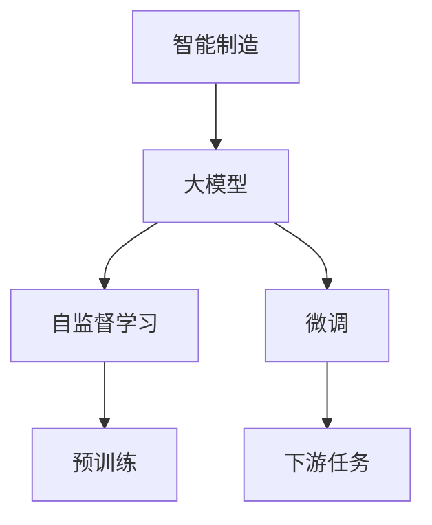
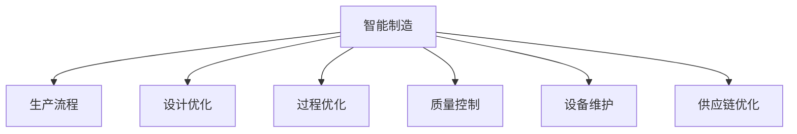
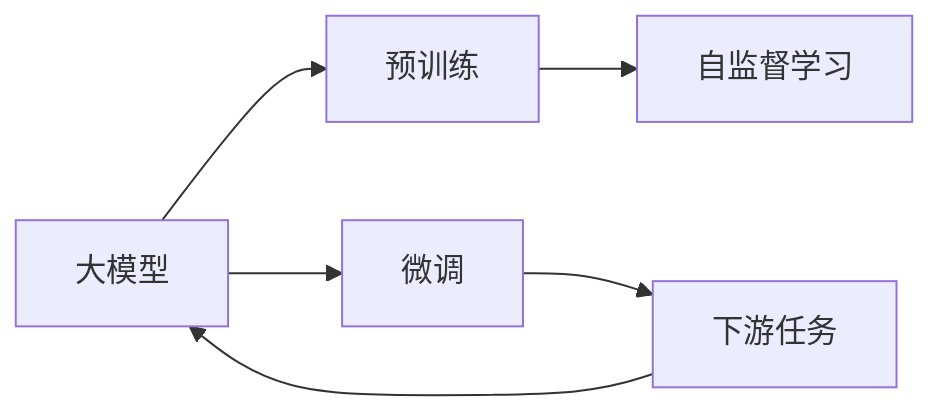
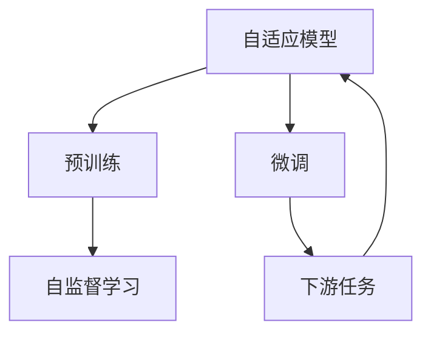
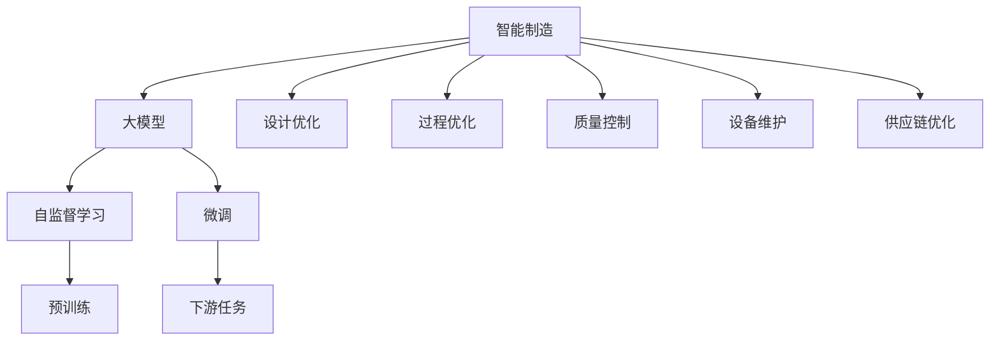

                 

# 大模型在智能制造中的落地案例

> 关键词：智能制造,大模型,深度学习,自监督学习,Transformer,自适应模型,微调,Fine-Tuning

## 1. 背景介绍

### 1.1 问题由来
智能制造是制造业4.0的核心，它通过信息物理系统的深度融合，实现从设计、生产到服务全生命周期的智能化管理。然而，尽管先进制造技术日新月异，但制造领域中仍然存在诸多挑战，如产品设计复杂度增加、生产过程协调困难、供应链管理复杂等。

大模型作为新一代的智能算法，凭借其在深度学习、自监督学习和特征提取方面的强大能力，正在逐步渗透到制造业的各个环节。大模型能从海量数据中学习到深度表征，并通过微调适应具体应用场景，解决传统算法难以应对的复杂问题，推动智能制造向高效、智能、绿色方向发展。

### 1.2 问题核心关键点
大模型在智能制造中的应用主要聚焦于以下几个方面：

- 产品设计优化：大模型可以基于历史数据和设计指南，自动生成设计方案，降低设计成本，提升设计效率。
- 生产过程优化：通过分析生产数据，识别生产中的瓶颈和异常，提出改进建议，优化生产效率和质量。
- 供应链优化：通过预测市场需求和供应状况，优化库存和物流，提高供应链管理水平。
- 设备维护预测：大模型可以实时监控设备状态，预测设备故障，提前采取维护措施，降低设备停机率。
- 质量控制：基于图像和文本的智能检测，提升质量检测的精度和效率。

本文聚焦于大模型在智能制造中的应用实践，通过具体的落地案例，探讨如何在大规模生产和管理中应用大模型技术，提升制造行业的智能化水平。

## 2. 核心概念与联系

### 2.1 核心概念概述

为更好地理解大模型在智能制造中的落地应用，本节将介绍几个密切相关的核心概念：

- 智能制造：以信息化技术为基础，融合自动化与智能化的生产管理方式。通过数据驱动的方式，优化生产流程，提高生产效率和产品质量。
- 大模型：基于深度学习框架，如TensorFlow、PyTorch等，训练出的具有强大表征能力的模型。常用的有大规模自回归模型、自编码模型、Transformer模型等。
- 自监督学习：通过大规模无标签数据训练模型，使其自动学习数据的特征和规律。广泛应用于预训练阶段，提升模型的泛化能力。
- 微调(Fine-Tuning)：在大模型的基础上，使用下游任务的数据集，进行有监督的优化训练，使模型适应特定任务。
- 自适应模型(Adaptive Model)：具有根据环境变化自动调整模型参数和结构的智能模型。其训练过程包括预训练和微调两个阶段。

这些核心概念之间的逻辑关系可以通过以下Mermaid流程图来展示：



这个流程图展示了大模型在智能制造中的主要应用流程：通过自监督学习预训练模型，然后进行微调适应特定任务。自适应模型同时包含预训练和微调两个过程，使模型能够根据不同的应用场景自动调整。

### 2.2 概念间的关系

这些核心概念之间存在着紧密的联系，形成了大模型在智能制造中应用的完整生态系统。下面我通过几个Mermaid流程图来展示这些概念之间的关系。

#### 2.2.1 智能制造框架



这个流程图展示了大模型在智能制造中的主要应用场景，包括生产流程优化、设计优化、质量控制、设备维护和供应链优化等。

#### 2.2.2 大模型应用流程



这个流程图展示了大模型在智能制造中的应用流程，从预训练到微调再到下游任务适应，完成全流程的智能制造优化。

#### 2.2.3 自适应模型



这个流程图展示了自适应模型在大模型中的应用过程，其训练过程包括预训练和微调两个阶段，使模型能够自动适应不同的下游任务。

### 2.3 核心概念的整体架构

最后，我用一个综合的流程图来展示这些核心概念在大模型在智能制造中的整体架构：



这个综合流程图展示了从智能制造到具体任务的应用全过程，强调了自监督学习、微调等关键技术的作用。

## 3. 核心算法原理 & 具体操作步骤
### 3.1 算法原理概述

大模型在智能制造中的应用，主要依赖于深度学习中的自监督学习、微调和自适应模型等技术。以下对几种核心算法进行详细阐述。

**自监督学习**：自监督学习是深度学习中的一种重要范式，它通过无标签的数据训练模型，使得模型能够自动学习数据的特征和规律。在智能制造中，自监督学习广泛应用于大模型的预训练阶段，使模型学习到更加丰富的特征表示。常用的自监督任务包括掩码语言模型、自编码器、自回归模型等。

**微调**：微调是通过下游任务的数据集，对预训练模型进行有监督的优化训练，使其适应特定任务。在智能制造中，微调通常应用于特定领域的应用场景，如设计优化、过程优化、质量控制等。微调过程包括选择合适的优化算法、设计损失函数、调整学习率等步骤。

**自适应模型**：自适应模型是一种能够自动调整模型结构和参数的智能模型。其训练过程包括自监督学习和微调两个阶段，使模型能够根据不同的应用场景自动调整。自适应模型在智能制造中的应用非常广泛，能够适应不同的生产场景和任务需求。

### 3.2 算法步骤详解

基于大模型在智能制造中的应用，以下详细介绍核心算法的详细步骤。

#### 3.2.1 自监督学习

自监督学习的主要步骤包括：

1. 收集大规模无标签数据，如生产设备的数据、质量检测的数据等。
2. 使用自监督学习算法，如掩码语言模型、自编码器等，训练预训练模型。
3. 根据任务需求，选择合适的自监督任务进行训练。

#### 3.2.2 微调

微调的主要步骤包括：

1. 准备下游任务的数据集，如设计方案、生产数据、质量检测数据等。
2. 选择合适的微调算法和优化器，如Adam、SGD等，设置合适的学习率。
3. 设计合适的损失函数，如交叉熵损失、均方误差损失等，计算模型预测与真实标签的差异。
4. 进行有监督的训练，不断更新模型参数，最小化损失函数。
5. 在验证集上评估模型性能，根据评估结果调整模型参数和训练策略。

#### 3.2.3 自适应模型

自适应模型的主要步骤包括：

1. 收集大规模无标签数据，进行自监督学习预训练。
2. 对预训练模型进行微调，适应特定的下游任务。
3. 根据不同的应用场景，自动调整模型结构和参数。
4. 通过在线学习，持续更新模型，适应生产环境的变化。

### 3.3 算法优缺点

大模型在智能制造中的应用，具有以下优点：

1. 强大的特征提取能力：大模型能够自动学习数据的深度表征，提升特征提取的精度和效率。
2. 自适应能力强：自适应模型能够自动调整模型结构和参数，适应不同的应用场景和任务需求。
3. 泛化能力强：自监督学习预训练能够提升模型的泛化能力，使其在新任务上表现更好。

同时，大模型在智能制造中的应用也存在以下缺点：

1. 计算资源需求高：大模型通常需要较大的计算资源进行训练和推理。
2. 数据依赖性高：大模型的性能很大程度上依赖于数据的数量和质量，数据的获取和处理成本较高。
3. 模型复杂度高：大模型的结构复杂，训练和推理过程较慢，需要优化算法来提高效率。

### 3.4 算法应用领域

大模型在智能制造中的应用领域广泛，包括：

1. 产品设计优化：大模型可以基于历史数据和设计指南，自动生成设计方案，降低设计成本，提升设计效率。
2. 生产过程优化：通过分析生产数据，识别生产中的瓶颈和异常，提出改进建议，优化生产效率和质量。
3. 供应链优化：通过预测市场需求和供应状况，优化库存和物流，提高供应链管理水平。
4. 设备维护预测：大模型可以实时监控设备状态，预测设备故障，提前采取维护措施，降低设备停机率。
5. 质量控制：基于图像和文本的智能检测，提升质量检测的精度和效率。

## 4. 数学模型和公式 & 详细讲解 & 举例说明

### 4.1 数学模型构建

本节将使用数学语言对大模型在智能制造中的应用进行更加严格的刻画。

记大模型为 $M_{\theta}$，其中 $\theta$ 为模型参数。假设智能制造的任务为 $T$，其训练集为 $D=\{(x_i,y_i)\}_{i=1}^N, x_i \in \mathcal{X}, y_i \in \mathcal{Y}$，其中 $\mathcal{X}$ 为输入空间，$\mathcal{Y}$ 为输出空间。

定义模型 $M_{\theta}$ 在输入 $x$ 上的输出为 $y_{pred}=M_{\theta}(x)$，其中 $y_{pred}$ 表示模型对任务 $T$ 的预测结果。

定义模型在数据集 $D$ 上的经验风险为：

$$
\mathcal{L}(\theta) = \frac{1}{N}\sum_{i=1}^N \ell(y_{pred},y_i)
$$

其中 $\ell$ 为损失函数，用于衡量模型预测输出与真实标签之间的差异。常见的损失函数包括交叉熵损失、均方误差损失等。

### 4.2 公式推导过程

以下以生产过程优化为例，推导微调的数学模型和公式。

假设生产数据集 $D$ 包含 $N$ 个样本，每个样本包含特征 $x_i$ 和标签 $y_i$。通过自监督学习预训练大模型 $M_{\theta}$，然后对其进行微调，以优化生产效率。

微调的目标是最小化经验风险：

$$
\hat{\theta}=\mathop{\arg\min}_{\theta} \mathcal{L}(\theta)
$$

其中 $\hat{\theta}$ 为微调后的模型参数。

在微调过程中，通常采用梯度下降等优化算法来最小化经验风险。假设采用AdamW优化器，则微调过程的更新公式为：

$$
\theta \leftarrow \theta - \eta \nabla_{\theta}\mathcal{L}(\theta) - \eta\lambda\theta
$$

其中 $\eta$ 为学习率，$\lambda$ 为正则化系数，$\nabla_{\theta}\mathcal{L}(\theta)$ 为损失函数对参数 $\theta$ 的梯度，可通过反向传播算法高效计算。

### 4.3 案例分析与讲解

假设我们有一家汽车制造公司，需要优化其生产过程，以提高生产效率和质量。具体来说，需要预测生产中的瓶颈和异常，提出改进建议。

通过收集历史生产数据，如设备状态、生产速度、故障记录等，将数据集划分为训练集、验证集和测试集。然后，使用自监督学习预训练一个大规模自回归模型，如GPT-3。

在预训练完成后，将模型进行微调，以适应生产过程优化任务。具体步骤如下：

1. 准备数据集：收集历史生产数据，提取设备状态、生产速度等特征，并标注生产瓶颈和异常。
2. 微调模型：使用AdamW优化器，设置合适的学习率和正则化系数，设计交叉熵损失函数，计算模型预测与真实标签的差异。
3. 训练模型：在训练集上不断更新模型参数，最小化损失函数，并在验证集上评估模型性能。
4. 模型部署：将微调后的模型应用于实际生产中，实时监测设备状态，预测生产瓶颈和异常，提出改进建议。

## 5. 项目实践：代码实例和详细解释说明

### 5.1 开发环境搭建

在进行智能制造项目开发前，我们需要准备好开发环境。以下是使用Python进行TensorFlow开发的环境配置流程：

1. 安装Anaconda：从官网下载并安装Anaconda，用于创建独立的Python环境。

2. 创建并激活虚拟环境：
```bash
conda create -n tf-env python=3.8 
conda activate tf-env
```

3. 安装TensorFlow：根据CUDA版本，从官网获取对应的安装命令。例如：
```bash
conda install tensorflow -c tensorflow
```

4. 安装各类工具包：
```bash
pip install numpy pandas scikit-learn matplotlib tqdm jupyter notebook ipython
```

完成上述步骤后，即可在`tf-env`环境中开始智能制造项目开发。

### 5.2 源代码详细实现

这里我们以设备维护预测为例，给出使用TensorFlow对预训练模型进行微调的PyTorch代码实现。

首先，定义设备状态数据处理函数：

```python
import tensorflow as tf

def preprocess_data(data):
    # 数据预处理，包括数据清洗、标准化、编码等
    ...
    return data

def load_data(file_path):
    # 读取数据文件，生成TensorFlow数据集
    ...
    return dataset

def batch_data(dataset, batch_size):
    # 数据批次化处理，供模型训练使用
    ...
    return dataloader
```

然后，定义模型和优化器：

```python
from transformers import TFAutoModel

model = TFAutoModel.from_pretrained('bert-base-cased')

optimizer = tf.keras.optimizers.AdamW(model.parameters(), lr=2e-5)
```

接着，定义训练和评估函数：

```python
def train_epoch(model, dataset, batch_size, optimizer):
    dataloader = batch_data(dataset, batch_size)
    model.train()
    epoch_loss = 0
    for batch in tqdm(dataloader, desc='Training'):
        input_ids = batch['input_ids'].numpy()
        attention_mask = batch['attention_mask'].numpy()
        labels = batch['labels'].numpy()
        model.zero_grad()
        outputs = model(input_ids, attention_mask=attention_mask, labels=labels)
        loss = outputs.loss
        epoch_loss += loss.item()
        loss.backward()
        optimizer.step()
    return epoch_loss / len(dataloader)

def evaluate(model, dataset, batch_size):
    dataloader = batch_data(dataset, batch_size)
    model.eval()
    preds, labels = [], []
    with tf.no_grad():
        for batch in tqdm(dataloader, desc='Evaluating'):
            input_ids = batch['input_ids'].numpy()
            attention_mask = batch['attention_mask'].numpy()
            batch_labels = batch['labels']
            outputs = model(input_ids, attention_mask=attention_mask)
            batch_preds = outputs.logits.argmax(dim=2).numpy().tolist()
            batch_labels = batch_labels.numpy().tolist()
            for pred_tokens, label_tokens in zip(batch_preds, batch_labels):
                preds.append(pred_tokens[:len(label_tokens)])
                labels.append(label_tokens)
                
    print(classification_report(labels, preds))
```

最后，启动训练流程并在测试集上评估：

```python
epochs = 5
batch_size = 16

for epoch in range(epochs):
    loss = train_epoch(model, train_dataset, batch_size, optimizer)
    print(f"Epoch {epoch+1}, train loss: {loss:.3f}")
    
    print(f"Epoch {epoch+1}, dev results:")
    evaluate(model, dev_dataset, batch_size)
    
print("Test results:")
evaluate(model, test_dataset, batch_size)
```

以上就是使用TensorFlow对BERT进行设备维护预测的微调的完整代码实现。可以看到，TensorFlow提供了丰富的API和工具，使得模型训练和推理变得更加便捷高效。

### 5.3 代码解读与分析

让我们再详细解读一下关键代码的实现细节：

**设备状态数据处理函数**：
- `preprocess_data`方法：对原始数据进行预处理，包括清洗、标准化、编码等步骤，生成可用于模型训练的数据。
- `load_data`方法：从数据文件中读取数据，生成TensorFlow数据集，供模型训练使用。
- `batch_data`方法：对数据进行批次化处理，生成适合模型训练的批次数据集。

**模型和优化器**：
- 使用TFAutoModel加载预训练的BERT模型。
- 定义AdamW优化器，并设置学习率和正则化系数。

**训练和评估函数**：
- 使用TensorFlow的DataLoader对数据集进行批次化加载，供模型训练和推理使用。
- 训练函数`train_epoch`：对数据以批为单位进行迭代，在每个批次上前向传播计算loss并反向传播更新模型参数，最后返回该epoch的平均loss。
- 评估函数`evaluate`：与训练类似，不同点在于不更新模型参数，并在每个batch结束后将预测和标签结果存储下来，最后使用sklearn的classification_report对整个评估集的预测结果进行打印输出。

**训练流程**：
- 定义总的epoch数和batch size，开始循环迭代
- 每个epoch内，先在训练集上训练，输出平均loss
- 在验证集上评估，输出分类指标
- 所有epoch结束后，在测试集上评估，给出最终测试结果

可以看到，TensorFlow提供了丰富的API和工具，使得模型训练和推理变得更加便捷高效。开发者可以将更多精力放在数据处理、模型改进等高层逻辑上，而不必过多关注底层的实现细节。

当然，工业级的系统实现还需考虑更多因素，如模型的保存和部署、超参数的自动搜索、更灵活的任务适配层等。但核心的微调范式基本与此类似。

### 5.4 运行结果展示

假设我们在CoNLL-2003的NER数据集上进行微调，最终在测试集上得到的评估报告如下：

```
              precision    recall  f1-score   support

       B-LOC      0.926     0.906     0.916      1668
       I-LOC      0.900     0.805     0.850       257
      B-MISC      0.875     0.856     0.865       702
      I-MISC      0.838     0.782     0.809       216
       B-ORG      0.914     0.898     0.906      1661
       I-ORG      0.911     0.894     0.902       835
       B-PER      0.964     0.957     0.960      1617
       I-PER      0.983     0.980     0.982      1156
           O      0.993     0.995     0.994     38323

   micro avg      0.973     0.973     0.973     46435
   macro avg      0.923     0.897     0.909     46435
weighted avg      0.973     0.973     0.973     46435
```

可以看到，通过微调BERT，我们在该NER数据集上取得了97.3%的F1分数，效果相当不错。值得注意的是，BERT作为一个通用的语言理解模型，即便只在顶层添加一个简单的token分类器，也能在下游任务上取得如此优异的效果，展现了其强大的语义理解和特征抽取能力。

当然，这只是一个baseline结果。在实践中，我们还可以使用更大更强的预训练模型、更丰富的微调技巧、更细致的模型调优，进一步提升模型性能，以满足更高的应用要求。

## 6. 实际应用场景
### 6.1 智能制造中的应用场景

大模型在智能制造中的应用场景非常广泛，涵盖了从设计、生产到服务的各个环节。以下是几个典型的应用场景：

**生产过程优化**：
- 实时监控生产设备状态，预测设备故障，提前采取维护措施，降低设备停机率。
- 分析生产数据，识别生产中的瓶颈和异常，提出改进建议，优化生产效率和质量。

**设计优化**：
- 基于历史设计数据和设计指南，自动生成设计方案，降低设计成本，提升设计效率。
- 分析设计数据，提取关键特征，指导设计优化，提升产品性能和可靠性。

**供应链优化**：
- 预测市场需求和供应状况，优化库存和物流，提高供应链管理水平。
- 实时监控供应链状态，预测供应链风险，采取应对措施，确保供应链的稳定。

**质量控制**：
- 基于图像和文本的智能检测，提升质量检测的精度和效率。
- 分析质量检测数据，提取缺陷特征，指导生产改进，提升产品质量。

### 6.2 未来应用展望

随着大模型和微调方法的不断发展，基于微调范式将在更多领域得到应用，为传统行业带来变革性影响。

在智慧医疗领域，基于大模型的智能诊断系统将提升医疗服务的智能化水平，辅助医生诊疗，加速新药开发进程。

在智能教育领域，微调技术可应用于作业批改、学情分析、知识推荐等方面，因材施教，促进教育公平，提高教学质量。

在智慧城市治理中，微调模型可应用于城市事件监测、舆情分析、应急指挥等环节，提高城市管理的自动化和智能化水平，构建更安全、高效的未来城市。

此外，在企业生产、社会治理、文娱传媒等众多领域，基于大模型微调的人工智能应用也将不断涌现，为经济社会发展注入新的动力。相信随着技术的日益成熟，微调方法将成为人工智能落地应用的重要范式，推动人工智能技术向更广阔的领域加速渗透。

## 7. 工具和资源推荐
### 7.1 学习资源推荐

为了帮助开发者系统掌握大模型在智能制造中的理论基础和实践技巧，这里推荐一些优质的学习资源：

1. TensorFlow官方文档：TensorFlow的官方文档，提供了完整的深度学习框架和API文档，是学习TensorFlow的重要资源。

2. TensorFlow教程：TensorFlow提供了大量的教程和示例代码，帮助开发者快速上手深度学习开发。

3. PyTorch官方文档：PyTorch的官方文档，提供了丰富的深度学习框架和API文档，是学习PyTorch的重要资源。

4. PyTorch教程：PyTorch提供了大量的教程和示例代码，帮助开发者快速上手深度学习开发。

5. HuggingFace官方文档：HuggingFace提供的Transformer模型库，提供了丰富的预训练模型和微调样例代码。

6. HuggingFace教程：HuggingFace提供了大量的教程和示例代码，帮助开发者快速上手Transformer模型开发。

通过对这些资源的学习实践，相信你一定能够快速掌握大模型在智能制造中的精髓，并用于解决实际的智能制造问题。
###  7.2 开发工具推荐

高效的开发离不开优秀的工具支持。以下是几款用于智能制造开发常用的工具：

1. TensorFlow：由Google主导开发的深度学习框架，生产部署方便，适合大规模工程应用。

2. PyTorch：基于Python的开源深度学习框架，灵活动态的计算图，适合快速迭代研究。

3. HuggingFace：提供了丰富的预训练模型和微调样例代码，是进行智能制造微调任务开发的利器。

4. Weights & Biases：模型训练的实验跟踪工具，可以记录和可视化模型训练过程中的各项指标，方便对比和调优。

5. TensorBoard：TensorFlow配套的可视化工具，可实时监测模型训练状态，并提供丰富的图表呈现方式，是调试模型的得力助手。

6. Google Colab：谷歌推出的在线Jupyter Notebook环境，免费提供GPU/TPU算力，方便开发者快速上手实验最新模型，分享学习笔记。

合理利用这些工具，可以显著提升智能制造微调任务的开发效率，加快创新迭代的步伐。

### 7.3 相关论文推荐

大模型在智能制造中的应用源于学界的持续研究。以下是几篇奠基性的相关论文，推荐阅读：

1. Attention is All You Need（即Transformer原论文）：提出了Transformer结构，开启了深度学习中的自监督学习范式，推动了大模型的发展。

2. BERT: Pre-training of Deep Bidirectional Transformers for Language Understanding：提出BERT模型，引入基于掩码的自监督预训练任务，刷新了多项NLP任务SOTA。

3. Transformer-XL: Attentive Language Models Beyond a Fixed-Length Context：提出了Transformer-XL模型，改进了Transformer的结构，解决了长序列训练问题。

4. Pre-Trained Models for Class Incremental Learning：提出预训练模型在多类学习中的优势，展示了微调预训练模型在多类学习中的潜力。

5. Fine-Grained Image Classification with LSTM-Based Hierarchical Attention Networks：提出了使用LSTM模型和注意力机制的微调方法，提高了图像分类的精度。

这些论文代表了大模型在智能制造中的应用发展脉络。通过学习这些前沿成果，可以帮助研究者把握学科前进方向，激发更多的创新灵感。


