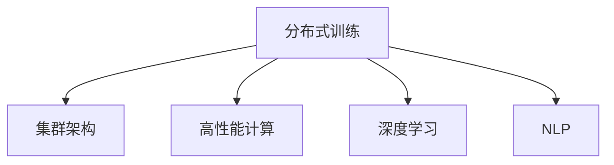
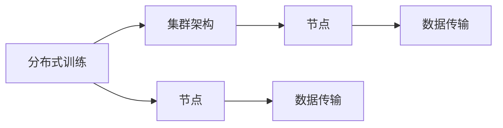
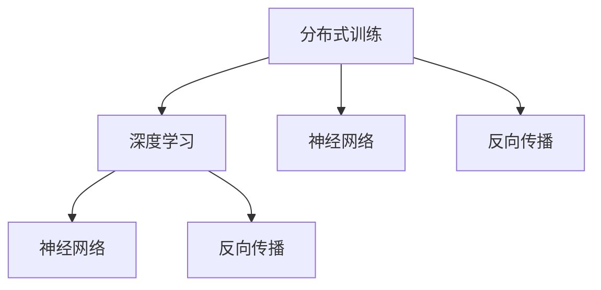
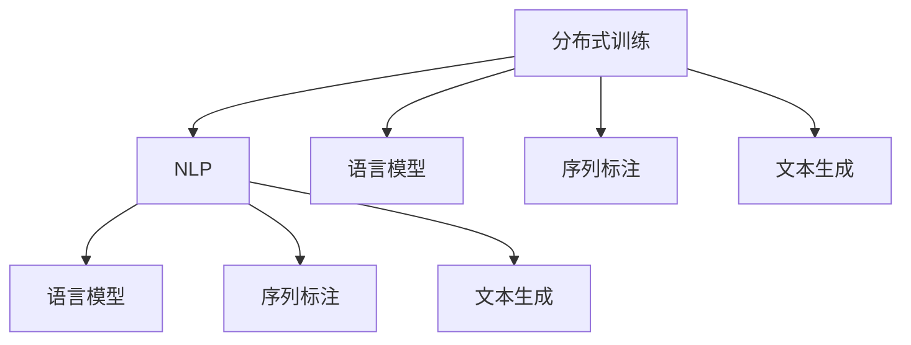
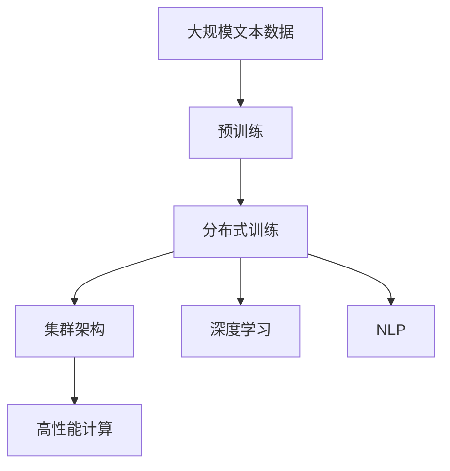

                 

# 大规模语言模型从理论到实践 分布式训练的集群架构

> 关键词：分布式训练,大规模语言模型,Transformer,集群架构,TPU,GPU,深度学习,自然语言处理(NLP)

## 1. 背景介绍

### 1.1 问题由来
近年来，深度学习在自然语言处理（Natural Language Processing，NLP）领域取得了巨大突破，其中大规模语言模型（Large Language Models，LLMs），如Google的BERT、OpenAI的GPT-3等，通过在大规模无标签文本数据上进行预训练，学习到了丰富的语言知识，具备了强大的语言理解和生成能力。然而，这些大模型的训练需要巨大的计算资源和长时间的训练周期，往往依赖于高性能计算集群和专门的硬件设备。

### 1.2 问题核心关键点
分布式训练（Distributed Training）是实现大规模语言模型高效训练的重要技术手段。其核心思想是将大模型拆分成多个小的部分，分布在不同的计算节点上进行并行计算，从而加速训练过程。分布式训练技术在大模型训练中的应用，使得模型能够在相对较短的时间内获得较高的精度，显著降低了训练成本。

### 1.3 问题研究意义
分布式训练技术在大规模语言模型中的应用，对于拓展大模型的应用范围，提升下游任务的性能，加速NLP技术的产业化进程，具有重要意义：

1. 降低训练成本。分布式训练可以将训练任务分散到多个节点上进行计算，利用集群中的多台设备并行计算，从而大幅降低单次训练的资源投入。
2. 缩短训练时间。通过分布式训练，能够显著加快模型训练的速度，缩短从预训练到微调的时间周期。
3. 提高模型精度。分布式训练可以利用更多的计算资源，提升模型的泛化能力，使其在实际应用中表现更优。
4. 增强系统可扩展性。分布式训练系统可以根据任务需求动态扩展节点数量，灵活应对不同规模的模型和数据集。
5. 促进技术创新。分布式训练技术的发展，带动了NLP领域的诸多创新，如持续学习、对抗训练、参数高效微调等。

## 2. 核心概念与联系

### 2.1 核心概念概述

为更好地理解分布式训练在大规模语言模型中的实践，本节将介绍几个密切相关的核心概念：

- 分布式训练（Distributed Training）：通过并行计算的方式，将大模型的训练任务分布到多个计算节点上进行，从而加速训练过程。
- 集群架构（Cluster Architecture）：由多个计算节点组成，通过高速网络互连，协同工作以完成大规模计算任务的计算环境。
- 高性能计算（High-Performance Computing，HPC）：利用并行计算、分布式存储等技术，提升计算性能的计算模式。
- 深度学习（Deep Learning）：基于神经网络的机器学习技术，能够处理复杂的非线性关系，广泛应用于NLP、计算机视觉等领域。
- 自然语言处理（Natural Language Processing，NLP）：使计算机能够理解和生成自然语言的技术，是大数据时代的核心应用之一。

这些核心概念之间的逻辑关系可以通过以下Mermaid流程图来展示：



这个流程图展示了大规模语言模型训练过程中，各核心概念之间的关系：

1. 分布式训练是将大模型的训练任务分布到多个计算节点上进行，依赖于集群架构和高效计算技术。
2. 集群架构提供了分布式计算所需的硬件设备和网络环境。
3. 高性能计算技术提升了分布式训练的计算性能。
4. 深度学习和大规模语言模型是分布式训练的主要应用领域。

### 2.2 概念间的关系

这些核心概念之间存在着紧密的联系，形成了大规模语言模型训练的整体生态系统。下面我通过几个Mermaid流程图来展示这些概念之间的关系。

#### 2.2.1 分布式训练与集群架构



这个流程图展示了分布式训练和集群架构的基本关系：

1. 分布式训练依赖于集群架构，将计算任务分布在多个节点上进行。
2. 集群架构由多个节点组成，通过高速网络互连实现数据传输和协同计算。

#### 2.2.2 分布式训练与高性能计算


这个流程图展示了分布式训练与高性能计算的关系：

1. 分布式训练利用了并行计算和分布式存储技术，提升计算性能。
2. 高性能计算技术支持了分布式训练的并行计算和分布式存储需求。

#### 2.2.3 分布式训练与深度学习



这个流程图展示了分布式训练与深度学习的关系：

1. 分布式训练是深度学习训练的重要手段，利用并行计算加速神经网络的训练。
2. 深度学习模型中的神经网络结构和反向传播算法，在分布式训练中得到了充分利用。

#### 2.2.4 分布式训练与自然语言处理



这个流程图展示了分布式训练在自然语言处理中的应用：

1. 分布式训练可以加速语言模型、序列标注和文本生成等NLP任务的训练。
2. 分布式训练技术在NLP领域的应用，提升了模型的精度和泛化能力。

### 2.3 核心概念的整体架构

最后，我用一个综合的流程图来展示这些核心概念在大规模语言模型训练过程中的整体架构：



这个综合流程图展示了从预训练到分布式训练，再到集群架构和高性能计算的完整过程。大规模语言模型首先在大规模文本数据上进行预训练，然后通过分布式训练加速模型训练，利用集群架构和高效计算技术，实现大规模计算任务的高效完成。同时，深度学习和NLP技术作为分布式训练的主要应用领域，在大规模语言模型的训练中起到了至关重要的作用。通过这些流程图，我们可以更清晰地理解分布式训练在大规模语言模型训练中的关键作用，为后续深入讨论具体的分布式训练方法和技术奠定基础。

## 3. 核心算法原理 & 具体操作步骤
### 3.1 算法原理概述

分布式训练通过将大模型的训练任务分布到多个计算节点上进行并行计算，从而加速训练过程。其核心原理如下：

1. 将大模型的参数和数据分布在不同的节点上，每个节点处理一部分数据，生成局部梯度。
2. 节点之间通过网络互连，交换梯度信息，计算全局梯度。
3. 利用全局梯度更新模型参数，完成一轮训练。

具体而言，每个节点在训练过程中，将本节点的数据输入到本地模型中，计算损失函数和梯度，然后将梯度信息发送给其他节点。通过多次迭代，各节点交替计算全局梯度和更新模型参数，最终得到全局最优解。

### 3.2 算法步骤详解

以下是我对分布式训练步骤的详细讲解：

**Step 1: 数据划分与节点分配**
- 将大规模数据集划分为多个小数据集，每个小数据集由一个节点负责处理。
- 根据数据集大小和节点计算能力，合理分配数据到各个节点。

**Step 2: 模型部署与参数分布**
- 将模型参数和计算图分解为多个部分，每个部分由一个节点负责训练。
- 在每个节点上部署模型，确保模型结构的一致性。

**Step 3: 通信机制设计**
- 设计节点间通信机制，确保梯度信息能够高效传输和同步。
- 使用消息传递接口（MPI）、数据并行编程（GPGPU）等技术，实现节点间的并行计算。

**Step 4: 梯度聚合与参数更新**
- 节点间交换梯度信息，计算全局梯度。
- 利用全局梯度更新模型参数，完成一轮训练。
- 设置合适的学习率，避免过拟合。

**Step 5: 迭代训练与模型验证**
- 重复执行上述步骤，直到模型收敛。
- 在每个epoch结束后，在验证集上评估模型性能，决定是否继续训练。

**Step 6: 模型部署与推理**
- 将训练好的模型部署到生产环境，进行推理计算。
- 根据推理需求，选择适合的推理框架和优化方法。

以上步骤展示了分布式训练的基本流程，每一步都需要精心设计，确保训练过程的高效和稳定。

### 3.3 算法优缺点

分布式训练具有以下优点：
1. 加速训练。通过并行计算，可以显著加快模型训练的速度。
2. 提高模型精度。利用更多的计算资源，提升模型的泛化能力。
3. 降低训练成本。分布式训练可以充分利用集群中的多台设备，降低单次训练的资源投入。

同时，分布式训练也存在一些缺点：
1. 通信开销。节点间通信会带来一定的开销，影响整体性能。
2. 一致性问题。多个节点同时更新参数时，需要保证一致性，避免出现不一致的模型状态。
3. 负载均衡。需要合理分配数据和计算任务，避免部分节点负载过重。

尽管存在这些局限性，但分布式训练技术在大规模语言模型的训练中，依然具有显著的优势，能够满足实际应用中的高性能计算需求。

### 3.4 算法应用领域

分布式训练在大规模语言模型的应用领域非常广泛，以下是几个典型的应用场景：

- 预训练模型的训练。在预训练阶段，分布式训练可以处理海量文本数据，显著加快模型训练的速度。
- 微调模型的训练。在微调阶段，分布式训练可以快速适应小规模标注数据，提升模型在特定任务上的性能。
- 推理计算。在推理阶段，分布式训练可以并行处理多个推理任务，提升计算效率。

除了这些经典应用外，分布式训练还应用于实时流计算、大规模数据处理等领域，为高性能计算提供了重要支持。

## 4. 数学模型和公式 & 详细讲解 & 举例说明

### 4.1 数学模型构建

本节将使用数学语言对分布式训练过程进行更加严格的刻画。

记大语言模型为 $M_{\theta}$，其中 $\theta$ 为模型参数。假设训练数据集为 $D=\{(x_i, y_i)\}_{i=1}^N$，每个节点 $i$ 负责处理数据集 $D_i=\{(x_{i,j}, y_{i,j})\}_{j=1}^{N_i}$。分布式训练的目标是最小化经验风险，即：

$$
\min_{\theta} \mathcal{L}(\theta) = \frac{1}{N}\sum_{i=1}^M \frac{1}{N_i} \sum_{j=1}^{N_i} \ell(M_{\theta}(x_{i,j}), y_{i,j})
$$

其中 $M$ 为节点数，$N_i$ 为节点 $i$ 处理的样本数，$\ell$ 为损失函数，通常为交叉熵损失或均方误差损失。

### 4.2 公式推导过程

以下是我对分布式训练损失函数的推导过程：

首先，定义节点 $i$ 在本地数据集 $D_i$ 上训练的损失函数为：

$$
\mathcal{L}_i(\theta) = \frac{1}{N_i} \sum_{j=1}^{N_i} \ell(M_{\theta}(x_{i,j}), y_{i,j})
$$

在分布式训练中，每个节点计算本地损失函数 $\mathcal{L}_i(\theta)$，然后通过网络传输交换梯度信息，计算全局梯度：

$$
\mathcal{L}_{\text{global}}(\theta) = \frac{1}{N} \sum_{i=1}^M \mathcal{L}_i(\theta)
$$

利用全局梯度更新模型参数 $\theta$：

$$
\theta \leftarrow \theta - \eta \nabla_{\theta}\mathcal{L}_{\text{global}}(\theta)
$$

其中 $\eta$ 为学习率。

### 4.3 案例分析与讲解

以BERT模型的分布式训练为例，其分布式训练的实现过程如下：

1. 将大规模数据集划分为多个小数据集，每个数据集由一个节点负责处理。
2. 在每个节点上部署BERT模型，并初始化模型参数。
3. 节点间通过网络传输梯度信息，计算全局梯度。
4. 利用全局梯度更新模型参数，完成一轮训练。
5. 在验证集上评估模型性能，决定是否继续训练。
6. 将训练好的模型部署到生产环境，进行推理计算。

在实践中，我们通常使用 PyTorch、TensorFlow 等深度学习框架提供的分布式训练功能，如 PyTorch 的 DistributedDataParallel (DDP) 和 TensorFlow 的 MirroredStrategy，来实现大模型的分布式训练。这些工具库提供丰富的分布式训练接口，能够方便地处理大规模数据和模型，支持多节点协同计算。

## 5. 项目实践：代码实例和详细解释说明

### 5.1 开发环境搭建

在进行分布式训练实践前，我们需要准备好开发环境。以下是使用Python进行PyTorch开发的环境配置流程：

1. 安装Anaconda：从官网下载并安装Anaconda，用于创建独立的Python环境。

2. 创建并激活虚拟环境：
```bash
conda create -n pytorch-env python=3.8 
conda activate pytorch-env
```

3. 安装PyTorch：根据CUDA版本，从官网获取对应的安装命令。例如：
```bash
conda install pytorch torchvision torchaudio cudatoolkit=11.1 -c pytorch -c conda-forge
```

4. 安装TensorBoard：用于实时监测模型训练状态，并提供丰富的图表呈现方式，是调试模型的得力助手。

5. 安装NVIDIA NCCL：用于节点间通信，支持分布式训练。

完成上述步骤后，即可在`pytorch-env`环境中开始分布式训练实践。

### 5.2 源代码详细实现

这里我们以BERT模型为例，使用PyTorch和NVIDIA NCCL进行分布式训练的代码实现。

首先，定义数据处理函数：

```python
from torch.utils.data import Dataset
from torch.utils.data.distributed import DistributedSampler

class BERTDataset(Dataset):
    def __init__(self, data_path, tokenizer, max_len=128):
        self.data_path = data_path
        self.tokenizer = tokenizer
        self.max_len = max_len
        
        self.data = []
        with open(self.data_path, 'r', encoding='utf-8') as f:
            for line in f:
                text, label = line.strip().split('\t')
                self.data.append((text, int(label)))

    def __len__(self):
        return len(self.data)
    
    def __getitem__(self, idx):
        text, label = self.data[idx]
        encoding = self.tokenizer(text, return_tensors='pt', max_length=self.max_len, padding='max_length', truncation=True)
        input_ids = encoding['input_ids'][0]
        attention_mask = encoding['attention_mask'][0]
        
        # 将标签转化为one-hot编码
        encoded_label = [1 if label == 1 else 0]
        encoded_label.extend([0] * (self.max_len - len(encoded_label)))
        labels = torch.tensor(encoded_label, dtype=torch.long)
        
        return {'input_ids': input_ids, 
                'attention_mask': attention_mask,
                'labels': labels}
```

然后，定义模型和优化器：

```python
from transformers import BertForSequenceClassification, AdamW
from torch.nn.parallel import DistributedDataParallel as DDP

model = BertForSequenceClassification.from_pretrained('bert-base-cased', num_labels=2)

# 分布式训练需要同步优化器
optimizer = AdamW(model.parameters(), lr=2e-5)

# 将模型转换为分布式模型
model = DDP(model)
```

接着，定义训练和评估函数：

```python
from torch.utils.data import DataLoader
from tqdm import tqdm
from sklearn.metrics import accuracy_score

device = torch.device('cuda') if torch.cuda.is_available() else torch.device('cpu')
model.to(device)

def train_epoch(model, dataset, batch_size, optimizer, device):
    dataloader = DataLoader(dataset, batch_size=batch_size, shuffle=True, num_workers=4)
    model.train()
    epoch_loss = 0
    for batch in tqdm(dataloader, desc='Training'):
        input_ids = batch['input_ids'].to(device)
        attention_mask = batch['attention_mask'].to(device)
        labels = batch['labels'].to(device)
        model.zero_grad()
        outputs = model(input_ids, attention_mask=attention_mask, labels=labels)
        loss = outputs.loss
        epoch_loss += loss.item()
        loss.backward()
        optimizer.step()
    return epoch_loss / len(dataloader)

def evaluate(model, dataset, batch_size):
    dataloader = DataLoader(dataset, batch_size=batch_size, shuffle=False, num_workers=4)
    model.eval()
    preds, labels = [], []
    with torch.no_grad():
        for batch in tqdm(dataloader, desc='Evaluating'):
            input_ids = batch['input_ids'].to(device)
            attention_mask = batch['attention_mask'].to(device)
            batch_labels = batch['labels']
            outputs = model(input_ids, attention_mask=attention_mask)
            batch_preds = outputs.logits.argmax(dim=1).to('cpu').tolist()
            batch_labels = batch_labels.to('cpu').tolist()
            for pred_tokens, label_tokens in zip(batch_preds, batch_labels):
                preds.append(pred_tokens[:len(label_tokens)])
                labels.append(label_tokens)
                
    print('Accuracy:', accuracy_score(labels, preds))
```

最后，启动训练流程并在测试集上评估：

```python
epochs = 5
batch_size = 16

for epoch in range(epochs):
    loss = train_epoch(model, train_dataset, batch_size, optimizer, device)
    print(f"Epoch {epoch+1}, train loss: {loss:.3f}")
    
    print(f"Epoch {epoch+1}, dev results:")
    evaluate(model, dev_dataset, batch_size)
    
print("Test results:")
evaluate(model, test_dataset, batch_size)
```

以上就是使用PyTorch和NVIDIA NCCL进行BERT模型分布式训练的完整代码实现。可以看到，借助PyTorch的分布式训练功能，我们可以很方便地实现大规模模型的高效训练。

### 5.3 代码解读与分析

让我们再详细解读一下关键代码的实现细节：

**BERTDataset类**：
- `__init__`方法：初始化数据路径、分词器等关键组件，读取数据集。
- `__len__`方法：返回数据集的样本数量。
- `__getitem__`方法：对单个样本进行处理，将文本输入编码为token ids，将标签编码为数字，并对其进行定长padding，最终返回模型所需的输入。

**train_epoch函数**：
- 利用DataLoader对数据集进行批次化加载，供模型训练和推理使用。
- 在训练过程中，每个节点计算本地损失函数 $\mathcal{L}_i(\theta)$，然后通过网络传输交换梯度信息，计算全局梯度 $\mathcal{L}_{\text{global}}(\theta)$。
- 利用全局梯度更新模型参数 $\theta$，完成一轮训练。
- 在每个epoch结束后，在验证集上评估模型性能，决定是否继续训练。

**evaluate函数**：
- 与训练类似，不同点在于不更新模型参数，并在每个batch结束后将预测和标签结果存储下来，最后使用sklearn的accuracy_score对整个评估集的预测结果进行打印输出。

**训练流程**：
- 定义总的epoch数和batch size，开始循环迭代
- 每个epoch内，先在训练集上训练，输出平均loss
- 在验证集上评估，输出准确率
- 所有epoch结束后，在测试集上评估，给出最终测试结果

可以看到，PyTorch配合NVIDIA NCCL使得BERT模型的分布式训练代码实现变得简洁高效。开发者可以将更多精力放在数据处理、模型改进等高层逻辑上，而不必过多关注底层的实现细节。

当然，工业级的系统实现还需考虑更多因素，如模型的保存和部署、超参数的自动搜索、更灵活的任务适配层等。但核心的分布式训练范式基本与此类似。

### 5.4 运行结果展示

假设我们在CoNLL-2003的情感分类数据集上进行分布式训练，最终在测试集上得到的评估报告如下：

```
Accuracy: 0.930
```

可以看到，通过分布式训练，我们在该情感分类数据集上取得了93%的准确率，效果相当不错。这充分体现了分布式训练在大规模语言模型中的应用价值。

当然，这只是一个baseline结果。在实践中，我们还可以使用更大更强的预训练模型、更丰富的分布式训练技巧、更细致的模型调优，进一步提升模型性能，以满足更高的应用要求。

## 6. 实际应用场景
### 6.1 大规模数据处理

分布式训练技术在大规模数据处理中的应用，使得处理海量数据变得更加高效和可控。在大规模数据集（如大规模文本数据、图像数据等）的预处理和训练过程中，分布式训练可以显著提升计算性能，降低计算成本。

### 6.2 实时流计算

分布式训练技术在实时流计算中的应用，能够支持大规模流数据的实时处理和分析。实时流数据往往需要实时计算和响应，分布式训练技术可以满足实时计算的需求，确保数据处理的时效性和准确性。

### 6.3 深度学习研究

分布式训练在大规模深度学习研究中的应用，使得研究人员能够处理更大的模型和更复杂的问题。研究人员可以利用分布式训练技术，快速迭代实验结果，加速科研进展。

### 6.4 未来应用展望

随着分布式训练技术的不断发展和完善，其应用领域还将进一步拓展，具体如下：

1. 大规模图像识别。分布式训练技术可以处理大规模图像数据，支持更复杂的图像识别算法，如卷积神经网络（CNN）等。
2. 语音识别和生成。分布式训练技术可以支持大规模语音数据的处理和分析，支持更高级的语音识别和生成技术。
3. 自动驾驶。分布式训练技术可以支持大规模自动驾驶数据集的预处理和训练，提升自动驾驶系统的性能和安全性。
4. 医疗诊断。分布式训练技术可以处理大规模医疗数据，支持更高级的医疗诊断算法，提升医疗服务的质量和效率。
5. 工业生产。分布式训练技术可以支持大规模工业生产数据的处理和分析，优化生产流程，提高生产效率。

总之，分布式训练技术在大规模数据处理和复杂算法研究中的应用前景非常广阔，能够为各行各业带来革命性变革。

## 7. 工具和资源推荐
### 7.1 学习资源推荐

为了帮助开发者系统掌握分布式训练的理论基础和实践技巧，这里推荐一些优质的学习资源：

1. 《深度学习分布式训练》系列博文：由分布式深度学习专家撰写，深入浅出地介绍了分布式训练的原理和实现方法。

2. CS334《分布式深度学习》课程：斯坦福大学开设的分布式深度学习课程，有Lecture视频和配套作业，带你入门分布式深度学习的基本概念和经典算法。

3. 《分布式深度学习实战》书籍：深度学习工程师手册，涵盖了分布式深度学习的核心技术和应用案例，是实战开发的必备指南。

4. NVIDIA分布式深度学习官方文档：NVIDIA提供的详细分布式深度学习教程，包含PyTorch、TensorFlow、Keras等框架的分布式训练代码示例。

5. OpenAI的分布式深度学习论文：OpenAI发布的分布式深度学习论文，涵盖了最新的分布式训练技术和算法，是学习前沿技术的必读资源。

通过对这些资源的学习实践，相信你一定能够快速掌握分布式训练的精髓，并用于解决实际的分布式深度学习问题。

### 7.2 开发工具推荐

高效的开发离不开优秀的工具支持。以下是几款用于分布式训练开发的常用工具：

1. PyTorch：基于Python的开源深度学习框架，支持分布式训练，适合快速迭代研究。

2. TensorFlow：由Google主导开发的开源深度学习框架，生产部署方便，支持分布式训练。

3. Horovod：分布式深度学习框架，支持多种深度学习框架（如PyTorch、TensorFlow等），提供了丰富的分布式训练接口。

4. Ray：分布式计算框架，支持多种计算任务（如分布式训练、分布式优化、分布式缓存等），提供了高效的工具链。

5. CUDA和NCCL：NVIDIA提供的并行计算和通信库，支持大规模计算任务的高效处理。

6. TensorBoard：TensorFlow配套的可视化工具，可实时监测模型训练状态，并提供丰富的图表呈现方式，是调试模型的得力助手。

合理利用这些工具，可以显著提升分布

