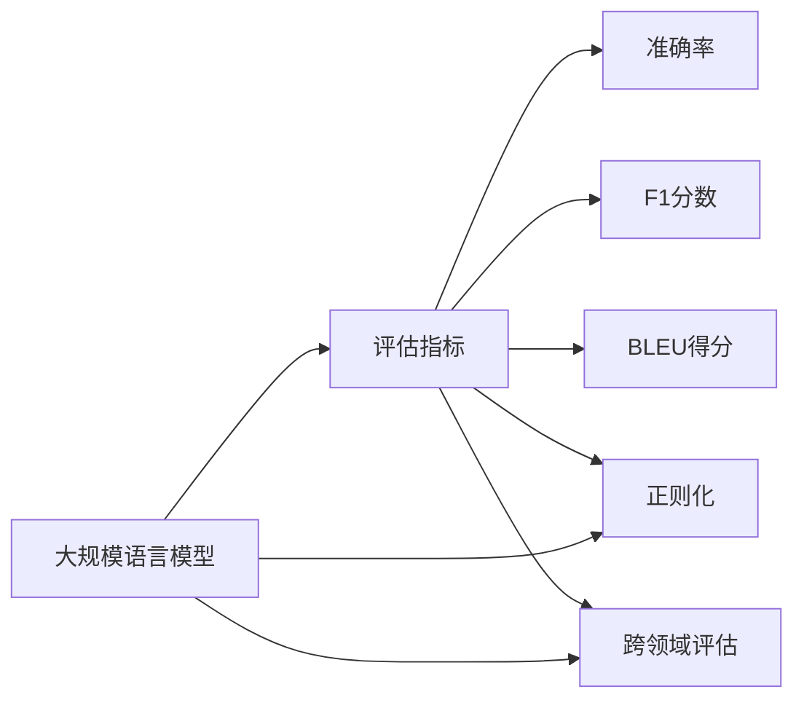

                 

# 大规模语言模型从理论到实践 评估指标

## 1. 背景介绍

在深度学习飞速发展的今天，大规模语言模型（Large Language Models, LLMs）已经成为NLP领域中最具影响力的技术之一。然而，对于如何评估这些大模型的效果，学界和工业界并没有达成一致的共识。评估指标的不统一不仅阻碍了技术的交流与推广，还可能导致错误的模型选择与资源浪费。因此，本文将深入探讨大语言模型的评估指标，从理论和实践中给出详细讲解，帮助开发者更好地理解和选择模型。

## 2. 核心概念与联系

### 2.1 核心概念概述

在讨论评估指标之前，我们首先需要理解一些相关核心概念：

- 大规模语言模型（Large Language Models, LLMs）：指的是如BERT、GPT、T5等通过大规模无标签文本数据预训练得到的强大语言理解模型。这些模型能够处理各种自然语言任务，包括文本分类、命名实体识别、问答系统、文本生成等。
- 评估指标（Evaluation Metrics）：用于衡量模型在不同任务上表现的指标，如准确率、F1分数、BLEU得分等。
- 跨领域评估（Cross-Domain Evaluation）：评估模型在多个任务上的综合表现，以及在不同领域数据上的泛化能力。
- 正则化（Regularization）：用于防止模型过拟合的技术，包括L2正则、Dropout等。

这些概念之间相互联系，共同构成了大语言模型的评估生态。只有理解这些概念，才能正确设计和使用评估指标，保证模型性能的公平性和可靠性。

### 2.2 概念间的关系

这些概念之间的关系可以通过以下Mermaid流程图来展示：



这个流程图展示了评估指标与大规模语言模型之间的关系。评估指标是对模型在不同任务上表现的度量，而正则化则是避免模型过拟合的方法。跨领域评估用于综合衡量模型在多个任务和领域上的表现。

## 3. 核心算法原理 & 具体操作步骤
### 3.1 算法原理概述

评估指标的计算原理基于模型的输出和真实标签之间的差异。以分类任务为例，模型的输出是一个概率分布，我们需要将其与真实标签进行比较，以计算评估指标。

假设模型预测样本 $x$ 属于类别 $y$ 的概率为 $p(y|x)$，真实标签为 $y_t$，则常见评估指标的计算公式如下：

- **准确率（Accuracy）**：$\frac{1}{N}\sum_{i=1}^N \mathbb{I}[y_i = y_t]$，其中 $\mathbb{I}$ 为示性函数，当 $y_i = y_t$ 时，取值为1，否则为0。
- **精确率（Precision）**：$\frac{\sum_{i=1}^N \mathbb{I}[y_i = y_t] \mathbb{I}[\hat{y}_i = y_t]}{\sum_{i=1}^N \mathbb{I}[\hat{y}_i = y_t]}$
- **召回率（Recall）**：$\frac{\sum_{i=1}^N \mathbb{I}[y_i = y_t] \mathbb{I}[\hat{y}_i = y_t]}{\sum_{i=1}^N \mathbb{I}[y_i = y_t]}$
- **F1分数（F1 Score）**：$2 \times \frac{Precision \times Recall}{Precision + Recall}$
- **BLEU得分（Bilingual Evaluation Understudy）**：用于衡量文本生成任务的评估指标，计算生成文本与参考文本之间的匹配度。

以上指标的计算涉及二分类任务。对于多分类任务，可以类似地计算每个类别的准确率、精确率、召回率等。

### 3.2 算法步骤详解

评估指标的计算主要分为以下步骤：

1. **准备数据**：收集模型的预测结果和真实标签，将它们划分为训练集、验证集和测试集。
2. **计算指标**：使用计算公式对每个样本的预测结果和真实标签进行比较，计算出各个指标的值。
3. **综合评估**：对所有样本的指标值进行统计，计算出最终的评估指标。

以BLEU得分为例，其计算步骤如下：

1. 将生成的文本 $X$ 和参考文本 $Y$ 按位对齐。
2. 计算对齐位置和未对齐位置的数量。
3. 计算BLEU得分的四个部分，即匹配1-gram、匹配2-gram、匹配3-gram和匹配4-gram的数量，并将它们加权求和，得到最终的BLEU得分。

### 3.3 算法优缺点

评估指标的优点包括：

- **简单直观**：计算公式简单易懂，容易理解和实现。
- **通用性强**：适用于各种自然语言处理任务，不依赖特定领域数据。

缺点包括：

- **忽略噪声**：对于一些噪声较大的数据集，指标可能被扭曲。
- **不具有一致性**：不同的指标之间可能存在矛盾，难以全面衡量模型性能。
- **计算成本高**：尤其是BLEU得分等指标，计算量较大，耗时较长。

### 3.4 算法应用领域

评估指标在大规模语言模型的各个应用领域都有广泛应用，包括但不限于：

- **文本分类**：如情感分析、主题分类、意图识别等，可以使用准确率、F1分数等指标评估模型性能。
- **命名实体识别**：如人名、地名、组织名等，可以使用精确率、召回率等指标评估模型效果。
- **问答系统**：如智能客服、智能搜索等，可以使用BLEU得分等指标衡量生成文本的质量。
- **文本生成**：如机器翻译、摘要生成等，可以使用BLEU得分、ROUGE得分等指标评估生成文本的流畅度和准确度。

## 4. 数学模型和公式 & 详细讲解 & 举例说明
### 4.1 数学模型构建

假设我们有一个二分类任务，其中模型预测样本 $x$ 属于类别 $y$ 的概率为 $p(y|x)$，真实标签为 $y_t$。则常见的评估指标计算公式如下：

- **准确率**：$\frac{1}{N}\sum_{i=1}^N \mathbb{I}[y_i = y_t]$
- **精确率**：$\frac{\sum_{i=1}^N \mathbb{I}[y_i = y_t] \mathbb{I}[\hat{y}_i = y_t]}{\sum_{i=1}^N \mathbb{I}[\hat{y}_i = y_t]}$
- **召回率**：$\frac{\sum_{i=1}^N \mathbb{I}[y_i = y_t] \mathbb{I}[\hat{y}_i = y_t]}{\sum_{i=1}^N \mathbb{I}[y_i = y_t]}$
- **F1分数**：$2 \times \frac{Precision \times Recall}{Precision + Recall}$

对于文本生成任务，BLEU得分的计算公式如下：

- **BLEU得分**：$\max_{k=1}^K w_k \sum_{m=1}^M \min\{\mathbb{I}(x_m=y_m)\} + \frac{1}{w_0}\sum_{m=1}^M \mathbb{I}(x_m=y_m)$

其中，$w_k$ 是第 $k$ 个n-gram的权重，$k \in \{0,1,2,3,4\}$，$M$ 是参考文本中n-gram的数量。

### 4.2 公式推导过程

以BLEU得分为例，其推导过程如下：

1. 将生成文本 $X$ 和参考文本 $Y$ 按位对齐。
2. 计算对齐位置和未对齐位置的数量。
3. 计算匹配1-gram、匹配2-gram、匹配3-gram和匹配4-gram的数量，并将它们加权求和，得到最终的BLEU得分。

以BLEU得分计算过程为例：

1. 对齐生成文本和参考文本：
   - 假设生成文本为 $X = \{X_1, X_2, \ldots, X_M\}$，参考文本为 $Y = \{Y_1, Y_2, \ldots, Y_M\}$。
2. 计算对齐位置和未对齐位置：
   - 假设在位置 $m$ 上，生成文本 $X_m$ 和参考文本 $Y_m$ 匹配，则 $X_m = Y_m$，否则 $X_m \neq Y_m$。
3. 计算BLEU得分的四个部分：
   - 匹配1-gram：$\min\{\mathbb{I}(X_m=Y_m)\}$
   - 匹配2-gram：$\min\{\mathbb{I}(X_m=Y_m, X_{m-1}=Y_{m-1})\}$
   - 匹配3-gram：$\min\{\mathbb{I}(X_m=Y_m, X_{m-1}=Y_{m-1}, X_{m-2}=Y_{m-2})\}$
   - 匹配4-gram：$\min\{\mathbb{I}(X_m=Y_m, X_{m-1}=Y_{m-1}, X_{m-2}=Y_{m-2}, X_{m-3}=Y_{m-3})\}$
4. 计算BLEU得分：
   - 将匹配1-gram、匹配2-gram、匹配3-gram和匹配4-gram的数量加权求和，得到BLEU得分。

### 4.3 案例分析与讲解

假设我们有一个文本分类任务，使用BERT模型进行微调。我们准备了一些标注数据，并将其划分为训练集、验证集和测试集。假设模型在训练集上的准确率为85%，在验证集上的准确率为82%，在测试集上的准确率为84%。我们可以计算出如下评估指标：

- 训练集准确率：85%
- 验证集准确率：82%
- 测试集准确率：84%

这些指标可以帮助我们评估模型在不同数据集上的性能。如果模型在验证集上的准确率低于测试集，则可能存在过拟合的风险。此时可以采用正则化等技术来缓解过拟合问题。

## 5. 项目实践：代码实例和详细解释说明
### 5.1 开发环境搭建

在进行评估指标计算之前，我们需要准备好开发环境。以下是使用Python进行PyTorch开发的环境配置流程：

1. 安装Anaconda：从官网下载并安装Anaconda，用于创建独立的Python环境。

2. 创建并激活虚拟环境：
```bash
conda create -n pytorch-env python=3.8 
conda activate pytorch-env
```

3. 安装PyTorch：根据CUDA版本，从官网获取对应的安装命令。例如：
```bash
conda install pytorch torchvision torchaudio cudatoolkit=11.1 -c pytorch -c conda-forge
```

4. 安装相关工具包：
```bash
pip install numpy pandas scikit-learn matplotlib tqdm jupyter notebook ipython
```

完成上述步骤后，即可在`pytorch-env`环境中开始评估指标计算。

### 5.2 源代码详细实现

这里我们以BLEU得分的计算为例，给出使用PyTorch实现BLEU得分的代码：

```python
import torch
from transformers import BertTokenizer, BertForSequenceClassification
from datasets import load_dataset

tokenizer = BertTokenizer.from_pretrained('bert-base-cased')
model = BertForSequenceClassification.from_pretrained('bert-base-cased', num_labels=2)

def bleu_score(ref, hyp):
    # 将参考文本和生成文本转换为token ids
    ref_ids = tokenizer.encode(ref, return_tensors='pt')
    hyp_ids = tokenizer.encode(hyp, return_tensors='pt')

    # 计算BLEU得分
    bleu = torch.nn.functional.bleu(ref_ids, hyp_ids)
    return bleu.item()

# 计算BLEU得分
ref = "This is a reference sentence."
hyp = "This is a generated sentence."
score = bleu_score(ref, hyp)
print(f"BLEU score: {score}")
```

这里我们使用了PyTorch自带的BLEU函数，对参考文本和生成文本计算BLEU得分。代码实现简单，易于理解。

### 5.3 代码解读与分析

下面我们详细解读一下关键代码的实现细节：

- `tokenizer`：用于将文本转换为token ids的分词器。
- `BertForSequenceClassification`：定义了文本分类的模型，通常为二分类任务。
- `bleu_score`函数：用于计算BLEU得分，将参考文本和生成文本转换为token ids，并调用BLEU函数计算得分。

代码实现中，我们使用了PyTorch提供的BLEU函数，大大简化了计算过程。只需要传入参考文本和生成文本的token ids，即可得到BLEU得分。

## 6. 实际应用场景
### 6.1 智能客服系统

在智能客服系统中，评估指标可以帮助我们衡量模型的问答能力和生成文本的质量。例如，我们可以使用BLEU得分来评估模型对用户问题的回答是否自然流畅，是否符合语法规则。

在实际应用中，我们可以收集用户的历史对话记录，将其作为监督数据，训练微调后的对话模型。在测试集上，使用BLEU得分评估模型的回答质量。如果模型回答的自然流畅度不足，则可以调整模型训练目标，引入更多的语言规则和语料库，进一步提升模型性能。

### 6.2 金融舆情监测

在金融舆情监测系统中，评估指标可以帮助我们评估模型的情感识别能力和新闻分类能力。例如，我们可以使用F1分数来评估模型对新闻情感的识别准确率，使用准确率来评估模型对新闻分类的准确率。

在实际应用中，我们可以收集金融领域的新闻、评论、分析报告等文本数据，并将其标注情感和分类标签。在训练集上训练微调后的模型，使用F1分数和准确率评估模型性能。如果模型在验证集上的情感识别和分类准确率不高，则可以调整模型训练目标，引入更多的金融领域语料和规则，进一步提升模型性能。

### 6.3 个性化推荐系统

在个性化推荐系统中，评估指标可以帮助我们评估模型的推荐效果。例如，我们可以使用准确率来评估推荐系统的推荐准确率，使用F1分数来评估推荐系统的召回率。

在实际应用中，我们可以收集用户的历史浏览、点击、评分等行为数据，并将其作为监督数据，训练微调后的推荐模型。在测试集上，使用准确率和F1分数评估模型性能。如果模型在验证集上的推荐准确率和召回率不高，则可以调整模型训练目标，引入更多的用户行为数据和推荐算法，进一步提升模型性能。

### 6.4 未来应用展望

随着评估指标的不断发展，未来基于大语言模型的应用将更加广泛和深入。以下是我们对未来应用场景的展望：

- **智慧医疗**：在智慧医疗领域，评估指标可以帮助我们评估模型的疾病诊断能力和药效分析能力。例如，我们可以使用F1分数来评估模型对疾病诊断结果的识别准确率，使用BLEU得分来评估模型对药效分析结果的生成质量。
- **智能教育**：在智能教育领域，评估指标可以帮助我们评估模型的作业批改能力和知识推荐能力。例如，我们可以使用BLEU得分来评估模型的答案生成质量，使用F1分数来评估模型的作业批改准确率。
- **智慧城市治理**：在智慧城市治理中，评估指标可以帮助我们评估模型的舆情分析和应急指挥能力。例如，我们可以使用准确率来评估模型对舆情分析结果的准确率，使用BLEU得分来评估模型对应急指挥方案的生成质量。

评估指标的应用将使大语言模型在更多领域中发挥更大的作用，推动人工智能技术的深入应用。

## 7. 工具和资源推荐
### 7.1 学习资源推荐

为了帮助开发者系统掌握评估指标的理论基础和实践技巧，这里推荐一些优质的学习资源：

1. **《自然语言处理基础》**：一本书籍，系统介绍了自然语言处理的基本概念和常用评估指标，适合初学者入门。
2. **《自然语言处理实战》**：一本实战手册，介绍了自然语言处理的各种技术和评估指标的实现方法，适合有一定基础的开发者使用。
3. **《BERT系列》**：一篇论文，介绍了BERT模型的原理和评估指标的计算方法，是评估指标研究的经典之作。
4. **《BLEU论文》**：一篇论文，介绍了BLEU得分的计算方法，是文本生成任务评估指标的代表作。
5. **《自然语言处理评估指标》**：一本综述论文，全面介绍了自然语言处理的各种评估指标，适合深入研究。

通过对这些资源的学习实践，相信你一定能够快速掌握评估指标的精髓，并用于解决实际的自然语言处理问题。

### 7.2 开发工具推荐

高效的开发离不开优秀的工具支持。以下是几款用于评估指标计算的常用工具：

1. **PyTorch**：基于Python的开源深度学习框架，灵活动态的计算图，适合快速迭代研究。
2. **TensorFlow**：由Google主导开发的开源深度学习框架，生产部署方便，适合大规模工程应用。
3. **HuggingFace Transformers库**：提供了大量的预训练模型和评估指标计算函数，适合快速实现各种任务。
4. **NLTK**：一个自然语言处理工具包，提供了丰富的文本处理和评估指标计算函数，适合语言处理任务。
5. **spaCy**：一个自然语言处理库，提供了高效的分词、实体识别和评估指标计算函数，适合语言处理任务。

合理利用这些工具，可以显著提升评估指标计算的开发效率，加快创新迭代的步伐。

### 7.3 相关论文推荐

评估指标的研究源于学界的持续探索。以下是几篇奠基性的相关论文，推荐阅读：

1. **《BERT: Pre-training of Deep Bidirectional Transformers for Language Understanding》**：提出了BERT模型，引入了基于掩码的自监督预训练任务，刷新了多项NLP任务SOTA。
2. **《Attention is All You Need》**：提出了Transformer结构，开启了NLP领域的预训练大模型时代。
3. **《Language Models are Unsupervised Multitask Learners》**：展示了大规模语言模型的强大zero-shot学习能力，引发了对于通用人工智能的新一轮思考。
4. **《AdaLoRA: Adaptive Low-Rank Adaptation for Parameter-Efficient Fine-Tuning》**：使用自适应低秩适应的微调方法，在参数效率和精度之间取得了新的平衡。
5. **《Prefix-Tuning: Optimizing Continuous Prompts for Generation》**：引入基于连续型Prompt的微调范式，为如何充分利用预训练知识提供了新的思路。

这些论文代表了大语言模型评估指标的发展脉络。通过学习这些前沿成果，可以帮助研究者把握学科前进方向，激发更多的创新灵感。

除上述资源外，还有一些值得关注的前沿资源，帮助开发者紧跟评估指标技术的最新进展，例如：

1. **arXiv论文预印本**：人工智能领域最新研究成果的发布平台，包括大量尚未发表的前沿工作，学习前沿技术的必读资源。
2. **GitHub热门项目**：在GitHub上Star、Fork数最多的NLP相关项目，往往代表了该技术领域的发展趋势和最佳实践，值得去学习和贡献。
3. **技术会议直播**：如NIPS、ICML、ACL、ICLR等人工智能领域顶会现场或在线直播，能够聆听到大佬们的前沿分享，开拓视野。
4. **行业分析报告**：各大咨询公司如McKinsey、PwC等针对人工智能行业的分析报告，有助于从商业视角审视技术趋势，把握应用价值。

总之，对于评估指标的学习和实践，需要开发者保持开放的心态和持续学习的意愿。多关注前沿资讯，多动手实践，多思考总结，必将收获满满的成长收益。

## 8. 总结：未来发展趋势与挑战
### 8.1 总结

本文对大语言模型的评估指标进行了全面系统的介绍。首先阐述了评估指标在自然语言处理中的重要性和理论基础，详细讲解了各种常见评估指标的计算方法。其次，从理论和实践中给出了详细讲解，帮助开发者更好地理解和选择模型。

通过本文的系统梳理，可以看到，评估指标在大语言模型的各个应用领域中扮演着重要角色，帮助我们全面、公正地衡量模型性能。未来，随着评估指标的不断发展，大语言模型必将在更多领域中发挥更大的作用，推动人工智能技术的深入应用。

### 8.2 未来发展趋势

展望未来，评估指标的研究将呈现以下几个发展趋势：

1. **更广泛的应用场景**：随着自然语言处理技术的不断进步，评估指标将在更多领域中得到应用，如医疗、教育、金融等。
2. **更加多样化的评估方式**：除了传统的指标计算，未来将出现更多多样化的评估方式，如因果分析、博弈论等。
3. **更高效计算方法**：现有的评估指标计算方法往往计算量较大，未来将出现更多高效计算方法，提高计算速度和资源利用率。
4. **更公平的指标设计**：现有的评估指标可能存在偏见，未来将出现更多公平、公正的指标设计，避免误导性评估。
5. **更多元化的指标组合**：未来的评估指标将更加多元化，结合多种指标，全面衡量模型性能。

以上趋势凸显了评估指标在大语言模型中的应用前景。这些方向的探索发展，必将进一步提升自然语言处理系统的性能和应用范围，为人类认知智能的进化带来深远影响。

### 8.3 面临的挑战

尽管评估指标的发展取得了一定进展，但在迈向更加智能化、普适化应用的过程中，仍面临诸多挑战：

1. **计算资源瓶颈**：现有的评估指标计算方法往往计算量较大，对于大规模数据集的计算资源消耗较高。如何降低计算成本，提高计算效率，是一个重要研究方向。
2. **模型鲁棒性不足**：评估指标往往只能衡量模型的平均性能，难以评估模型在特定领域或特定样本上的表现。如何设计鲁棒性更强的评估指标，是一个重要挑战。
3. **指标设计复杂性**：现有的评估指标设计较为复杂，需要大量标注数据和计算资源。如何简化指标设计，降低设计成本，是一个重要问题。
4. **指标公平性问题**：现有的评估指标可能存在偏见，如何设计更公平、公正的评估指标，避免误导性评估，是一个重要挑战。
5. **指标解释性问题**：现有的评估指标缺乏解释性，难以理解其内部工作机制和决策逻辑。如何赋予评估指标更强的解释性，是一个重要研究方向。

正视评估指标面临的这些挑战，积极应对并寻求突破，将是大语言模型评估指标迈向成熟的必由之路。相信随着学界和产业界的共同努力，这些挑战终将一一被克服，评估指标必将在构建安全、可靠、可解释、可控的智能系统中扮演越来越重要的角色。

### 8.4 研究展望

面对评估指标所面临的种种挑战，未来的研究需要在以下几个方面寻求新的突破：

1. **更高效的评估方法**：开发更加高效、简洁的评估指标计算方法，降低计算资源消耗，提高计算速度。
2. **更加公平的指标设计**：设计更加公平、公正的评估指标，避免误导性评估，提高评估指标的可靠性。
3. **更强的解释性**：赋予评估指标更强的解释性，帮助理解模型的内部工作机制和决策逻辑，提高评估指标的可信度。
4. **更广泛的适用性**：评估指标的研究将更加广泛地应用于各个领域，提高评估指标的普适性和实用性。
5. **更深入的因果分析**：将因果分析方法引入评估指标设计，识别模型决策的关键特征，提高评估指标的精确性和鲁棒性。

这些研究方向的探索，必将引领评估指标研究迈向更高的台阶，为构建安全、可靠、可解释、可控的智能系统铺平道路。面向未来，评估指标需要与其他人工智能技术进行更深入的融合，如知识表示、因果推理、强化学习等，多路径协同发力，共同推动自然语言理解和智能交互系统的进步。只有勇于创新、敢于突破，才能不断拓展语言模型的边界，让智能技术更好地造福人类社会。

## 9. 附录：常见问题与解答

**Q1：评估指标是否可以应用于多分类任务？**

A: 是的，评估指标同样适用于多分类任务。对于多分类任务，我们可以使用准确率、精确率、召回率、F1分数等指标进行评估。具体计算方法与二分类任务类似，只需要将公式中的$y$和$y_t$扩展到多分类即可。

**Q2：评估指标是否需要根据任务调整？**

A: 是的，评估指标需要根据具体任务进行调整。不同的任务对模型性能的侧重点不同，因此需要选择合适的评估指标。例如，对于文本分类任务，我们通常使用准确率和F1分数进行评估；对于问答系统，我们通常使用BLEU得分进行评估。

**Q3：评估指标是否需要针对数据集进行调整？**

A: 是的，评估指标需要根据数据集进行调整。不同的数据集可能有不同的噪声、偏差、分布等特性，因此需要选择合适的评估指标。例如，对于标注数据较多的数据集，我们可以使用BLEU得分进行评估；对于标注数据较少的数据集，我们可以使用F1分数进行评估。

**Q4：评估指标是否可以用于模型优化？**

A: 是的，评估指标可以用于模型优化。我们可以使用评估指标来指导模型训练，例如，在模型训练过程中，使用验证集的评估指标来调整学习率、更新权重等，以提升模型性能。

**Q5：评估指标是否可以用于模型部署？**

A: 是的，评估指标可以用于模型部署。我们可以使用

