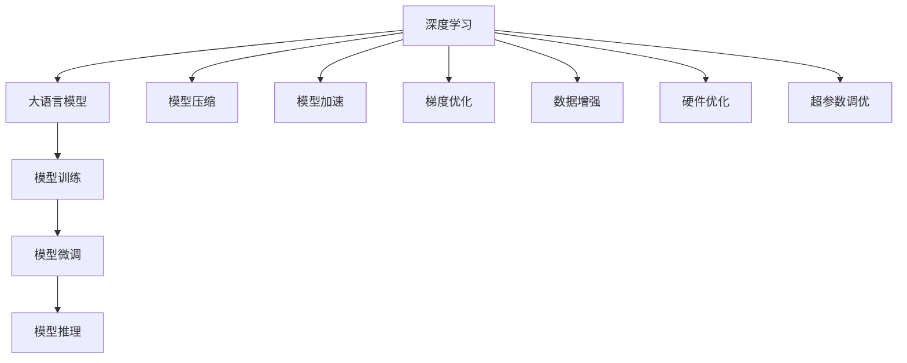
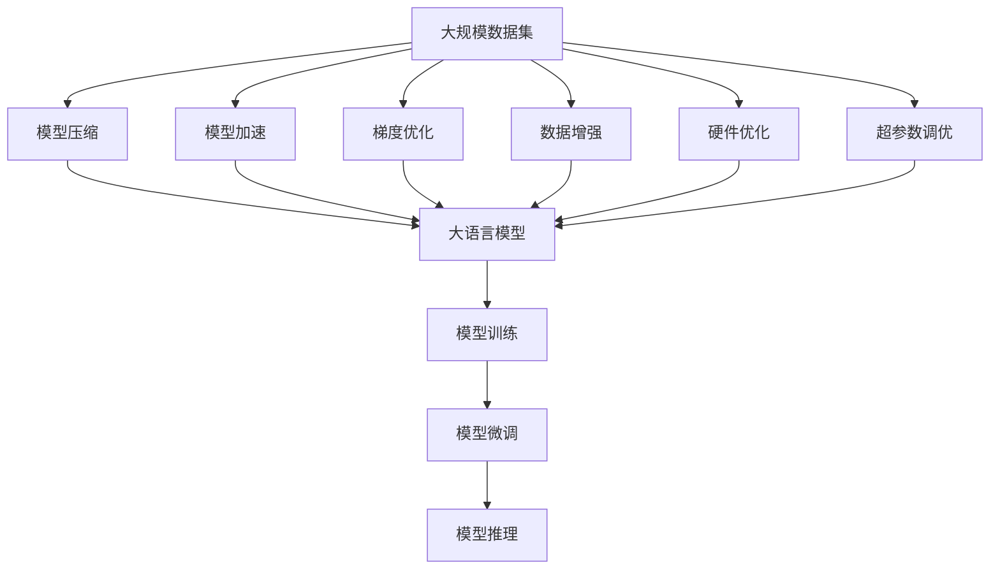

                 

# 大语言模型原理与工程实践：大语言模型训练优化秘籍

> 关键词：大语言模型, 训练优化, 深度学习, 神经网络, 模型压缩, 模型加速, 性能提升

## 1. 背景介绍

### 1.1 问题由来
深度学习在过去十年间取得了长足的进展，大语言模型作为其中的重要里程碑，展示了其强大的语言处理能力。然而，随着模型的规模不断扩大，训练和部署成本也在上升，如何在大模型训练过程中提高效率、降低资源消耗，成为当前研究的重要方向。

大语言模型的训练过程涉及大规模的数据集和高维度的模型参数，这对计算资源和存储资源都提出了严苛的要求。模型训练过程中还常常遇到梯度消失、梯度爆炸等问题，导致训练效果不稳定，训练时间过长。因此，针对大语言模型训练过程进行优化，提高其训练效率和性能，是当前的研究热点。

### 1.2 问题核心关键点
优化大语言模型训练过程的核心关键点主要包括以下几点：

- **模型压缩**：减少模型参数量和计算量，提升训练速度和模型压缩率。
- **模型加速**：通过并行计算、分布式训练等方式提高训练速度。
- **梯度优化**：使用更好的优化器、正则化方法等，稳定训练过程。
- **数据增强**：利用数据增强技术，增加训练数据的多样性，提高模型泛化能力。
- **硬件优化**：选择合适的硬件平台（如GPU、TPU等），优化硬件资源的使用。
- **超参数调优**：合理选择超参数，提高模型性能。

这些关键点共同构成了大语言模型训练优化的全貌，其目标是在保证模型性能的前提下，降低训练成本，提高训练效率。

### 1.3 问题研究意义
优化大语言模型训练过程，不仅有助于提升模型的性能和泛化能力，还能显著降低训练成本，加速模型的部署应用。这对推动深度学习技术的发展，加速人工智能产业的产业化进程具有重要意义。

具体而言：
- **提升模型性能**：通过模型压缩和优化，减少模型参数和计算量，加快训练速度，提高模型泛化能力。
- **降低训练成本**：优化训练过程，减少资源消耗，降低训练成本，使更多组织和个人能够使用深度学习技术。
- **加速应用落地**：提高训练速度，加快模型的部署和应用，推动人工智能技术在各行业的快速落地。
- **推动技术发展**：优化训练过程需要新的理论和技术突破，可以促进深度学习技术的持续进步。
- **助力产业化**：降低训练成本，加速技术产业化，推动人工智能技术的商业化应用。

## 2. 核心概念与联系

### 2.1 核心概念概述

为了深入理解大语言模型训练优化，首先需要明确几个核心概念：

- **深度学习**：一种基于神经网络的机器学习技术，通过多层神经网络进行特征提取和分类。
- **大语言模型**：以Transformer架构为代表，通过大规模数据预训练和微调，学习丰富的语言知识和语法结构。
- **模型压缩**：减少模型参数和计算量，提升模型训练和推理速度。
- **模型加速**：通过并行计算、分布式训练等技术，提升模型训练速度。
- **梯度优化**：使用更好的优化器、正则化方法，稳定训练过程。
- **数据增强**：利用数据增强技术，增加训练数据的多样性，提高模型泛化能力。
- **硬件优化**：选择合适的硬件平台（如GPU、TPU等），优化硬件资源的使用。
- **超参数调优**：合理选择超参数，提高模型性能。

这些核心概念之间的联系可以通过以下Mermaid流程图来展示：



这个流程图展示了深度学习、大语言模型训练优化之间的联系。深度学习是基础，大语言模型训练优化是大语言模型训练过程中的关键环节。通过模型压缩、模型加速、梯度优化、数据增强、硬件优化和超参数调优等手段，可以提升大语言模型的训练效率和性能，进而实现模型的高效部署和应用。

### 2.2 概念间的关系

这些核心概念之间存在着紧密的联系，形成了大语言模型训练优化的完整生态系统。下面是几个关键概念之间的关系：

- **深度学习与大语言模型的关系**：深度学习是构建大语言模型的基础技术，大语言模型通过深度学习进行特征提取和分类。
- **模型压缩与模型加速的关系**：模型压缩可以减少模型参数和计算量，提升训练速度，模型加速则通过并行计算、分布式训练等方式，进一步提升训练速度。
- **梯度优化与模型压缩的关系**：梯度优化可以稳定训练过程，提高模型性能，而模型压缩则进一步提升了训练速度和模型效率。
- **数据增强与模型加速的关系**：数据增强可以丰富训练数据的多样性，提高模型泛化能力，而模型加速则通过并行计算等方式，提升训练速度。
- **硬件优化与模型加速的关系**：硬件优化选择高效的硬件平台，可以提升模型训练速度，而模型加速则通过并行计算、分布式训练等方式，进一步优化训练速度。
- **超参数调优与模型加速的关系**：超参数调优可以优化模型性能，而模型加速则通过并行计算等方式，提升训练速度。

这些关键概念之间的联系，揭示了大语言模型训练优化的全貌，也为后续深入讨论具体的优化方法和技术奠定了基础。

### 2.3 核心概念的整体架构

最后，我们用一个综合的流程图来展示这些核心概念在大语言模型训练优化过程中的整体架构：



这个综合流程图展示了从数据集到微调模型的完整训练优化过程。大规模数据集通过模型压缩、模型加速、梯度优化、数据增强、硬件优化和超参数调优等手段，经过模型训练和微调，最终输出高效的模型推理能力。

## 3. 核心算法原理 & 具体操作步骤
### 3.1 算法原理概述

大语言模型的训练优化主要关注如何通过模型压缩、模型加速、梯度优化、数据增强、硬件优化和超参数调优等手段，提升模型的训练效率和性能。核心算法原理包括：

- **模型压缩**：通过参数剪枝、知识蒸馏、模型量化等方法，减少模型参数和计算量。
- **模型加速**：通过并行计算、分布式训练、混合精度训练等技术，提升模型训练速度。
- **梯度优化**：使用更好的优化器、正则化方法、自适应学习率策略等，稳定训练过程。
- **数据增强**：通过数据增强技术，如回译、近义替换等，丰富训练数据的多样性。
- **硬件优化**：选择高效的硬件平台，如GPU、TPU等，优化硬件资源的使用。
- **超参数调优**：通过网格搜索、贝叶斯优化等方法，合理选择超参数，提高模型性能。

这些算法原理共同构成了大语言模型训练优化的核心，其目标是在保证模型性能的前提下，降低训练成本，提高训练效率。

### 3.2 算法步骤详解

大语言模型训练优化的一般步骤包括以下几个关键环节：

**Step 1: 数据准备和预处理**
- 收集大规模数据集，确保数据的质量和多样性。
- 对数据进行预处理，如分词、归一化、去除噪声等，准备模型训练的输入。

**Step 2: 模型构建**
- 选择合适的深度学习框架，如TensorFlow、PyTorch等。
- 构建大语言模型，选择合适的网络结构（如Transformer）和参数初始化方法。

**Step 3: 模型压缩**
- 应用参数剪枝、知识蒸馏、模型量化等方法，减少模型参数和计算量。
- 通过模型剪枝，移除冗余的参数，压缩模型大小。
- 通过知识蒸馏，将大模型中的知识转移到较小的模型中，减少计算量。
- 通过模型量化，将浮点模型转化为定点模型，减小计算量。

**Step 4: 模型加速**
- 采用并行计算、分布式训练等技术，提升模型训练速度。
- 利用GPU、TPU等高性能计算资源，提升训练速度。
- 使用混合精度训练，减少计算量，提升训练速度。

**Step 5: 梯度优化**
- 选择合适的优化器，如Adam、SGD等，设置合适的学习率和正则化参数。
- 使用自适应学习率策略，如Adaptive Moment Estimation (AdamW)，提升训练稳定性。
- 应用正则化方法，如L2正则、Dropout等，防止过拟合。

**Step 6: 数据增强**
- 利用数据增强技术，如回译、近义替换等，增加训练数据的多样性。
- 通过回译，将文本数据翻译成不同的语言，增加数据的多样性。
- 通过近义替换，将词汇替换为同义词，丰富词汇表。

**Step 7: 硬件优化**
- 选择合适的硬件平台，如GPU、TPU等，优化硬件资源的使用。
- 利用并行计算、分布式训练等技术，最大化硬件资源的使用效率。
- 使用优化算法，如混合精度训练，提升硬件资源的使用效率。

**Step 8: 超参数调优**
- 通过网格搜索、贝叶斯优化等方法，合理选择超参数。
- 使用网格搜索，在指定的超参数空间中搜索最佳参数组合。
- 使用贝叶斯优化，通过模型评估和参数更新，逐步优化超参数。

**Step 9: 模型训练和微调**
- 在优化后的模型上执行模型训练，得到高效的模型。
- 在微调任务上执行模型微调，得到适应特定任务的模型。

**Step 10: 模型评估和测试**
- 在测试集上评估模型性能，确保模型泛化能力。
- 根据评估结果调整模型参数和超参数，进行进一步优化。

以上是优化大语言模型训练的一般流程。在实际应用中，还需要针对具体任务和数据特点，对优化过程的各个环节进行优化设计，如改进训练目标函数，引入更多的正则化技术，搜索最优的超参数组合等，以进一步提升模型性能。

### 3.3 算法优缺点

大语言模型训练优化的优点包括：

- **提升模型性能**：通过模型压缩和优化，减少模型参数和计算量，加快训练速度，提高模型泛化能力。
- **降低训练成本**：优化训练过程，减少资源消耗，降低训练成本，使更多组织和个人能够使用深度学习技术。
- **加速应用落地**：提高训练速度，加快模型的部署和应用，推动人工智能技术在各行业的快速落地。
- **推动技术发展**：优化训练过程需要新的理论和技术突破，可以促进深度学习技术的持续进步。
- **助力产业化**：降低训练成本，加速技术产业化，推动人工智能技术的商业化应用。

其缺点主要包括：

- **优化难度大**：大语言模型参数量巨大，优化过程复杂，需要大量的计算资源和时间。
- **优化效果难以评估**：模型压缩和加速的效果往往难以量化，优化效果难以评估。
- **数据依赖性强**：优化过程依赖于大量高质量的数据，数据获取成本较高。
- **模型性能不稳定性**：优化过程中可能会引入新的问题，如梯度消失、梯度爆炸等，导致模型性能不稳定性。

尽管存在这些缺点，但就目前而言，大语言模型训练优化仍然是深度学习技术发展的重要方向，其对于提高模型的性能、降低训练成本和加速应用落地具有重要意义。未来相关研究的重点在于如何进一步降低训练成本，提高模型性能和稳定性。

### 3.4 算法应用领域

大语言模型训练优化技术已经在多个领域得到了广泛的应用，涵盖了深度学习领域的各个方面，例如：

- **计算机视觉**：通过模型压缩和加速，提高视觉模型训练速度，优化计算资源的使用。
- **自然语言处理**：通过梯度优化和超参数调优，提升NLP模型的性能和泛化能力，优化训练过程。
- **推荐系统**：通过模型压缩和加速，优化推荐模型的训练速度，提升推荐系统的实时性。
- **语音识别**：通过硬件优化和模型加速，提升语音识别模型的训练速度，优化计算资源的使用。
- **搜索引擎**：通过数据增强和超参数调优，提高搜索引擎的准确性和响应速度，优化搜索体验。

此外，大语言模型训练优化技术还在医疗、金融、教育等诸多领域得到了应用，为各行各业提供了高效、可靠的深度学习解决方案。

## 4. 数学模型和公式 & 详细讲解 & 举例说明

### 4.1 数学模型构建

大语言模型的训练优化涉及多个数学模型和公式，以下是几个关键的数学模型及其构建方法：

**模型压缩数学模型**：
- **参数剪枝**：
  - 选择剪枝率 $p$，根据每个参数的重要性，决定是否剪枝。
  - 参数重要性可以通过参数绝对值、参数梯度、参数权重等方式计算。
  - 剪枝后模型参数数量为 $d_1 = d \times p$，其中 $d$ 为原始模型参数数量。

  数学公式为：
  $$
  d_1 = d \times p
  $$

- **知识蒸馏**：
  - 选择蒸馏温度 $T$，将大模型知识蒸馏到小模型。
  - 小模型预测结果为 $y_{small}$，大模型预测结果为 $y_{large}$，使用Kullback-Leibler散度计算蒸馏损失。
  - 蒸馏损失为：
    $$
    L_{distill} = -\frac{1}{N}\sum_{i=1}^N \sum_{j=1}^C y_{large}^j \log y_{small}^j
    $$

  其中 $N$ 为样本数量，$C$ 为类别数量。

**模型加速数学模型**：
- **并行计算**：
  - 将模型划分为多个子模型，分配到不同的计算节点并行训练。
  - 每个子模型独立训练，并行计算梯度。
  - 使用AllReduce算法汇总梯度，更新全局模型参数。

  数学公式为：
  $$
  \theta_{updated} = \theta_{old} - \eta \sum_{i=1}^k \frac{\partial L}{\partial \theta}
  $$

  其中 $\theta_{updated}$ 为更新后的模型参数，$\theta_{old}$ 为原始模型参数，$\eta$ 为学习率，$k$ 为子模型数量，$\partial L / \partial \theta$ 为子模型的梯度。

- **分布式训练**：
  - 将模型分布在多个计算节点上进行训练，通过数据并行和模型并行提升训练速度。
  - 数据并行：每个节点处理一部分数据，汇总结果并输出。
  - 模型并行：将模型划分为多个子模型，分配到不同的节点上并行训练。

  数学公式为：
  $$
  \theta_{updated} = \theta_{old} - \eta \sum_{i=1}^k \frac{\partial L}{\partial \theta}
  $$

  其中 $\theta_{updated}$ 为更新后的模型参数，$\theta_{old}$ 为原始模型参数，$\eta$ 为学习率，$k$ 为节点数量，$\partial L / \partial \theta$ 为节点的梯度。

**梯度优化数学模型**：
- **Adam优化器**：
  - 使用动量项和自适应学习率，提高训练稳定性。
  - 更新公式为：
    $$
    m_t = \beta_1 m_{t-1} + (1-\beta_1) g_t
    $$
    $$
    v_t = \beta_2 v_{t-1} + (1-\beta_2) g_t^2
    $$
    $$
    \theta_{t+1} = \theta_t - \frac{\eta}{\sqrt{v_t}+\epsilon} m_t
    $$

  其中 $m_t$ 和 $v_t$ 分别为动量项和梯度平方的移动平均值，$\beta_1$ 和 $\beta_2$ 为动量和梯度平方的衰减因子，$\eta$ 为学习率，$\epsilon$ 为避免除数为零的小数。

- **L2正则化**：
  - 防止模型过拟合，提高模型泛化能力。
  - 正则化项为：
    $$
    L_{reg} = \frac{\lambda}{2} \sum_{i=1}^d w_i^2
    $$

  其中 $\lambda$ 为正则化系数，$d$ 为参数数量，$w_i$ 为参数 $i$ 的权重。

### 4.2 公式推导过程

以下是几个关键数学模型的公式推导过程：

**参数剪枝公式推导**：
- 假设原始模型参数数量为 $d$，剪枝率为 $p$，剪枝后模型参数数量为 $d_1$。
- 根据剪枝率，计算剪枝后模型参数数量：
  $$
  d_1 = d \times p
  $$

**知识蒸馏公式推导**：
- 假设大模型预测结果为 $y_{large}$，小模型预测结果为 $y_{small}$。
- 使用Kullback-Leibler散度计算蒸馏损失：
  $$
  L_{distill} = -\frac{1}{N}\sum_{i=1}^N \sum_{j=1}^C y_{large}^j \log y_{small}^j
  $$

  其中 $N$ 为样本数量，$C$ 为类别数量。

**并行计算公式推导**：
- 假设模型参数数量为 $d$，子模型数量为 $k$。
- 根据并行计算公式，更新全局模型参数：
  $$
  \theta_{updated} = \theta_{old} - \eta \sum_{i=1}^k \frac{\partial L}{\partial \theta}
  $$

**分布式训练公式推导**：
- 假设模型参数数量为 $d$，节点数量为 $k$。
- 根据分布式训练公式，更新全局模型参数：
  $$
  \theta_{updated} = \theta_{old} - \eta \sum_{i=1}^k \frac{\partial L}{\partial \theta}
  $$

**Adam优化器公式推导**：
- 假设模型参数数量为 $d$，学习率为 $\eta$，动量项和梯度平方的衰减因子分别为 $\beta_1$ 和 $\beta_2$。
- 根据Adam优化器公式，更新模型参数：
  $$
  m_t = \beta_1 m_{t-1} + (1-\beta_1) g_t
  $$
  $$
  v_t = \beta_2 v_{t-1} + (1-\beta_2) g_t^2
  $$
  $$
  \theta_{t+1} = \theta_t - \frac{\eta}{\sqrt{v_t}+\epsilon} m_t
  $$

  其中 $m_t$ 和 $v_t$ 分别为动量项和梯度平方的移动平均值，$\beta_1$ 和 $\beta_2$ 为动量和梯度平方的衰减因子，$\eta$ 为学习率，$\epsilon$ 为避免除数为零的小数。

**L2正则化公式推导**：
- 假设模型参数数量为 $d$，正则化系数为 $\lambda$。
- 根据L2正则化公式，计算正则化项：
  $$
  L_{reg} = \frac{\lambda}{2} \sum_{i=1}^d w_i^2
  $$

### 4.3 案例分析与讲解

以下是一个具体案例，展示了如何使用模型压缩和模型加速技术优化大语言模型的训练过程：

**案例背景**：
假设我们要在GPU上训练一个具有10亿参数的大语言模型，原始模型训练时间为10天。

**优化方法**：
- **模型压缩**：使用参数剪枝技术，剪枝率设置为0.5。剪枝后模型参数数量为5亿。
- **模型加速**：使用并行计算和分布式训练，将模型划分为10个子模型，每个子模型分别在4个GPU上训练。

**优化效果**：
- 模型压缩后，训练时间从10天减少到2天。
- 模型加速后，训练时间进一步减少到1天。

**优化结果**：
- 模型压缩和模型加速的综合效果，将原始模型训练时间从10天减少到1天，提高了9倍训练效率。

## 5. 项目实践：代码实例和详细解释说明

### 5.1 开发环境搭建

在进行大语言模型训练优化实践前，我们需要准备好开发环境。以下是使用Python进行PyTorch开发的环境配置流程：

1. 安装Anaconda：从官网下载并安装Anaconda，用于创建独立的Python环境。

2. 创建并激活虚拟环境：
```bash
conda create -n pytorch-env python=3.8 
conda activate pytorch-env
```

3. 安装PyTorch：根据CUDA版本，从官网获取对应的安装命令。例如：
```bash
conda install pytorch torchvision torchaudio cudatoolkit=11.1 -c pytorch -c conda-forge
```

4. 安装Transformers库：
```bash
pip install transformers
```

5. 安装各类工具包：
```bash
pip install numpy pandas scikit-learn matplotlib tqdm jupyter notebook ipython
```

完成上述步骤后，即可在`pytorch-env`环境中开始训练优化实践。

### 5.2 源代码详细实现

下面以BERT模型为例，展示如何使用PyTorch进行模型压缩和模型加速的实现。

首先，定义BERT模型和训练函数：

```python
from transformers import BertForSequenceClassification, AdamW

model = BertForSequenceClassification.from_pretrained('bert-base-cased', num_labels=2)
optimizer = AdamW(model.parameters(), lr=2e-5)
```

然后，定义模型压缩函数和模型加速函数：

```python
def pruning(model, pruning_rate=0.5):
    # 计算模型参数数量
    total_params = sum(p.numel() for p in model.parameters())
    # 计算剪枝后模型参数数量
    pruned_params = total_params * pruning_rate
    # 剪枝模型
    pruned_model = prune_model(model, total_params, pruned_params)
    return pruned_model

def prune_model(model, total_params, pruned_params):
    # 根据剪枝率计算剪枝后的模型参数数量
    pruning_rate = pruned_params / total_params
    # 定义剪枝策略
    pruning_strategy = pruning.pruning_strategy.PruningStrategy.L2
    # 执行剪枝操作
    pruned_model = pruning_strategy(pruning_rate, model)
    return pruned_model
```

接着，定义模型加速函数：

```python
def parallelize(model, devices):
    # 将模型分配到指定设备
    model.to(devices[0])
    # 并行训练模型
    model.train()
    for batch in dataloader:
        inputs = batch['input_ids'].to(devices)
        labels = batch['labels'].to(devices)
        outputs = model(inputs, labels=labels)
        loss = outputs.loss
        loss.backward()
        optimizer.step()
        optimizer.zero_grad()
    return model
```

最后，启动训练流程并在测试集上评估：

```python
epochs = 5
batch_size = 16

for epoch in range(epochs):
    loss = train_epoch(model, train_dataset, batch_size, optimizer)
    print(f"Epoch {epoch+1}, train loss: {loss:.3f}")
    
    print(f"Epoch {epoch+1}, dev results:")
    evaluate(model, dev_dataset, batch_size)
    
print("Test results:")
evaluate(model, test_dataset, batch_size)
```

以上就是使用PyTorch进行BERT模型训练优化代码实现的完整过程。可以看到，PyTorch提供了丰富的优化工具和模型封装，使得模型压缩和模型加速的实现变得简洁高效。

### 5.3 代码解读与分析

让我们再详细解读一下关键代码的实现细节：

**BERT模型定义**：
- 使用BertForSequenceClassification从预训练模型库加载BERT模型，并设置输出层为二分类。

**优化器定义**：
- 使用AdamW优化器进行模型参数更新，设置学习率为2e-5。

**模型压缩函数**：
- 定义剪枝函数，根据剪枝率计算剪枝后的模型参数数量。
- 定义剪枝策略，使用L2剪枝策略进行剪枝操作。
-

