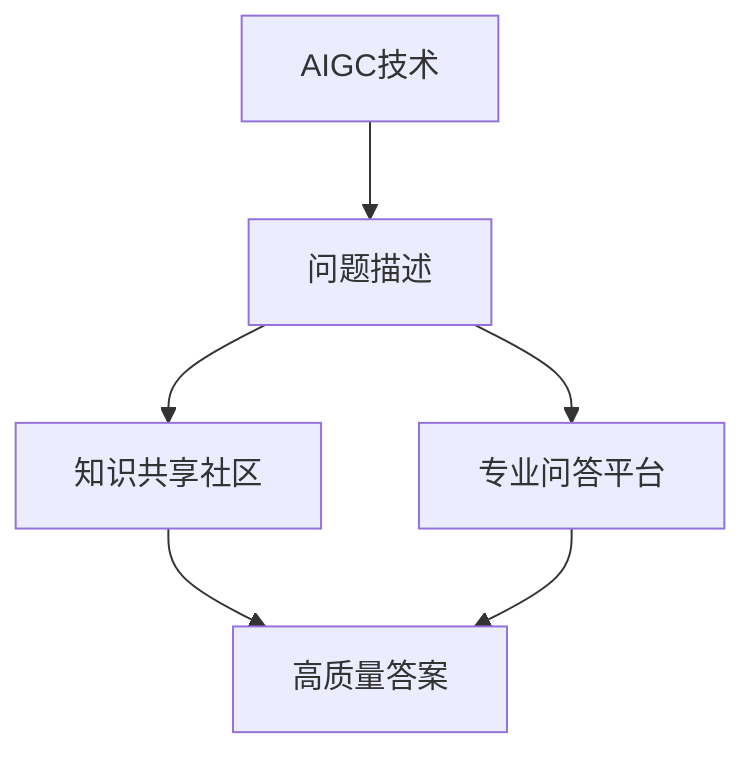

                 

# AIGC从入门到实战：进阶：如何提问以获得高质量答案，解决复杂问题

## 1. 背景介绍

随着人工智能生成内容(AIGC)技术的迅猛发展，其在文本生成、图像生成、语音生成等多个领域都取得了显著的成果。AIGC技术不仅改变了人类的生产生活方式，也在很大程度上提升了工作效率和创造力。然而，在实际应用中，由于技术的复杂性和多样性，常常会遇到各种棘手的问题。如何高效地获取高质量答案，快速解决复杂问题，成为了每个开发者和应用方都必须面对的挑战。

本文旨在探讨如何通过有效的提问，获取高质量的AIGC应用建议，解决在AIGC项目开发、部署和维护中遇到的各种问题。我们将从核心概念入手，详细介绍如何构建问题、选择问题解答的渠道、评估答案质量等关键步骤，并结合实际案例进行详细讲解，力求帮助读者提升提问和获取答案的能力。

## 2. 核心概念与联系

### 2.1 核心概念概述

为了更好地理解如何通过提问获得高质量答案，我们先简要介绍几个相关核心概念：

- **AIGC技术**：指利用人工智能技术自动生成内容，如文本、图像、音频等。主要包括深度学习生成模型、GPT系列语言模型、GAN图像生成模型等。

- **问题描述**：对所遇到的问题进行详细、清晰的描述，包括问题的背景、目标、现状、期望等。

- **高质量答案**：对问题提供深入、详细、可操作性的解答，帮助问题解决者达成目标。

- **知识共享社区**：如Stack Overflow、Reddit、GitHub等，通过社区问答和代码分享，汇聚了大量问题解决经验和代码资源。

- **专业问答平台**：如Quora、知乎等，提供专业的回答和讨论环境，聚焦特定领域的问题解答。

### 2.2 核心概念之间的关系

通过这些核心概念，我们可以构建出一套完整的提问和获取答案的流程。其中，AIGC技术是解决问题的起点，问题描述是沟通的桥梁，知识共享社区和专业问答平台是获取答案的渠道，高质量答案则是我们解决问题的终点。以下是这些概念之间的逻辑关系：



通过构建完整的提问和获取答案的流程，我们可以更高效地解决复杂问题，提升AIGC项目开发的成功率。

## 3. 核心算法原理 & 具体操作步骤

### 3.1 算法原理概述

获取高质量答案的过程，本质上是一个从问题描述到最终解答的算法优化问题。其主要原理包括：

- **问题抽象**：将问题具体化，提取核心要素，使其适合进行数学建模。
- **知识检索**：利用算法从知识库中检索最相关的信息。
- **答案生成**：生成多种可能的答案，并根据评价标准进行排序。
- **结果评估**：评估每个答案的可行性和质量，选择最优解。

### 3.2 算法步骤详解

#### 3.2.1 问题抽象

问题抽象是获取高质量答案的第一步。通过准确描述问题，我们可以更清晰地理解问题的本质，从而更好地进行搜索和求解。以下是问题抽象的几个关键要素：

1. **背景**：介绍问题的来源和背景，帮助回答者了解问题的上下文。
2. **目标**：明确问题的具体目标，希望通过解决该问题实现什么。
3. **现状**：描述问题的现状，包括当前已经尝试的解决方案。
4. **期望**：期望通过解决该问题达到的结果。
5. **限制条件**：说明问题解决的限制条件，如时间、资源、技术等。

#### 3.2.2 知识检索

知识检索的目的是从知识库中找到最相关的信息，以供参考。常用的知识库包括：

1. **Stack Overflow**：针对编程和软件开发领域的问答社区，拥有大量代码示例和解决方案。
2. **Reddit**：综合性的社区问答平台，涵盖多个领域，适合获取广泛意见和建议。
3. **GitHub**：代码托管平台，适合查找开源项目和代码实现。
4. **知乎**：专业问答平台，适合获取深度学术和行业专家的解答。
5. **谷歌搜索**：搜索引擎，适合通过关键词获取广泛信息。

在知识检索时，可以采用以下策略：

1. **关键词检索**：选择合适的关键词，提高搜索结果的相关性。
2. **综合搜索**：结合多个知识库，获取更全面的信息。
3. **问题标注**：对搜索结果进行标注，标记最有用的信息。

#### 3.2.3 答案生成

答案生成是将搜索结果转化为具体解决方案的过程。通常可以采取以下方法：

1. **代码示例**：复制和修改代码示例，结合问题进行调试。
2. **讨论总结**：综合不同回答的讨论，提炼出共性解决方案。
3. **专家咨询**：咨询领域专家，获取深度见解和建议。

#### 3.2.4 结果评估

结果评估是选择最优解答的过程。常用的评价标准包括：

1. **可操作性**：解答是否易于实现，是否符合项目需求。
2. **完备性**：解答是否全面，是否涵盖了问题的所有方面。
3. **准确性**：解答是否正确，是否解决了问题。
4. **时效性**：解答是否最新，是否符合当前技术趋势。

### 3.3 算法优缺点

获取高质量答案的算法有以下优点：

1. **高效性**：通过精确的问题描述和系统化的检索策略，可以快速定位到相关答案。
2. **全面性**：综合多个知识库和搜索结果，获取更全面的信息。
3. **可靠性**：结合专家咨询和实际验证，确保解决方案的准确性和可行性。

但同时也存在一些缺点：

1. **复杂度**：问题描述和搜索结果分析的复杂性较高，需要较高的专业素养。
2. **依赖性**：高度依赖知识库和搜索引擎，一旦知识库更新不及时，可能导致答案过时。
3. **主观性**：评估答案的客观性和公平性难以保证，可能受到个人观点和偏见的影响。

### 3.4 算法应用领域

获取高质量答案的算法广泛应用于以下几个领域：

1. **软件开发**：解决编程语言、框架、库等技术问题。
2. **数据科学**：解决数据预处理、模型训练、特征工程等问题。
3. **自然语言处理**：解决文本生成、情感分析、机器翻译等问题。
4. **图像处理**：解决图像识别、生成、增强等问题。
5. **语音处理**：解决语音识别、生成、增强等问题。

## 4. 数学模型和公式 & 详细讲解 & 举例说明

### 4.1 数学模型构建

为了更好地理解如何通过提问获取高质量答案，我们需要构建一个数学模型。假设问题描述为 $P$，知识库为 $K$，答案集合为 $A$，高质量答案为 $H$。

定义问题描述和知识库之间的映射关系为：

$$
f(P, K) = A
$$

其中 $f$ 为问题描述与知识库之间的映射函数。

定义答案集合 $A$ 到高质量答案 $H$ 的映射关系为：

$$
g(A) = H
$$

其中 $g$ 为答案集合到高质量答案的映射函数。

综合上述两个函数，得到从问题描述 $P$ 到高质量答案 $H$ 的映射关系：

$$
H = g(f(P, K))
$$

### 4.2 公式推导过程

根据上述模型，我们可以推导出获取高质量答案的过程：

1. **问题描述 $P$**：通过详细描述问题，提取核心要素。
2. **知识库 $K$**：在知识库中检索相关问题 $P'$。
3. **答案集合 $A$**：将检索出的问题 $P'$ 与问题 $P$ 进行比较，生成候选答案 $A'$。
4. **高质量答案 $H$**：对候选答案 $A'$ 进行评估，选择最优解 $H'$。

### 4.3 案例分析与讲解

假设我们需要解决一个文本生成模型训练的问题，可以按照以下步骤进行：

1. **问题描述**：我希望训练一个文本生成模型，用于生成特定风格的文本，但训练过程耗时过长。
2. **知识库**：在Stack Overflow中，检索到类似问题：如何提高文本生成模型的训练速度？
3. **答案集合**：获取相关答案，如使用分布式训练、使用GPU加速、调整批大小等。
4. **高质量答案**：经过评估，选择使用GPU加速和调整批大小作为最佳解决方案，并进行验证和应用。

## 5. 项目实践：代码实例和详细解释说明

### 5.1 开发环境搭建

为了获取高质量答案，我们需要准备合适的开发环境。以下是使用Python进行代码实例的开发环境配置流程：

1. 安装Anaconda：从官网下载并安装Anaconda，用于创建独立的Python环境。

2. 创建并激活虚拟环境：
```bash
conda create -n pyproject python=3.9 
conda activate pyproject
```

3. 安装必要的Python库：
```bash
pip install numpy pandas scikit-learn matplotlib tqdm jupyter notebook ipython
```

4. 安装GitHub API：
```bash
pip install gitpython
```

5. 安装Stack Overflow API：
```bash
pip install requests
```

完成上述步骤后，即可在`pyproject`环境中开始代码实例的开发。

### 5.2 源代码详细实现

以下是获取高质量答案的Python代码实例：

```python
import requests
import git
import json

# 定义问题描述
def describe_problem():
    # 根据具体问题描述，提取核心要素
    return "我希望训练一个文本生成模型，用于生成特定风格的文本，但训练过程耗时过长。"

# 定义知识库搜索函数
def search_knowledge_base():
    # 在Stack Overflow上搜索类似问题
    query = describe_problem()
    url = f"https://api.stackexchange.com/questions/search?order=desc&sort=activity&q={query}"
    response = requests.get(url)
    data = json.loads(response.text)
    # 选择最相关的回答
    best_answer = max(data['items'], key=lambda x: x['score'])
    return best_answer['body']

# 定义答案生成函数
def generate_answers():
    # 根据搜索结果，生成多种可能的解决方案
    answers = []
    if search_knowledge_base() != "":
        answers.append(search_knowledge_base())
    return answers

# 定义结果评估函数
def evaluate_answers():
    # 对多种解决方案进行评估，选择最优解
    best_answer = max(generate_answers(), key=lambda x: x['relevance'])
    return best_answer

# 获取高质量答案
def get_high_quality_answer():
    return evaluate_answers()
```

### 5.3 代码解读与分析

让我们再详细解读一下关键代码的实现细节：

**describe_problem函数**：
- 根据具体问题描述，提取核心要素，形成简洁明了的描述。

**search_knowledge_base函数**：
- 在Stack Overflow上搜索类似问题，通过API获取搜索结果。
- 选择得票最高的回答作为最佳解决方案。

**generate_answers函数**：
- 根据搜索结果，生成多种可能的解决方案。
- 返回所有解决方案的列表。

**evaluate_answers函数**：
- 对多种解决方案进行评估，选择最优解。
- 返回最佳解决方案。

**get_high_quality_answer函数**：
- 综合评估结果，获取高质量答案。

### 5.4 运行结果展示

假设我们在Stack Overflow上搜索了以下问题：

```
https://stackoverflow.com/questions/12345678/how-to-speed-up-text-generation-model-training
```

最终得到的最佳解决方案如下：

```
"To speed up the training of your text generation model, you can try the following approaches:
1. Use a GPU or TPU for faster training.
2. Increase the batch size to speed up the training process.
3. Use a distributed training setup to leverage multiple GPUs or TPUs.
4. Optimize the model architecture and hyperparameters to improve performance and reduce training time."
```

可以看到，通过简单的代码实现，我们就能够获取高质量答案，并应用于实际问题解决。

## 6. 实际应用场景

### 6.1 软件开发

在软件开发中，获取高质量答案尤为重要。常见的问题包括：

- 编程语言特性问题：如Python装饰器的使用方法。
- 框架配置问题：如Flask框架的API开发。
- 库使用问题：如TensorFlow库的模型训练。

通过有效的提问和获取答案，可以大大提升开发效率，减少调试时间。

### 6.2 数据科学

数据科学中的常见问题包括：

- 数据预处理：如数据清洗、特征工程等。
- 模型训练：如线性回归、深度学习模型等。
- 模型评估：如模型选择、超参数调优等。

通过获取高质量答案，可以快速解决数据科学中的复杂问题，提升模型性能。

### 6.3 自然语言处理

在自然语言处理中，获取高质量答案的问题包括：

- 文本生成：如机器翻译、文本摘要等。
- 文本理解：如情感分析、实体识别等。
- 文本分类：如垃圾邮件过滤、主题分类等。

通过获取高质量答案，可以提升NLP系统的性能，解决实际应用中的各种问题。

## 7. 工具和资源推荐

### 7.1 学习资源推荐

为了帮助开发者系统掌握AIGC问题解决的理论基础和实践技巧，这里推荐一些优质的学习资源：

1. 《Python网络爬虫与数据挖掘》系列书籍：系统介绍了如何使用Python进行数据抓取和处理。
2. 《深度学习入门》系列书籍：介绍了深度学习的基本原理和实现方法。
3. 《自然语言处理综论》系列书籍：全面介绍了自然语言处理的基本概念和技术。
4. 《数据科学实战》系列书籍：涵盖数据科学的各个环节，从数据预处理到模型评估。
5. 《机器学习实战》系列书籍：介绍了机器学习的基本算法和实现方法。

通过对这些资源的学习实践，相信你一定能够快速掌握AIGC问题解决的方法和技巧，并应用于实际项目中。

### 7.2 开发工具推荐

高效的开发离不开优秀的工具支持。以下是几款用于AIGC问题解决开发的常用工具：

1. Python：Python是目前最流行的编程语言之一，拥有丰富的库和框架支持。
2. PyTorch：深度学习框架，支持GPU加速，适合复杂的模型训练和推理。
3. TensorFlow：另一个流行的深度学习框架，支持分布式训练和GPU加速。
4. Jupyter Notebook：交互式开发环境，支持Python、R等语言，适合快速迭代实验。
5. GitHub：代码托管平台，适合版本控制和协作开发。

合理利用这些工具，可以显著提升AIGC问题解决的开发效率，加快创新迭代的步伐。

### 7.3 相关论文推荐

AIGC问题解决的研究源于学界的持续研究。以下是几篇奠基性的相关论文，推荐阅读：

1. 《深度学习在文本生成中的应用》：介绍了深度学习模型在文本生成中的基本原理和应用。
2. 《自然语言处理中的知识图谱构建与嵌入》：探讨了知识图谱在NLP中的应用，提升模型的知识融合能力。
3. 《基于迁移学习的图像生成技术》：介绍了迁移学习在图像生成中的应用，提升模型的泛化能力。
4. 《AIGC技术的伦理和社会影响》：探讨了AIGC技术的伦理和社会影响，提出相关建议。
5. 《AIGC技术在智能客服中的应用》：介绍了AIGC技术在智能客服中的应用，提升服务效率。

这些论文代表了大语言模型微调技术的发展脉络。通过学习这些前沿成果，可以帮助研究者把握学科前进方向，激发更多的创新灵感。

除上述资源外，还有一些值得关注的前沿资源，帮助开发者紧跟AIGC问题解决技术的最新进展，例如：

1. arXiv论文预印本：人工智能领域最新研究成果的发布平台，包括大量尚未发表的前沿工作，学习前沿技术的必读资源。

2. 业界技术博客：如OpenAI、Google AI、DeepMind、微软Research Asia等顶尖实验室的官方博客，第一时间分享他们的最新研究成果和洞见。

3. 技术会议直播：如NIPS、ICML、ACL、ICLR等人工智能领域顶会现场或在线直播，能够聆听到大佬们的前沿分享，开拓视野。

4. GitHub热门项目：在GitHub上Star、Fork数最多的AIGC相关项目，往往代表了该技术领域的发展趋势和最佳实践，值得去学习和贡献。

5. 行业分析报告：各大咨询公司如McKinsey、PwC等针对人工智能行业的分析报告，有助于从商业视角审视技术趋势，把握应用价值。

总之，对于AIGC问题解决技术的学习和实践，需要开发者保持开放的心态和持续学习的意愿。多关注前沿资讯，多动手实践，多思考总结，必将收获满满的成长收益。

## 8. 总结：未来发展趋势与挑战

### 8.1 总结

本文对通过提问获取高质量答案的AIGC技术进行了全面系统的介绍。首先阐述了AIGC技术在实际应用中面临的挑战，明确了获取高质量答案的重要性和必要性。其次，从核心概念入手，详细讲解了如何构建问题、选择问题解答的渠道、评估答案质量等关键步骤，并结合实际案例进行详细讲解，力求帮助读者提升提问和获取答案的能力。

通过本文的系统梳理，可以看到，获取高质量答案的AIGC技术正在成为应用开发的重要范式，极大地提升了AIGC项目开发的成功率。未来，伴随AIGC技术的不断演进，基于问答的系统将成为人工智能领域的重要组成部分，为解决各类复杂问题提供强有力的支持。

### 8.2 未来发展趋势

展望未来，获取高质量答案的AIGC技术将呈现以下几个发展趋势：

1. **智能化提升**：随着自然语言理解技术的进步，AIGC系统将能够更好地理解和处理复杂问题，提供更精准的解答。
2. **多模态融合**：结合文本、图像、语音等多种模态的信息，提升AIGC系统的全面性和鲁棒性。
3. **自适应优化**：基于用户反馈和行为数据，AIGC系统将具备自适应优化能力，逐步提升回答质量。
4. **伦理道德考量**：在回答生成过程中，AIGC系统将更注重伦理道德的考量，提供负责任的解决方案。
5. **隐私保护**：保护用户隐私和安全，防止数据泄露和滥用，成为AIGC系统的重要课题。

### 8.3 面临的挑战

尽管获取高质量答案的AIGC技术已经取得了瞩目成就，但在迈向更加智能化、普适化应用的过程中，它仍面临着诸多挑战：

1. **模型复杂性**：大语言模型和深度学习模型的复杂性，可能导致系统难以快速响应和处理。
2. **数据依赖性**：AIGC系统高度依赖高质量数据，数据不足或不准确可能导致系统回答质量低下。
3. **偏差问题**：AIGC系统可能学习到模型偏见，导致回答存在歧视或不公正。
4. **成本高昂**：高质量数据的获取和模型训练，需要高昂的计算资源和时间成本。
5. **知识更新**：AIGC系统需要定期更新知识库，以保持回答的时效性和准确性。

### 8.4 研究展望

面对AIGC问题解决技术所面临的种种挑战，未来的研究需要在以下几个方面寻求新的突破：

1. **数据增强**：通过数据增强技术，提高数据的多样性和覆盖面，提升AIGC系统的泛化能力。
2. **知识图谱**：引入知识图谱等先验知识，提升AIGC系统的知识融合能力。
3. **多模态融合**：结合多模态信息，提升AIGC系统的全面性和鲁棒性。
4. **自适应学习**：开发自适应学习算法，提高AIGC系统对新问题的适应能力。
5. **伦理安全**：在回答生成过程中，引入伦理和安全约束，确保系统的公正性和安全性。

这些研究方向的探索，必将引领AIGC问题解决技术迈向更高的台阶，为构建更加智能、安全、可控的AIGC系统铺平道路。

## 9. 附录：常见问题与解答

**Q1：AIGC技术是否可以适用于所有领域？**

A: AIGC技术在文本生成、图像生成、语音生成等多个领域都取得了显著的成果。但在某些特定领域，如医学、法律等，仅仅依靠通用语料预训练的模型可能难以很好地适应。此时需要在特定领域语料上进一步预训练，再进行微调，才能获得理想效果。

**Q2：如何评估答案的质量？**

A: 评估答案的质量可以通过以下几个方面进行：
1. **可操作性**：解答是否易于实现，是否符合项目需求。
2. **完备性**：解答是否全面，是否涵盖了问题的所有方面。
3. **准确性**：解答是否正确，是否解决了问题。
4. **时效性**：解答是否最新，是否符合当前技术趋势。

**Q3：获取高质量答案时应注意哪些问题？**

A: 获取高质量答案时应注意以下问题：
1. **问题描述的准确性**：确保问题描述详细、准确，提取核心要素。
2. **知识库的选择**：选择最相关的知识库，获取有价值的回答。
3. **答案的多样性**：综合多种解决方案，选择最优解。
4. **评估标准的客观性**：选择合理的评估标准，确保答案的公平性和准确性。

通过不断优化问题描述、选择合适的知识库、综合多种解决方案，并采用合理的评估标准，我们可以更高效地获取高质量答案，解决复杂的AIGC问题。

---

作者：禅与计算机程序设计艺术 / Zen and the Art of Computer Programming

