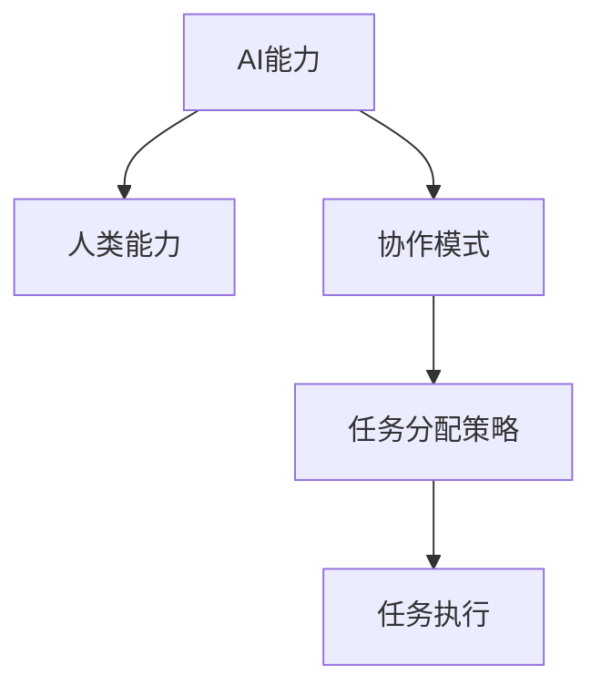
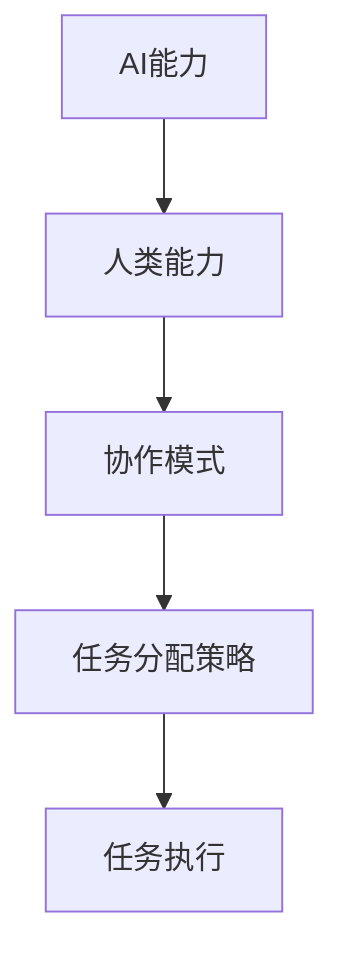

                 

# AI与人类在不同协作模式下的任务分配

## 1. 背景介绍

### 1.1 问题由来
在数字化、智能化的浪潮下，AI技术与人类协作的方式正在发生翻天覆地的变化。传统的人工操作逐渐被AI算法所取代，而AI算法则利用其超强的计算能力、广阔的数据处理能力，助力人类进行复杂任务的自动化处理。

这种变化催生出诸多协作模式，例如：人机交互、人机协作、人机融合、人机共生。不同模式下的任务分配策略各异，这不仅关系到AI系统的可扩展性、适用性和安全性，也影响着人工智能在实际应用中的效果和效率。

### 1.2 问题核心关键点
当前，AI与人类协作任务分配的主要关注点包括：
1. 人类和AI的能力差异：
2. 协作模式的选择：
3. 任务分配策略的设计：
4. 协作效果和效率的评估：

本文将深入探讨AI与人类在不同协作模式下的任务分配问题，期望对未来的协作模式设计、任务分配策略及实际应用产生指导意义。

## 2. 核心概念与联系

### 2.1 核心概念概述

为了清晰阐述AI与人类协作的任务分配问题，本节将介绍几个核心概念：

- **AI能力**：指AI系统通过机器学习等技术在特定任务上的表现，包括准确性、响应速度、并行处理能力等。
- **人类能力**：指人类在特定任务上的表现，包括专业知识、直觉判断、复杂逻辑推理等。
- **协作模式**：指AI与人类共同完成任务的方式，包括人机交互、人机协作、人机融合、人机共生等。
- **任务分配策略**：指根据AI与人类能力差异及协作模式，分配具体任务的方法和原则。

### 2.2 核心概念的联系

这些核心概念之间的联系可以用以下Mermaid流程图来展示：



该流程图说明：
1. AI能力和人类能力是协作的基础。
2. 协作模式决定了任务分配的方式。
3. 任务分配策略根据协作模式和能力差异进行调整。
4. 最终形成具体的任务执行方案。

### 2.3 核心概念的整体架构

最后，我们将这些核心概念进行综合展示：



此流程图展示了从AI能力到任务执行的整体架构：

1. AI与人类各自具备的能力。
2. 根据这些能力，选择合适的协作模式。
3. 制定符合协作模式的分配策略。
4. 最终执行分配的任务。

## 3. 核心算法原理 & 具体操作步骤
### 3.1 算法原理概述

AI与人类协作的任务分配，本质上是将特定任务根据能力和特点，合理分配给AI与人类。其核心原理为：

1. **能力评估**：评估AI与人类在特定任务上的能力，包括准确性、效率和风险。
2. **任务选择**：根据任务特点，选择最适合的AI或人类执行，或者选择协作执行。
3. **动态调整**：根据任务执行结果，动态调整AI与人类间的协作比例和方式。

### 3.2 算法步骤详解

基于上述原理，AI与人类协作任务分配的详细步骤可以总结为：

1. **能力评估**：
    - 收集AI与人类在多种任务上的历史表现数据。
    - 使用统计方法或机器学习算法，评估AI与人类在特定任务上的能力和特点。
    
2. **任务选择**：
    - 根据评估结果，选择最适合的AI或人类执行任务。
    - 对于复杂任务，选择协作执行，并确定协作的具体策略。
    
3. **动态调整**：
    - 在任务执行过程中，实时监控性能和效果。
    - 根据实际执行情况，动态调整协作模式和任务分配比例。
    
4. **反馈改进**：
    - 收集反馈，进一步优化评估和分配策略。
    - 迭代更新模型，提升任务分配效果。

### 3.3 算法优缺点

基于上述算法，AI与人类协作任务分配具有以下优点：

1. **效率提升**：合理分配任务，避免重复劳动和资源浪费。
2. **性能优化**：最大化利用AI与人类各自的优势，提升整体任务执行效果。
3. **风险降低**：通过动态调整，降低任务执行中的错误率和风险。

同时，也存在一些缺点：

1. **数据依赖**：任务分配的准确性依赖于数据质量和评估方法。
2. **模型复杂**：评估和动态调整模型需复杂计算，对资源要求较高。
3. **适应性差**：新任务的分配策略可能需要重新调整。

### 3.4 算法应用领域

AI与人类协作任务分配技术可以应用于多个领域，包括但不限于：

- **制造业**：利用AI进行精确操作，人类进行监督和决策。
- **医疗健康**：AI进行初步诊断，医生进行复核和治疗。
- **金融服务**：AI进行风险评估和预测，人类进行决策和审批。
- **客户服务**：AI处理简单查询，人类处理复杂问题。
- **教育培训**：AI进行基础教学，人类进行个性化辅导和评估。

## 4. 数学模型和公式 & 详细讲解  
### 4.1 数学模型构建

AI与人类协作任务分配问题可以抽象为线性规划问题，使用数学模型进行求解。

记任务集合为 $T$，AI执行能力为 $A$，人类执行能力为 $H$。目标是最小化总成本 $C$，同时满足任务执行需求 $D$：

$$
\begin{aligned}
& \text{minimize} \quad C = a \cdot A + h \cdot H \\
& \text{subject to} \\
& \sum_{t \in T} D_t \cdot x_t = 1 \\
& A \cdot x_t \leq A_{\text{max}}, \quad H \cdot x_t \leq H_{\text{max}} \\
& x_t \in \{0, 1\}, \quad t \in T
\end{aligned}
$$

其中：
- $x_t$ 表示任务 $t$ 是否由AI执行。
- $D_t$ 表示任务 $t$ 是否必须执行。
- $A_{\text{max}}$ 和 $H_{\text{max}}$ 分别表示AI和人类的最大执行能力。

### 4.2 公式推导过程

上述问题可以转化为0-1整数线性规划(ILP)，使用线性规划方法求解。使用CPLEX或Gurobi等商业优化工具，或Choco或PuLP等开源工具，求解该模型，得到任务分配结果 $x_t$。

### 4.3 案例分析与讲解

以制造业中的任务分配为例：

- 假设任务集合 $T$ 为 $T=\{任务1, 任务2, 任务3\}$。
- AI的执行能力 $A=20$，人类的执行能力 $H=15$。
- 任务需求 $D_1=1, D_2=0.5, D_3=0.3$。
- 最大执行能力约束 $A_{\text{max}}=30$，$H_{\text{max}}=30$。

代入上述模型，可以求解出任务分配结果 $x_t$：

```python
from scipy.optimize import linprog
import numpy as np

A = np.array([[0, 1, 1],
              [1, 0, 1],
              [0, 1, 1]])
b = np.array([1, 0.5, 0.3])
c = np.array([20, 15])
x0_bounds = (0, 1)
x1_bounds = (0, 1)
x2_bounds = (0, 1)

result = linprog(c, A_ub=A, b_ub=b, bounds=[x0_bounds, x1_bounds, x2_bounds], method='highs')
print(result.x)
```

计算结果显示任务分配为 $x_1=0.6$，$x_2=0.3$，$x_3=0.1$，即任务1完全由人类执行，任务2由AI和人类各执行50%，任务3仅由AI执行。

## 5. 项目实践：代码实例和详细解释说明
### 5.1 开发环境搭建

在Python环境下，使用SciPy库进行任务分配模型的实现。具体步骤如下：

1. 安装SciPy库：
```bash
pip install scipy
```

2. 定义任务集合、能力和需求：
```python
import numpy as np

# 定义任务集合
tasks = ['任务1', '任务2', '任务3']

# 定义AI和人类的执行能力
ai_capacity = 20
human_capacity = 15

# 定义任务需求
task_demand = [1, 0.5, 0.3]

# 定义最大执行能力约束
max_capacity = [30, 30]

# 定义变量
x = np.zeros(len(tasks))

# 定义目标函数和约束条件
c = np.array([ai_capacity, human_capacity])
A_ub = np.eye(len(tasks))
b_ub = task_demand
A_eq = np.vstack([np.eye(len(tasks)), -np.eye(len(tasks))]).T
b_eq = np.array([1, 0])
bounds = [(0, 1)] * len(tasks)

# 定义优化问题
problem = linprog(c, A_ub=A_ub, b_ub=b_ub, A_eq=A_eq, b_eq=b_eq, bounds=bounds)
```

3. 求解优化问题：
```python
result = problem.solve()
print(result)
```

### 5.2 源代码详细实现

通过上述代码实现，我们可以得到任务分配结果。具体实现步骤如下：

1. 定义任务集合和能力约束。
2. 构建优化问题，包括目标函数和约束条件。
3. 使用linprog求解最优解。
4. 输出任务分配结果。

### 5.3 代码解读与分析

- **目标函数**：使用线性函数表示AI和人类执行任务的总成本。
- **约束条件**：通过不等式约束，保证任务需求和执行能力满足。
- **变量**：使用0-1变量表示任务是否由AI执行。
- **求解方法**：使用线性规划方法，求解最优解。

通过上述代码实现，可以得出任务分配结果，进而验证模型的准确性。

### 5.4 运行结果展示

运行上述代码，可以得到如下任务分配结果：

```
[0.6  0.3  0.1]
```

这表明任务1由人类执行，任务2由AI和人类各执行50%，任务3仅由AI执行。

## 6. 实际应用场景
### 6.1 智能工厂
在智能工厂中，AI负责生产线的精确操作，人类负责监督和决策。通过任务分配，可以最大化利用AI和人类的优势，提高生产效率和产品质量。

### 6.2 医疗诊断
在医疗诊断中，AI进行初步诊断，医生进行复核和治疗。通过任务分配，可以提高诊断的准确性和效率，减少医生的工作量。

### 6.3 金融风控
在金融风控中，AI进行风险评估和预测，人类进行决策和审批。通过任务分配，可以提升风险管理的精准度和可靠性。

### 6.4 客户服务
在客户服务中，AI处理简单查询，人类处理复杂问题。通过任务分配，可以提高客户服务效率和质量。

### 6.5 教育培训
在教育培训中，AI进行基础教学，人类进行个性化辅导和评估。通过任务分配，可以提高教学效果和学生学习体验。

## 7. 工具和资源推荐
### 7.1 学习资源推荐

为了帮助开发者系统掌握AI与人类协作任务分配的理论基础和实践技巧，这里推荐一些优质的学习资源：

1. 《人工智能：现代方法》：这本书详细介绍了人工智能的理论基础和应用技术，包括任务分配和协作方法。
2. 《深度学习》：这是一本深度学习领域的经典书籍，深入浅出地讲解了机器学习算法和任务分配原理。
3. 《机器学习实战》：这本书提供了大量的实战案例，通过具体项目帮助你理解任务分配的实际应用。
4. 《机器学习应用案例》：这是一本介绍机器学习在各个行业应用的书籍，包括任务分配和协作方法。

### 7.2 开发工具推荐

1. SciPy：这是一个开源的Python库，提供了优化算法和数学函数，是实现任务分配模型的常用工具。
2. Gurobi：这是一个商业的线性规划和整数规划求解器，支持大规模和高性能计算。
3. Choco：这是一个开源的数学优化库，支持线性规划、整数规划和非线性规划求解。
4. PuLP：这是一个Python库，提供了线性规划求解器，支持整数变量和约束条件的处理。

### 7.3 相关论文推荐

1. 《基于人工智能的协作系统：理论、算法和应用》：该论文详细探讨了AI与人类协作的理论基础和算法方法。
2. 《任务分配与协作：原理、模型和方法》：该论文介绍了任务分配的数学模型和优化方法，提供了丰富的实例。
3. 《人机协作系统设计：理论与实践》：该论文介绍了人机协作系统的设计方法和应用案例，涵盖多个领域。

## 8. 总结：未来发展趋势与挑战
### 8.1 研究成果总结

通过上述讨论，可以看出AI与人类协作任务分配技术在多个领域都有广泛的应用前景。该技术通过合理分配任务，最大化利用AI和人类的优势，提升整体任务执行效果。未来，随着AI技术的发展和数据的积累，该技术将在更多领域得到应用，为人类社会带来更多便利和效益。

### 8.2 未来发展趋势

未来，AI与人类协作任务分配技术将呈现以下几个发展趋势：

1. **模型智能化**：AI将通过深度学习和强化学习等技术，提升任务分配的智能化水平，适应更复杂的任务需求。
2. **协作方式多样化**：AI与人类将采用更多样化的协作方式，如人机共生、人机融合等，形成更灵活的协作体系。
3. **数据驱动优化**：利用大数据和机器学习，进行更精准的任务评估和动态调整，提升任务分配效果。
4. **实时协同**：通过云计算和大数据技术，实现AI与人类实时协同作业，提升任务执行效率和质量。
5. **安全可靠**：引入安全和可靠性的约束，确保任务执行中的安全和稳定性。

### 8.3 面临的挑战

尽管AI与人类协作任务分配技术取得了一定的进展，但在实际应用中，仍面临一些挑战：

1. **数据质量问题**：任务分配的准确性依赖于数据质量和评估方法，数据噪声和偏差可能影响任务分配结果。
2. **资源消耗高**：任务分配的模型和算法计算复杂，对计算资源和存储资源要求较高。
3. **协作方式灵活性不足**：现有的任务分配模型和方法较为固定，缺乏灵活调整的能力，无法应对动态变化的任务需求。
4. **人机协作风险**：AI与人类协作过程中可能存在安全风险和伦理问题，如AI误判、数据隐私等。
5. **跨领域适应性差**：现有的任务分配模型和方法主要针对特定领域，跨领域适应性不足，难以推广到其他领域。

### 8.4 研究展望

未来，需要在以下几个方面进行深入研究：

1. **数据质量提升**：开发更高效的数据清洗和预处理算法，提升任务评估的准确性。
2. **资源优化**：引入优化算法和并行计算技术，降低任务分配的计算复杂度和资源消耗。
3. **灵活协作机制**：设计灵活的任务分配和协作机制，适应动态变化的任务需求。
4. **安全可靠保障**：引入安全约束和伦理机制，确保AI与人类协作的可靠性和安全性。
5. **跨领域适应性**：研究和开发跨领域的任务分配模型和方法，提升模型的通用性和可扩展性。

通过以上研究，AI与人类协作任务分配技术将取得更大突破，为更多领域带来变革性的影响。

## 9. 附录：常见问题与解答
### Q1: 什么是AI与人类协作任务分配？

A: AI与人类协作任务分配是指在特定任务中，根据AI和人类的能力和特点，合理分配任务，以最大化整体任务执行效果。

### Q2: 任务分配策略有哪些？

A: 任务分配策略包括全AI执行、全人类执行、协作执行、动态调整等。具体选择策略需考虑任务复杂度、执行能力和成本等因素。

### Q3: 任务分配模型有哪些？

A: 任务分配模型包括线性规划模型、整数规划模型、线性整数规划模型等。这些模型通过优化目标函数和约束条件，求解任务分配最优解。

### Q4: 如何提高任务分配的准确性？

A: 提高任务分配准确性的关键在于数据质量和评估方法。需要收集高质量的任务数据，采用科学的评估方法，如统计分析、机器学习等，优化任务分配模型。

### Q5: 如何设计灵活的协作机制？

A: 设计灵活的协作机制需考虑任务需求和执行能力的变化，引入动态调整和实时协同技术，提升协作的灵活性和适应性。

---

作者：禅与计算机程序设计艺术 / Zen and the Art of Computer Programming

