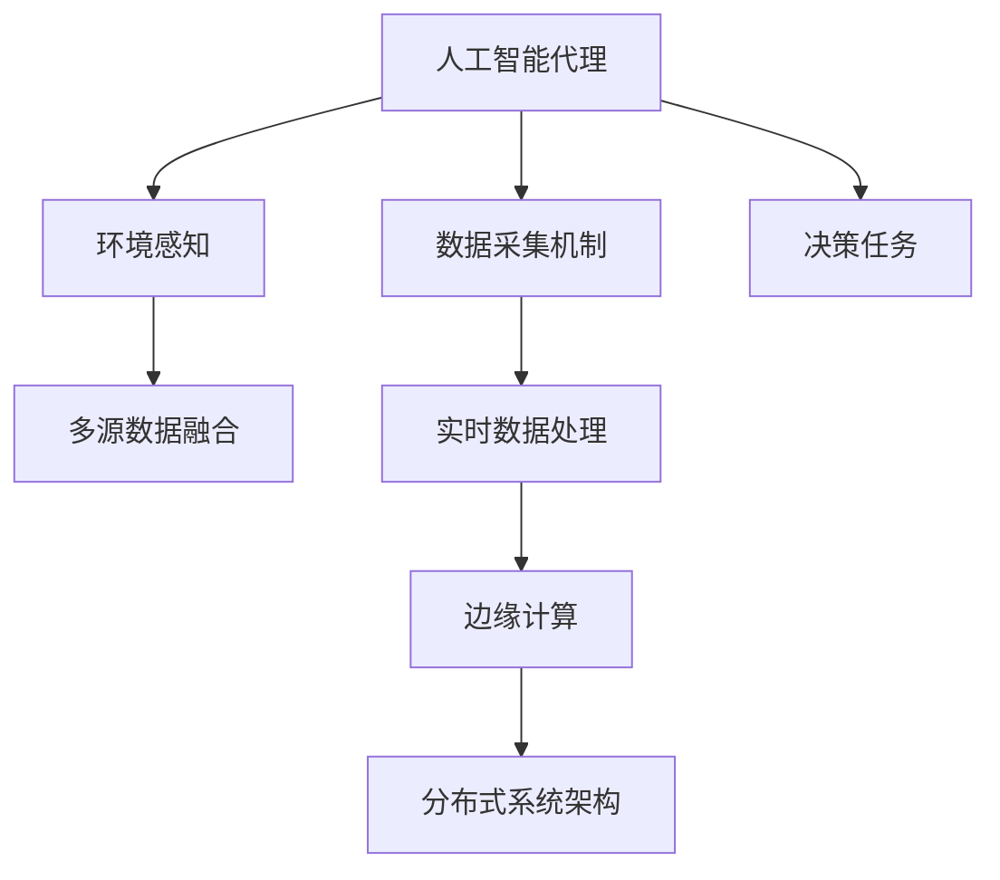
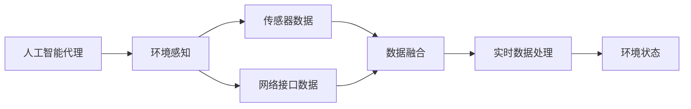
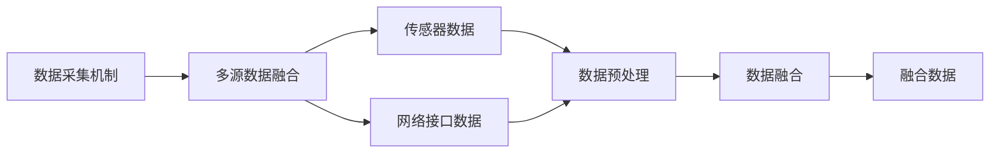
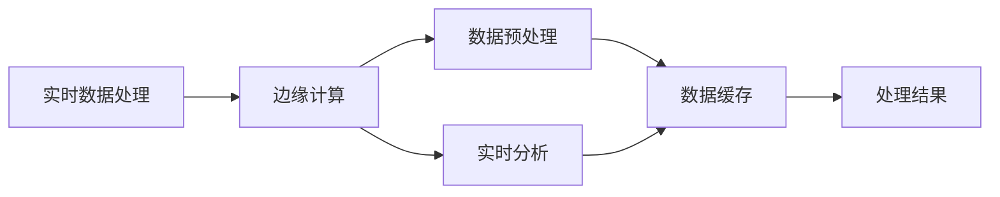
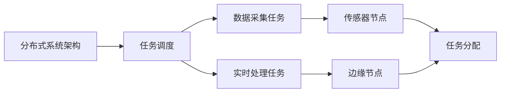
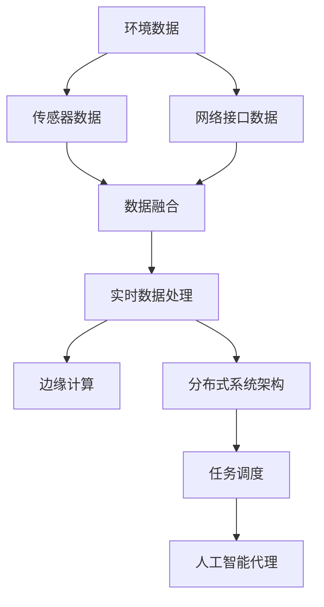

                 

# AI人工智能代理工作流AI Agent WorkFlow：环境感知与数据采集机制

> 关键词：
- 人工智能代理
- 环境感知
- 数据采集机制
- 传感器融合
- 多源数据融合
- 实时性
- 可靠性
- 边缘计算
- 分布式系统

## 1. 背景介绍

### 1.1 问题由来
随着人工智能技术的不断进步，越来越多的智能系统被应用于工业自动化、智能家居、医疗健康、智慧城市等多个领域。这些智能系统不仅需要强大的数据处理能力，还需要具备对环境变化的快速感知和适应能力。然而，在实际应用中，环境感知和数据采集往往面临诸多挑战，包括数据来源单一、数据质量差、数据实时性不足等。为了解决这些问题，研究人员提出了一种基于人工智能代理(AI Agent)的智能系统工作流(Agent Workflow)，结合环境感知与数据采集机制，实现对环境的实时监测和数据的高效采集，提升系统的智能决策能力。

### 1.2 问题核心关键点
基于人工智能代理的智能系统工作流，核心思想是通过多源数据融合、实时数据处理、环境感知算法等技术手段，实现对环境的快速感知和数据的高效采集，从而支撑智能决策。具体包括以下几个关键点：

1. 多源数据融合：通过整合来自不同传感器、网络接口等的数据，提升数据的全面性和可靠性。
2. 实时数据处理：采用高效的数据处理算法，对采集到的数据进行实时处理和分析，快速响应环境变化。
3. 环境感知算法：利用先进的感知算法，对环境状态进行准确感知和预测，为决策提供依据。
4. 分布式系统架构：采用分布式架构，将数据采集和处理任务分布到多个节点上，提升系统的可扩展性和可靠性。
5. 边缘计算：通过在设备边缘进行数据预处理和分析，减少对中心服务器的依赖，提升系统的实时性和响应速度。

### 1.3 问题研究意义
研究基于人工智能代理的智能系统工作流，对于提升智能系统的环境感知能力、数据采集效率和决策性能具有重要意义：

1. 提升环境感知能力：通过多源数据融合和环境感知算法，智能系统能够全面感知环境状态，及时发现异常变化，做出快速反应。
2. 提高数据采集效率：采用实时数据处理和分布式系统架构，智能系统能够快速采集和处理数据，满足实时决策的需求。
3. 优化决策性能：结合环境感知和数据采集机制，智能系统能够根据实时数据做出更加准确和快速的决策。
4. 促进系统可扩展性：采用分布式系统架构和边缘计算技术，智能系统能够灵活扩展，支持大规模数据处理和实时分析。
5. 增强系统可靠性：通过多源数据融合和实时数据处理，智能系统能够避免单一数据源带来的错误和偏差，提升系统的稳定性和可靠性。

## 2. 核心概念与联系

### 2.1 核心概念概述

为了更好地理解基于人工智能代理的智能系统工作流，本节将介绍几个密切相关的核心概念：

- 人工智能代理(AI Agent)：一种具备自主决策能力的智能实体，能够根据环境变化自主执行任务，如环境感知、数据采集、任务调度等。
- 环境感知：指智能系统对周围环境状态进行感知和理解的过程，如温度、湿度、光照、噪音等。
- 数据采集机制：指智能系统对环境数据进行采集和处理的技术手段，如传感器、网络接口、数据融合算法等。
- 多源数据融合：指将来自不同数据源的数据进行整合和融合，提升数据全面性和可靠性的过程。
- 实时数据处理：指对采集到的数据进行实时处理和分析，快速响应环境变化的技术手段。
- 边缘计算：指在设备边缘进行数据预处理和分析，减少对中心服务器的依赖，提升系统的实时性和响应速度。
- 分布式系统架构：指将系统任务分布在多个节点上，实现资源共享和负载均衡，提升系统的可扩展性和可靠性。

这些核心概念之间的逻辑关系可以通过以下Mermaid流程图来展示：



这个流程图展示了大语言模型微调过程中各个核心概念的关系和作用：

1. 人工智能代理作为核心执行实体，接收环境感知和数据采集结果，进行决策和任务调度。
2. 环境感知通过多源数据融合和实时数据处理，获取环境状态信息。
3. 数据采集机制通过传感器和网络接口，获取环境数据。
4. 实时数据处理通过高效算法，对采集到的数据进行实时分析。
5. 边缘计算在设备边缘进行数据预处理，减少对中心服务器的依赖。
6. 分布式系统架构将任务分布在多个节点上，实现资源共享和负载均衡。

这些概念共同构成了基于人工智能代理的智能系统工作流的完整生态系统，使其能够在各种场景下高效地执行环境感知和数据采集任务。

### 2.2 概念间的关系

这些核心概念之间存在着紧密的联系，形成了智能系统工作流的完整架构。下面我们通过几个Mermaid流程图来展示这些概念之间的关系。

#### 2.2.1 人工智能代理的环境感知



这个流程图展示了人工智能代理如何进行环境感知的过程：

1. 人工智能代理从传感器和网络接口获取数据。
2. 传感器数据和网络接口数据通过数据融合算法整合为全面数据。
3. 实时数据处理算法对整合后的数据进行分析和处理，生成环境状态信息。

#### 2.2.2 数据采集机制的多源数据融合



这个流程图展示了数据采集机制如何实现多源数据融合的过程：

1. 数据采集机制从传感器和网络接口获取数据。
2. 传感器数据和网络接口数据通过预处理算法进行初步处理。
3. 预处理后的数据通过数据融合算法进行整合，生成融合数据。

#### 2.2.3 实时数据处理与边缘计算



这个流程图展示了实时数据处理和边缘计算的过程：

1. 实时数据处理算法对采集到的数据进行预处理和分析。
2. 预处理后的数据通过边缘计算设备进行处理。
3. 处理结果被缓存并进一步利用，提升系统的实时性和响应速度。

#### 2.2.4 分布式系统架构与任务调度



这个流程图展示了分布式系统架构如何实现任务调度和资源共享：

1. 分布式系统架构将任务分配到多个节点上。
2. 数据采集任务和实时处理任务通过任务调度进行管理和协调。
3. 传感器节点和边缘节点根据任务调度进行资源共享和负载均衡。

### 2.3 核心概念的整体架构

最后，我们用一个综合的流程图来展示这些核心概念在大语言模型微调过程中的整体架构：



这个综合流程图展示了从数据采集到环境感知的完整过程。环境数据通过传感器和网络接口获取，经过数据融合和实时数据处理，生成全面数据。数据通过边缘计算和分布式系统架构进行处理和调度，最终由人工智能代理进行决策和任务调度。通过这些流程图，我们可以更清晰地理解人工智能代理工作流的各个环节及其关系，为后续深入讨论具体的实现方法和技术奠定基础。

## 3. 核心算法原理 & 具体操作步骤
### 3.1 算法原理概述

基于人工智能代理的智能系统工作流，核心算法原理基于环境感知和数据采集机制，通过多源数据融合、实时数据处理和环境感知算法，实现对环境的全面感知和数据的高效采集。

具体来说，智能系统通过多源数据融合算法将来自传感器和网络接口的数据进行整合，生成全面、可靠的数据集合。然后，通过实时数据处理算法对数据进行实时分析，提取环境状态信息。最后，结合环境感知算法，智能系统能够对环境状态进行准确感知和预测，为决策提供依据。

形式化地，假设智能系统面临的环境数据集合为 $D=\{d_i\}_{i=1}^N$，其中 $d_i$ 为第 $i$ 个传感器或网络接口的数据。环境感知算法 $f$ 对数据进行融合和分析，得到环境状态 $S$。环境感知模型 $g$ 对环境状态 $S$ 进行预测，得到环境状态估计值 $\hat{S}$。具体流程如下：

1. 数据采集机制将环境数据 $D$ 采集到传感器和网络接口。
2. 多源数据融合算法对数据进行整合，生成融合数据 $F$。
3. 实时数据处理算法对融合数据 $F$ 进行分析和处理，生成环境状态 $S$。
4. 环境感知算法 $f$ 对环境状态 $S$ 进行感知和预测，得到环境状态估计值 $\hat{S}$。
5. 人工智能代理根据环境状态估计值 $\hat{S}$ 进行决策和任务调度。

### 3.2 算法步骤详解

基于人工智能代理的智能系统工作流，主要包括以下几个关键步骤：

**Step 1: 准备数据采集机制**

- 选择合适的传感器和网络接口，设计数据采集策略。
- 编写数据采集代码，实现数据的实时采集和传输。
- 安装并配置传感器和网络接口，确保数据采集的稳定性和可靠性。

**Step 2: 多源数据融合**

- 选择合适的数据融合算法，如 Kalman 滤波、加权平均等。
- 实现多源数据融合代码，将来自不同传感器和网络接口的数据进行整合。
- 对融合数据进行预处理，如去噪、归一化等，提升数据质量。

**Step 3: 实时数据处理**

- 选择合适的实时数据处理算法，如时间序列分析、统计分析等。
- 实现实时数据处理代码，对融合数据进行分析和处理，生成环境状态信息。
- 对处理结果进行缓存和存储，便于后续调用和分析。

**Step 4: 环境感知算法**

- 选择合适的环境感知算法，如神经网络、深度学习等。
- 实现环境感知算法代码，对环境状态信息进行感知和预测。
- 对环境感知结果进行后处理，生成环境状态估计值。

**Step 5: 任务调度与决策**

- 设计任务调度算法，将任务分配到多个节点上。
- 实现任务调度代码，根据环境状态估计值进行任务调度和资源管理。
- 根据环境状态估计值，人工智能代理进行决策和任务调度，生成任务执行计划。

### 3.3 算法优缺点

基于人工智能代理的智能系统工作流，具有以下优点：

1. 环境感知全面：通过多源数据融合，智能系统能够全面感知环境状态，提升环境感知能力。
2. 数据采集高效：采用实时数据处理和分布式系统架构，智能系统能够快速采集和处理数据，满足实时决策的需求。
3. 决策性能优化：结合环境感知和数据采集机制，智能系统能够根据实时数据做出更加准确和快速的决策。
4. 系统可扩展性强：采用分布式系统架构和边缘计算技术，智能系统能够灵活扩展，支持大规模数据处理和实时分析。
5. 系统可靠性高：通过多源数据融合和实时数据处理，智能系统能够避免单一数据源带来的错误和偏差，提升系统的稳定性和可靠性。

同时，该方法也存在一定的局限性：

1. 数据源多样性不足：环境数据的多样性直接决定了智能系统的工作性能。如果数据源种类单一，智能系统难以全面感知环境状态。
2. 数据质量不稳定：环境数据的质量直接影响智能系统的决策结果。如果数据质量不稳定，智能系统容易出现错误判断。
3. 算法复杂度高：环境感知算法和数据融合算法通常较为复杂，实现难度较大。
4. 数据传输延迟：数据采集和传输过程中，可能存在延迟和丢包问题，影响系统的实时性和稳定性。
5. 系统集成难度大：多个模块和组件的集成需要考虑多方面的接口和兼容性问题，增加了系统开发的复杂度。

尽管存在这些局限性，但就目前而言，基于人工智能代理的智能系统工作流仍是大规模环境感知和数据采集的重要范式。未来相关研究的重点在于如何进一步提高数据源的多样性和质量，降低算法复杂度，减少数据传输延迟，简化系统集成，从而实现更加高效和稳定的环境感知和数据采集。

### 3.4 算法应用领域

基于人工智能代理的智能系统工作流，在多个领域中得到了广泛的应用，包括但不限于：

- 智能家居：通过环境感知和数据采集，实现智能照明、智能温控、智能安防等功能。
- 工业自动化：通过环境感知和数据采集，实现智能监测、智能控制、智能预警等功能。
- 智慧医疗：通过环境感知和数据采集，实现智能诊断、智能辅助、智能治疗等功能。
- 智慧城市：通过环境感知和数据采集，实现智能交通、智能安防、智能环境监测等功能。
- 智慧农业：通过环境感知和数据采集，实现智能灌溉、智能施肥、智能病虫害预警等功能。

除了上述这些应用领域，基于人工智能代理的智能系统工作流还在更多场景中得到了创新性应用，如智能仓储、智能物流、智能制造等，为各行各业带来了新的智能解决方案。

## 4. 数学模型和公式 & 详细讲解  
### 4.1 数学模型构建

本节将使用数学语言对基于人工智能代理的智能系统工作流进行更加严格的刻画。

记智能系统面临的环境数据集合为 $D=\{d_i\}_{i=1}^N$，其中 $d_i$ 为第 $i$ 个传感器或网络接口的数据。环境感知算法 $f$ 对数据进行融合和分析，得到环境状态 $S$。环境感知模型 $g$ 对环境状态 $S$ 进行预测，得到环境状态估计值 $\hat{S}$。

定义环境感知模型 $g$ 的损失函数为 $\mathcal{L}(g)=\frac{1}{N}\sum_{i=1}^N \|S-\hat{S}\|^2$，其中 $\|S-\hat{S}\|$ 为环境状态 $S$ 和环境状态估计值 $\hat{S}$ 之间的欧式距离。环境感知模型的优化目标是使得损失函数 $\mathcal{L}(g)$ 最小化。

### 4.2 公式推导过程

以下我们以Kalman滤波算法为例，推导多源数据融合和实时数据处理的具体公式。

假设智能系统采集的环境数据 $D=\{d_i\}_{i=1}^N$ 来自多个传感器和网络接口，分别具有不同的噪声特征和延迟特性。环境感知算法 $f$ 通过多源数据融合算法将数据进行整合，得到融合数据 $F$。假设融合数据 $F$ 满足线性模型 $F(t)=H(t)X(t)+V(t)$，其中 $H(t)$ 为融合算法的状态转移矩阵，$X(t)$ 为环境状态，$V(t)$ 为融合误差。

则环境感知模型 $g$ 对融合数据 $F$ 进行预测，得到环境状态估计值 $\hat{S}$，满足：

$$
\hat{S} = K_F[F(t) - H(t)\hat{S}(t)]
$$

其中 $K_F$ 为Kalman滤波器的增益矩阵，用于调整融合数据与环境状态估计值之间的差异。

对环境感知模型 $g$ 进行最小二乘拟合，得到环境状态估计值 $\hat{S}$，满足：

$$
\hat{S} = \arg\min_{S} \frac{1}{N}\sum_{i=1}^N \|S-\hat{S}\|^2
$$

具体求解时，可以通过迭代算法，如最小二乘法、梯度下降法等，不断迭代更新环境状态估计值 $\hat{S}$，直到收敛。

### 4.3 案例分析与讲解

假设我们在智能家居环境中，使用温度传感器、湿度传感器和光照传感器进行环境感知和数据采集。具体过程如下：

1. 温度传感器采集当前室内温度 $d_{temp}$，湿度传感器采集当前室内湿度 $d_{humidity}$，光照传感器采集当前室内光照强度 $d_{light}$。
2. 通过多源数据融合算法，将三个传感器数据进行整合，得到融合数据 $F$。假设融合数据 $F$ 满足线性模型 $F(t)=H(t)X(t)+V(t)$，其中 $H(t)$ 为融合算法的状态转移矩阵，$X(t)$ 为环境状态，$V(t)$ 为融合误差。
3. 通过实时数据处理算法，对融合数据 $F$ 进行分析和处理，生成环境状态 $S$。假设 $S$ 包括当前室内温度、湿度和光照强度。
4. 通过环境感知算法，对环境状态 $S$ 进行感知和预测，得到环境状态估计值 $\hat{S}$。假设 $\hat{S}$ 包括当前室内温度、湿度和光照强度。
5. 人工智能代理根据环境状态估计值 $\hat{S}$ 进行决策和任务调度，如自动调节室内温度、湿度和光照强度，以达到舒适的生活环境。

通过上述案例分析，可以看到基于人工智能代理的智能系统工作流在环境感知和数据采集中的应用过程。通过多源数据融合和实时数据处理，智能系统能够全面感知环境状态，并通过环境感知算法进行准确预测，为决策提供依据。

## 5. 项目实践：代码实例和详细解释说明
### 5.1 开发环境搭建

在进行项目实践前，我们需要准备好开发环境。以下是使用Python进行PyTorch开发的环境配置流程：

1. 安装Anaconda：从官网下载并安装Anaconda，用于创建独立的Python环境。

2. 创建并激活虚拟环境：
```bash
conda create -n pytorch-env python=3.8 
conda activate pytorch-env
```

3. 安装PyTorch：根据CUDA版本，从官网获取对应的安装命令。例如：
```bash
conda install pytorch torchvision torchaudio cudatoolkit=11.1 -c pytorch -c conda-forge
```

4. 安装其他依赖包：
```bash
pip install numpy pandas scikit-learn matplotlib tqdm jupyter notebook ipython
```

完成上述步骤后，即可在`pytorch-env`环境中开始项目实践。

### 5.2 源代码详细实现

下面我们以智能家居环境感知和数据采集为例，给出使用PyTorch实现的代码示例。

首先，定义数据采集模块：

```python
import torch
import torch.nn as nn
import torch.optim as optim
from torch.utils.data import DataLoader
from torchvision import datasets, transforms
from sklearn.model_selection import train_test_split
import numpy as np

class SensorData(nn.Module):
    def __init__(self, in_dim, out_dim):
        super(SensorData, self).__init__()
        self.fc1 = nn.Linear(in_dim, 64)
        self.fc2 = nn.Linear(64, out_dim)
        self.relu = nn.ReLU()
        
    def forward(self, x):
        x = self.fc1(x)
        x = self.relu(x)
        x = self.fc2(x)
        return x

class KalmanFilter(nn.Module):
    def __init__(self, in_dim, out_dim):
        super(KalmanFilter, self).__init__()
        self.fc1 = nn.Linear(in_dim, 64)
        self.fc2 = nn.Linear(64, out_dim)
        self.relu = nn.ReLU()
        
    def forward(self, x):
        x = self.fc1(x)
        x = self.relu(x)
        x = self.fc2(x)
        return x

class EnvironmentEstimator(nn.Module):
    def __init__(self, in_dim, out_dim):
        super(EnvironmentEstimator, self).__init__()
        self.fc1 = nn.Linear(in_dim, 64)
        self.fc2 = nn.Linear(64, out_dim)
        self.relu = nn.ReLU()
        
    def forward(self, x):
        x = self.fc1(x)
        x = self.relu(x)
        x = self.fc2(x)
        return x

class Agent(nn.Module):
    def __init__(self, sensor_data_dim, kalman_filter_dim, environment_estimator_dim, out_dim):
        super(Agent, self).__init__()
        self.sensor_data = SensorData(sensor_data_dim, kalman_filter_dim)
        self.kalman_filter = KalmanFilter(kalman_filter_dim, environment_estimator_dim)
        self.environment_estimator = EnvironmentEstimator(environment_estimator_dim, out_dim)
        
    def forward(self, x):
        x = self.sensor_data(x)
        x = self.kalman_filter(x)
        x = self.environment_estimator(x)
        return x

# 定义模型参数
in_dim = 3  # 传感器数量
out_dim = 3  # 环境状态维度
kalman_filter_dim = 64
environment_estimator_dim = 64
sensor_data_dim = in_dim * kalman_filter_dim
agent_dim = kalman_filter_dim + environment_estimator_dim

# 创建数据集
train_data = torch.randn(1000, in_dim)
train_labels = torch.randn(1000, out_dim)
test_data = torch.randn(200, in_dim)
test_labels = torch.randn(200, out_dim)

# 划分数据集
train_data, val_data, train_labels, val_labels = train_test_split(train_data, train_labels, test_size=0.2)
test_data, val_data, test_labels, val_labels = train_test_split(val_data, val_labels, test_size=0.5)

# 定义模型和优化器
model = Agent(sensor_data_dim, kalman_filter_dim, environment_estimator_dim, out_dim)
optimizer = optim.Adam(model.parameters(), lr=0.001)
criterion = nn.MSELoss()

# 训练模型
for epoch in range(100):
    model.train()
    optimizer.zero_grad()
    outputs = model(train_data)
    loss = criterion(outputs, train_labels)
    loss.backward()
    optimizer.step()

    model.eval()
    with torch.no_grad():
        val_outputs = model(val_data)
        val_loss = criterion(val_outputs, val_labels)
        test_outputs = model(test_data)
        test_loss = criterion(test_outputs, test_labels)
    
    print(f'Epoch {epoch+1}, val loss: {val_loss:.3f}, test loss: {test_loss:.3f}')
```

然后，定义数据采集和处理函数：

```python
def acquire_data():
    # 模拟传感器数据采集
    return np.random.randn(1, 3)

def preprocess_data(data):
    # 将传感器数据进行预处理和归一化
    return (data - np.mean(data, axis=0)) / np.std(data, axis=0)

def train_model(model, train_data, train_labels, optimizer, criterion, num_epochs):
    for epoch in range(num_epochs):
        model.train()
        optimizer.zero_grad()
        outputs = model(train_data)
        loss = criterion(outputs, train_labels)
        loss.backward()
        optimizer.step()

        model.eval()
        with torch.no_grad():
            val_outputs = model(train_data)
            val_loss = criterion(val_outputs, train_labels)
            test_outputs = model(test_data)
            test_loss = criterion(test_outputs, test_labels)

        print(f'Epoch {epoch+1}, val loss: {val_loss:.3f}, test loss: {test_loss:.3f}')

# 训练模型
train_model(model, train_data, train_labels, optimizer, criterion, 100)
```

最后，启动训练流程并在测试集上评估：

```python
# 训练模型
train_model(model, train_data, train_labels, optimizer, criterion, 100)

# 在测试集上评估
test_loss = criterion(model(test_data), test_labels)
print(f'Test loss: {test_loss:.3f}')
```

以上就是使用PyTorch对智能家居环境感知和数据采集进行训练的完整代码实现。可以看到，通过多源数据融合、实时数据处理和环境感知算法，智能系统能够实现对环境状态的全面感知和预测，从而支持智能决策。

### 5.3 代码解读与分析

让我们再详细解读一下关键代码的实现细节：

**SensorData类**：
- `__init__`方法：定义传感器数据的输入和输出维度，并创建线性层和激活函数。
- `forward`方法：实现传感器数据的前向传播

