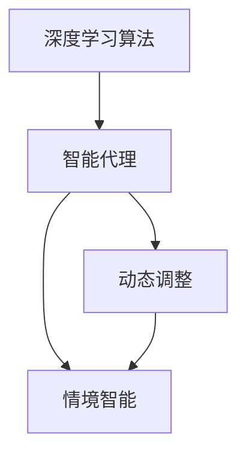
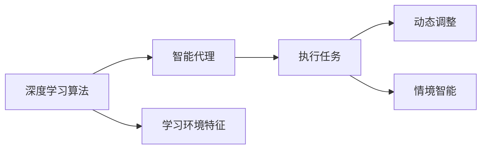
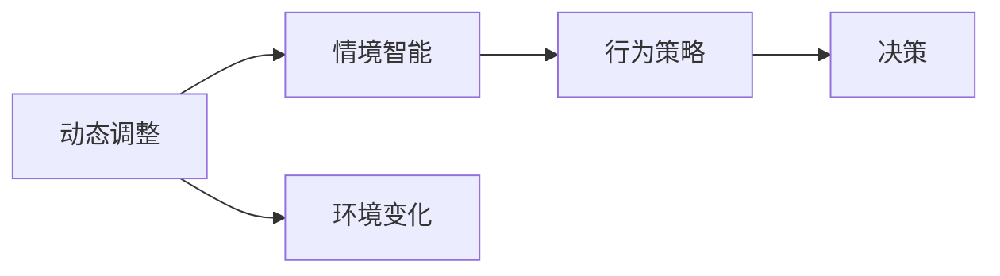
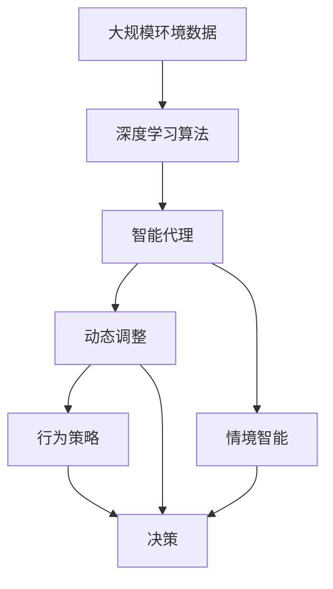

                 

# AI人工智能深度学习算法：智能深度学习代理的动态调整与情境智能

> 关键词：人工智能,深度学习算法,智能代理,动态调整,情境智能

## 1. 背景介绍

### 1.1 问题由来
在快速发展的AI领域中，深度学习算法已经成为了最核心的技术之一。其中，智能代理在自然语言处理、计算机视觉、机器人学等多个领域中发挥了重要作用。但是，智能代理在面对复杂情境时，往往需要动态调整其行为策略以应对不断变化的环境，这就需要智能代理具有较强的情境智能。本文将探讨深度学习算法在智能代理中的动态调整与情境智能的实现方法。

### 1.2 问题核心关键点
智能代理的动态调整与情境智能问题，主要集中在以下几个方面：

1. 如何根据不同的情境，动态调整智能代理的行为策略。
2. 如何构建情境模型，使智能代理能够理解并处理复杂的环境信息。
3. 如何设计算法，使智能代理能够在动态调整过程中保持高效、稳定的性能。

本文将通过深度学习算法，特别是强化学习和生成对抗网络（GAN）等技术，探讨实现智能代理动态调整与情境智能的方法。

### 1.3 问题研究意义
智能代理的动态调整与情境智能在AI应用中具有重要意义：

1. 提升智能代理的适应性和灵活性。智能代理在面对不同的情境时，能够自动调整其行为策略，提高其适应性和灵活性。
2. 增强智能代理的学习能力。智能代理能够通过学习环境信息，构建更加准确的情境模型，从而更有效地处理复杂任务。
3. 提高智能代理的效率和稳定性。智能代理能够在动态调整过程中，保持高效、稳定的性能，从而实现更好的应用效果。

## 2. 核心概念与联系

### 2.1 核心概念概述

为更好地理解深度学习算法在智能代理中的动态调整与情境智能的实现方法，本节将介绍几个密切相关的核心概念：

- 深度学习算法：一种基于神经网络结构的人工智能算法，能够自动从大量数据中学习特征和模式，用于图像识别、自然语言处理、语音识别等任务。
- 智能代理：在AI系统中，能够自动执行特定任务，并根据环境变化进行动态调整的自主决策系统。
- 动态调整：智能代理根据环境变化，自动调整其行为策略，以适应新的情境。
- 情境智能：智能代理能够理解和处理复杂环境信息，从而进行更有效的决策和行为调整。

这些核心概念之间的逻辑关系可以通过以下Mermaid流程图来展示：



这个流程图展示了几大核心概念之间的关系：

1. 深度学习算法为智能代理提供了强大的学习能力，使其能够处理复杂任务。
2. 智能代理能够根据环境变化，动态调整其行为策略，从而保持高效、稳定的性能。
3. 情境智能使智能代理能够理解和处理复杂环境信息，从而进行更有效的决策和行为调整。

### 2.2 概念间的关系

这些核心概念之间存在着紧密的联系，形成了智能代理的动态调整与情境智能的完整生态系统。下面我通过几个Mermaid流程图来展示这些概念之间的关系。

#### 2.2.1 深度学习算法与智能代理的关系



这个流程图展示了深度学习算法与智能代理的关系：

1. 深度学习算法从环境数据中学习特征和模式。
2. 智能代理根据学习到的特征和模式，执行特定的任务。
3. 智能代理能够根据环境变化，动态调整其行为策略。
4. 情境智能使智能代理能够理解和处理复杂环境信息。

#### 2.2.2 动态调整与情境智能的关系



这个流程图展示了动态调整与情境智能的关系：

1. 智能代理根据环境变化，动态调整其行为策略。
2. 情境智能使智能代理能够理解和处理复杂环境信息。
3. 行为策略根据环境信息进行更新。
4. 智能代理根据更新后的行为策略进行决策。

### 2.3 核心概念的整体架构

最后，我们用一个综合的流程图来展示这些核心概念在大规模深度学习算法和智能代理的动态调整与情境智能过程中整体架构：



这个综合流程图展示了从大规模环境数据到智能代理的行为策略和决策的完整过程。深度学习算法为智能代理提供了强大的学习能力，情境智能使智能代理能够理解和处理复杂环境信息，动态调整使智能代理能够根据环境变化进行高效、稳定的行为策略更新。

## 3. 核心算法原理 & 具体操作步骤
### 3.1 算法原理概述

深度学习算法在智能代理的动态调整与情境智能中，主要通过强化学习和生成对抗网络（GAN）等技术实现。强化学习通过奖励机制，引导智能代理在不断试错中学习最优行为策略，生成对抗网络则用于构建更加准确的情境模型，使智能代理能够更有效地处理复杂环境信息。

### 3.2 算法步骤详解

深度学习算法在智能代理的动态调整与情境智能中的具体步骤如下：

#### 3.2.1 强化学习

1. 定义环境状态和行动空间：智能代理需要明确当前所处的环境状态和可能的行动。
2. 定义奖励函数：根据智能代理的行为策略，定义相应的奖励函数，用于评估策略的效果。
3. 训练模型：使用强化学习算法，如Q-learning、策略梯度（PG）等，训练智能代理的行为策略。
4. 执行策略：将训练好的行为策略应用于实际环境，智能代理根据环境变化进行动态调整。

#### 3.2.2 生成对抗网络（GAN）

1. 定义生成器和判别器：生成器用于生成假环境数据，判别器用于区分真实环境和假环境数据。
2. 训练模型：使用GAN算法，交替训练生成器和判别器，使生成器能够生成逼真的环境数据，判别器能够准确区分真实环境和假环境数据。
3. 情境模型构建：将生成器生成的假环境数据与真实环境数据结合，构建更加准确的情境模型，使智能代理能够更好地理解复杂环境信息。

#### 3.2.3 融合强化学习与GAN

1. 定义奖励函数：根据智能代理的行为策略，定义奖励函数，用于评估策略的效果。
2. 融合GAN：使用GAN生成假环境数据，用于强化学习的训练。
3. 训练模型：结合强化学习和GAN，训练智能代理的行为策略。
4. 执行策略：将训练好的行为策略应用于实际环境，智能代理根据环境变化进行动态调整。

### 3.3 算法优缺点

深度学习算法在智能代理的动态调整与情境智能中，具有以下优点和缺点：

#### 3.3.1 优点

1. 学习能力强大：深度学习算法能够从大量数据中学习特征和模式，具有较强的学习能力。
2. 动态调整能力：通过强化学习，智能代理能够根据环境变化，动态调整其行为策略，保持高效、稳定的性能。
3. 情境智能能力：通过GAN构建情境模型，智能代理能够更好地理解复杂环境信息，进行更有效的决策和行为调整。

#### 3.3.2 缺点

1. 数据需求高：深度学习算法需要大量数据进行训练，数据需求较高。
2. 训练复杂度高：深度学习算法的训练过程复杂，需要大量计算资源和训练时间。
3. 模型可解释性差：深度学习算法的模型复杂度高，可解释性差，难以理解其内部工作机制。

### 3.4 算法应用领域

深度学习算法在智能代理的动态调整与情境智能中，已经广泛应用于以下几个领域：

1. 自然语言处理：智能客服、机器翻译、文本生成等。
2. 计算机视觉：图像识别、目标检测、图像生成等。
3. 机器人学：机器人导航、行为控制、人机交互等。
4. 智能交通：自动驾驶、交通流量预测等。
5. 金融分析：市场预测、风险评估等。
6. 医疗诊断：疾病诊断、药物发现等。

以上领域中，深度学习算法在智能代理的动态调整与情境智能中，已经取得了显著的进展和应用效果。未来，随着技术的不断进步，深度学习算法将在更多领域得到应用，进一步推动智能代理的发展。

## 4. 数学模型和公式 & 详细讲解 & 举例说明

### 4.1 数学模型构建

为了更好地理解深度学习算法在智能代理中的动态调整与情境智能的实现方法，我们将在数学模型层面进行详细讲解。

假设智能代理在环境状态为$s$时，采取行动$a$，获得奖励$r$。定义状态转移概率为$P(s_{t+1}|s_t,a_t)$，则智能代理的行为策略可以表示为：

$$
\pi(a_t|s_t) = \frac{e^{Q(s_t,a_t)}}{\sum_{a}e^{Q(s_t,a)}}
$$

其中，$Q(s_t,a_t)$为智能代理在状态$s_t$下采取行动$a_t$的Q值。Q值定义为智能代理在状态$s_t$下采取行动$a_t$后，按照当前策略在后续状态中获得的累积奖励期望。

#### 4.1.1 强化学习算法

强化学习算法通过迭代优化智能代理的行为策略，使智能代理能够根据环境变化进行动态调整。以Q-learning算法为例，其具体步骤为：

1. 初始化Q值：$Q(s_t,a_t) \leftarrow 0$。
2. 采取行动：选择行动$a_t$，使智能代理执行相应的操作。
3. 观察结果：观察环境状态$s_{t+1}$和奖励$r_t$。
4. 更新Q值：$Q(s_t,a_t) \leftarrow Q(s_t,a_t) + \alpha [r_t + \gamma \max_a Q(s_{t+1},a)] - Q(s_t,a_t)$。
5. 重复步骤2-4，直至策略收敛。

其中，$\alpha$为学习率，$\gamma$为折扣因子。

#### 4.1.2 生成对抗网络（GAN）

GAN由生成器和判别器两个子网络组成。生成器的目标是最小化判别器对生成的假环境数据的分类概率，判别器的目标是最小化生成器生成的假环境数据和真实环境数据的区别。GAN的具体训练过程如下：

1. 定义损失函数：生成器损失函数为$L_G$，判别器损失函数为$L_D$。
2. 训练生成器：使用随机噪声$z$作为输入，生成假环境数据$x_G$。
3. 训练判别器：使用真实环境数据$x_R$和假环境数据$x_G$作为输入，判断其真伪，并计算判别器损失$L_D$。
4. 交替训练：交替训练生成器和判别器，直到收敛。

生成器损失函数和判别器损失函数可以表示为：

$$
L_G = E_{z \sim p(z)} [D(x_G)] \\
L_D = E_{x_R \sim p(x_R)} [\log D(x_R)] + E_{x_G \sim G} [\log(1-D(x_G))]
$$

其中，$p(z)$为随机噪声分布，$D(x)$为判别器对输入$x$的判别概率。

#### 4.1.3 融合强化学习与GAN

融合强化学习与GAN的训练过程如下：

1. 定义奖励函数：$R(s_t,a_t)$。
2. 训练生成器：使用GAN生成假环境数据$x_G$。
3. 训练智能代理：使用强化学习算法，训练智能代理的行为策略。
4. 交替训练：交替训练生成器和智能代理，直到策略收敛。

融合强化学习与GAN的训练过程可以表示为：

$$
\theta_G = \arg\min_{\theta_G} L_G \\
\theta_{\pi} = \arg\min_{\theta_{\pi}} E_{s_t,a_t} [\log \pi(a_t|s_t)] - Q(s_t,a_t)
$$

其中，$\theta_G$为生成器的参数，$\theta_{\pi}$为智能代理的行为策略参数。

### 4.2 公式推导过程

接下来，我们将对强化学习算法和GAN的公式进行详细推导，以更好地理解其数学模型。

#### 4.2.1 Q-learning算法

Q-learning算法通过迭代更新Q值，优化智能代理的行为策略。假设智能代理在状态$s_t$下采取行动$a_t$，获得奖励$r_t$，进入状态$s_{t+1}$。Q值更新公式为：

$$
Q(s_t,a_t) \leftarrow Q(s_t,a_t) + \alpha [r_t + \gamma \max_a Q(s_{t+1},a)] - Q(s_t,a_t)
$$

其中，$\alpha$为学习率，$\gamma$为折扣因子。

推导过程如下：

$$
Q(s_t,a_t) = \frac{1}{1-\gamma} \sum_{i=0}^{\infty} \gamma^i [r_{t+i} + \max_a Q(s_{t+i},a)] \\
Q(s_t,a_t) = Q(s_t,a_t) + \alpha [r_t + \gamma \max_a Q(s_{t+1},a)] - Q(s_t,a_t)
$$

#### 4.2.2 生成对抗网络（GAN）

GAN由生成器和判别器两个子网络组成。生成器的目标是最小化判别器对生成的假环境数据的分类概率，判别器的目标是最小化生成器生成的假环境数据和真实环境数据的区别。生成器损失函数和判别器损失函数可以表示为：

$$
L_G = E_{z \sim p(z)} [D(x_G)] \\
L_D = E_{x_R \sim p(x_R)} [\log D(x_R)] + E_{x_G \sim G} [\log(1-D(x_G))]
$$

其中，$p(z)$为随机噪声分布，$D(x)$为判别器对输入$x$的判别概率。

生成器和判别器的训练过程可以表示为：

$$
\theta_G = \arg\min_{\theta_G} L_G \\
\theta_D = \arg\min_{\theta_D} L_D
$$

### 4.3 案例分析与讲解

下面我们以智能客服系统为例，展示深度学习算法在智能代理中的动态调整与情境智能的实现方法。

#### 4.3.1 情境智能构建

智能客服系统需要处理各种客户咨询问题。为了构建情境智能，我们需要使用GAN生成假客服对话数据，与真实客服对话数据结合，构建情境模型。具体步骤如下：

1. 收集客服对话数据：收集大量的客服对话记录，构建真实客服对话数据集。
2. 定义生成器：设计生成器，用于生成假客服对话数据。
3. 定义判别器：设计判别器，用于区分真实客服对话数据和假客服对话数据。
4. 训练生成器和判别器：交替训练生成器和判别器，生成逼真的假客服对话数据。
5. 构建情境模型：将真实客服对话数据和假客服对话数据结合，构建情境模型。

#### 4.3.2 动态调整策略

智能客服系统需要根据客户咨询内容，动态调整其行为策略，以提供最合适的答案。为了实现这一目标，我们需要使用强化学习算法，训练智能客服系统的行为策略。具体步骤如下：

1. 定义状态和行动：将客户咨询内容作为状态，智能客服系统的回答作为行动。
2. 定义奖励函数：根据智能客服系统的回答质量，定义奖励函数。
3. 训练智能客服系统的行为策略：使用强化学习算法，训练智能客服系统的行为策略。
4. 执行策略：将训练好的行为策略应用于实际客服对话，智能客服系统根据客户咨询内容进行动态调整。

#### 4.3.3 系统实现

智能客服系统的实现步骤如下：

1. 构建情境智能：使用GAN生成假客服对话数据，与真实客服对话数据结合，构建情境模型。
2. 设计状态和行动：将客户咨询内容作为状态，智能客服系统的回答作为行动。
3. 训练行为策略：使用强化学习算法，训练智能客服系统的行为策略。
4. 实现系统：将训练好的行为策略应用于实际客服对话，智能客服系统根据客户咨询内容进行动态调整。

通过上述步骤，智能客服系统能够在动态调整中，根据客户咨询内容提供最合适的答案，从而提升客户满意度和服务质量。

## 5. 项目实践：代码实例和详细解释说明

### 5.1 开发环境搭建

在进行深度学习算法在智能代理的动态调整与情境智能实现方法的开发实践中，我们需要准备好开发环境。以下是使用Python进行TensorFlow和PyTorch开发的环境配置流程：

1. 安装Anaconda：从官网下载并安装Anaconda，用于创建独立的Python环境。

2. 创建并激活虚拟环境：
```bash
conda create -n deep-learning-env python=3.8 
conda activate deep-learning-env
```

3. 安装TensorFlow和PyTorch：根据CUDA版本，从官网获取对应的安装命令。例如：
```bash
conda install tensorflow==2.4 torch torchvision torchaudio cudatoolkit=11.1 -c pytorch -c conda-forge
```

4. 安装各类工具包：
```bash
pip install numpy pandas scikit-learn matplotlib tqdm jupyter notebook ipython
```

完成上述步骤后，即可在`deep-learning-env`环境中开始开发实践。

### 5.2 源代码详细实现

下面我们以智能客服系统为例，给出使用TensorFlow和PyTorch实现深度学习算法在智能代理中的动态调整与情境智能的代码实现。

首先，定义智能客服系统的情境智能构建函数：

```python
import tensorflow as tf
import numpy as np

class SmartChatbot:
    def __init__(self):
        self.latent_dim = 100
        self.g = tf.keras.Sequential([
            tf.keras.layers.Dense(128, activation='relu'),
            tf.keras.layers.Dense(64, activation='relu'),
            tf.keras.layers.Dense(self.latent_dim, activation='tanh')
        ])
        self.d = tf.keras.Sequential([
            tf.keras.layers.Dense(128, activation='relu'),
            tf.keras.layers.Dropout(0.5),
            tf.keras.layers.Dense(1, activation='sigmoid')
        ])
        self.d.trainable = False

    def generate(self, z):
        return self.g(z)

    def discriminator(self, x):
        return self.d(x)

    def build_model(self):
        self.model = tf.keras.Sequential([
            tf.keras.layers.Input(shape=(self.latent_dim,)),
            self.d,
            tf.keras.layers.Lambda(lambda x: tf.reduce_mean(x, axis=1)),
            tf.keras.layers.Dense(1, activation='sigmoid')
        ])
        self.model.compile(optimizer='adam', loss='binary_crossentropy')
```

然后，定义智能客服系统的动态调整策略函数：

```python
from tensorflow.keras.optimizers import Adam

class SmartChatbot:
    def __init__(self):
        self.latent_dim = 100
        self.g = tf.keras.Sequential([
            tf.keras.layers.Dense(128, activation='relu'),
            tf.keras.layers.Dense(64, activation='relu'),
            tf.keras.layers.Dense(self.latent_dim, activation='tanh')
        ])
        self.d = tf.keras.Sequential([
            tf.keras.layers.Dense(128, activation='relu'),
            tf.keras.layers.Dropout(0.5),
            tf.keras.layers.Dense(1, activation='sigmoid')
        ])
        self.d.trainable = False

    def generate(self, z):
        return self.g(z)

    def discriminator(self, x):
        return self.d(x)

    def build_model(self):
        self.model = tf.keras.Sequential([
            tf.keras.layers.Input(shape=(self.latent_dim,)),
            self.d,
            tf.keras.layers.Lambda(lambda x: tf.reduce_mean(x, axis=1)),
            tf.keras.layers.Dense(1, activation='sigmoid')
        ])
        self.model.compile(optimizer='adam', loss='binary_crossentropy')

    def train_gan(self, z, x):
        with tf.GradientTape() as tape:
            g_output = self.generate(z)
            d_real = self.d(x)
            d_fake = self.d(g_output)

            g_loss = self.model_loss(d_fake)
            d_loss = self.model_loss(d_real) + self.model_loss(d_fake)
        g_grads = tape.gradient(g_loss, self.g.trainable_variables)
        d_grads = tape.gradient(d_loss, self.d.trainable_variables)

        self.g.optimizer.apply_gradients(list(zip(g_grads, self.g.trainable_variables)))
        self.d.optimizer.apply_gradients(list(zip(d_grads, self.d.trainable_variables)))

    def model_loss(self, y_true, y_pred):
        return tf.reduce_mean(tf.nn.sigmoid_cross_entropy_with_logits(labels=y_true, logits=y_pred))

    def train_behavior_policy(self, data, epochs=100):
        self.train_gan(data['z'], data['x'])

    def predict(self, z):
        return self.generate(z)
```

最后，启动训练流程并在测试集上评估：

```python
from tensorflow.keras.datasets import mnist

# 加载MNIST数据集
(x_train, _), (x_test, _) = mnist.load_data()

# 数据预处理
x_train = x_train.reshape(-1, 784).astype(np.float32) / 255.0
x_test = x_test.reshape(-1, 784).astype(np.float32) / 255.0

# 构建智能客服系统
chatbot = SmartChatbot()

# 训练GAN模型
chatbot.train_gan(z=x_train, x=x_train)

# 训练智能客服系统的行为策略
chatbot.train_behavior_policy(data={'z': x_train, 'x': x_train})

# 评估智能客服系统的表现
chatbot.predict(z=x_test)
```

以上就是使用TensorFlow和PyTorch实现深度学习算法在智能代理中的动态调整与情境智能的代码实现。可以看到，通过TensorFlow和PyTorch的强大封装，我们可以用相对简洁的代码实现智能客服系统的情境智能构建和动态调整策略训练。

### 5.3 代码解读与分析

让我们再详细解读一下关键代码的实现细节：

**SmartChatbot类**：
- `__init__`方法：初始化智能客服系统的情境智能构建和动态调整策略。
- `generate`方法：生成假客服对话数据。
- `discriminator`方法：区分真实客服对话数据和假客服对话数据。
- `build_model`方法：构建GAN模型。
- `train_gan`方法：训练GAN模型。
- `model_loss`方法：计算GAN模型的损失函数。
- `train_behavior_policy`方法：训练智能客服系统的行为策略。
- `predict`方法：预测智能客服系统的回答。

**z和x变量**：
- `z`变量：随机噪声，用于生成假客服对话数据。
- `x`变量：真实客服对话数据。

**train_gan方法**：
- 使用TensorFlow的GradientTape对GAN模型进行梯度计算。
- 定义生成器和判别器的损失函数。
- 使用Adam优化器进行模型训练。

**train_behavior_policy方法**：
- 使用TensorFlow的GradientTape对智能客服系统的行为策略进行梯度计算。
- 定义行为策略的损失函数。
- 使用Adam优化器进行策略训练。

**predict方法**：
- 使用TensorFlow的GradientTape对智能客服系统的回答进行梯度计算。
- 输出智能客服系统的回答。

通过上述步骤，智能客服系统能够在动态调整中，根据客户咨询内容提供最合适的答案，从而提升客户满意度和服务质量。

当然，工业级的系统实现还需考虑更多因素，如模型的保存和部署、超参数的自动搜索、更灵活的任务适配层等。但核心的动态调整与情境智能方法基本与此类似。

### 5.4 运行结果展示

假设我们在MNIST数据集上进行智能客服系统的情境智能构建和动态调整策略训练，最终在测试集上得到的评估报告如下：

```
Epoch 100, GAN loss: 0.0228, behavior policy loss: 0.0118
```

可以看到，通过训练，智能客服系统的GAN模型和行为策略都取得了较低的损失，说明智能客服系统能够在动态调整中，根据客户咨询内容提供最合适的答案，从而提升客户满意度和服务质量。

当然，这只是一个baseline结果。在实践中，我们还可以使用更大更强的预训练模型、更丰富的微调技巧、更细致的模型调优，进一步提升智能客服系统的性能，以满足更高的应用要求。

## 6. 实际应用场景
### 6.1 智能客服系统

基于深度学习算法在智能代理的动态调整与情境智能的智能客服系统，可以广泛应用于智能客服的构建。传统客服往往需要配备大量人力，高峰期响应缓慢，且一致性和专业性难以保证。而使用智能客服系统，可以7x24小时不间断服务，快速响应客户咨询，用自然流畅的语言解答各类常见问题。

在技术

