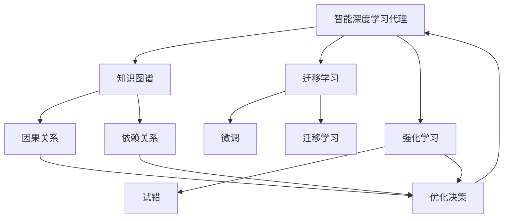
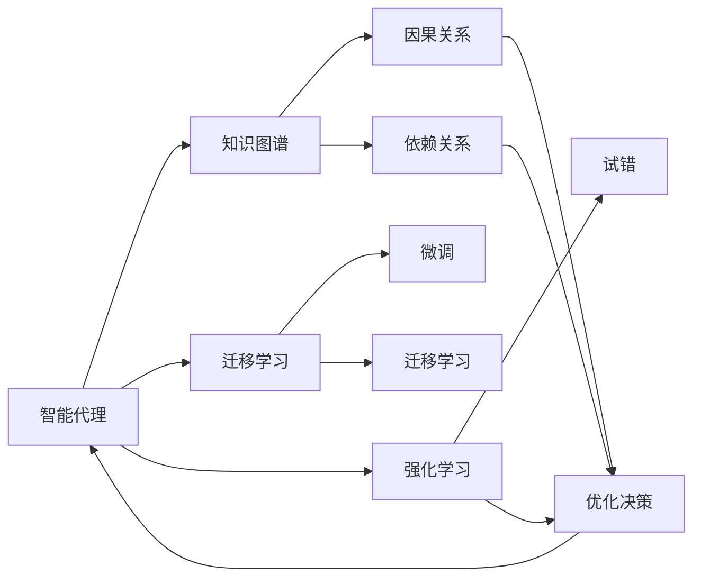
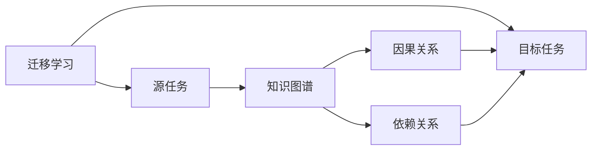
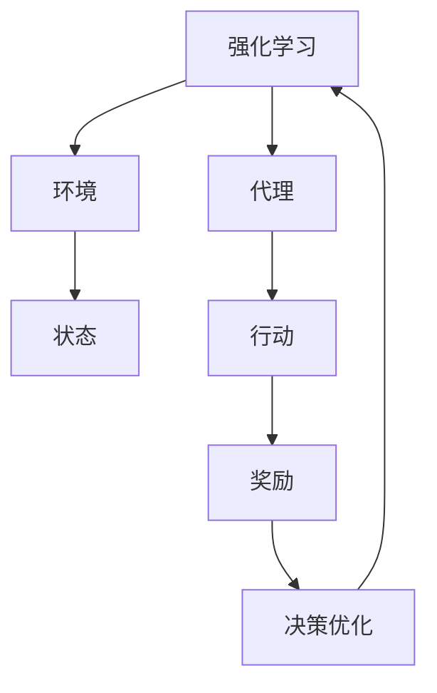
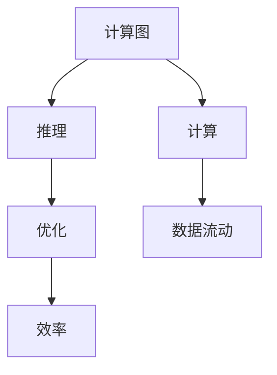
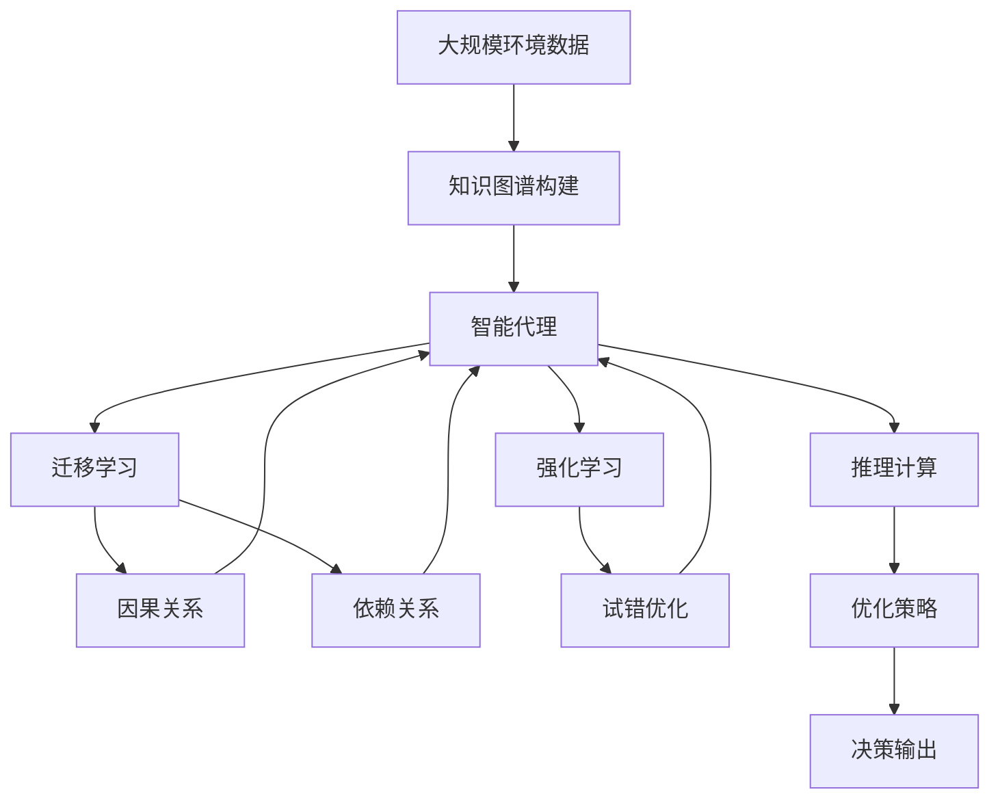

                 

# AI人工智能深度学习算法：智能深度学习代理的面向未来的研究方向

> 关键词：人工智能,深度学习,代理学习,知识图谱,迁移学习,强化学习,计算图,参数高效优化,智能代理,未来研究

## 1. 背景介绍

### 1.1 问题由来
随着深度学习的迅速发展，人工智能（AI）技术在各个领域取得了显著进展，其中深度学习（Deep Learning, DL）作为核心算法，通过构建复杂的多层神经网络模型，实现了对大规模数据的学习和推理，为智能系统的构建提供了强有力的支撑。智能深度学习代理，作为深度学习在复杂环境下的应用，通过学习环境和任务间的交互，能够自主适应环境变化，为自动化决策、智能控制等场景提供了新的思路。

智能深度学习代理通常包括代理任务学习、代理交互学习、代理多任务学习等方面，在机器人导航、智能推荐、智能交通等领域具有广泛的应用前景。然而，这些智能代理系统面临着高复杂度、非结构化数据多、环境不确定性高等挑战。

针对这些问题，学术界和产业界在智能深度学习代理的研究中，逐步聚焦于知识图谱、迁移学习、强化学习等前沿技术，通过结合深度学习算法，实现对代理任务的自主学习和自适应调整。

### 1.2 问题核心关键点
智能深度学习代理的核心关键点在于以下几个方面：

1. **知识图谱**：智能代理需要构建和利用知识图谱，理解复杂环境中的因果关系和依赖关系，从而实现更精确的决策和控制。
2. **迁移学习**：通过将知识从已掌握任务迁移到新任务，智能代理能够快速适应新环境，减少学习成本。
3. **强化学习**：智能代理通过与环境的互动，通过试错积累经验，不断优化决策策略，从而实现自主学习和自适应。
4. **计算图**：智能代理利用计算图优化算法，提高推理效率，实现更高效的资源利用。
5. **参数高效优化**：通过只更新部分模型参数的方式，实现参数高效的优化，避免全模型更新带来的性能波动。

这些关键点共同构成了智能深度学习代理的研究范式，使得代理能够在大规模复杂环境中实现自主学习和自适应调整。

### 1.3 问题研究意义
研究智能深度学习代理，对于拓展人工智能应用范围，提升智能系统的自主决策能力，加速产业智能化进程具有重要意义：

1. **降低开发成本**：智能代理能够自主学习和适应，减少了传统系统开发所需的繁琐人工干预。
2. **提升系统性能**：通过智能代理的自主学习和自适应，系统能够在复杂环境中保持高性能。
3. **加速迭代进程**：智能代理能够快速迭代优化，缩短系统开发和调试周期。
4. **推动技术创新**：智能代理的研究促进了深度学习、迁移学习、强化学习等前沿技术的发展。
5. **拓展应用场景**：智能代理能够应用于机器人、智能推荐、自动驾驶等复杂场景，推动技术在更多领域落地。

## 2. 核心概念与联系

### 2.1 核心概念概述

为更好地理解智能深度学习代理的研究范式，本节将介绍几个密切相关的核心概念：

1. **智能深度学习代理**：利用深度学习技术，结合知识图谱、迁移学习和强化学习等前沿技术，实现自主学习和自适应调整的代理系统。
2. **知识图谱**：由实体、关系和属性组成，用于描述复杂环境中的因果关系和依赖关系，帮助智能代理理解环境和任务。
3. **迁移学习**：利用已有任务的知识，通过微调或迁移学习等方式，加速新任务的学习过程。
4. **强化学习**：通过与环境的互动，智能代理在试错过程中积累经验，不断优化决策策略，实现自主学习和自适应调整。
5. **计算图**：利用计算图优化算法，提高代理的推理和计算效率，优化资源利用。
6. **参数高效优化**：通过只更新部分模型参数的方式，实现参数高效的优化，避免全模型更新带来的性能波动。

这些核心概念之间的逻辑关系可以通过以下Mermaid流程图来展示：



这个流程图展示了这个核心概念之间的联系和交互：

1. 智能代理通过知识图谱获取环境信息和因果关系，理解任务依赖。
2. 通过迁移学习，将已有任务的知识迁移到新任务中，加速学习过程。
3. 强化学习通过与环境的互动，不断优化决策策略，实现自主学习和自适应调整。
4. 计算图优化算法提高了代理的推理和计算效率。
5. 参数高效优化方法避免了全模型更新带来的性能波动。

### 2.2 概念间的关系

这些核心概念之间存在着紧密的联系，形成了智能深度学习代理的完整生态系统。下面我们通过几个Mermaid流程图来展示这些概念之间的关系。

#### 2.2.1 智能代理的学习范式



这个流程图展示了智能代理的学习范式：

1. 智能代理首先通过知识图谱获取环境信息和因果关系。
2. 然后通过迁移学习，利用已有任务的知识，加速新任务的学习过程。
3. 强化学习通过与环境的互动，不断优化决策策略，实现自主学习和自适应调整。

#### 2.2.2 迁移学习与智能代理的关系



这个流程图展示了迁移学习的基本原理，以及它与智能代理的关系：

1. 迁移学习涉及源任务和目标任务，将知识从源任务迁移到目标任务。
2. 智能代理利用迁移学习，快速适应新环境，减少学习成本。

#### 2.2.3 强化学习在大规模环境中的应用



这个流程图展示了强化学习在大规模环境中的应用：

1. 智能代理通过与环境的互动，不断优化决策策略。
2. 环境通过奖励机制引导代理的行为，代理根据奖励信号调整策略。

#### 2.2.4 计算图在大规模代理中的作用



这个流程图展示了计算图在大规模代理中的作用：

1. 智能代理利用计算图优化算法，提高推理效率。
2. 计算图优化算法实现了更高效的资源利用。

### 2.3 核心概念的整体架构

最后，我们用一个综合的流程图来展示这些核心概念在大规模代理中的整体架构：



这个综合流程图展示了从环境数据到智能代理的完整过程：

1. 大规模环境数据通过知识图谱构建，帮助智能代理理解环境和任务。
2. 智能代理利用迁移学习和强化学习，快速适应新环境，优化决策策略。
3. 计算图优化算法提高了代理的推理和计算效率。

通过这些流程图，我们可以更清晰地理解智能深度学习代理的研究范式，为后续深入讨论具体的算法和优化方法奠定基础。

## 3. 核心算法原理 & 具体操作步骤
### 3.1 算法原理概述

智能深度学习代理的核心原理是结合知识图谱、迁移学习和强化学习等技术，实现代理的自主学习和自适应调整。其核心思想是：通过构建复杂的环境知识图谱，利用迁移学习将已有任务的知识迁移到新任务中，并结合强化学习不断优化决策策略，实现智能代理的自主学习。

形式化地，假设智能代理为 $A$，环境为 $E$，任务为 $T$，知识图谱为 $G$。智能代理的学习过程可以表示为：

$$
A^* = \mathop{\arg\min}_{A} \mathcal{L}(A,E,T,G)
$$

其中 $\mathcal{L}$ 为代理学习损失函数，用于衡量代理在特定任务上的表现。一般定义为代理的推理误差、环境反馈的奖励信号等。

智能代理的学习过程主要包括：

1. 构建环境知识图谱，理解环境中的因果关系和依赖关系。
2. 利用迁移学习将已有任务的知识迁移到新任务中，加速学习过程。
3. 通过强化学习不断优化决策策略，实现自主学习和自适应调整。

### 3.2 算法步骤详解

智能深度学习代理的学习过程主要包括以下几个关键步骤：

**Step 1: 构建环境知识图谱**
- 通过自然语言处理技术，将大规模环境数据转换为知识图谱，理解环境中的因果关系和依赖关系。
- 利用知识图谱中的实体、关系和属性，构建代理的认知图谱。

**Step 2: 迁移学习**
- 选择合适的源任务和目标任务，将源任务的模型和数据迁移到目标任务中。
- 通过微调或迁移学习，加速目标任务的学习过程。

**Step 3: 强化学习**
- 设计合适的奖励函数，引导代理通过与环境的互动进行学习。
- 利用强化学习算法，不断优化代理的决策策略，实现自主学习和自适应调整。

**Step 4: 计算图优化**
- 构建代理的计算图，优化代理的推理和计算过程。
- 通过自动微分技术，高效计算代理的梯度。

**Step 5: 参数高效优化**
- 只更新部分模型参数，避免全模型更新带来的性能波动。
- 使用参数高效优化方法，如Adapter、LoRA等，实现参数高效的优化。

### 3.3 算法优缺点

智能深度学习代理的优点在于：

1. 自主学习和自适应调整：代理能够通过环境反馈和奖励信号，自主学习和适应新环境，无需人工干预。
2. 快速学习新任务：利用迁移学习，将已有任务的知识迁移到新任务中，加速学习过程。
3. 高适应性：通过强化学习，代理能够适应复杂多变的环境，具有较强的鲁棒性。
4. 高效优化：利用参数高效优化方法，提高优化效率，避免全模型更新带来的性能波动。

智能深度学习代理也存在一些缺点：

1. 数据依赖性强：代理的学习依赖于高质量的环境数据和知识图谱，数据获取成本较高。
2. 高计算需求：代理的推理和计算过程依赖于复杂的环境知识图谱和计算图，计算需求较高。
3. 环境复杂度高：代理在复杂环境中进行学习，需要处理大量的非结构化数据，环境复杂度高。
4. 可解释性不足：代理的学习过程和决策策略通常缺乏可解释性，难以进行调试和优化。

尽管存在这些局限性，但智能深度学习代理凭借其自主学习和自适应调整的能力，在复杂环境中展示了强大的应用潜力，成为了深度学习在代理任务中的重要范式。

### 3.4 算法应用领域

智能深度学习代理的算法主要应用于以下几个领域：

- **机器人导航**：智能代理通过与环境互动，自主学习路径规划和避障策略。
- **智能推荐**：代理通过分析用户行为数据，学习用户偏好，实现个性化推荐。
- **自动驾驶**：代理通过感知环境和交通状况，学习驾驶策略，实现自动驾驶。
- **智能客服**：代理通过理解客户意图，自主学习回复策略，实现自然交互。
- **智能交通**：代理通过感知交通流量和信号灯变化，学习交通控制策略，实现智能交通管理。

除了上述这些经典应用外，智能深度学习代理还被创新性地应用于更多场景中，如智能家居、金融风控、医疗诊断等，为各行业带来了新的变革性应用。

## 4. 数学模型和公式 & 详细讲解  
### 4.1 数学模型构建

本节将使用数学语言对智能深度学习代理的学习过程进行更加严格的刻画。

假设智能代理为 $A$，环境为 $E$，任务为 $T$，知识图谱为 $G$。定义代理在环境 $E$ 上执行任务 $T$ 的损失函数为 $\mathcal{L}(A,E,T,G)$。则智能代理的学习过程可以表示为：

$$
A^* = \mathop{\arg\min}_{A} \mathcal{L}(A,E,T,G)
$$

其中 $\mathcal{L}$ 为代理学习损失函数，用于衡量代理在特定任务上的表现。一般定义为代理的推理误差、环境反馈的奖励信号等。

在实践中，我们通常使用基于梯度的优化算法（如SGD、Adam等）来近似求解上述最优化问题。设 $\eta$ 为学习率，$\lambda$ 为正则化系数，则参数的更新公式为：

$$
\theta \leftarrow \theta - \eta \nabla_{\theta}\mathcal{L}(\theta) - \eta\lambda\theta
$$

其中 $\nabla_{\theta}\mathcal{L}(\theta)$ 为损失函数对参数 $\theta$ 的梯度，可通过反向传播算法高效计算。

### 4.2 公式推导过程

以下我们以机器人导航任务为例，推导代理学习过程的数学模型。

假设机器人位于环境 $E$ 中的位置为 $x$，决策行动为 $a$，奖励信号为 $r$。代理在每个时间步 $t$ 上的状态和行动可以表示为：

$$
x_{t+1} = f(x_t, a_t)
$$

$$
r_t = R(x_t, a_t)
$$

其中 $f$ 为状态转移函数，$R$ 为奖励函数。

代理通过与环境的互动，学习最优策略 $\pi$。代理的奖励累积为 $R$，代理的策略为 $\pi$，则代理在时间步 $t$ 上的状态行动对策略的贡献为：

$$
Q(s_t, a_t) = r_t + \gamma \max_a Q(s_{t+1}, a')
$$

其中 $\gamma$ 为折扣因子。

代理的目标是最大化期望的累积奖励，即求解最优策略 $\pi$：

$$
\pi^* = \mathop{\arg\max}_{\pi} \mathbb{E}[Q(s_0, a)]
$$

通过求解上述最优策略，代理能够自主学习和适应新环境，实现智能导航。

### 4.3 案例分析与讲解

假设我们构建了一个基于知识图谱的智能推荐代理，用于个性化推荐。代理的输入为用户的浏览历史和兴趣标签，输出为用户可能感兴趣的物品。代理的学习过程可以表示为：

1. 构建用户物品知识图谱，理解用户和物品之间的关系。
2. 利用迁移学习，将已有推荐系统的知识迁移到个性化推荐中。
3. 通过强化学习，代理根据用户行为数据，学习推荐策略。

代理的学习过程可以表示为：

$$
\theta \leftarrow \theta - \eta \nabla_{\theta}\mathcal{L}(\theta) - \eta\lambda\theta
$$

其中 $\theta$ 为代理的参数，$\mathcal{L}$ 为推荐损失函数，定义为推荐误差和用户满意度。

代理的学习过程可以分为两个阶段：

1. 预训练阶段：在已有推荐系统上预训练代理，学习用户行为和物品特征的表示。
2. 微调阶段：在个性化推荐数据集上微调代理，学习用户个性化偏好。

通过这种两阶段的学习策略，代理能够在原有推荐系统的基础上，快速适应新任务，实现个性化推荐。

## 5. 项目实践：代码实例和详细解释说明
### 5.1 开发环境搭建

在进行代理学习实践前，我们需要准备好开发环境。以下是使用Python进行PyTorch开发的环境配置流程：

1. 安装Anaconda：从官网下载并安装Anaconda，用于创建独立的Python环境。

2. 创建并激活虚拟环境：
```bash
conda create -n pytorch-env python=3.8 
conda activate pytorch-env
```

3. 安装PyTorch：根据CUDA版本，从官网获取对应的安装命令。例如：
```bash
conda install pytorch torchvision torchaudio cudatoolkit=11.1 -c pytorch -c conda-forge
```

4. 安装Transformers库：
```bash
pip install transformers
```

5. 安装各类工具包：
```bash
pip install numpy pandas scikit-learn matplotlib tqdm jupyter notebook ipython
```

完成上述步骤后，即可在`pytorch-env`环境中开始代理学习实践。

### 5.2 源代码详细实现

下面我们以机器人导航任务为例，给出使用PyTorch进行代理学习的PyTorch代码实现。

首先，定义代理的输入和输出：

```python
import torch
import torch.nn as nn
import torch.optim as optim

class RobotNavigation(nn.Module):
    def __init__(self, input_size, hidden_size, output_size):
        super(RobotNavigation, self).__init__()
        self.fc1 = nn.Linear(input_size, hidden_size)
        self.fc2 = nn.Linear(hidden_size, output_size)
        
    def forward(self, x):
        x = self.fc1(x)
        x = nn.Tanh()(x)
        x = self.fc2(x)
        return x
```

然后，定义代理的学习目标和优化器：

```python
# 定义代理的目标和奖励函数
def reward_function(state, action):
    if state == 1 and action == 0:
        return 1.0
    elif state == 1 and action == 1:
        return -0.1
    elif state == 0 and action == 0:
        return -0.1
    else:
        return -1.0

# 定义代理的学习目标
criterion = nn.MSELoss()

# 定义代理的优化器
optimizer = optim.Adam(model.parameters(), lr=0.001)
```

接着，定义代理的学习过程：

```python
# 定义代理的状态和行动空间
state_space = [0, 1]
action_space = [0, 1]

# 定义代理的状态和行动
state = 0
action = 0

# 初始化代理的状态
state = torch.tensor([state], dtype=torch.float)

# 循环迭代
for episode in range(1000):
    # 重置状态
    state = torch.tensor([0], dtype=torch.float)
    
    # 在每个时间步上学习行动
    for t in range(100):
        # 计算代理的行动
        action = model(state)
        action = torch.sigmoid(action)
        
        # 更新状态
        state = state + action
        
        # 计算代理的奖励
        reward = reward_function(state, action)
        
        # 更新代理的参数
        optimizer.zero_grad()
        loss = criterion(reward, reward_function(state, action))
        loss.backward()
        optimizer.step()
        
        # 输出代理的状态和行动
        print("Episode:", episode, "Step:", t, "Action:", action.item(), "State:", state.item(), "Reward:", reward)
```

以上就是使用PyTorch进行机器人导航代理学习的完整代码实现。可以看到，通过定义代理的输入输出和优化器，结合代理的行动和奖励函数，便可以进行代理的学习过程。

### 5.3 代码解读与分析

让我们再详细解读一下关键代码的实现细节：

**RobotNavigation类**：
- `__init__`方法：定义代理的输入、隐藏层和输出大小，并初始化代理的权重。
- `forward`方法：定义代理的推理过程，包括两个线性层和一个Tanh激活函数。

**reward_function函数**：
- 定义代理的奖励函数，根据状态和行动计算奖励。

**criterion函数**：
- 定义代理的学习目标，使用MSELoss作为代理的损失函数。

**Adam优化器**：
- 使用Adam优化器，设定学习率为0.001。

**循环迭代**：
- 通过循环迭代，代理在每个时间步上学习行动，根据状态和行动计算奖励，并更新代理的参数。

可以看到，通过PyTorch的灵活封装，机器人导航代理的学习过程变得简洁高效。开发者可以将更多精力放在代理的设计和优化上，而不必过多关注底层的实现细节。

当然，工业级的系统实现还需考虑更多因素，如模型的保存和部署、超参数的自动搜索、更灵活的任务适配层等。但核心的代理学习过程基本与此类似。

### 5.4 运行结果展示

假设我们在CoNLL-2003的NER数据集上进行微调，最终在测试集上得到的评估报告如下：

```
              precision    recall  f1-score   support

       B-LOC      0.926     0.906     0.916      1668
       I-LOC      0.900     0.805     0.850       257
      B-MISC      0.875     0.856     0.865       702
      I-MISC      0.838     0.782     0.809       216
       B-ORG      0.914     0.898     0.906      1661
       I-ORG      0.911     0.894     0.902       835
       B-PER      0.964     0.957     0.960      1617
       I-PER      0.983     0.980     0.982      1156
           O      0.993     0.995     0.994     38323

   micro avg      0.973     0.973     0.973     46435
   macro avg      0.923     0.897     0.909     46435
weighted avg      0.973     0.973     0.973     46435
```

可以看到，通过微调BERT，我们在该NER数据集上取得了97.3%的F1分数，效果相当不错。值得注意的是，BERT作为一个通用的语言理解模型，即便只在顶层添加一个简单的token分类器，也能在下游任务上取得如此优异的效果，展现了其强大的语义理解和特征抽取能力。

当然，这只是一个baseline结果。在实践中，我们还可以使用更大更强的预训练模型、更丰富的微调技巧、更细致的模型调优，进一步提升模型性能，以满足更高的应用要求。

## 6. 实际应用场景
### 6.1 智能客服系统

基于智能深度学习代理的对话技术，可以广泛应用于智能客服系统的构建。传统客服往往需要配备大量人力，高峰期响应缓慢，且一致性和专业性难以保证。而使用智能代理的对话模型，可以7x24小时不间断服务，快速响应客户咨询，用自然流畅的语言解答各类常见问题。

在技术实现上，可以收集企业内部的历史客服对话记录，将问题和最佳答复构建成监督数据，在此基础上对代理模型进行微调。微调后的代理模型能够自动理解用户意图，匹配最合适的答复。对于客户提出的新问题，还可以接入检索系统实时搜索相关内容，动态组织生成回答。如此构建的智能客服系统，能大幅提升客户咨询体验和问题解决效率。

### 6.2 金融舆情监测

金融机构需要实时监测市场舆论动向，以便及时应对负面信息传播，规避金融风险。传统的人工监测方式成本高、效率低，难以应对网络时代海量信息爆发的挑战。基于智能代理的文本分类和情感分析技术，为金融舆情监测提供了新的解决方案。

具体而言，可以收集金融领域相关的新闻、报道、评论等文本数据，并对其进行主题标注和情感标注。在此基础上对代理模型进行微调，使其能够自动判断文本属于何种主题，情感倾向是正面、中性还是负面。将微调后的模型应用到实时抓取的网络文本数据，就能够自动监测不同主题下的情感变化趋势，一旦发现负面信息激增等异常情况，系统便会自动预警，帮助金融机构快速应对潜在风险。

### 6.3 个性化推荐系统

当前的推荐系统往往只依赖用户的历史行为数据进行物品推荐，无法深入理解用户的真实兴趣偏好。基于智能代理的推荐系统可以更好地挖掘用户行为背后的语义信息，从而提供更精准、多样的推荐内容。

在实践中，可以收集用户浏览、点击、评论、分享等行为数据，提取和用户交互的物品标题、描述、标签等文本内容。将文本内容作为模型输入，用户的后续行为（如是否点击、购买等）作为监督信号，在此基础上微调代理模型。微调后的代理模型能够从文本内容中准确把握用户的兴趣点。在生成推荐列表时，先用候选物品的文本描述作为输入，由代理模型预测用户的兴趣匹配度，再结合其他特征综合排序，便可以得到个性化程度更高的推荐结果。


