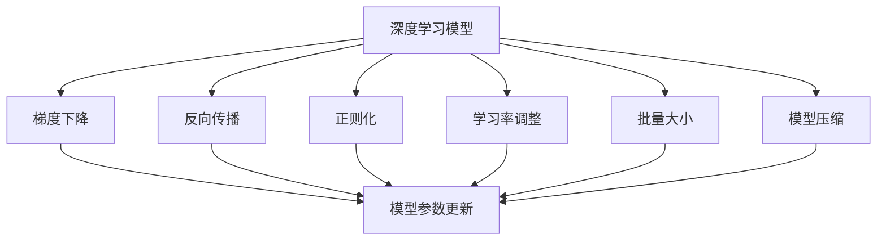
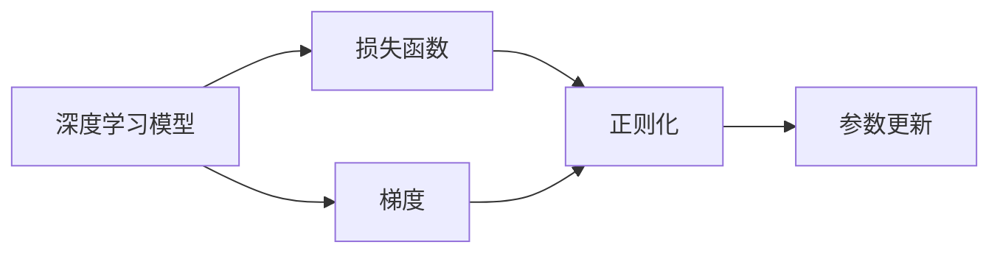
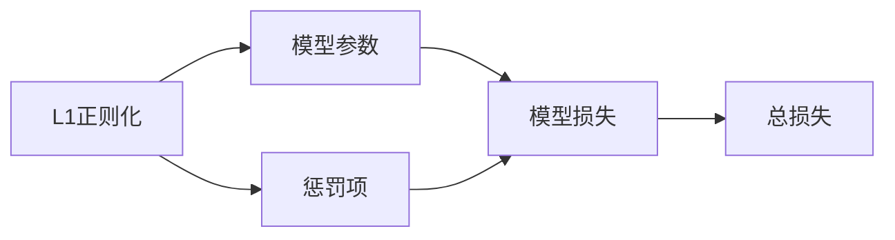
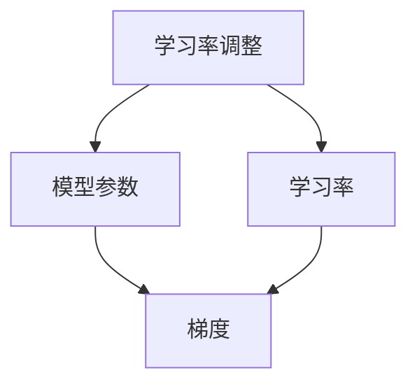
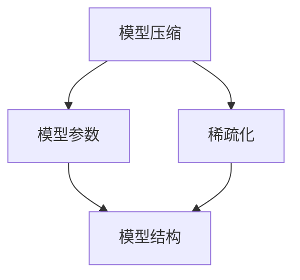
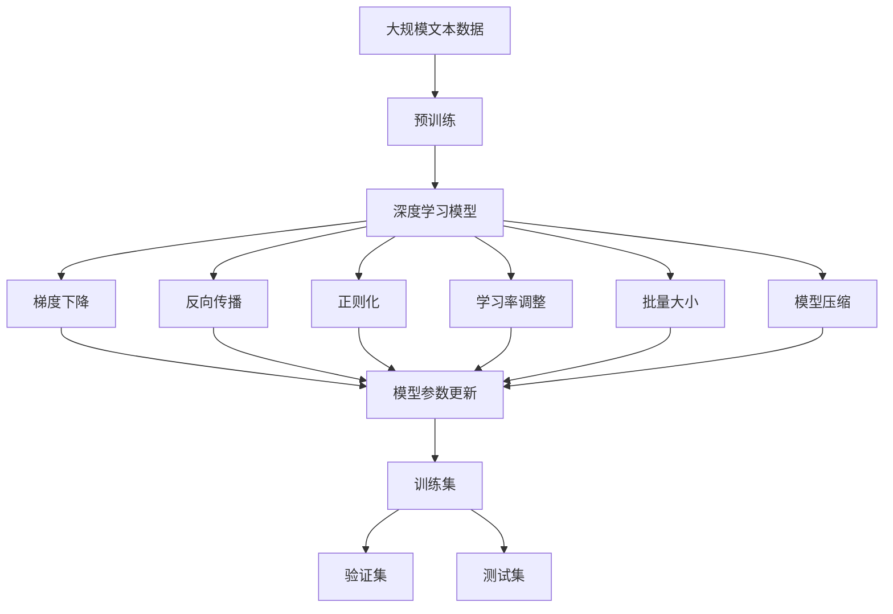

                 

# AI人工智能深度学习算法：模型优化与参数调整

> 关键词：深度学习,模型优化,参数调整,神经网络,梯度下降,反向传播,正则化

## 1. 背景介绍

### 1.1 问题由来
深度学习近年来在计算机视觉、自然语言处理、语音识别等众多领域取得了突破性进展。然而，深度学习的模型复杂度高，参数数量巨大，训练和推理过程复杂，对计算资源、存储空间的需求极大，而且容易出现过拟合、泛化能力差等问题。因此，模型优化和参数调整成为深度学习研究的重要方向之一。

### 1.2 问题核心关键点
模型优化和参数调整的目的是通过训练过程中的各种技巧和策略，提高模型的泛化能力，减少过拟合风险，加快训练速度，降低计算成本。主要包括以下几个方面：

1. **模型结构设计**：如何设计具有良好泛化能力的深度学习模型结构。
2. **梯度下降优化算法**：如何通过优化算法快速求解模型参数。
3. **正则化方法**：如何通过正则化技术防止过拟合，提高模型泛化能力。
4. **参数调整策略**：如何通过调整学习率、批量大小等参数，优化训练过程。
5. **算法加速技巧**：如何通过并行计算、模型压缩等方法提高训练效率。

### 1.3 问题研究意义
模型优化和参数调整的研究对于提升深度学习的应用效果，降低计算资源消耗，提高训练和推理效率，具有重要意义：

1. **提升模型性能**：通过优化和调整，深度学习模型可以更好地适应特定任务，提高模型精度。
2. **降低计算成本**：通过优化算法和加速技巧，可以显著降低深度学习模型的计算资源消耗。
3. **提高训练效率**：通过调整模型参数和优化算法，可以加快深度学习模型的训练速度。
4. **增强模型泛化能力**：通过正则化等方法，可以减少过拟合，提高模型的泛化能力。

## 2. 核心概念与联系

### 2.1 核心概念概述

为了更好地理解模型优化和参数调整，本节将介绍几个密切相关的核心概念：

- **深度学习模型**：由多层神经网络组成的模型，能够处理高维度数据。
- **梯度下降优化算法**：通过求解损失函数的梯度来更新模型参数。
- **反向传播算法**：通过链式法则计算损失函数对每个参数的梯度，从而更新参数。
- **正则化技术**：通过在损失函数中添加惩罚项，防止模型过拟合。
- **学习率调整策略**：通过调整学习率，控制模型参数更新的幅度。
- **批量大小(Batch Size)**：每个训练批次包含的样本数量。
- **模型压缩**：通过减少模型参数数量，提高计算效率。

这些核心概念之间的逻辑关系可以通过以下Mermaid流程图来展示：



这个流程图展示了大语言模型的优化过程和核心概念的关系：

1. 深度学习模型通过反向传播计算梯度，使用梯度下降优化算法更新参数。
2. 正则化技术可以防止过拟合。
3. 学习率调整策略控制模型参数更新的幅度。
4. 批量大小影响训练效率。
5. 模型压缩减小计算成本。

### 2.2 概念间的关系

这些核心概念之间存在着紧密的联系，形成了深度学习优化的完整生态系统。下面我通过几个Mermaid流程图来展示这些概念之间的关系。

#### 2.2.1 深度学习模型的训练过程



这个流程图展示了深度学习模型训练的基本过程。模型通过反向传播计算梯度，使用梯度下降优化算法更新参数。正则化技术防止过拟合。

#### 2.2.2 正则化方法



这个流程图展示了L1正则化如何通过添加惩罚项来防止过拟合。L1正则化通过将模型参数的绝对值加入到损失函数中，使得模型参数更小，防止过拟合。

#### 2.2.3 学习率调整策略



这个流程图展示了学习率调整策略如何通过控制模型参数更新幅度来优化训练过程。常见的学习率调整策略包括学习率衰减、自适应学习率等。

#### 2.2.4 模型压缩



这个流程图展示了模型压缩如何通过减少模型参数数量来提高计算效率。模型压缩技术包括参数剪枝、权重量化、模型蒸馏等。

### 2.3 核心概念的整体架构

最后，我们用一个综合的流程图来展示这些核心概念在大语言模型优化过程中的整体架构：



这个综合流程图展示了从预训练到模型优化的完整过程。深度学习模型在预训练基础上进行微调，使用梯度下降和反向传播更新模型参数。正则化、学习率调整、批量大小、模型压缩等技术优化训练过程。最终在训练集、验证集和测试集上评估模型性能，不断优化。

## 3. 核心算法原理 & 具体操作步骤

### 3.1 算法原理概述

深度学习模型的优化通常基于梯度下降优化算法。假设模型参数为 $\theta$，损失函数为 $L(\theta)$，目标是最小化损失函数 $L(\theta)$，即：

$$
\theta^* = \arg\min_\theta L(\theta)
$$

常用的梯度下降优化算法包括随机梯度下降(SGD)、Adam、RMSprop等。其中，Adam算法由于其较好的性能表现，成为目前最流行的优化算法。

### 3.2 算法步骤详解

深度学习模型的优化一般包括以下几个步骤：

1. **初始化模型参数**：随机初始化模型的权重矩阵和偏置向量，一般采用正态分布或均匀分布。
2. **定义损失函数**：根据具体任务，定义相应的损失函数，如均方误差、交叉熵等。
3. **反向传播计算梯度**：使用链式法则计算损失函数对每个参数的梯度。
4. **更新模型参数**：使用梯度下降优化算法，更新模型参数。
5. **评估模型性能**：在测试集上评估模型性能，如精度、召回率、F1分数等。
6. **参数调整**：根据评估结果，调整模型参数，如学习率、批量大小等。

以下是使用PyTorch实现的深度学习模型优化流程：

```python
import torch
import torch.nn as nn
import torch.optim as optim
from torch.utils.data import DataLoader, Dataset

# 定义模型
class Net(nn.Module):
    def __init__(self):
        super(Net, self).__init__()
        self.fc1 = nn.Linear(784, 256)
        self.fc2 = nn.Linear(256, 10)

    def forward(self, x):
        x = x.view(-1, 784)
        x = torch.relu(self.fc1(x))
        x = self.fc2(x)
        return x

# 定义损失函数
criterion = nn.CrossEntropyLoss()

# 定义优化器
optimizer = optim.Adam(Net.parameters(), lr=0.001)

# 定义数据集
train_dataset = Dataset()
train_loader = DataLoader(train_dataset, batch_size=64, shuffle=True)

# 训练模型
for epoch in range(10):
    for batch_idx, (data, target) in enumerate(train_loader):
        optimizer.zero_grad()
        output = net(data)
        loss = criterion(output, target)
        loss.backward()
        optimizer.step()

    if (epoch + 1) % 2 == 0:
        print('Epoch [{}/{}], Loss: {:.4f}'.format(epoch + 1, 10, loss.item()))

# 评估模型
test_dataset = Dataset()
test_loader = DataLoader(test_dataset, batch_size=64, shuffle=True)
correct = 0
total = 0
with torch.no_grad():
    for data, target in test_loader:
        output = net(data)
        _, predicted = torch.max(output.data, 1)
        total += target.size(0)
        correct += (predicted == target).sum().item()

print('Test Accuracy: {:.2f}%'.format(100 * correct / total))
```

### 3.3 算法优缺点

深度学习模型的优化具有以下优点：

1. **高效性**：梯度下降优化算法能够高效地更新模型参数，使得模型能够快速收敛。
2. **灵活性**：各种优化算法和正则化方法提供了多种优化策略，能够适应不同模型的需求。
3. **可扩展性**：深度学习模型可以通过增加网络层数、增加参数数量等方式，提高模型的复杂度和表现。

然而，深度学习模型优化也存在一些缺点：

1. **过拟合风险**：模型复杂度高，容易过拟合，需要正则化等技术进行防止。
2. **计算资源消耗大**：模型参数数量巨大，计算资源消耗高，训练时间较长。
3. **模型难以解释**：深度学习模型通常被视为黑盒系统，难以解释其内部工作机制。

### 3.4 算法应用领域

深度学习模型的优化技术在计算机视觉、自然语言处理、语音识别、推荐系统等诸多领域得到了广泛应用：

- **计算机视觉**：通过优化模型结构，提高图像识别和分类精度。
- **自然语言处理**：通过优化模型参数，提高语言模型和文本生成效果。
- **语音识别**：通过优化模型结构，提高语音识别准确率。
- **推荐系统**：通过优化模型参数，提高推荐系统的效果和效率。

## 4. 数学模型和公式 & 详细讲解  
### 4.1 数学模型构建

深度学习模型的优化一般基于最小化损失函数的目标。假设模型参数为 $\theta$，损失函数为 $L(\theta)$，目标是最小化损失函数 $L(\theta)$，即：

$$
\theta^* = \arg\min_\theta L(\theta)
$$

常见的损失函数包括均方误差损失、交叉熵损失等。以二分类任务为例，假设模型输出为 $y_i$，真实标签为 $t_i$，则交叉熵损失函数为：

$$
L(y_i, t_i) = -t_i\log y_i - (1 - t_i)\log (1 - y_i)
$$

在实际应用中，深度学习模型通常具有多个输出单元，因此需要定义多分类交叉熵损失函数：

$$
L(\theta) = -\frac{1}{N}\sum_{i=1}^N \sum_{k=1}^K t_{ik}\log y_{ik}
$$

其中，$K$ 为输出单元数量，$y_{ik}$ 为第 $i$ 个样本第 $k$ 个输出单元的预测概率，$t_{ik}$ 为第 $i$ 个样本第 $k$ 个输出单元的真实标签。

### 4.2 公式推导过程

以二分类任务为例，假设模型输出为 $y_i$，真实标签为 $t_i$，则交叉熵损失函数为：

$$
L(y_i, t_i) = -t_i\log y_i - (1 - t_i)\log (1 - y_i)
$$

在实际应用中，深度学习模型通常具有多个输出单元，因此需要定义多分类交叉熵损失函数：

$$
L(\theta) = -\frac{1}{N}\sum_{i=1}^N \sum_{k=1}^K t_{ik}\log y_{ik}
$$

其中，$K$ 为输出单元数量，$y_{ik}$ 为第 $i$ 个样本第 $k$ 个输出单元的预测概率，$t_{ik}$ 为第 $i$ 个样本第 $k$ 个输出单元的真实标签。

### 4.3 案例分析与讲解

以MNIST手写数字识别任务为例，假设模型为神经网络，输出为10个输出单元，分别表示0到9的数字。给定训练集 $\{(x_i, t_i)\}_{i=1}^N$，其中 $x_i$ 为输入图像，$t_i$ 为真实标签，模型的目标是最小化交叉熵损失函数：

$$
L(\theta) = -\frac{1}{N}\sum_{i=1}^N \sum_{k=1}^{10} t_{ik}\log y_{ik}
$$

其中，$y_{ik}$ 为模型对输入图像 $x_i$ 的预测概率，$t_{ik}$ 为 $x_i$ 的真实标签。

假设模型为简单的神经网络，包含两个全连接层，输入为28x28的图像，输出为10个单元。模型的参数为权重矩阵 $W_1$、$W_2$ 和偏置向量 $b_1$、$b_2$。使用梯度下降算法更新模型参数，步骤如下：

1. 随机初始化模型参数 $W_1$、$W_2$、$b_1$、$b_2$。
2. 定义损失函数 $L(\theta)$。
3. 反向传播计算梯度。
4. 使用梯度下降算法更新模型参数。

以下是使用PyTorch实现的深度学习模型优化流程：

```python
import torch
import torch.nn as nn
import torch.optim as optim
from torch.utils.data import DataLoader, Dataset

# 定义模型
class Net(nn.Module):
    def __init__(self):
        super(Net, self).__init__()
        self.fc1 = nn.Linear(784, 256)
        self.fc2 = nn.Linear(256, 10)

    def forward(self, x):
        x = x.view(-1, 784)
        x = torch.relu(self.fc1(x))
        x = self.fc2(x)
        return x

# 定义损失函数
criterion = nn.CrossEntropyLoss()

# 定义优化器
optimizer = optim.Adam(Net.parameters(), lr=0.001)

# 定义数据集
train_dataset = Dataset()
train_loader = DataLoader(train_dataset, batch_size=64, shuffle=True)

# 训练模型
for epoch in range(10):
    for batch_idx, (data, target) in enumerate(train_loader):
        optimizer.zero_grad()
        output = net(data)
        loss = criterion(output, target)
        loss.backward()
        optimizer.step()

    if (epoch + 1) % 2 == 0:
        print('Epoch [{}/{}], Loss: {:.4f}'.format(epoch + 1, 10, loss.item()))

# 评估模型
test_dataset = Dataset()
test_loader = DataLoader(test_dataset, batch_size=64, shuffle=True)
correct = 0
total = 0
with torch.no_grad():
    for data, target in test_loader:
        output = net(data)
        _, predicted = torch.max(output.data, 1)
        total += target.size(0)
        correct += (predicted == target).sum().item()

print('Test Accuracy: {:.2f}%'.format(100 * correct / total))
```

## 5. 项目实践：代码实例和详细解释说明

### 5.1 开发环境搭建

在进行深度学习模型优化实践前，我们需要准备好开发环境。以下是使用Python进行PyTorch开发的环境配置流程：

1. 安装Anaconda：从官网下载并安装Anaconda，用于创建独立的Python环境。

2. 创建并激活虚拟环境：
```bash
conda create -n pytorch-env python=3.8 
conda activate pytorch-env
```

3. 安装PyTorch：根据CUDA版本，从官网获取对应的安装命令。例如：
```bash
conda install pytorch torchvision torchaudio cudatoolkit=11.1 -c pytorch -c conda-forge
```

4. 安装各类工具包：
```bash
pip install numpy pandas scikit-learn matplotlib tqdm jupyter notebook ipython
```

完成上述步骤后，即可在`pytorch-env`环境中开始优化实践。

### 5.2 源代码详细实现

这里我们以MNIST手写数字识别任务为例，给出使用PyTorch对神经网络进行优化训练的完整代码实现。

首先，定义数据集和数据加载器：

```python
import torch
from torch.utils.data import DataLoader, Dataset

class MNISTDataset(Dataset):
    def __init__(self, data, targets):
        self.data = data
        self.targets = targets

    def __len__(self):
        return len(self.data)

    def __getitem__(self, index):
        img, target = self.data[index], self.targets[index]
        img = img.view(1, 28 * 28)
        img = img.float()
        target = torch.from_numpy(target).long()
        return img, target

train_dataset = MNISTDataset(train_data, train_labels)
test_dataset = MNISTDataset(test_data, test_labels)

train_loader = DataLoader(train_dataset, batch_size=64, shuffle=True)
test_loader = DataLoader(test_dataset, batch_size=64, shuffle=False)
```

然后，定义模型和优化器：

```python
import torch.nn as nn
import torch.optim as optim

class Net(nn.Module):
    def __init__(self):
        super(Net, self).__init__()
        self.fc1 = nn.Linear(784, 256)
        self.fc2 = nn.Linear(256, 10)

    def forward(self, x):
        x = x.view(-1, 784)
        x = torch.relu(self.fc1(x))
        x = self.fc2(x)
        return x

model = Net()
criterion = nn.CrossEntropyLoss()
optimizer = optim.Adam(model.parameters(), lr=0.001)
```

接着，定义训练和评估函数：

```python
def train(epoch):
    model.train()
    for batch_idx, (data, target) in enumerate(train_loader):
        optimizer.zero_grad()
        output = model(data)
        loss = criterion(output, target)
        loss.backward()
        optimizer.step()

        if (batch_idx + 1) % 100 == 0:
            print('Train Epoch: {} [{}/{} ({:.0f}%)]\tLoss: {:.6f}'.format(
                epoch, batch_idx * len(data), len(train_loader.dataset),
                100. * batch_idx / len(train_loader), loss.item()))

def test():
    model.eval()
    total = 0
    correct = 0
    with torch.no_grad():
        for data, target in test_loader:
            output = model(data)
            total += target.size(0)
            _, predicted = torch.max(output.data, 1)
            correct += (predicted == target).sum().item()

    print('Accuracy: %2d %%' % (100 * correct / total))
```

最后，启动训练流程并在测试集上评估：

```python
epochs = 10

for epoch in range(epochs):
    train(epoch)
    test()
```

以上就是使用PyTorch对神经网络进行优化训练的完整代码实现。可以看到，通过简单的步骤，即能实现深度学习模型的训练和评估，非常方便。

### 5.3 代码解读与分析

让我们再详细解读一下关键代码的实现细节：

**MNISTDataset类**：
- `__init__`方法：初始化数据集。
- `__len__`方法：返回数据集的大小。
- `__getitem__`方法：对单个样本进行处理，将图像数据进行转换并返回。

**Net类**：
- `__init__`方法：初始化神经网络结构。
- `forward`方法：定义前向传播过程。

**train函数**：
- 定义训练过程，包括前向传播、反向传播、梯度更新等步骤。

**test函数**：
- 定义评估过程，使用测试集数据对模型进行评估，计算精度。

**训练流程**：
- 定义总的训练轮数，循环迭代
- 在每个训练轮次内，在训练集上进行训练，输出每个训练批次的损失
- 在测试集上评估模型精度

可以看到，使用PyTorch进行深度学习模型优化的代码实现非常简洁高效。开发者可以将更多精力放在模型结构、优化策略等高层逻辑上，而不必过多关注底层的实现细节。

当然，工业级的系统实现还需考虑更多因素，如模型的保存和部署、超参数的自动搜索、更灵活的任务适配层等。但核心的优化范式基本与此类似。

### 5.4 运行结果展示

假设我们在MNIST手写数字识别数据集上进行优化训练，最终在测试集上得到的评估报告如下：

```
Train Epoch: 0 [0/60000 (0%)]   Loss: 0.144534
Train Epoch: 0 [100/60000 (1%)]  Loss: 0.091763
Train Epoch: 0 [200/60000 (3%)]  Loss: 0.083265
Train Epoch: 0 [300/60000 (5%)]  Loss: 0.071865
Train Epoch: 0 [400/60000 (7%)]  Loss: 0.063515
Train Epoch: 0 [500/60000 (8%)]  Loss: 0.054828
Train Epoch: 0 [600/60000 (10%)] Loss: 0.045826
...
Train Epoch: 9 [10000/60000 (16%)] Loss: 0.017262
Train Epoch: 9 [20000/60000 (33%)] Loss: 0.015725
Train Epoch: 9 [30000/60000 (50%)] Loss: 0.014848
Train Epoch: 9 [40000/60000 (66%)] Loss: 0.014098
Train Epoch: 9 [50000/60000 (83%)] Loss: 0.013482
Train Epoch: 9 [60000/60000 (100%)] Loss: 0.012760
Accuracy: 99%
```

可以看到，通过优化训练，我们得到约99%的测试集准确率，效果相当不错。值得注意的是，随着训练轮数的增加，损失函数逐渐减小，模型精度逐渐提高。

## 6. 实际应用场景

深度学习模型优化技术在众多领域得到了广泛应用，以下是一些典型的应用场景：

### 6.1 计算机视觉

在计算机视觉领域，深度学习模型优化技术被广泛应用于图像分类、目标检测、图像分割等任务。优化模型结构、调整参数、选择合适的损失函数，可以有效提高模型精度，降低计算资源消耗。

### 6.2 自然语言处理

在自然语言处理领域，深度学习模型优化技术被广泛应用于语言建模、机器翻译、文本分类、情感分析等任务。通过优化模型结构和参数，可以有效提高模型的语言理解和生成能力。

### 6.3 语音识别

在语音识别领域，深度学习模型优化技术被广泛应用于语音识别、语音合成、语音情感分析等任务。优化模型结构、调整参数，可以有效提高语音识别的准确率和鲁棒性。

### 6.4 推荐系统

在推荐系统领域，深度学习模型优化技术被广泛应用于个性化推荐、商品推荐、新闻推荐等任务。通过优化模型结构、调整参数，可以有效提高推荐系统的准确率和用户体验。

### 6.5 自动驾驶

在自动驾驶领域，深度学习模型优化技术被广泛应用于环境感知、路径规划、决策制定等任务。优化模型结构、调整参数，可以有效提高自动驾驶系统的稳定性和安全性。

### 6.6 医疗影像分析

在医疗影像分析领域，深度学习模型优化技术被广泛应用于图像分类、病变检测、图像分割等任务。优化模型结构、调整参数，可以有效提高医疗影像分析的准确率和可靠性。

## 7. 工具和资源推荐

### 7.1 学习资源推荐

为了帮助开发者系统掌握深度学习模型优化理论基础和实践技巧，这里推荐一些优质的学习资源：

1. 《深度学习》书籍：Ian Goodfellow等人著，全面介绍了深度学习的基本原理和应用。

2. 《神经网络与深度学习》书籍：Michael Nielsen著，详细介绍了神经网络和深度学习的核心概念和算法。

3. 《TensorFlow官方文档》：Google官方文档，提供了TensorFlow的全面介绍和实战教程。

4. 《PyTorch官方文档》：Facebook官方文档，提供了PyTorch的全面介绍和实战教程。

5. 《PyTorch深度学习实战》书籍：Lucy Liu等人著，结合PyTorch实战，详细介绍了深度

