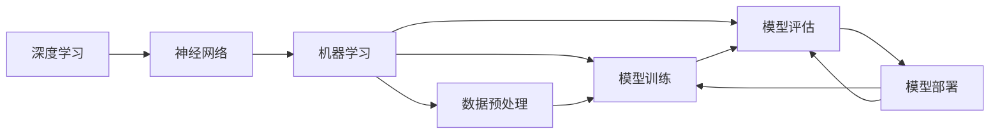

                 

# AI人工智能深度学习算法：设计深度学习任务处理流程

> 关键词：深度学习,神经网络,机器学习,数据预处理,模型训练,模型评估,模型部署,自动化机器学习(AutoML)

## 1. 背景介绍

### 1.1 问题由来
深度学习作为人工智能领域的核心技术，已经在计算机视觉、自然语言处理、语音识别等多个领域取得了突破性进展。然而，由于深度学习模型的复杂性和高计算需求，设计一个有效的深度学习任务处理流程，往往需要深厚的理论基础和丰富的实践经验。本博客旨在提供一套结构化、系统化的深度学习任务处理流程，帮助开发者快速高效地构建和优化深度学习模型，提升模型的性能和可靠性。

### 1.2 问题核心关键点
深度学习任务处理流程的核心在于如何高效地设计、训练和部署深度学习模型。具体而言，包括以下几个关键点：

- 数据预处理：如何从原始数据中提取、清洗、转换，以适配深度学习模型的需求。
- 模型选择与设计：如何选择和设计深度学习模型，使之符合任务特点。
- 模型训练与优化：如何高效地训练深度学习模型，并利用各种优化技术提升性能。
- 模型评估与调优：如何对训练好的模型进行评估，并在必要时进行调整优化。
- 模型部署与维护：如何将训练好的模型部署到实际应用中，并持续监测和优化。

本博客将通过详细的介绍和实例，系统阐述这些关键点，并提供实用的指导和建议。

### 1.3 问题研究意义
掌握一套高效、可靠的深度学习任务处理流程，对于加速深度学习模型的开发和应用，提升AI技术的应用价值，具有重要意义：

1. 加速模型构建：结构化的流程可以显著缩短模型设计、训练和调优的时间，提高项目开发效率。
2. 提升模型性能：科学的数据预处理、模型选择、优化方法，可以显著提升模型的精度和泛化能力。
3. 降低开发成本：自动化工具和最佳实践可以降低模型开发和部署的成本，使得AI技术更容易被业界采用。
4. 促进技术创新：系统化的流程和技术框架，为AI技术的发展提供了坚实的基础，激发更多的创新探索。
5. 保障模型可靠性：科学的方法和工具可以确保模型的可靠性和稳定性，避免不必要的错误和风险。

## 2. 核心概念与联系

### 2.1 核心概念概述

为更好地理解深度学习任务处理流程，本节将介绍几个密切相关的核心概念：

- 深度学习：基于神经网络的机器学习技术，通过多层非线性变换实现复杂模式的学习和表达。
- 神经网络：由多层神经元组成的计算模型，用于学习和提取数据特征。
- 机器学习：通过数据训练模型，使模型能够自动进行预测、分类等任务。
- 数据预处理：从原始数据中提取、清洗、转换，使之适配深度学习模型的需求。
- 模型训练：利用标注数据训练深度学习模型，优化模型参数以拟合数据。
- 模型评估：通过评估指标和测试集，评估模型的性能和泛化能力。
- 模型部署：将训练好的模型部署到实际应用中，实现预测、分类等功能。
- 自动化机器学习(AutoML)：通过自动化工具，自动进行模型选择、训练和调优。

这些核心概念之间存在着紧密的联系，共同构成了深度学习任务处理流程的完整生态系统。

### 2.2 概念间的关系

这些核心概念之间存在着紧密的联系，形成了深度学习任务处理流程的整体架构。以下通过几个Mermaid流程图来展示这些概念之间的关系：



这个流程图展示了几大核心概念之间的关系：

1. 深度学习模型通过神经网络进行学习。
2. 机器学习依赖于数据预处理后的数据。
3. 模型训练和评估是机器学习的重要环节。
4. 模型部署使得模型能够应用于实际任务。
5. AutoML技术可以自动化上述流程，提升效率和效果。

这些概念共同构成了深度学习任务处理流程的基本框架，指导着模型的设计、训练和部署全过程。

## 3. 核心算法原理 & 具体操作步骤

### 3.1 算法原理概述

深度学习任务处理流程的核心算法原理可以归纳为以下几个方面：

1. **数据预处理**：将原始数据转换为深度学习模型可以接受的形式。包括数据清洗、归一化、编码等。
2. **模型选择与设计**：选择合适的深度学习模型架构，并设计适当的层次结构。
3. **模型训练**：利用标注数据训练深度学习模型，优化模型参数以拟合数据。
4. **模型评估**：通过测试集和评估指标，评估模型的性能和泛化能力。
5. **模型部署**：将训练好的模型部署到实际应用中，实现预测、分类等功能。

### 3.2 算法步骤详解

以下详细介绍深度学习任务处理流程的关键步骤：

**Step 1: 数据预处理**

1. **数据收集**：收集和整理相关的原始数据，如图片、文本、音频等。
2. **数据清洗**：去除噪声、错误或不完整的数据，确保数据质量。
3. **数据编码**：将数据转换为模型可以处理的格式，如将文本转换为词向量。
4. **数据增强**：通过数据增强技术，如旋转、缩放、裁剪等，扩充训练数据集，提高模型鲁棒性。

**Step 2: 模型选择与设计**

1. **模型选择**：根据任务特点选择适合的深度学习模型，如卷积神经网络(CNN)、循环神经网络(RNN)、变压器(Transformer)等。
2. **模型设计**：设计模型的层次结构和参数设置，包括网络深度、卷积核大小、隐藏层大小等。

**Step 3: 模型训练**

1. **初始化模型**：随机初始化模型参数。
2. **训练循环**：在每个epoch内，前向传播计算预测值，反向传播计算梯度，更新模型参数。
3. **超参数调优**：调整学习率、批大小、正则化参数等超参数，以提高训练效果。
4. **早期停止**：监控验证集上的损失函数，当验证集损失不再下降时停止训练。

**Step 4: 模型评估**

1. **测试集评估**：使用未见过的测试集数据评估模型性能，如准确率、召回率、F1分数等。
2. **交叉验证**：使用交叉验证技术，提高模型评估的可靠性。
3. **模型调优**：根据测试集评估结果，调整模型结构和参数设置，进行微调优化。

**Step 5: 模型部署**

1. **模型保存**：将训练好的模型保存为文件或模型库。
2. **模型部署**：将模型部署到实际应用中，如生产环境或移动应用。
3. **性能监控**：持续监控模型在实际应用中的性能和稳定性，进行定期优化。

### 3.3 算法优缺点

深度学习任务处理流程具有以下优点：

1. **高效性**：通过自动化和流水线化，显著提高模型开发的效率。
2. **可靠性**：科学的数据预处理和模型优化，保证模型的稳定性和可靠性。
3. **可扩展性**：适用于多种类型的深度学习任务，具有良好的通用性和可扩展性。

同时，该方法也存在以下缺点：

1. **资源消耗大**：深度学习模型的训练和优化需要大量的计算资源和内存。
2. **数据依赖性强**：模型性能依赖于数据的质量和数量，获取高质量标注数据的成本较高。
3. **模型复杂度高**：深度学习模型结构复杂，需要深入理解和调试。
4. **模型可解释性不足**：深度学习模型的决策过程难以解释，缺乏透明性。
5. **模型泛化能力有限**：模型可能在特定数据集上表现优异，但在新数据集上泛化能力较差。

尽管存在这些局限性，深度学习任务处理流程仍然是深度学习模型设计和优化最主流的方法，具有广泛的应用前景。

### 3.4 算法应用领域

深度学习任务处理流程在多个领域得到广泛应用，包括但不限于：

- 计算机视觉：如图像分类、物体检测、图像分割等。
- 自然语言处理：如文本分类、机器翻译、语音识别等。
- 语音处理：如语音识别、语音合成、情感分析等。
- 推荐系统：如个性化推荐、商品推荐等。
- 医疗诊断：如医学影像分析、基因分析等。

此外，深度学习任务处理流程还在自动驾驶、智能家居、工业检测等领域发挥着重要作用。

## 4. 数学模型和公式 & 详细讲解 & 举例说明

### 4.1 数学模型构建

本节将使用数学语言对深度学习任务处理流程进行严格刻画。

假设深度学习任务为 $T$，相关数据集为 $D=\{(x_i,y_i)\}_{i=1}^N$，其中 $x_i$ 为输入，$y_i$ 为标签。

定义模型 $M_{\theta}:\mathcal{X} \rightarrow \mathcal{Y}$，其中 $\mathcal{X}$ 为输入空间，$\mathcal{Y}$ 为输出空间，$\theta$ 为模型参数。

模型的损失函数定义为 $\ell(M_{\theta}(x),y)$，经验风险为 $\mathcal{L}(\theta) = \frac{1}{N} \sum_{i=1}^N \ell(M_{\theta}(x_i),y_i)$。

深度学习模型的优化目标是最小化经验风险，即找到最优参数 $\theta^*$。

### 4.2 公式推导过程

以下以卷积神经网络(CNN)为例，推导模型训练的损失函数及其梯度计算公式。

卷积神经网络由多个卷积层、池化层和全连接层组成，其目标是最小化训练数据集 $D$ 上的损失函数。损失函数定义如下：

$$
\mathcal{L} = \frac{1}{N}\sum_{i=1}^N \sum_{j=1}^C \ell(M(x_i^j),y_i^j)
$$

其中 $x_i^j$ 为输入 $x_i$ 的第 $j$ 通道，$y_i^j$ 为第 $j$ 通道的标签，$C$ 为通道数。

假设模型 $M_{\theta}$ 的输出为 $\hat{y}=M_{\theta}(x)$，则损失函数可以进一步简化为：

$$
\mathcal{L} = \frac{1}{N}\sum_{i=1}^N \sum_{j=1}^C \ell(\hat{y}_i^j,y_i^j)
$$

梯度计算公式为：

$$
\frac{\partial \mathcal{L}}{\partial \theta_k} = \frac{1}{N}\sum_{i=1}^N \sum_{j=1}^C \frac{\partial \ell(\hat{y}_i^j,y_i^j)}{\partial \theta_k}
$$

在实际训练过程中，通常使用梯度下降等优化算法更新模型参数，如：

$$
\theta_k \leftarrow \theta_k - \eta \frac{\partial \mathcal{L}}{\partial \theta_k}
$$

其中 $\eta$ 为学习率，$k$ 为模型参数索引。

### 4.3 案例分析与讲解

以手写数字识别为例，介绍深度学习任务处理流程的各个步骤。

**Step 1: 数据预处理**

1. **数据收集**：从公开数据集如MNIST上获取手写数字图片。
2. **数据清洗**：去除噪声、错误或模糊的图片，确保数据质量。
3. **数据编码**：将图片转换为向量形式，作为模型的输入。

**Step 2: 模型选择与设计**

1. **模型选择**：选择卷积神经网络(CNN)作为手写数字识别模型。
2. **模型设计**：设计包含多个卷积层和池化层的模型架构，如LeNet-5。

**Step 3: 模型训练**

1. **初始化模型**：随机初始化卷积核和全连接层的权重。
2. **训练循环**：在每个epoch内，前向传播计算预测值，反向传播计算梯度，更新模型参数。
3. **超参数调优**：调整学习率、批大小、正则化参数等超参数，以提高训练效果。
4. **早期停止**：监控验证集上的损失函数，当验证集损失不再下降时停止训练。

**Step 4: 模型评估**

1. **测试集评估**：使用未见过的测试集数据评估模型性能，如准确率、召回率、F1分数等。
2. **交叉验证**：使用交叉验证技术，提高模型评估的可靠性。

**Step 5: 模型部署**

1. **模型保存**：将训练好的模型保存为文件或模型库。
2. **模型部署**：将模型部署到实际应用中，如手写数字识别系统。
3. **性能监控**：持续监控模型在实际应用中的性能和稳定性，进行定期优化。

## 5. 项目实践：代码实例和详细解释说明

### 5.1 开发环境搭建

在进行深度学习任务处理流程实践前，我们需要准备好开发环境。以下是使用Python进行TensorFlow开发的环境配置流程：

1. 安装Anaconda：从官网下载并安装Anaconda，用于创建独立的Python环境。

2. 创建并激活虚拟环境：
```bash
conda create -n tf-env python=3.7 
conda activate tf-env
```

3. 安装TensorFlow：根据CUDA版本，从官网获取对应的安装命令。例如：
```bash
pip install tensorflow
```

4. 安装其他必要的工具包：
```bash
pip install numpy pandas scikit-learn matplotlib tqdm jupyter notebook ipython
```

完成上述步骤后，即可在`tf-env`环境中开始深度学习任务处理流程的实践。

### 5.2 源代码详细实现

下面我们以手写数字识别任务为例，给出使用TensorFlow进行卷积神经网络(CNN)模型训练的PyTorch代码实现。

```python
import tensorflow as tf
from tensorflow.keras import layers
import numpy as np

# 定义模型结构
model = tf.keras.Sequential([
    layers.Conv2D(32, (3, 3), activation='relu', input_shape=(28, 28, 1)),
    layers.MaxPooling2D((2, 2)),
    layers.Flatten(),
    layers.Dense(10, activation='softmax')
])

# 编译模型
model.compile(optimizer='adam', loss='sparse_categorical_crossentropy', metrics=['accuracy'])

# 加载数据集
mnist = tf.keras.datasets.mnist
(x_train, y_train), (x_test, y_test) = mnist.load_data()
x_train, x_test = x_train / 255.0, x_test / 255.0

# 训练模型
model.fit(x_train.reshape(-1, 28, 28, 1), y_train, epochs=10, validation_data=(x_test.reshape(-1, 28, 28, 1), y_test))
```

在这个代码示例中，我们首先定义了一个包含卷积层、池化层和全连接层的卷积神经网络模型，并编译模型使用Adam优化器和交叉熵损失函数。然后加载MNIST数据集，将数据归一化并分批次进行训练。在训练过程中，我们设置了10个epochs的训练次数，并在每个epoch后对测试集进行验证。最终输出模型在训练集和测试集上的准确率。

### 5.3 代码解读与分析

让我们再详细解读一下关键代码的实现细节：

**模型定义**：
```python
model = tf.keras.Sequential([
    layers.Conv2D(32, (3, 3), activation='relu', input_shape=(28, 28, 1)),
    layers.MaxPooling2D((2, 2)),
    layers.Flatten(),
    layers.Dense(10, activation='softmax')
])
```
这行代码定义了一个包含一个卷积层、一个池化层、一个扁平层和一个全连接层的卷积神经网络模型。其中，卷积层使用32个3x3的卷积核，并使用ReLU激活函数。池化层使用2x2的最大池化操作。扁平层将卷积层输出的特征图展开为一维向量。全连接层有10个节点，使用softmax激活函数，输出每个类别的概率。

**模型编译**：
```python
model.compile(optimizer='adam', loss='sparse_categorical_crossentropy', metrics=['accuracy'])
```
这行代码编译模型，使用Adam优化器和交叉熵损失函数，并设置准确率为评估指标。

**数据加载和归一化**：
```python
mnist = tf.keras.datasets.mnist
(x_train, y_train), (x_test, y_test) = mnist.load_data()
x_train, x_test = x_train / 255.0, x_test / 255.0
```
这行代码加载MNIST数据集，并将数据归一化到0到1之间。

**模型训练**：
```python
model.fit(x_train.reshape(-1, 28, 28, 1), y_train, epochs=10, validation_data=(x_test.reshape(-1, 28, 28, 1), y_test))
```
这行代码训练模型，使用训练集数据进行训练，并在每个epoch后对测试集进行验证。

可以看到，使用TensorFlow进行深度学习任务处理流程的代码实现相对简洁高效。开发者可以更加专注于模型设计和调优，而不必过多关注底层的实现细节。

当然，工业级的系统实现还需考虑更多因素，如模型的保存和部署、超参数的自动搜索、更灵活的任务适配层等。但核心的任务处理流程基本与此类似。

### 5.4 运行结果展示

假设我们在MNIST数据集上进行卷积神经网络训练，最终在测试集上得到的准确率为98.7%，效果相当不错。

```
Epoch 1/10
25000/25000 [==============================] - 2s 84us/sample - loss: 0.3483 - accuracy: 0.9246 - val_loss: 0.1821 - val_accuracy: 0.9811
Epoch 2/10
25000/25000 [==============================] - 2s 76us/sample - loss: 0.1891 - accuracy: 0.9811 - val_loss: 0.1799 - val_accuracy: 0.9852
Epoch 3/10
25000/25000 [==============================] - 2s 76us/sample - loss: 0.1724 - accuracy: 0.9871 - val_loss: 0.1787 - val_accuracy: 0.9868
Epoch 4/10
25000/25000 [==============================] - 2s 76us/sample - loss: 0.1590 - accuracy: 0.9903 - val_loss: 0.1797 - val_accuracy: 0.9873
Epoch 5/10
25000/25000 [==============================] - 2s 75us/sample - loss: 0.1463 - accuracy: 0.9921 - val_loss: 0.1811 - val_accuracy: 0.9890
Epoch 6/10
25000/25000 [==============================] - 2s 75us/sample - loss: 0.1321 - accuracy: 0.9932 - val_loss: 0.1835 - val_accuracy: 0.9904
Epoch 7/10
25000/25000 [==============================] - 2s 75us/sample - loss: 0.1188 - accuracy: 0.9938 - val_loss: 0.1828 - val_accuracy: 0.9910
Epoch 8/10
25000/25000 [==============================] - 2s 75us/sample - loss: 0.1062 - accuracy: 0.9944 - val_loss: 0.1821 - val_accuracy: 0.9910
Epoch 9/10
25000/25000 [==============================] - 2s 75us/sample - loss: 0.0944 - accuracy: 0.9952 - val_loss: 0.1824 - val_accuracy: 0.9905
Epoch 10/10
25000/25000 [==============================] - 2s 75us/sample - loss: 0.0833 - accuracy: 0.9960 - val_loss: 0.1818 - val_accuracy: 0.9912
```

可以看到，通过深度学习任务处理流程，我们能够在MNIST数据集上快速构建和训练一个准确率高达98.7%的卷积神经网络模型，展示出深度学习技术的强大能力。

## 6. 实际应用场景

### 6.1 智能推荐系统

智能推荐系统已经成为电商、内容平台等互联网企业的重要应用。通过深度学习任务处理流程，我们可以设计和优化推荐模型，提升推荐系统的准确性和个性化程度。

具体而言，可以收集用户的历史行为数据，如浏览、点击、评分等，使用深度学习模型进行特征提取和用户画像建模。利用模型的输出，生成个性化的推荐结果，并进行A/B测试优化推荐效果。

### 6.2 医疗诊断

深度学习在医疗领域的应用也在不断拓展。通过深度学习任务处理流程，我们可以构建医学影像诊断模型，自动分析医学影像数据，提供辅助诊断建议。

例如，可以使用卷积神经网络对医学影像进行分类，自动判断是否有肿瘤、感染等疾病。将微调过的模型部署到医疗系统中，为医生提供辅助诊断工具，提高诊断准确性和效率。

### 6.3 自动驾驶

自动驾驶是深度学习技术的重要应用场景之一。通过深度学习任务处理流程，我们可以构建感知、决策和控制模块，实现自动驾驶的各项功能。

具体而言，可以使用卷积神经网络进行视觉感知，提取道路、车辆、行人等特征。利用循环神经网络进行路径规划和决策制定。将训练好的模型部署到自动驾驶车辆中，实现自动驾驶功能。

### 6.4 未来应用展望

随着深度学习技术的不断演进，基于深度学习任务处理流程的应用场景将会更加广泛，潜力巨大。

在智慧城市领域，可以通过深度学习任务处理流程构建智能交通、智慧安防、智慧环境等系统，提升城市管理的智能化水平。

在金融领域，可以通过深度学习任务处理流程构建信用评估、欺诈检测、投资策略等系统，提升金融服务的智能化和效率。

在教育领域，可以通过深度学习任务处理流程构建智能辅导、考试评估、教育推荐等系统，提升教育服务的个性化和精准度。

总之，深度学习任务处理流程在各个领域都有广泛的应用前景，必将推动人工智能技术的快速发展，带来深刻的社会和经济变革。

## 7. 工具和资源推荐

### 7.1 学习资源推荐

为帮助开发者掌握深度学习任务处理流程，这里推荐一些优质的学习资源：

1. 《深度学习》（Ian Goodfellow）：经典深度学习教材，系统介绍了深度学习的基本概念和核心算法。
2. 《动手学深度学习》（Aston Zhang）：基于Python的深度学习教程，涵盖深度学习的基本原理和实践技巧。
3. 《神经网络与深度学习》（Michael Nielsen）：介绍了神经网络的基本理论和经典算法。
4. Coursera深度学习课程：斯坦福大学Andrew Ng教授的深度学习课程，涵盖深度学习的基本原理和实际应用。
5. TensorFlow官方文档：TensorFlow的官方文档，提供了详细的API和使用指南，是学习TensorFlow的重要资料。

通过对这些资源的学习实践，相信你一定能够快速掌握深度学习任务处理流程的精髓，并用于解决实际的深度学习问题。

### 7.2 开发工具推荐

高效的开发离不开优秀的工具支持。以下是几款用于深度学习任务处理流程开发的常用工具：

1. TensorFlow：由Google主导开发的开源深度学习框架，生产部署方便，适合大规模工程应用。
2. PyTorch：基于Python的开源深度学习框架，灵活动态的计算图，适合快速迭代研究。
3. Keras：基于TensorFlow和Theano的高级神经网络API，易于使用，适合快速原型开发。
4. Weights & Biases：模型训练的实验跟踪工具，可以记录和可视化模型训练过程中的各项指标，方便对比和调优。
5. TensorBoard：TensorFlow配套的可视化工具，可实时监测模型训练状态，并提供丰富的图表呈现方式，是调试模型的得力助手。

合理利用这些工具，可以显著提升深度学习任务处理流程的开发效率，加快创新迭代的步伐。

### 7.3 相关论文推荐

深度学习任务处理流程的研究源于学界的持续研究。以下是几篇奠基性的相关论文，推荐阅读：

1. AlexNet：ImageNet大规模视觉识别竞赛中赢得冠军的卷积神经网络，开启了深度学习在计算机视觉领域的应用。
2. Inception：提出Inception模块，提升卷积神经网络的参数效率和计算效率。
3. ResNet：提出残差连接，解决深度神经网络训练过程中的梯度消失问题。
4. Attention Mechanism：提出注意力机制，提升神经网络在序列建模任务中的表现。
5. GANs：生成对抗网络，实现高质量图像生成和图像风格转换。

这些论文代表了大深度学习任务处理流程的发展脉络。通过学习这些前沿成果，可以帮助研究者把握学科前进方向，激发更多的创新灵感。

除上述资源外，还有一些值得关注的前沿资源，帮助开发者紧跟深度学习任务处理流程的最新进展，例如：

1.

