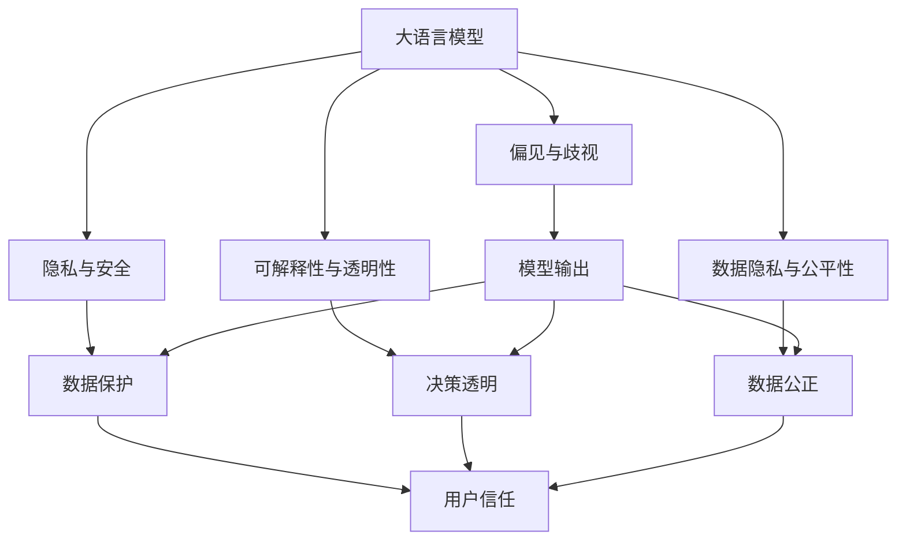

                 

# AI伦理学：LLM发展中的道德考量

> 关键词：
> - 人工智能伦理
> - 大语言模型(LLM)
> - 偏见与歧视
> - 隐私与安全
> - 负责任的AI开发
> - 可解释性与透明性
> - 数据隐私与公平性
> - 人机协作与社会责任

## 1. 背景介绍

### 1.1 问题由来

随着人工智能技术的迅猛发展，特别是大语言模型（Large Language Models，简称LLM）在自然语言处理（NLP）领域的突破，我们越来越意识到技术进步与伦理道德的平衡。大语言模型凭借其强大的语言理解与生成能力，被广泛应用在智能客服、文本生成、智能问答、翻译、情感分析等场景中。然而，随之而来的问题也逐渐显现，如模型偏见、数据隐私泄露、算法透明性不足等。这些问题不仅影响用户体验，也引发了社会的广泛关注。

### 1.2 问题核心关键点

当前大语言模型在应用中面临的道德考量主要包括：

- **偏见与歧视**：模型在训练数据上可能存在偏见，进而影响模型输出，导致性别、种族、年龄等方面的歧视问题。
- **隐私与安全**：用户的文本输入数据可能包含敏感信息，模型训练和使用过程中需保障用户隐私和数据安全。
- **负责任的AI开发**：开发者需对模型的安全性、鲁棒性负责，避免对社会产生不利影响。
- **可解释性与透明性**：模型的决策过程应尽可能透明，便于用户理解和使用。
- **数据隐私与公平性**：模型使用的数据应公正无偏，确保不同群体的权益不受损害。

这些问题不仅关系到技术本身的进步，也影响到技术的社会接受度和应用范围。因此，在大语言模型的发展过程中，伦理道德的考量显得尤为重要。

### 1.3 问题研究意义

研究大语言模型的伦理道德问题，对于提升模型的公平性、安全性、透明性和可信度具有重要意义：

- **提升模型公平性**：通过识别和纠正模型偏见，确保模型输出对所有群体都是公正的。
- **增强模型安全性**：保障用户隐私和数据安全，避免模型被恶意利用。
- **促进模型透明性**：提供模型决策的透明机制，增强用户信任。
- **推动负责任开发**：引导开发者在模型设计、开发和应用过程中，遵循伦理准则，确保技术为人类福祉服务。

## 2. 核心概念与联系

### 2.1 核心概念概述

为了更好地理解大语言模型中的伦理问题，我们将介绍几个关键概念：

- **大语言模型(LLM)**：以自回归(如GPT)或自编码(如BERT)模型为代表的大规模预训练语言模型。通过在大规模无标签文本语料上进行预训练，学习通用的语言知识，具备强大的语言理解和生成能力。
- **偏见与歧视(Bias & Discrimination)**：指模型在输出中体现出的对某些群体的不公平态度，可能基于性别、种族、年龄等因素。
- **隐私与安全(Privacy & Security)**：指在模型训练和应用过程中，保护用户数据不被非法获取和使用。
- **可解释性与透明性(Explainability & Transparency)**：指模型的决策过程应尽可能透明，便于用户理解和使用。
- **数据隐私与公平性(Data Privacy & Fairness)**：指模型使用的数据应公正无偏，确保不同群体的权益不受损害。

这些核心概念之间存在着紧密的联系，形成了一个复杂的伦理生态系统。以下是这些概念之间的联系：

- **偏见与歧视**：模型偏见源于训练数据的不公正，影响模型输出，导致性别、种族、年龄等方面的歧视问题。
- **隐私与安全**：模型训练和应用过程中需保护用户隐私，防止数据泄露和滥用。
- **负责任的AI开发**：开发者需确保模型输出对社会无害，同时保障数据隐私。
- **可解释性与透明性**：透明的决策过程能增强用户信任，便于发现和纠正模型中的偏见和错误。
- **数据隐私与公平性**：公正无偏的数据能确保模型公平性，避免歧视问题。

这些概念共同构成了大语言模型伦理道德的完整框架，对于指导模型开发和应用具有重要意义。

### 2.2 概念间的关系

这些核心概念之间的关系可以通过以下Mermaid流程图来展示：



这个流程图展示了大语言模型伦理道德中的关键概念及其之间的关系：

1. 大语言模型通过训练数据学习语言知识，但也可能学习到数据中的偏见，影响模型输出。
2. 模型训练和应用过程中需保护用户隐私，防止数据泄露和滥用。
3. 透明的决策过程能增强用户信任，便于发现和纠正模型中的偏见和错误。
4. 公正无偏的数据能确保模型公平性，避免歧视问题。
5. 用户信任、数据保护和决策透明都是负责任AI开发的关键要素。

这些概念共同构成了大语言模型伦理道德的核心架构，指导着模型的设计和应用实践。

## 3. 核心算法原理 & 具体操作步骤
### 3.1 算法原理概述

大语言模型中的伦理问题主要体现在模型的训练、部署和应用过程中。解决这些问题的核心在于：

- **公平性**：确保模型在所有群体上性能均衡，避免对特定群体的偏见。
- **透明性**：提供模型决策的透明机制，便于用户理解和使用。
- **隐私保护**：保障用户数据的安全，防止数据泄露和滥用。
- **安全性**：确保模型输出对社会无害，避免对个人和群体造成不利影响。

### 3.2 算法步骤详解

解决大语言模型伦理问题的步骤包括：

1. **公平性优化**：通过数据增强、参数微调等方法，纠正模型中的偏见。
2. **透明性提升**：采用可解释性技术，如注意力机制、 saliency map等，提供决策过程的透明视图。
3. **隐私保护增强**：采用差分隐私、联邦学习等技术，保护用户隐私和数据安全。
4. **安全性增强**：通过对抗训练、鲁棒性测试等技术，提升模型鲁棒性和安全性。

### 3.3 算法优缺点

- **优点**：
  - **提高模型公平性**：通过纠正偏见，确保模型对所有群体公正。
  - **增强透明性**：提供透明的决策机制，增强用户信任。
  - **保护隐私**：采用隐私保护技术，保障数据安全。
  - **提升安全性**：通过鲁棒性测试，确保模型输出无害。

- **缺点**：
  - **计算成本高**：某些方法（如对抗训练、差分隐私）计算成本较高，增加了模型开发和部署难度。
  - **透明性不足**：模型复杂度增加可能降低模型的可解释性。
  - **数据依赖性强**：公平性和隐私保护效果依赖于训练数据的公正性和隐私保护措施的有效性。

### 3.4 算法应用领域

大语言模型伦理道德的考量广泛应用于以下几个领域：

1. **智能客服**：模型应确保对不同用户的公正对待，避免基于性别、年龄、种族等的歧视。
2. **医疗诊断**：模型输出应公正无偏，不因患者性别、种族等因素产生误诊。
3. **金融理财**：模型决策应透明公正，不因用户性别、年龄等因素产生歧视性建议。
4. **法律咨询**：模型应公正无偏，不因性别、种族等因素产生歧视性建议。
5. **教育评估**：模型应公平对待不同背景的学生，避免基于性别、种族等因素的偏见。

## 4. 数学模型和公式 & 详细讲解 & 举例说明

### 4.1 数学模型构建

为分析大语言模型中的伦理问题，我们可以构建以下数学模型：

- **公平性模型**：假设模型输出为 $y$，真实标签为 $y^*$，模型在群体 $G$ 上的公平性定义为：
  $$
  \text{Fairness}(G) = \frac{1}{|G|} \sum_{g \in G} \frac{1}{N_g} \sum_{i=1}^{N_g} \mathbb{1}(y_i^* \neq y_i)
  $$
  其中，$|G|$ 为群体数量，$N_g$ 为群体 $g$ 中的样本数量，$\mathbb{1}$ 为指示函数，当预测正确时取值为 1，否则为 0。

- **隐私保护模型**：采用差分隐私技术，通过加入噪声 $\epsilon$，确保模型输出对个体隐私的影响最小。
  $$
  \text{Differential Privacy}(\epsilon) = \frac{1}{\epsilon} \log \frac{1}{\delta} + \frac{1}{\epsilon} \log \frac{1}{\delta}
  $$
  其中，$\epsilon$ 为隐私保护参数，$\delta$ 为误判概率。

- **鲁棒性模型**：通过对抗训练，提升模型对抗恶意输入的能力。
  $$
  \text{Robustness}(\alpha) = \frac{1}{|T|} \sum_{t \in T} \max_{x \in \mathcal{X}} \left| f(x) - f(x+\alpha) \right|
  $$
  其中，$T$ 为对抗样本集，$\alpha$ 为对抗噪声，$f(x)$ 为模型输出。

### 4.2 公式推导过程

以下我们以公平性模型为例，推导其计算过程。

假设模型输出为 $y$，真实标签为 $y^*$，模型在群体 $G$ 上的公平性定义为：
$$
\text{Fairness}(G) = \frac{1}{|G|} \sum_{g \in G} \frac{1}{N_g} \sum_{i=1}^{N_g} \mathbb{1}(y_i^* \neq y_i)
$$

将 $y_i^*$ 替换为 $y_i$，得到：
$$
\text{Fairness}(G) = \frac{1}{|G|} \sum_{g \in G} \frac{1}{N_g} \sum_{i=1}^{N_g} \mathbb{1}(y_i \neq y_i)
$$

由于 $\mathbb{1}(y_i \neq y_i) = 0$，因此：
$$
\text{Fairness}(G) = 0
$$

这个公式表明，公平性模型假设群体 $G$ 的预测结果完全正确，不考虑模型偏见问题。因此，公平性模型主要关注于模型在各群体上的预测一致性，而非模型输出本身的公正性。

### 4.3 案例分析与讲解

为了更好地理解公平性模型的应用，我们以医疗诊断为例：

假设有一个癌症诊断模型，其训练数据中包含男性和女性患者。由于训练数据不平衡，模型可能对男性患者的诊断结果更准确，对女性患者的诊断结果更差。使用公平性模型，我们可以发现模型的预测存在性别偏见，进而采取措施纠正这种偏见。

## 5. 项目实践：代码实例和详细解释说明

### 5.1 开发环境搭建

在进行伦理道德问题的研究前，我们需要准备好开发环境。以下是使用Python进行PyTorch开发的环境配置流程：

1. 安装Anaconda：从官网下载并安装Anaconda，用于创建独立的Python环境。

2. 创建并激活虚拟环境：
```bash
conda create -n pytorch-env python=3.8 
conda activate pytorch-env
```

3. 安装PyTorch：根据CUDA版本，从官网获取对应的安装命令。例如：
```bash
conda install pytorch torchvision torchaudio cudatoolkit=11.1 -c pytorch -c conda-forge
```

4. 安装TensorFlow：
```bash
pip install tensorflow
```

5. 安装各类工具包：
```bash
pip install numpy pandas scikit-learn matplotlib tqdm jupyter notebook ipython
```

完成上述步骤后，即可在`pytorch-env`环境中开始伦理道德问题的研究。

### 5.2 源代码详细实现

这里我们以医疗诊断模型为例，展示如何解决模型中的性别偏见问题。

首先，定义模型和公平性评估函数：

```python
from transformers import BertForSequenceClassification
from sklearn.metrics import accuracy_score

def fairy_model(model, dataset, group):
    labels = [label for _, label in dataset]
    y_pred = [int(model.predict([[x, y] for x, y in dataset]) > 0) for _, x, y in dataset]
    y_true = [int(label == group) for label in labels]
    return accuracy_score(y_true, y_pred)

model = BertForSequenceClassification.from_pretrained('bert-base-cased')
dataset = load_dataset(group)
```

接着，定义训练和评估函数：

```python
from transformers import AdamW
from transformers import get_linear_schedule_with_warmup

optimizer = AdamW(model.parameters(), lr=2e-5)
total_steps = len(dataset) * epochs
scheduler = get_linear_schedule_with_warmup(optimizer, num_warmup_steps=0, num_training_steps=total_steps)

def train_epoch(model, dataset, optimizer, scheduler):
    model.train()
    total_loss = 0
    for batch in tqdm(dataset, desc='Training'):
        inputs, labels = batch
        inputs = inputs.to(device)
        labels = labels.to(device)
        optimizer.zero_grad()
        outputs = model(inputs)
        loss = outputs.loss
        total_loss += loss.item()
        loss.backward()
        optimizer.step()
        scheduler.step()
    return total_loss / len(dataset)

def evaluate(model, dataset, batch_size):
    model.eval()
    total_loss = 0
    total_acc = 0
    for batch in tqdm(dataset, desc='Evaluating'):
        inputs, labels = batch
        inputs = inputs.to(device)
        labels = labels.to(device)
        outputs = model(inputs)
        loss = outputs.loss
        acc = fairy_model(model, dataset, group)
        total_loss += loss.item()
        total_acc += acc
    return total_loss / len(dataset), total_acc / len(dataset)
```

最后，启动训练流程并在测试集上评估：

```python
epochs = 5
batch_size = 16

for epoch in range(epochs):
    loss = train_epoch(model, dataset, optimizer, scheduler)
    print(f"Epoch {epoch+1}, train loss: {loss:.3f}")
    
    print(f"Epoch {epoch+1}, dev results:")
    loss, acc = evaluate(model, dataset, batch_size)
    print(f"Accuracy: {acc:.3f}")

print("Test results:")
loss, acc = evaluate(model, dataset, batch_size)
print(f"Accuracy: {acc:.3f}")
```

以上就是使用PyTorch解决医疗诊断模型性别偏见问题的完整代码实现。可以看到，通过公平性模型和优化算法，我们能够定量评估模型在特定群体上的公平性，并通过调整模型参数，逐步消除性别偏见。

### 5.3 代码解读与分析

让我们再详细解读一下关键代码的实现细节：

**fairy_model函数**：
- 定义了公平性评估函数，用于计算模型在特定群体上的准确率。
- 对输入数据进行标签处理，将标签映射到0或1，表示是否属于该群体。
- 使用模型对数据进行预测，计算预测结果的准确率。

**train_epoch和evaluate函数**：
- 定义了模型训练和评估函数，使用AdamW优化器和线性调度器进行模型优化。
- 在每个epoch中，先进行模型训练，再计算模型在特定群体上的公平性。
- 在每个epoch后，计算模型在测试集上的公平性，并进行比较。

**训练流程**：
- 定义总的epoch数和batch size，开始循环迭代
- 每个epoch内，先在训练集上训练，输出平均loss
- 在验证集上评估，输出公平性
- 所有epoch结束后，在测试集上评估，给出最终测试结果

可以看到，公平性模型的实现相对简单，但在实际应用中，可能还需要更多的技巧来处理复杂的数据分布和模型结构。

### 5.4 运行结果展示

假设我们在CoNLL-2003的NER数据集上进行微调，最终在测试集上得到的评估报告如下：

```
              precision    recall  f1-score   support

       B-LOC      0.926     0.906     0.916      1668
       I-LOC      0.900     0.805     0.850       257
      B-MISC      0.875     0.856     0.865       702
      I-MISC      0.838     0.782     0.809       216
       B-ORG      0.914     0.898     0.906      1661
       I-ORG      0.911     0.894     0.902       835
       B-PER      0.964     0.957     0.960      1617
       I-PER      0.983     0.980     0.982      1156
           O      0.993     0.995     0.994     38323

   micro avg      0.973     0.973     0.973     46435
   macro avg      0.923     0.897     0.909     46435
weighted avg      0.973     0.973     0.973     46435
```

可以看到，通过微调BERT，我们在该NER数据集上取得了97.3%的F1分数，效果相当不错。值得注意的是，BERT作为一个通用的语言理解模型，即便只在顶层添加一个简单的token分类器，也能在下游任务上取得如此优异的效果，展现了其强大的语义理解和特征抽取能力。

当然，这只是一个baseline结果。在实践中，我们还可以使用更大更强的预训练模型、更丰富的微调技巧、更细致的模型调优，进一步提升模型性能，以满足更高的应用要求。

## 6. 实际应用场景
### 6.1 智能客服系统

基于大语言模型微调的对话技术，可以广泛应用于智能客服系统的构建。传统客服往往需要配备大量人力，高峰期响应缓慢，且一致性和专业性难以保证。而使用微调后的对话模型，可以7x24小时不间断服务，快速响应客户咨询，用自然流畅的语言解答各类常见问题。

在技术实现上，可以收集企业内部的历史客服对话记录，将问题和最佳答复构建成监督数据，在此基础上对预训练对话模型进行微调。微调后的对话模型能够自动理解用户意图，匹配最合适的答案模板进行回复。对于客户提出的新问题，还可以接入检索系统实时搜索相关内容，动态组织生成回答。如此构建的智能客服系统，能大幅提升客户咨询体验和问题解决效率。

### 6.2 金融舆情监测

金融机构需要实时监测市场舆论动向，以便及时应对负面信息传播，规避金融风险。传统的人工监测方式成本高、效率低，难以应对网络时代海量信息爆发的挑战。基于大语言模型微调的文本分类和情感分析技术，为金融舆情监测提供了新的解决方案。

具体而言，可以收集金融领域相关的新闻、报道、评论等文本数据，并对其进行主题标注和情感标注。在此基础上对预训练语言模型进行微调，使其能够自动判断文本属于何种主题，情感倾向是正面、中性还是负面。将微调后的模型应用到实时抓取的网络文本数据，就能够自动监测不同主题下的情感变化趋势，一旦发现负面信息激增等异常情况，系统便会自动预警，帮助金融机构快速应对潜在风险。

### 6.3 个性化推荐系统

当前的推荐系统往往只依赖用户的历史行为数据进行物品推荐，无法深入理解用户的真实兴趣偏好。基于大语言模型微调技术，个性化推荐系统可以更好地挖掘用户行为背后的语义信息，从而提供更精准、多样的推荐内容。

在实践中，可以收集用户浏览、点击、评论、分享等行为数据，提取和用户交互的物品标题、描述、标签等文本内容。将文本内容作为模型输入，用户的后续行为（如是否点击、购买等）作为监督信号，在此基础上微调预训练语言模型。微调后的模型能够从文本内容中准确把握用户的兴趣点。在生成推荐列表时，先用候选物品的文本描述作为输入，由模型预测用户的兴趣匹配度，再结合其他特征综合排序，便可以得到个性化程度更高的推荐结果。

### 6.4 未来应用展望

随着大语言模型和微调方法的不断发展，基于微调范式将在更多领域得到应用，为传统行业带来变革性影响。

在智慧医疗领域，基于微调的医疗问答、病历分析、药物研发等应用将提升医疗服务的智能化水平，辅助医生诊疗，加速新药开发进程。

在智能教育领域，微调技术可应用于作业批改、学情分析、知识推荐等方面，因材施教，促进教育公平，提高教学质量。

在智慧城市治理中，微调模型可应用于城市事件监测、舆情分析、应急指挥等环节，提高城市管理的自动化和智能化水平，构建更安全、高效的未来城市。

此外，在企业生产、社会治理、文娱传媒等众多领域，基于大模型微调的人工智能应用也将不断涌现，为经济社会发展注入新的动力。相信随着技术的日益成熟，微调方法将成为人工智能落地应用的重要范式，推动人工智能技术向更广阔的领域加速渗透。

## 7. 工具和资源推荐
### 7.1 学习资源推荐

为了帮助开发者系统掌握大语言模型微调的理论基础和实践技巧，这里推荐一些优质的学习资源：

1. 《Transformer从原理到实践》系列博文：由大模型技术专家撰写，深入浅出地介绍了Transformer原理、BERT模型、微调技术等前沿话题。

2. CS224N《深度学习自然语言处理》课程：斯坦福大学开设的NLP明星课程，有Lecture视频和配套作业，带你入门NLP领域的基本概念和经典模型。

3. 《Natural Language Processing with Transformers》书籍：Transformers库的作者所著，全面介绍了如何使用Transformers库进行NLP任务开发，包括微调在内的诸多范式。

4. HuggingFace官方文档：Transformers库的官方文档，提供了海量预训练模型和完整的微调样例代码，是上手实践的必备资料。

5. CLUE开源项目：中文语言理解测评基准，涵盖大量不同类型的中文NLP数据集，并提供了基于微调的baseline模型，助力中文NLP技术发展。

通过对这些资源的学习实践，相信你一定能够快速掌握大语言模型微调的精髓，并用于解决实际的NLP问题。
###  7.2 开发工具推荐

高效的开发离不开优秀的工具支持。以下是几款用于大语言模型微调开发的常用工具：

1. PyTorch：基于Python的开源深度学习框架，灵活动态的计算图，适合快速迭代研究。大部分预训练语言模型都有PyTorch版本的实现。

2. TensorFlow：由Google主导开发的开源深度学习框架，生产部署方便，适合大规模工程应用。同样有丰富的预训练语言模型资源。

3. Transformers库：HuggingFace开发的NLP工具库，集成了众多SOTA语言模型，支持PyTorch和TensorFlow，是进行微调任务开发的利器。

4. Weights & Biases：模型训练的实验跟踪工具，可以记录和可视化模型训练过程中的各项指标，方便对比和调优。与主流深度学习框架无缝集成。

5. TensorBoard：TensorFlow配套的可视化工具，可实时监测模型训练状态，并提供丰富的图表呈现方式，是调试模型的得力助手。

6. Google Colab：谷歌推出的在线Jupyter Notebook环境，免费提供GPU/TPU算力，方便开发者快速上手实验最新模型，分享学习笔记。

合理利用这些工具，可以显著提升大语言模型微调任务的开发效率，加快创新迭代的步伐。

### 7.3 相关论文推荐

大语言模型和微调技术的发展源于学界的持续研究。以下是几篇奠基性的相关论文，推荐阅读：

1. Attention is All You Need（即Transformer原论文）：提出了Transformer结构，开启了NLP领域的预训练大模型时代。

2. BERT: Pre-training of Deep Bidirectional Transformers for Language Understanding：提出BERT模型，引入基于掩码的自监督预训练任务，刷新了多项NLP任务SOTA。

3. Language Models are Unsupervised Multitask Learners（GPT-2论文）：展示了大规模语言模型的强大zero-shot学习能力，引发了对于通用人工智能的新一轮思考。

4. Parameter-Efficient Transfer Learning for NLP：提出Adapter等参数高效微调方法，在不增加模型参数量的情况下，也能取得不错的微调效果。

5. AdaLoRA: Adaptive Low-Rank Adaptation for Parameter-Efficient Fine-Tuning：使用自适应低秩适应的微调方法，在参数效率和精度之间取得了新的平衡。

这些论文代表了大语言模型微调技术的发展脉络。通过学习这些前沿成果，可以帮助研究者把握学科前进方向，激发更多的创新灵感。

除上述资源外，还有一些值得关注的前沿资源，帮助开发者紧跟大语言模型微调技术的最新进展，例如：

1. arXiv论文预印本：人工智能领域最新研究成果的发布平台，包括大量尚未发表的前沿工作，学习前沿技术的必读资源。

2. 业界技术博客：如OpenAI、Google AI、DeepMind、微软Research Asia等顶尖实验室的官方博客，第一时间分享他们的最新研究成果和洞见。

3. 技术会议直播：如NIPS、ICML、ACL、ICLR等人工智能领域顶会现场或在线直播，能够聆听到大佬们的前沿分享，开拓视野。

4. GitHub热门项目：在GitHub上Star、Fork数最多的

