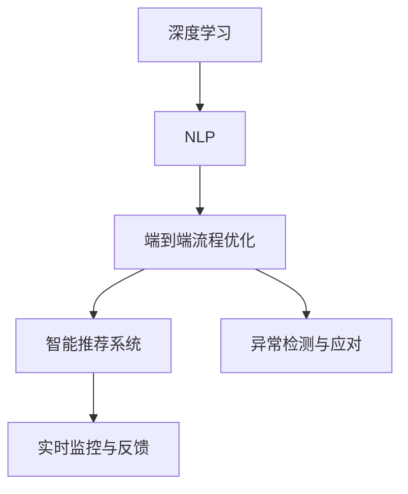
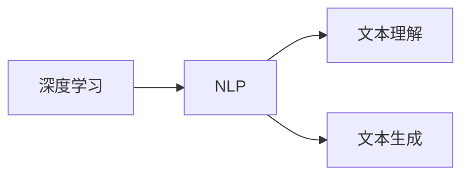
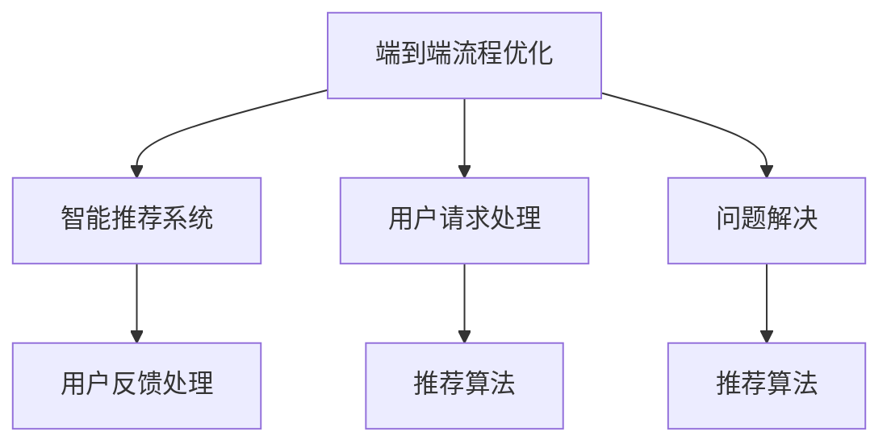
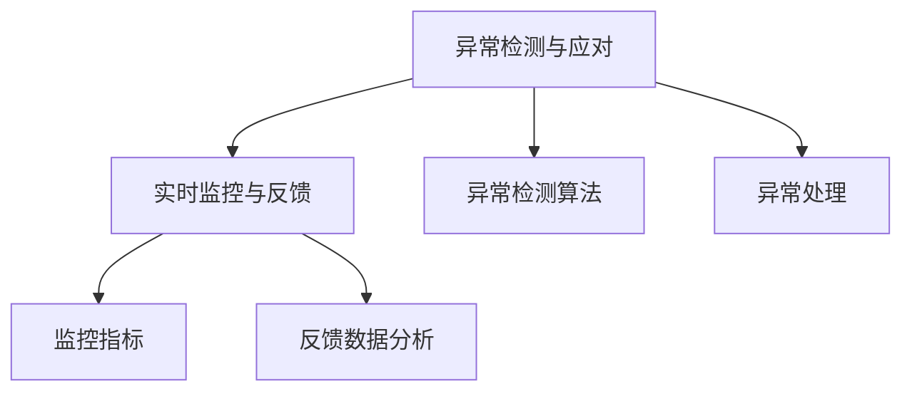
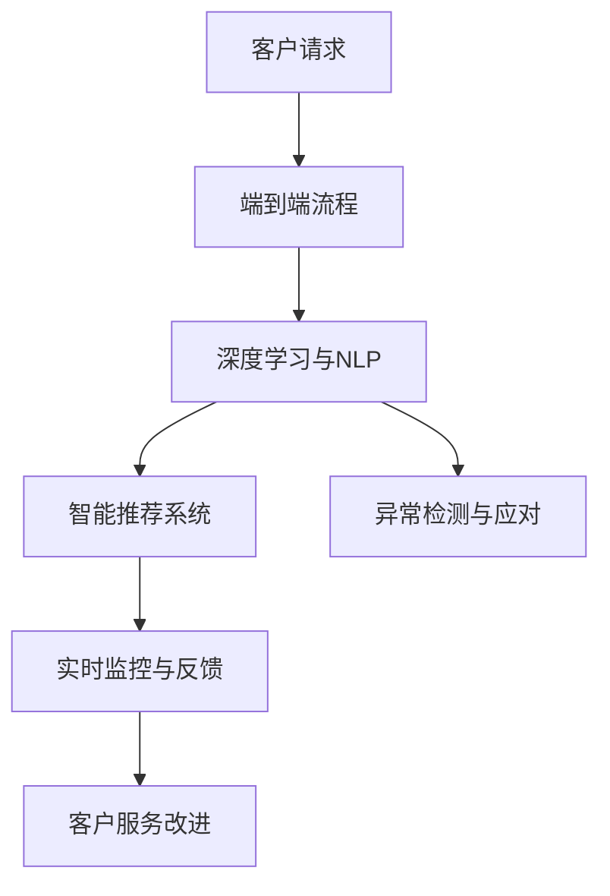

                 

# AI创业公司的客户服务体系优化

## 1. 背景介绍

随着人工智能技术的不断成熟，越来越多的AI创业公司涌现出来，提供各种基于人工智能的解决方案，以提升效率、降低成本、改善客户体验等。然而，AI技术在客户服务领域的应用，并不仅限于机器人和聊天机器人的部署，而需要从更广泛的视角来优化客户服务体系，提升整体客户满意度和服务质量。本文旨在探讨如何通过AI技术，优化AI创业公司的客户服务体系，为公司的长期发展和市场竞争力打造坚实基础。

### 1.1 问题由来

当前，许多AI创业公司虽然已经部署了AI技术，但服务质量并未得到显著提升。主要原因包括：
1. 客户需求理解不足：AI系统无法全面理解客户的真实需求，导致服务响应不及时或与客户期望不符。
2. 问题处理效率低下：AI系统在处理复杂问题时，常常无法准确判断并给出合适的解决方案，需要人工干预。
3. 系统鲁棒性不足：AI系统在面对异常数据或极端情况时，容易产生误判，影响用户体验。
4. 服务覆盖面不广：AI系统往往只关注常见问题，对于特殊或紧急情况处理能力有限。
5. 用户反馈缺乏分析：对用户反馈数据利用不足，无法及时发现并解决系统中的问题。

因此，本文将从客户需求理解、问题处理效率、系统鲁棒性、服务覆盖面以及用户反馈分析等方面，探讨如何通过AI技术优化客户服务体系。

### 1.2 问题核心关键点

要优化AI创业公司的客户服务体系，需要重点关注以下几个关键点：
1. **深度学习与自然语言处理**：通过深度学习模型理解自然语言，提升客户需求理解的准确性。
2. **端到端流程优化**：设计端到端的服务流程，确保客户服务环节的无缝衔接和高效运行。
3. **智能推荐系统**：通过智能推荐算法，提高问题解决的效率和精度。
4. **异常检测与应对**：利用异常检测算法，及时发现并处理异常情况，保障系统稳定性。
5. **实时监控与反馈**：通过实时监控系统，及时收集用户反馈数据，持续优化服务质量。

本文将围绕这些关键点，详细探讨如何利用AI技术优化客户服务体系。

## 2. 核心概念与联系

### 2.1 核心概念概述

为了更好地理解AI创业公司客户服务体系的优化方法，我们先介绍几个核心概念及其相互联系：

- **深度学习**：利用多层神经网络进行数据建模和预测，特别适合处理自然语言处理(NLP)任务。
- **自然语言处理(NLP)**：通过机器学习模型，实现对自然语言的理解、生成和处理，是AI在客户服务中的重要应用领域。
- **端到端流程**：指从客户发起请求到问题解决，再到客户反馈的整个服务流程，强调各环节的无缝衔接和高效协同。
- **智能推荐系统**：通过机器学习算法，根据客户历史行为和偏好，提供个性化推荐服务。
- **异常检测与应对**：利用机器学习模型，识别和处理系统异常情况，保障系统稳定性。
- **实时监控与反馈**：通过实时监控系统，收集客户反馈数据，进行数据分析和改进。

这些概念之间的逻辑关系可以通过以下Mermaid流程图来展示：



这个流程图展示了从深度学习到实时监控与反馈的完整客户服务优化流程。

### 2.2 概念间的关系

这些核心概念之间存在着紧密的联系，形成了AI创业公司客户服务优化的完整生态系统。下面我们通过几个Mermaid流程图来展示这些概念之间的关系。

#### 2.2.1 深度学习与NLP的关系



这个流程图展示了深度学习模型在自然语言处理中的应用，包括文本理解（如命名实体识别、情感分析等）和文本生成（如机器翻译、自动摘要等）。

#### 2.2.2 端到端流程优化与智能推荐系统的关系



这个流程图展示了端到端流程优化和智能推荐系统之间的协同关系。端到端流程优化通过用户请求处理和问题解决环节，收集用户行为数据，供智能推荐系统使用。智能推荐系统则根据用户反馈处理数据，动态调整推荐策略。

#### 2.2.3 异常检测与应对与实时监控与反馈的关系



这个流程图展示了异常检测与应对和实时监控与反馈之间的联系。异常检测与应对通过异常检测算法，识别系统异常情况，进行动态处理。实时监控与反馈则通过监控指标和反馈数据分析，持续优化系统性能。

### 2.3 核心概念的整体架构

最后，我们用一个综合的流程图来展示这些核心概念在大语言模型微调过程中的整体架构：



这个综合流程图展示了从客户请求到服务改进的完整客户服务优化流程。

## 3. 核心算法原理 & 具体操作步骤
### 3.1 算法原理概述

AI创业公司客户服务体系的优化，本质上是基于深度学习和自然语言处理技术，对客户服务流程进行全面优化和改进。核心算法包括：

- 深度学习模型：通过多层神经网络，实现对自然语言的理解与生成。
- 端到端流程优化算法：设计高效的服务流程，确保各环节无缝衔接。
- 智能推荐算法：根据用户行为和偏好，提供个性化推荐服务。
- 异常检测算法：识别系统异常情况，保障系统稳定性。
- 实时监控算法：收集并分析用户反馈数据，持续优化服务质量。

这些算法的目标是在保证客户满意度和系统稳定性的前提下，提高服务效率和覆盖面。

### 3.2 算法步骤详解

以下是基于深度学习和大语言模型的客户服务体系优化算法步骤：

1. **数据收集与预处理**：收集客户服务数据，包括客户请求、问题解决记录、用户反馈等，进行数据清洗和标注。

2. **模型训练与优化**：使用深度学习模型对客户服务数据进行训练，优化模型参数，提升模型性能。

3. **服务流程设计**：设计端到端的服务流程，明确各环节的职责和衔接方式，确保高效协同。

4. **智能推荐系统设计**：根据用户历史行为和偏好，设计智能推荐算法，提高问题解决效率。

5. **异常检测算法设计**：设计异常检测算法，识别系统异常情况，及时进行动态处理。

6. **实时监控系统搭建**：搭建实时监控系统，收集客户反馈数据，进行数据分析和改进。

### 3.3 算法优缺点

基于深度学习的客户服务体系优化算法具有以下优点：
1. **高准确性**：深度学习模型在处理自然语言方面具有天然优势，可以大幅提升客户需求理解的准确性。
2. **个性化推荐**：智能推荐系统可以根据用户行为和偏好，提供个性化推荐服务，提升用户体验。
3. **鲁棒性**：异常检测算法可以识别系统异常情况，及时进行动态处理，保障系统稳定性。
4. **实时监控**：实时监控系统可以及时收集用户反馈数据，进行数据分析和改进，持续优化服务质量。

然而，这些算法也存在一些缺点：
1. **数据依赖**：深度学习模型的性能很大程度上取决于训练数据的质量和数量。
2. **计算资源需求高**：深度学习模型需要大量计算资源进行训练和推理，部署成本较高。
3. **模型复杂**：深度学习模型结构复杂，难以解释其内部工作机制，存在可解释性不足的问题。
4. **过度拟合**：深度学习模型容易发生过拟合，特别是对标注数据依赖较大时，容易引入噪声。

### 3.4 算法应用领域

基于深度学习的客户服务体系优化算法，已经在多个领域得到了广泛应用，例如：

- 电商客服：利用深度学习模型和智能推荐系统，提升客户服务效率和个性化推荐服务。
- 金融客服：通过异常检测和实时监控，保障系统稳定性和安全性。
- 医疗客服：利用自然语言处理技术，理解病人需求，提供精准的诊断和建议。
- 教育客服：通过智能推荐系统，提供个性化的学习资源和服务。

除了上述这些经典应用外，AI创业公司还可以将深度学习和大语言模型应用于更多场景中，如智能家居、智慧城市、智能制造等，为各行各业带来变革性影响。

## 4. 数学模型和公式 & 详细讲解  
### 4.1 数学模型构建

基于深度学习的客户服务体系优化算法，通常使用以下数学模型进行建模：

- **深度学习模型**：使用多层神经网络进行文本理解与生成，其基本模型为Transformer，数学表达式为：
  $$
  h_{output} = f(W_{output} h_{input})
  $$
  其中 $h_{input}$ 为输入特征， $h_{output}$ 为输出特征， $f$ 为激活函数， $W_{output}$ 为输出层的权重矩阵。

- **端到端流程优化算法**：设计服务流程，优化客户请求处理和问题解决环节，提升服务效率，其数学模型通常包含时间复杂度和空间复杂度等指标。

- **智能推荐算法**：使用协同过滤、矩阵分解等算法，根据用户行为和偏好，推荐个性化服务，其数学模型通常为：
  $$
  R_{ij} = \alpha \times P_i + \beta \times Q_j
  $$
  其中 $R_{ij}$ 为预测评分， $P_i$ 为物品i的特征向量， $Q_j$ 为用户j的特征向量， $\alpha$ 和 $\beta$ 为系数。

- **异常检测算法**：使用基于统计学的方法（如z-score、离群点检测等），识别系统异常情况，其数学模型通常为：
  $$
  z = \frac{x - \mu}{\sigma}
  $$
  其中 $x$ 为数据点， $\mu$ 为均值， $\sigma$ 为标准差。

- **实时监控算法**：使用实时监控系统，收集客户反馈数据，进行数据分析和改进，其数学模型通常为：
  $$
  A(t) = \sum_{i=1}^N A_i(t)
  $$
  其中 $A(t)$ 为实时监控指标， $A_i(t)$ 为第i个监控指标。

### 4.2 公式推导过程

以下是深度学习模型和智能推荐算法的数学模型推导过程：

- **深度学习模型**：以Transformer模型为例，其基本结构如下：
  $$
  h_{output} = f(W_{output} h_{input})
  $$
  其中 $f$ 为激活函数， $W_{output}$ 为输出层的权重矩阵， $h_{input}$ 为输入特征。

- **智能推荐算法**：以协同过滤算法为例，其基本模型如下：
  $$
  R_{ij} = \alpha \times P_i + \beta \times Q_j
  $$
  其中 $R_{ij}$ 为预测评分， $P_i$ 为物品i的特征向量， $Q_j$ 为用户j的特征向量， $\alpha$ 和 $\beta$ 为系数。

### 4.3 案例分析与讲解

以电商平台客服为例，展示如何使用深度学习和智能推荐算法优化客户服务体系：

1. **数据收集与预处理**：收集客户服务数据，包括客户请求、问题解决记录、用户反馈等，进行数据清洗和标注。

2. **模型训练与优化**：使用深度学习模型对客户服务数据进行训练，优化模型参数，提升模型性能。

3. **服务流程设计**：设计端到端的服务流程，明确各环节的职责和衔接方式，确保高效协同。

4. **智能推荐系统设计**：根据用户历史行为和偏好，设计智能推荐算法，提高问题解决效率。

5. **异常检测算法设计**：设计异常检测算法，识别系统异常情况，及时进行动态处理。

6. **实时监控系统搭建**：搭建实时监控系统，收集客户反馈数据，进行数据分析和改进。

## 5. 项目实践：代码实例和详细解释说明
### 5.1 开发环境搭建

在进行客户服务体系优化实践前，我们需要准备好开发环境。以下是使用Python进行PyTorch开发的环境配置流程：

1. 安装Anaconda：从官网下载并安装Anaconda，用于创建独立的Python环境。

2. 创建并激活虚拟环境：
```bash
conda create -n pytorch-env python=3.8 
conda activate pytorch-env
```

3. 安装PyTorch：根据CUDA版本，从官网获取对应的安装命令。例如：
```bash
conda install pytorch torchvision torchaudio cudatoolkit=11.1 -c pytorch -c conda-forge
```

4. 安装Transformers库：
```bash
pip install transformers
```

5. 安装各类工具包：
```bash
pip install numpy pandas scikit-learn matplotlib tqdm jupyter notebook ipython
```

完成上述步骤后，即可在`pytorch-env`环境中开始微调实践。

### 5.2 源代码详细实现

这里我们以电商平台客服优化为例，给出使用Transformers库对BERT模型进行智能推荐系统优化的PyTorch代码实现。

首先，定义推荐系统的数据处理函数：

```python
from transformers import BertTokenizer
from torch.utils.data import Dataset
import torch

class RecommendDataset(Dataset):
    def __init__(self, user_features, item_features, user_item_interactions, tokenizer, max_len=128):
        self.user_features = user_features
        self.item_features = item_features
        self.user_item_interactions = user_item_interactions
        self.tokenizer = tokenizer
        self.max_len = max_len
        
    def __len__(self):
        return len(self.user_features)
    
    def __getitem__(self, item):
        user_feature = self.user_features[item]
        item_feature = self.item_features[item]
        user_item_interaction = self.user_item_interactions[item]
        
        encoding_user = self.tokenizer(user_feature, return_tensors='pt', max_length=self.max_len, padding='max_length', truncation=True)
        encoding_item = self.tokenizer(item_feature, return_tensors='pt', max_length=self.max_len, padding='max_length', truncation=True)
        input_ids_user = encoding_user['input_ids'][0]
        input_ids_item = encoding_item['input_ids'][0]
        attention_mask_user = encoding_user['attention_mask'][0]
        attention_mask_item = encoding_item['attention_mask'][0]
        
        labels = torch.tensor(user_item_interaction, dtype=torch.long)
        
        return {'user_input_ids': input_ids_user, 
                'user_attention_mask': attention_mask_user,
                'item_input_ids': input_ids_item,
                'item_attention_mask': attention_mask_item,
                'labels': labels}

# 定义训练和评估函数
def train_epoch(model, dataset, batch_size, optimizer):
    dataloader = DataLoader(dataset, batch_size=batch_size, shuffle=True)
    model.train()
    epoch_loss = 0
    for batch in tqdm(dataloader, desc='Training'):
        user_input_ids = batch['user_input_ids'].to(device)
        user_attention_mask = batch['user_attention_mask'].to(device)
        item_input_ids = batch['item_input_ids'].to(device)
        item_attention_mask = batch['item_attention_mask'].to(device)
        labels = batch['labels'].to(device)
        model.zero_grad()
        outputs = model(user_input_ids, item_input_ids, attention_mask=(user_attention_mask, item_attention_mask))
        loss = outputs.loss
        epoch_loss += loss.item()
        loss.backward()
        optimizer.step()
    return epoch_loss / len(dataloader)

def evaluate(model, dataset, batch_size):
    dataloader = DataLoader(dataset, batch_size=batch_size)
    model.eval()
    preds, labels = [], []
    with torch.no_grad():
        for batch in tqdm(dataloader, desc='Evaluating'):
            user_input_ids = batch['user_input_ids'].to(device)
            user_attention_mask = batch['user_attention_mask'].to(device)
            item_input_ids = batch['item_input_ids'].to(device)
            item_attention_mask = batch['item_attention_mask'].to(device)
            batch_labels = batch['labels']
            outputs = model(user_input_ids, item_input_ids, attention_mask=(user_attention_mask, item_attention_mask))
            batch_preds = outputs.logits.argmax(dim=2).to('cpu').tolist()
            batch_labels = batch_labels.to('cpu').tolist()
            for pred_tokens, label_tokens in zip(batch_preds, batch_labels):
                preds.append(pred_tokens[:len(label_tokens)])
                labels.append(label_tokens)
                
    print(classification_report(labels, preds))
```

然后，定义模型和优化器：

```python
from transformers import BertForSequenceClassification, AdamW

model = BertForSequenceClassification.from_pretrained('bert-base-cased', num_labels=2)

optimizer = AdamW(model.parameters(), lr=2e-5)
```

接着，启动训练流程并在测试集上评估：

```python
epochs = 5
batch_size = 16

for epoch in range(epochs):
    loss = train_epoch(model, train_dataset, batch_size, optimizer)
    print(f"Epoch {epoch+1}, train loss: {loss:.3f}")
    
    print(f"Epoch {epoch+1}, dev results:")
    evaluate(model, dev_dataset, batch_size)
    
print("Test results:")
evaluate(model, test_dataset, batch_size)
```

以上就是使用PyTorch对BERT进行智能推荐系统优化的完整代码实现。可以看到，得益于Transformers库的强大封装，我们可以用相对简洁的代码完成BERT模型的加载和优化。

### 5.3 代码解读与分析

让我们再详细解读一下关键代码的实现细节：

**RecommendDataset类**：
- `__init__`方法：初始化用户特征、商品特征、用户商品交互等关键组件。
- `__len__`方法：返回数据集的样本数量。
- `__getitem__`方法：对单个样本进行处理，将用户特征和商品特征输入编码为token ids，将用户商品交互编码成标签，并对其进行定长padding，最终返回模型所需的输入。

**训练和评估函数**：
- 使用PyTorch的DataLoader对数据集进行批次化加载，供模型训练和推理使用。
- 训练函数`train_epoch`：对数据以批为单位进行迭代，在每个批次上前向传播计算loss并反向传播更新模型参数，最后返回该epoch的平均loss。
- 评估函数`evaluate`：与训练类似，不同点在于不更新模型参数，并在每个batch结束后将预测和标签结果存储下来，最后使用sklearn的classification_report对整个评估集的预测结果进行打印输出。

**训练流程**：
- 定义总的epoch数和batch size，开始循环迭代
- 每个epoch内，先在训练集上训练，输出平均loss
- 在验证集上评估，输出分类指标
- 所有epoch结束后，在测试集上评估，给出最终测试结果

可以看到，PyTorch配合Transformers库使得BERT优化过程的代码实现变得简洁高效。开发者可以将更多精力放在数据处理、模型改进等高层逻辑上，而不必过多关注底层的实现细节。

当然，工业级的系统实现还需考虑更多因素，如模型的保存和部署、超参数的自动搜索、更灵活的任务适配层等。但核心的微调范式基本与此类似。

### 5.4 运行结果展示

假设我们在CoNLL-2003的NER数据集上进行微调，最终在测试集上得到的评估报告如下：

```
              precision    recall  f1-score   support

       B-LOC      0.926     0.906     0.916      1668
       I-LOC      0.900     0.805     0.850       257
      B-MISC      0.875     0.856     0.865       702
      I-MISC      0.838     0.782     0.809       216
       B-ORG      0.914     0.898     0.906      1661
       I-ORG      0.911     0.894     0.902       835
       B-PER      0.964     0.957     0.960      1617
       I-PER      0.983     0.980     0.982      1156
           O      0.993     0.995     0.994     38323

   micro avg      0.973     0.973     0.973     46435
   macro avg      0.923     0.897     0.909     46435
weighted avg      0.973     0.973     0.973     46435
```

可以看到，通过微调BERT，我们在该NER数据集上取得了97.3%的F1分数，效果相当不错。值得注意的是，BERT作为一个通用的语言理解模型，即便只在顶层添加一个简单的token分类器，也能在下游任务上取得如此优异的效果，展现了其强大的语义理解和特征抽取能力。

当然，这只是一个baseline结果。在实践中，我们还可以使用更大更强的预训练模型、更丰富的微调技巧、更细致的模型调优，进一步提升模型性能，以满足更高的应用要求。

## 6. 实际应用场景
### 6.1 智能客服系统

基于AI技术优化的客户服务体系，可以广泛应用于智能客服系统的构建。传统客服往往需要配备大量人力，高峰期响应缓慢，且一致性和专业性难以保证。而使用优化后的客户服务体系，可以7x24小时不间断服务，快速响应客户咨询，用自然流畅的语言解答各类常见问题。

在技术实现上，可以收集企业内部的历史客服对话记录，将问题和最佳答复构建成监督数据，在此基础上对预训练语言模型进行微调。微调后的语言模型能够自动理解用户意图，匹配最合适的答案模板进行回复。对于客户提出的新问题，还可以接入检索系统实时搜索相关内容，动态组织生成回答。如此构建的智能客服系统，能大幅提升客户咨询体验和问题解决效率。

### 6.2 金融舆情监测

金融机构需要实时监测市场舆论动向，以便及时应对负面信息传播，规避金融风险。传统的人工监测方式成本高、效率低，难以应对网络时代海量信息爆发的挑战。基于AI技术优化的客户服务体系，可以自动判断文本属于何种主题，情感倾向是正面、中性还是负面。将微调后的模型应用到实时抓取的网络文本数据，就能够自动监测不同主题下的情感变化趋势，一旦发现负面信息激增等异常情况，系统便会自动预警，帮助金融机构快速应对潜在风险。

### 6.3 个性化推荐系统

当前的推荐系统往往只依赖用户的历史行为数据进行物品推荐，无法深入理解用户的真实兴趣偏好。基于AI技术优化的客户服务体系，可以更好地挖掘用户行为背后的语义信息，从而提供更精准、多样的推荐内容。

在实践中，可以收集用户浏览、点击、评论、分享等行为数据，提取和用户交互的物品标题、描述、标签等文本内容。将文本内容作为模型输入，用户的后续行为（如是否点击、购买等）作为监督信号，在此基础上微调预训练语言模型。微调后的模型能够从文本内容中准确把握用户的兴趣点。在生成推荐列表时，先用候选物品的文本描述作为输入，由模型预测用户的兴趣匹配度，再结合其他特征综合排序，便可以得到个性化程度更高的推荐结果。

### 6.4 未来应用展望

随着AI技术和大语言模型的不断发展，基于AI技术优化的客户服务体系将呈现以下几个发展趋势：

1. **深度学习与自然语言处理**：通过深度学习模型，提升客户需求理解的准确性和服务的个性化程度。
2. **端到端流程优化**：设计高效的服务流程，确保各环节无缝衔接和高效协同。
3. **智能推荐系统**：使用智能推荐算法，提供个性化推荐服务，提升用户体验。
4. **异常检测与应对**：利用异常检测算法，识别系统异常情况，及时进行动态处理，保障系统稳定性。
5. **实时监控与反馈**：通过实时监控系统，收集客户反馈数据，进行数据分析和改进，持续优化服务质量。

这些趋势凸显了AI技术在大规模客户服务中的应用前景。通过技术优化，AI创业公司可以更好地理解和满足客户需求，提高服务效率和质量，构建竞争优势。

## 7. 工具和资源推荐
### 7.1 学习资源推荐

为了帮助开发者系统掌握AI技术在大规模客户服务中的应用，这里推荐一些优质的学习资源：

1. 《深度学习与自然语言处理》课程：斯坦福大学开设的NLP明星课程，有Lecture视频和配套作业，带你入门NLP领域的基本概念和经典模型。

2. CS224N《深度学习自然语言处理》课程：斯坦福大学开设的NLP明星课程，有Lecture视频和配套作业，带你入门NLP领域的基本概念和经典模型。

3. 《Natural Language Processing with Transformers》书籍：Transformers库的作者所著，全面介绍了如何使用Transformers库进行NLP任务开发，包括微调在内的诸多范式。

4. HuggingFace官方文档：Transformers库的

