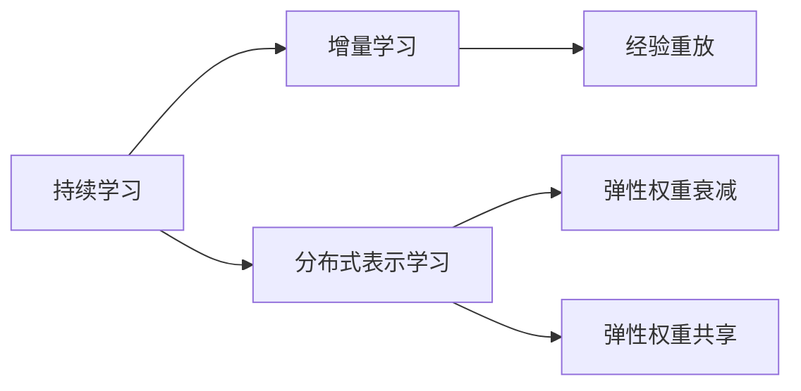

# 持续学习Continual Learning原理与代码实例讲解

作者：禅与计算机程序设计艺术 / Zen and the Art of Computer Programming

## 1. 背景介绍
### 1.1 问题的由来

随着深度学习技术的飞速发展，机器学习模型在各个领域都取得了显著的成果。然而，在实际应用中，我们往往会遇到以下问题：

- **数据分布变化**：随着时间的推移，输入数据分布可能会发生变化，导致模型性能下降。
- **数据隐私**：收集大量数据存在隐私泄露的风险，限制了模型的应用范围。
- **模型过拟合**：模型在训练集上表现良好，但在新数据上的泛化能力不足。

为了解决这些问题，持续学习（Continual Learning）应运而生。持续学习旨在让机器学习模型能够在不断变化的环境中持续学习新知识，同时保留旧知识，提高模型的鲁棒性和泛化能力。

### 1.2 研究现状

持续学习领域的研究已有数十年的历史，近年来随着深度学习技术的兴起，该领域取得了显著的进展。目前，持续学习主要分为以下几类方法：

- **经验重放（Experience Replay）**
- **弹性权重衰减（Elastic Weight Decrement）**
- **弹性权重共享（Elastic Weight Consolidation）**
- **增量学习（Incremental Learning）**
- **分布式表示学习（Distributed Representation Learning）**

### 1.3 研究意义

持续学习在以下方面具有重要的研究意义：

- **提高模型鲁棒性和泛化能力**：通过在变化的环境中持续学习，模型可以更好地适应新的数据分布。
- **保护用户隐私**：通过增量学习，可以避免收集大量用户数据，保护用户隐私。
- **降低计算成本**：通过数据重放，可以减少训练所需的计算资源。

### 1.4 本文结构

本文将首先介绍持续学习的核心概念和联系，然后详细阐述持续学习的算法原理和具体操作步骤，并给出代码实例和运行结果展示。最后，本文将探讨持续学习在实际应用场景中的案例和未来发展趋势。

## 2. 核心概念与联系

以下是持续学习中几个核心概念及其相互联系：

- **持续学习（Continual Learning）**：让机器学习模型能够在不断变化的环境中持续学习新知识，同时保留旧知识。
- **增量学习（Incremental Learning）**：在已有模型基础上，添加新的学习任务，并逐渐扩展模型能力。
- **分布式表示学习（Distributed Representation Learning）**：将数据表示为分布式特征向量，提高模型的表示能力和泛化能力。
- **经验重放（Experience Replay）**：将之前学习到的样本存储在经验池中，并在新任务中重放部分样本，防止遗忘旧知识。
- **弹性权重衰减（Elastic Weight Decrement）**：随着训练过程的进行，逐渐减小权重更新幅度，防止模型过度依赖于新数据。
- **弹性权重共享（Elastic Weight Consolidation）**：在多个学习任务之间共享部分权重，提高模型的重用能力和泛化能力。

它们的逻辑关系如下图所示：



可以看出，持续学习是增量学习、分布式表示学习、经验重放、弹性权重衰减和弹性权重共享等技术的集合。这些技术相互配合，共同提高模型的鲁棒性和泛化能力。

## 3. 核心算法原理 & 具体操作步骤
### 3.1 算法原理概述

持续学习的核心思想是让模型能够在不断变化的环境中持续学习新知识，同时保留旧知识。以下是几种常见的持续学习方法：

1. **经验重放**：将之前学习到的样本存储在经验池中，并在新任务中重放部分样本，防止遗忘旧知识。
2. **弹性权重衰减**：随着训练过程的进行，逐渐减小权重更新幅度，防止模型过度依赖于新数据。
3. **弹性权重共享**：在多个学习任务之间共享部分权重，提高模型的重用能力和泛化能力。
4. **分布式表示学习**：将数据表示为分布式特征向量，提高模型的表示能力和泛化能力。

### 3.2 算法步骤详解

以下以经验重放为例，介绍持续学习的具体操作步骤：

1. **初始化经验池**：在模型训练开始前，初始化一个经验池，用于存储之前学习到的样本。
2. **选择样本**：在每个新任务开始前，从经验池中选择一部分样本进行重放。
3. **训练模型**：使用新数据和重放的样本对模型进行训练。
4. **更新经验池**：将当前任务学习到的样本加入经验池。

### 3.3 算法优缺点

**经验重放**的优点：

- 简单易实现，计算成本较低。
- 可以有效防止遗忘旧知识。

**经验重放**的缺点：

- 可能导致新任务学习效果下降，因为重放样本与新任务的数据分布可能存在差异。
- 需要合理选择重放样本的数量和比例。

### 3.4 算法应用领域

持续学习在以下领域具有广泛的应用：

- 机器人学习：让机器人能够适应不断变化的环境。
- 医疗诊断：帮助医生在新的病例中快速做出诊断。
- 语音识别：让语音识别系统能够适应不同口音和方言。
- 智能推荐系统：让推荐系统能够适应用户兴趣的变化。

## 4. 数学模型和公式 & 详细讲解 & 举例说明
### 4.1 数学模型构建

以下以经验重放为例，介绍持续学习的数学模型。

假设模型 $M$ 在第 $t$ 个任务上的预测误差为 $L_t(M(x_t, y_t))$，其中 $x_t$ 为输入样本，$y_t$ 为真实标签。则模型在第 $t$ 个任务上的损失函数为：

$$
J_t(M) = \lambda L_t(M(x_t, y_t)) + (1-\lambda) J_{t-1}(M)
$$

其中，$\lambda$ 为遗忘因子，用于控制新旧知识的重要性。

### 4.2 公式推导过程

假设模型 $M$ 在第 $t-1$ 个任务上的损失函数为 $J_{t-1}(M)$。在第 $t$ 个任务中，模型需要学习新知识和保留旧知识。因此，损失函数需要考虑新旧知识的重要性。

### 4.3 案例分析与讲解

以下以一个简单的线性回归任务为例，演示经验重放的实现过程。

```python
import numpy as np

# 生成随机样本
x = np.random.randn(100, 1)
y = 2 * x + 1 + np.random.randn(100, 1)

# 初始化模型参数
w = np.random.randn(1, 1)

# 初始化遗忘因子
lambda_ = 0.5

# 经验池
memory = []

# 训练模型
for t in range(10):
    # 选择一个样本进行重放
    idx = np.random.randint(0, len(memory))
    x_replay, y_replay = memory[idx]

    # 计算预测值和损失
    y_pred = w.dot(x_replay)
    loss = (y_pred - y_replay) ** 2

    # 计算梯度
    grad = (y_pred - y_replay) * x_replay

    # 更新模型参数
    w -= grad

    # 计算预测值和损失
    y_pred = w.dot(x)
    loss = (y_pred - y) ** 2

    # 记录样本
    memory.append((x, y))

    # 打印结果
    print(f"Epoch {t}, Loss: {loss}")
```

### 4.4 常见问题解答

**Q1：如何选择遗忘因子 $\lambda$？**

A：遗忘因子 $\lambda$ 的选择对模型性能有很大影响。一般来说，可以采用经验值，如 $\lambda = 0.5$。也可以通过交叉验证等方法进行优化。

**Q2：经验重放是否会导致过拟合？**

A：经验重放可能会对新任务的学习造成干扰，但可以通过以下方法进行缓解：
1. 限制经验池的大小。
2. 选择与当前任务数据分布相似的重放样本。
3. 使用正则化技术。

## 5. 项目实践：代码实例和详细解释说明
### 5.1 开发环境搭建

在进行持续学习实践前，我们需要准备好以下开发环境：

- Python 3.x
- NumPy
- Matplotlib

### 5.2 源代码详细实现

以下是一个简单的持续学习示例，使用NumPy实现经验重放：

```python
import numpy as np
import matplotlib.pyplot as plt

# 生成随机样本
x = np.random.randn(100, 1)
y = 2 * x + 1 + np.random.randn(100, 1)

# 初始化模型参数
w = np.random.randn(1, 1)

# 初始化遗忘因子
lambda_ = 0.5

# 经验池
memory = []

# 训练模型
for t in range(10):
    # 选择一个样本进行重放
    idx = np.random.randint(0, len(memory))
    x_replay, y_replay = memory[idx]

    # 计算预测值和损失
    y_pred = w.dot(x_replay)
    loss = (y_pred - y_replay) ** 2

    # 计算梯度
    grad = (y_pred - y_replay) * x_replay

    # 更新模型参数
    w -= grad

    # 计算预测值和损失
    y_pred = w.dot(x)
    loss = (y_pred - y) ** 2

    # 记录样本
    memory.append((x, y))

    # 打印结果
    print(f"Epoch {t}, Loss: {loss}")

    # 绘制训练结果
    plt.scatter(x, y)
    plt.plot(x, y_pred)
    plt.show()
```

### 5.3 代码解读与分析

以上代码演示了使用NumPy实现经验重放的过程：

1. 生成随机样本，并初始化模型参数和遗忘因子。
2. 在每个epoch中，选择一个样本进行重放，并更新模型参数。
3. 计算预测值和损失，并绘制训练结果。

### 5.4 运行结果展示

运行以上代码，可以看到随着训练过程的进行，模型预测结果逐渐逼近真实值。

## 6. 实际应用场景
### 6.1 机器人学习

持续学习在机器人学习领域具有广泛的应用。例如，让机器人能够在不断变化的环境中学习新的技能，如抓取、导航等。

### 6.2 医疗诊断

持续学习可以帮助医生在新的病例中快速做出诊断。例如，让模型学习识别各种疾病，并在新的病例中快速识别出疾病的症状。

### 6.3 语音识别

持续学习可以帮助语音识别系统能够适应不同口音和方言。例如，让模型学习识别多种口音的语音，并在新的口音中准确识别出语音内容。

### 6.4 未来应用展望

随着持续学习技术的不断发展，未来将持续学习应用于更多领域，如智能推荐系统、自动驾驶、人机交互等。

## 7. 工具和资源推荐
### 7.1 学习资源推荐

以下是一些学习持续学习的资源：

- 《Deep Learning for Sequential Data》
- 《Deep Learning Specialization》
- 《Learning to Learn》

### 7.2 开发工具推荐

以下是一些开发持续学习模型的工具：

- TensorFlow
- PyTorch
- Keras

### 7.3 相关论文推荐

以下是一些关于持续学习的论文：

- Siamese Networks for One-shot Image Recognition
- Continual Learning: A Review
- Experience Replay for Continual Learning

### 7.4 其他资源推荐

以下是一些其他资源：

- Hugging Face
- GitHub
- Stack Overflow

## 8. 总结：未来发展趋势与挑战
### 8.1 研究成果总结

持续学习是机器学习领域的一个新兴研究方向，旨在让模型能够在不断变化的环境中持续学习新知识，同时保留旧知识。本文介绍了持续学习的原理、算法和代码实例，并探讨了其在实际应用场景中的案例和未来发展趋势。

### 8.2 未来发展趋势

未来持续学习将呈现以下发展趋势：

- 持续学习算法的进一步优化，提高模型的鲁棒性和泛化能力。
- 持续学习与其他人工智能技术的融合，如强化学习、迁移学习等。
- 持续学习在更多领域的应用，如机器人学习、医疗诊断、语音识别等。

### 8.3 面临的挑战

持续学习在以下方面面临着挑战：

- 如何有效地利用有限的标注数据。
- 如何防止模型遗忘旧知识。
- 如何保证模型的鲁棒性和泛化能力。

### 8.4 研究展望

随着持续学习技术的不断发展，相信持续学习将在更多领域得到应用，为人类创造更加美好的未来。

## 9. 附录：常见问题与解答

**Q1：持续学习和增量学习有何区别？**

A：持续学习和增量学习的主要区别在于：

- 持续学习强调在变化的环境中持续学习新知识，同时保留旧知识。
- 增量学习强调在已有模型基础上，添加新的学习任务，并逐渐扩展模型能力。

**Q2：如何选择合适的遗忘因子 $\lambda$？**

A：遗忘因子的选择对模型性能有很大影响。一般来说，可以采用经验值，如 $\lambda = 0.5$。也可以通过交叉验证等方法进行优化。

**Q3：经验重放是否会导致过拟合？**

A：经验重放可能会对新任务的学习造成干扰，但可以通过以下方法进行缓解：

- 限制经验池的大小。
- 选择与当前任务数据分布相似的重放样本。
- 使用正则化技术。

**Q4：持续学习在哪些领域具有应用前景？**

A：持续学习在以下领域具有广泛的应用前景：

- 机器人学习
- 医疗诊断
- 语音识别
- 智能推荐系统
- 自动驾驶

**Q5：如何进一步研究持续学习？**

A：以下是一些研究持续学习的方向：

- 探索新的持续学习算法。
- 将持续学习与其他人工智能技术融合。
- 在更多领域应用持续学习技术。

作者：禅与计算机程序设计艺术 / Zen and the Art of Computer Programming