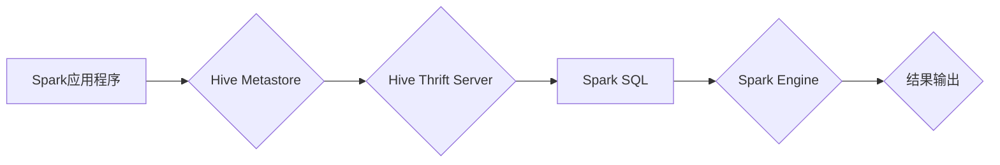

## Spark-Hive整合原理与代码实例讲解

> 关键词：Spark, Hive, 数据处理, 集群计算, ETL, 数据仓库, SQL, Scala

## 1. 背景介绍

在现代数据分析时代，海量数据的处理和分析成为企业发展的重要驱动力。Spark 和 Hive 作为大数据处理领域的明星技术，各自在数据处理和数据仓库领域占据着重要地位。Spark 以其高性能、灵活性和易用性，成为实时数据处理的首选引擎；而 Hive 以其 SQL-like 语法和数据仓库管理能力，成为数据分析和报表生成的重要工具。

然而，Spark 和 Hive 的独立使用存在一些局限性。Spark 缺乏成熟的数据仓库管理功能，Hive 的处理速度相对较慢。因此，将 Spark 和 Hive 整合在一起，充分发挥各自优势，成为大数据处理领域的重要趋势。

## 2. 核心概念与联系

Spark 和 Hive 的整合主要通过两种方式实现：

* **Spark SQL:** Spark 提供了 Spark SQL 模块，可以执行 HiveQL 查询，并利用 Spark 的高性能进行数据处理。
* **Hive Thrift Server:** Hive 提供了 Thrift 服务器，可以作为 Spark 的数据源，方便 Spark 读取 Hive 表数据进行处理。

**Spark-Hive 整合架构流程图:**



**核心概念:**

* **Spark SQL:** Spark 的 SQL 模块，支持 HiveQL 查询，并利用 Spark 的高性能进行数据处理。
* **Hive Metastore:** Hive 元数据存储，存储 Hive 表的元数据信息，如表结构、数据位置等。
* **Hive Thrift Server:** Hive 提供的 Thrift 服务器，可以作为 Spark 的数据源，方便 Spark 读取 Hive 表数据进行处理。
* **Spark Engine:** Spark 的核心计算引擎，负责执行 Spark SQL 查询，并进行数据处理。

## 3. 核心算法原理 & 具体操作步骤

### 3.1  算法原理概述

Spark-Hive 整合的核心算法原理是将 HiveQL 查询转换为 Spark 的内部表示，然后由 Spark Engine 执行。

**具体步骤:**

1. Spark SQL 解析 HiveQL 查询语句。
2. Spark SQL 将 HiveQL 查询转换为 Spark 的内部表示，即 RDD 或 DataFrame。
3. Spark Engine 执行 Spark 的内部表示，并进行数据处理。
4. Spark Engine 将处理结果返回给 Spark SQL。
5. Spark SQL 将处理结果转换为 HiveQL 格式，并返回给用户。

### 3.2  算法步骤详解

1. **HiveQL 查询解析:** Spark SQL 解析器会分析 HiveQL 查询语句，识别出查询的表、列、条件等信息。
2. **查询计划生成:** Spark SQL 会根据查询语句生成一个查询计划，确定查询的执行顺序和操作。
3. **数据读取:** Spark 会从 Hive Metastore 中获取表元数据，并根据元数据信息读取数据。
4. **数据处理:** Spark Engine 会执行查询计划中的操作，对数据进行过滤、聚合、排序等处理。
5. **结果输出:** Spark 会将处理结果输出到指定位置，例如 HDFS 或数据库。

### 3.3  算法优缺点

**优点:**

* **高性能:** Spark 的高性能可以显著提高 Hive 查询的速度。
* **灵活性和易用性:** Spark SQL 支持 HiveQL 语法，方便用户使用 Hive 的数据处理能力。
* **扩展性:** Spark 可以轻松扩展到更大的集群，处理更大的数据量。

**缺点:**

* **复杂性:** Spark-Hive 整合的实现相对复杂，需要对 Spark 和 Hive 有深入的了解。
* **兼容性:** Spark 和 Hive 的版本兼容性需要特别注意。

### 3.4  算法应用领域

Spark-Hive 整合广泛应用于以下领域:

* **数据仓库:** 将 Hive 作为数据仓库，使用 Spark 进行数据处理和分析。
* **ETL:** 使用 Spark-Hive 整合进行数据提取、转换和加载。
* **实时数据分析:** 使用 Spark 的实时处理能力进行实时数据分析。

## 4. 数学模型和公式 & 详细讲解 & 举例说明

Spark-Hive 整合涉及到数据处理、查询优化等多个方面，其数学模型和公式主要用于数据分区、数据倾斜等问题。

### 4.1  数学模型构建

**数据分区:**

Spark 将数据划分为多个分区，每个分区在不同的节点上进行处理。数据分区策略可以影响查询性能。常见的分区策略包括：

* **Hash 分区:** 根据数据键值对数据进行哈希运算，将数据分配到不同的分区。
* **Range 分区:** 根据数据键值范围将数据分配到不同的分区。

**数据倾斜:**

数据倾斜是指某些分区的数据量远大于其他分区，导致某些节点处理负担过重。

### 4.2  公式推导过程

**数据倾斜度:**

数据倾斜度可以表示为：

$$
\text{倾斜度} = \frac{\text{最大分区大小}}{\text{最小分区大小}}
$$

### 4.3  案例分析与讲解

假设一个 Hive 表包含 100 万条数据，并根据用户 ID 进行分区。如果某个用户 ID 的数据量占总数据量的 90%，则该表存在数据倾斜问题。

## 5. 项目实践：代码实例和详细解释说明

### 5.1  开发环境搭建

* 安装 Spark 和 Hive。
* 配置 Spark 和 Hive 的环境变量。
* 创建 Hive 元数据存储。

### 5.2  源代码详细实现

```scala
import org.apache.spark.sql.SparkSession

object SparkHiveIntegration {
  def main(args: Array[String]): Unit = {
    // 创建 SparkSession
    val spark = SparkSession.builder()
     .appName("SparkHiveIntegration")
     .enableHiveSupport()
     .getOrCreate()

    // 读取 Hive 表数据
    val df = spark.sql("SELECT * FROM my_hive_table")

    // 对数据进行处理
    val processedDF = df.filter($"age" > 30)

    // 将处理结果写入 Hive 表
    processedDF.write.mode("overwrite").saveAsTable("processed_hive_table")

    // 关闭 SparkSession
    spark.stop()
  }
}
```

### 5.3  代码解读与分析

* `enableHiveSupport()`: 开启 Hive 支持，方便 Spark 读取 Hive 表数据。
* `spark.sql("SELECT * FROM my_hive_table")`: 使用 Spark SQL 语法读取 Hive 表数据。
* `df.filter($"age" > 30)`: 对数据进行过滤操作。
* `processedDF.write.mode("overwrite").saveAsTable("processed_hive_table")`: 将处理结果写入 Hive 表。

### 5.4  运行结果展示

运行代码后，将从 `my_hive_table` 表中读取数据，过滤年龄大于 30 的数据，并将结果写入 `processed_hive_table` 表。

## 6. 实际应用场景

Spark-Hive 整合在实际应用场景中具有广泛的应用价值。

### 6.1  数据仓库建设

Spark-Hive 整合可以用于构建高效的数据仓库，将 Hive 作为数据仓库，使用 Spark 进行数据处理和分析。

### 6.2  ETL 流程优化

Spark-Hive 整合可以用于优化 ETL 流程，使用 Spark 的高性能进行数据转换和加载。

### 6.3  实时数据分析

Spark-Hive 整合可以用于实时数据分析，使用 Spark 的实时处理能力进行实时数据分析。

### 6.4  未来应用展望

随着大数据处理技术的不断发展，Spark-Hive 整合将继续发挥重要作用，并应用于更多领域。例如：

* **机器学习:** 将 Spark-Hive 整合用于机器学习数据处理和模型训练。
* **人工智能:** 将 Spark-Hive 整合用于人工智能算法的训练和应用。

## 7. 工具和资源推荐

### 7.1  学习资源推荐

* Spark 官方文档: https://spark.apache.org/docs/latest/
* Hive 官方文档: https://hive.apache.org/docs/
* Spark-Hive 整合教程: https://spark.apache.org/docs/latest/sql-programming-guide.html#hive-support

### 7.2  开发工具推荐

* Apache Spark: https://spark.apache.org/downloads.html
* Apache Hive: https://hive.apache.org/downloads.html
* IDE: Eclipse, IntelliJ IDEA

### 7.3  相关论文推荐

* Spark SQL: https://static.googleusercontent.com/media/research.google.com/en//pubs/archive/43911.pdf
* Hive: https://www.usenix.org/system/files/conference/osdi09/osdi09-paper-deppeler.pdf

## 8. 总结：未来发展趋势与挑战

### 8.1  研究成果总结

Spark-Hive 整合技术已经取得了显著的成果，提高了数据处理效率，简化了数据分析流程。

### 8.2  未来发展趋势

* **更紧密的集成:** Spark 和 Hive 将更加紧密地集成，实现更流畅的数据处理流程。
* **更强大的功能:** Spark-Hive 将不断添加新的功能，支持更复杂的查询和数据处理任务。
* **更易于使用:** Spark-Hive 将更加易于使用，降低用户学习和使用门槛。

### 8.3  面临的挑战

* **数据倾斜问题:** 数据倾斜问题仍然是 Spark-Hive 整合面临的挑战，需要不断改进数据分区和数据倾斜处理算法。
* **性能优化:** 随着数据规模的不断增长，需要不断优化 Spark-Hive 的性能，提高数据处理效率。
* **兼容性问题:** Spark 和 Hive 的版本兼容性需要不断维护，确保用户能够顺利使用最新版本。

### 8.4  研究展望

未来，Spark-Hive 整合技术将继续朝着更高效、更易用、更强大的方向发展，为大数据处理领域提供更强大的工具和解决方案。

## 9. 附录：常见问题与解答

**常见问题:**

* 如何配置 Spark-Hive 整合环境？
* 如何解决数据倾斜问题？
* 如何优化 Spark-Hive 查询性能？

**解答:**

* 配置 Spark-Hive 整合环境需要按照官方文档进行配置，包括安装 Spark 和 Hive，配置环境变量，创建 Hive 元数据存储等。
* 数据倾斜问题可以通过优化数据分区策略、使用数据倾斜处理算法等方法解决。
* 优化 Spark-Hive 查询性能可以通过优化查询计划、使用缓存机制、调整 Spark 配置等方法实现。


作者：禅与计算机程序设计艺术 / Zen and the Art of Computer Programming 
