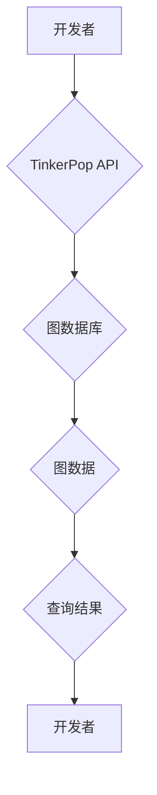

## TinkerPop原理与代码实例讲解

> 关键词：TinkerPop, 图数据库,  GraphTraversal, Gremlin,  Apache TinkerPop,  关系型数据,  节点,  边

## 1. 背景介绍

随着数据量的爆炸式增长，传统的关系型数据库在处理复杂关系数据时逐渐显得力不从心。图数据库作为一种专门用于存储和查询图结构数据的数据库，凭借其强大的关系表达能力和高效的查询性能，在社交网络分析、推荐系统、知识图谱构建等领域得到了广泛应用。

TinkerPop 是一个开源的图数据库 API 和工具集，它为开发者提供了一套统一的接口，可以方便地访问和操作各种不同的图数据库。TinkerPop 的核心思想是使用 GraphTraversal 语法来表达图查询，这种语法类似于 SQL，但更适合于表达图结构的查询逻辑。

## 2. 核心概念与联系

TinkerPop 的核心概念包括：

* **图 (Graph):** 图是由节点 (Vertex) 和边 (Edge) 组成的结构。节点代表实体，边代表实体之间的关系。
* **节点 (Vertex):** 图中的基本单元，代表一个实体。每个节点都有一个唯一的 ID 和一些属性。
* **边 (Edge):** 连接两个节点的线，代表实体之间的关系。每个边都有一个唯一的 ID、类型和一些属性。
* **图遍历 (GraphTraversal):** TinkerPop 使用 GraphTraversal 语法来表达图查询。GraphTraversal 是一个基于步骤的查询语言，可以用来遍历图结构，查询特定节点或边。

**TinkerPop 架构流程图:**



## 3. 核心算法原理 & 具体操作步骤

### 3.1  算法原理概述

TinkerPop 的核心算法是基于图遍历的查询算法。它使用 GraphTraversal 语法来定义查询步骤，每个步骤都对应一个图操作，例如：

* **TraversalSource:**  用于创建图遍历对象。
* **V:**  表示访问节点。
* **E:**  表示访问边。
* **out:**  表示沿着边向外遍历。
* **in:**  表示沿着边向内遍历。
* **has:**  表示根据属性筛选节点或边。
* **filter:**  表示根据条件筛选节点或边。
* **limit:**  表示限制查询结果数量。

这些步骤可以组合在一起，形成复杂的图查询。

### 3.2  算法步骤详解

1. **创建 TraversalSource 对象:**  使用 TinkerPop API 创建一个 TraversalSource 对象，该对象代表图数据库的连接。
2. **定义 GraphTraversal 语句:**  使用 GraphTraversal 语法定义查询步骤，例如：

```gremlin
g.V().hasLabel("person").out("knows").count()
```

这个语句表示：从所有节点中选择标签为 "person" 的节点，沿着 "knows" 边遍历，并返回连接数。

3. **执行 GraphTraversal 语句:**  调用 TraversalSource 对象的 `traversal()` 方法执行 GraphTraversal 语句，得到查询结果。

### 3.3  算法优缺点

**优点:**

* **易于学习和使用:** GraphTraversal 语法类似于 SQL，易于理解和使用。
* **灵活性和强大性:**  可以组合各种步骤，实现复杂的图查询。
* **可移植性:**  TinkerPop 支持多种图数据库，可以方便地切换数据库。

**缺点:**

* **性能:**  对于大型图数据库，图遍历查询可能比较耗时。
* **复杂性:**  对于复杂的图查询，GraphTraversal 语句可能比较难以编写和维护。

### 3.4  算法应用领域

TinkerPop 的图遍历算法广泛应用于以下领域:

* **社交网络分析:**  分析用户之间的关系，发现社区结构和影响力用户。
* **推荐系统:**  根据用户的兴趣和行为，推荐相关商品或内容。
* **知识图谱构建:**  构建知识图谱，表示实体和关系，支持知识推理和查询。
* **网络安全:**  检测网络攻击和恶意行为。

## 4. 数学模型和公式 & 详细讲解 & 举例说明

### 4.1  数学模型构建

图数据库可以抽象为一个数学模型，其中：

* **节点:**  用集合 $V$ 表示，每个节点 $v \in V$ 都有一个唯一的 ID 和一些属性。
* **边:**  用集合 $E$ 表示，每个边 $e \in E$ 由两个节点 $v_1, v_2 \in V$ 组成，表示 $v_1$ 和 $v_2$ 之间的关系。

**图的邻接矩阵:**

邻接矩阵 $A$ 是一个 $n \times n$ 的矩阵，其中 $n$ 是节点总数。如果节点 $i$ 和节点 $j$ 之间存在边，则 $A[i][j] = 1$，否则 $A[i][j] = 0$。

**图的邻接表:**

邻接表是一个列表，每个元素是一个节点的 ID 和与其相连的节点 ID 的列表。

### 4.2  公式推导过程

**度数:**

节点 $v$ 的度数表示它连接的边的数量，可以用公式表示为：

$$degree(v) = \sum_{e \in E} 1$$

其中，$e$ 遍历所有边，如果边 $e$ 的其中一个端点是节点 $v$，则计数为 1。

**路径:**

图中从节点 $v_1$ 到节点 $v_n$ 的路径是一个边序列，可以表示为：

$$v_1 \rightarrow e_1 \rightarrow v_2 \rightarrow e_2 \rightarrow... \rightarrow v_n$$

其中，$e_i$ 是连接节点 $v_{i-1}$ 和 $v_i$ 的边。

### 4.3  案例分析与讲解

**案例:**

假设有一个图数据库，其中包含以下节点和边:

* 节点: A, B, C, D
* 边: A-B, B-C, C-D

**分析:**

* 节点 A 的度数为 1。
* 节点 B 的度数为 2。
* 节点 C 的度数为 2。
* 节点 D 的度数为 1。
* 从节点 A 到节点 D 的路径为: A-B-C-D。

## 5. 项目实践：代码实例和详细解释说明

### 5.1  开发环境搭建

1. 下载并安装 Java JDK。
2. 下载 TinkerPop 的依赖包。
3. 选择一个图数据库，例如 Neo4j 或 JanusGraph。
4. 安装图数据库并配置连接信息。

### 5.2  源代码详细实现

```java
import org.apache.tinkerpop.gremlin.process.traversal.dsl.graph.__;
import org.apache.tinkerpop.gremlin.structure.Graph;
import org.apache.tinkerpop.gremlin.structure.T;

public class TinkerPopExample {

    public static void main(String[] args) {
        // 连接图数据库
        Graph graph = TinkerFactory.open("driver://localhost:7687");

        // 创建图遍历对象
        TraversalSource g = graph.traversal();

        // 查询所有节点
        Iterable<Vertex> vertices = g.V().toList();

        // 打印所有节点的 ID 和标签
        for (Vertex vertex : vertices) {
            System.out.println("ID: " + vertex.id() + ", Label: " + vertex.label());
        }

        // 关闭图数据库连接
        graph.close();
    }
}
```

### 5.3  代码解读与分析

1. **连接图数据库:** 使用 TinkerFactory.open() 方法连接到图数据库。
2. **创建图遍历对象:** 使用 graph.traversal() 方法创建图遍历对象。
3. **查询所有节点:** 使用 g.V() 方法查询所有节点。
4. **打印节点信息:** 使用 for 循环遍历查询结果，打印每个节点的 ID 和标签。
5. **关闭图数据库连接:** 使用 graph.close() 方法关闭图数据库连接。

### 5.4  运行结果展示

运行代码后，会打印出图数据库中所有节点的 ID 和标签。

## 6. 实际应用场景

TinkerPop 在实际应用场景中具有广泛的应用价值，例如:

* **社交网络分析:**  分析用户之间的关系，发现社区结构和影响力用户。
* **推荐系统:**  根据用户的兴趣和行为，推荐相关商品或内容。
* **知识图谱构建:**  构建知识图谱，表示实体和关系，支持知识推理和查询。
* **网络安全:**  检测网络攻击和恶意行为。

### 6.4  未来应用展望

随着图数据库技术的不断发展，TinkerPop 的应用场景将会更加广泛，例如:

* **人工智能:**  在机器学习和深度学习领域，图数据可以用于表示知识和关系，提高模型的性能。
* **物联网:**  在物联网领域，图数据可以用于表示设备之间的关系，实现设备管理和故障诊断。
* **生物信息学:**  在生物信息学领域，图数据可以用于表示生物分子之间的关系，进行药物研发和疾病诊断。

## 7. 工具和资源推荐

### 7.1  学习资源推荐

* **TinkerPop 官方文档:** https://tinkerpop.apache.org/
* **Gremlin 文档:** https://tinkerpop.apache.org/gremlin/
* **图数据库教程:** https://www.tutorialspoint.com/graph_database/index.htm

### 7.2  开发工具推荐

* **Gremlin Console:** https://tinkerpop.apache.org/gremlin/docs/current/console/
* **Neo4j Desktop:** https://neo4j.com/download/desktop/
* **JanusGraph:** https://janusgraph.org/

### 7.3  相关论文推荐

* **TinkerPop: A Graph Traversal Framework for the Modern Graph Database:** https://dl.acm.org/doi/10.1145/2939672.2939701
* **Gremlin: A Graph Traversal Language:** https://dl.acm.org/doi/10.1145/2939672.2939702

## 8. 总结：未来发展趋势与挑战

### 8.1  研究成果总结

TinkerPop 作为一种开源的图数据库 API 和工具集，为开发者提供了统一的接口，方便地访问和操作各种不同的图数据库。其基于 GraphTraversal 语法的查询算法灵活强大，应用领域广泛。

### 8.2  未来发展趋势

* **性能优化:**  针对大型图数据库，继续优化图遍历算法的性能。
* **支持更多图数据库:**  扩展 TinkerPop 的支持范围，支持更多类型的图数据库。
* **集成人工智能:**  将人工智能技术与 TinkerPop 集成，实现更智能的图数据分析和处理。

### 8.3  面临的挑战

* **复杂性:**  对于复杂的图查询，GraphTraversal 语句可能比较难以编写和维护。
* **标准化:**  图数据库的标准化程度较低，不同数据库的 API 和数据模型存在差异。
* **人才缺口:**  图数据库领域的人才缺口较大，需要更多的开发者和研究人员投入。

### 8.4  研究展望

未来，TinkerPop 将继续发展成为一种更强大、更灵活、更易用的图数据库 API 和工具集，为开发者提供更便捷的图数据处理和分析能力。


## 9. 附录：常见问题与解答

**问题 1:** TinkerPop 支持哪些图数据库？

**答案:** TinkerPop 支持 Neo4j, JanusGraph, Apache Cassandra, Amazon Neptune 等多种图数据库。

**问题 2:** TinkerPop 的 GraphTraversal 语法是什么？

**答案:** GraphTraversal 语法是一种基于步骤的图查询语言，可以使用各种步骤来