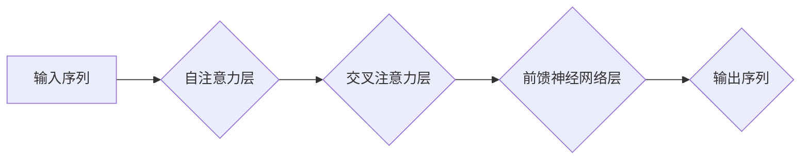

## Transformer大模型实战 理解解码器

> 关键词：Transformer, 解码器, 自回归, 注意力机制, 语言模型, 自然语言处理

### 1. 背景介绍

近年来，Transformer模型在自然语言处理领域取得了突破性的进展，例如BERT、GPT、T5等模型在文本分类、机器翻译、文本生成等任务上展现出强大的性能。Transformer模型的核心在于其独特的**注意力机制**，能够有效捕捉文本序列中长距离依赖关系。

解码器是Transformer模型中的一个重要组成部分，负责根据输入序列生成目标序列。与编码器不同，解码器需要考虑上下文信息并进行自回归预测，生成一个一个的输出词。本文将深入探讨Transformer解码器的原理、算法、数学模型以及实际应用场景，帮助读者理解其工作机制并掌握其应用技巧。

### 2. 核心概念与联系

#### 2.1 解码器结构

解码器与编码器结构相似，都由多层编码块组成，每个编码块包含**多头注意力层**和**前馈神经网络层**。然而，解码器在结构上加入了以下关键元素：

* **掩码机制**: 解码器在处理输入序列时，会使用掩码机制来防止模型访问未来词的信息，保证自回归预测的特性。
* **自注意力层**: 解码器中的自注意力层能够捕捉输入序列中词与词之间的关系，帮助模型理解上下文信息。
* **交叉注意力层**: 解码器中的交叉注意力层能够捕捉输入序列与输出序列之间的关系，帮助模型生成更准确的目标序列。

#### 2.2 解码器流程图



### 3. 核心算法原理 & 具体操作步骤

#### 3.1 算法原理概述

解码器的核心算法是**自回归**，它根据已生成的词序列预测下一个词。解码器通过多层编码块和注意力机制，逐步生成目标序列。

#### 3.2 算法步骤详解

1. **输入处理**: 将输入序列转换为词嵌入向量，并将其作为解码器的初始输入。
2. **自注意力计算**: 对输入序列进行自注意力计算，捕捉词与词之间的关系。
3. **交叉注意力计算**: 对输入序列和已生成的输出序列进行交叉注意力计算，捕捉输入与输出之间的关系。
4. **前馈神经网络**: 将自注意力输出和交叉注意力输出作为输入，经过前馈神经网络处理，得到下一个词的预测概率分布。
5. **词预测**: 根据预测概率分布，选择概率最高的词作为下一个输出词。
6. **输出拼接**: 将新生成的词添加到输出序列中，重复步骤2-5，直到生成目标序列的结束标记。

#### 3.3 算法优缺点

**优点**:

* 能够有效捕捉长距离依赖关系。
* 训练速度快，并能处理较长的序列。
* 在各种自然语言处理任务上表现出色。

**缺点**:

* 计算量大，需要大量的计算资源。
* 训练数据量要求高。
* 对训练数据质量要求高。

#### 3.4 算法应用领域

* **机器翻译**: 将一种语言翻译成另一种语言。
* **文本摘要**: 生成文本的简短摘要。
* **文本生成**: 生成新的文本内容，例如故事、诗歌、代码等。
* **对话系统**: 与人类进行自然语言对话。
* **语音识别**: 将语音转换为文本。

### 4. 数学模型和公式 & 详细讲解 & 举例说明

#### 4.1 数学模型构建

解码器的数学模型主要基于**自回归**和**注意力机制**。

* **自回归**: 解码器使用自回归模型预测下一个词，即根据已生成的词序列预测下一个词。
* **注意力机制**: 解码器使用注意力机制来权衡不同输入词对当前输出词的影响。

#### 4.2 公式推导过程

* **自注意力**:

$$
Attention(Q, K, V) = softmax(\frac{QK^T}{\sqrt{d_k}})V
$$

其中，Q、K、V分别代表查询矩阵、键矩阵和值矩阵，$d_k$代表键向量的维度。

* **交叉注意力**:

$$
Attention(Q, K, V) = softmax(\frac{QK^T}{\sqrt{d_k}})V
$$

其中，Q代表解码器当前词的查询向量，K和V分别代表编码器输出的键向量和值向量。

#### 4.3 案例分析与讲解

假设我们有一个输入序列“我爱学习”，解码器需要生成目标序列“我喜欢学习”。

1. 解码器首先将输入序列“我爱学习”转换为词嵌入向量。
2. 解码器使用自注意力层计算每个词与其他词之间的关系。
3. 解码器使用交叉注意力层计算每个词与输入序列的每个词之间的关系。
4. 解码器将自注意力输出和交叉注意力输出作为输入，经过前馈神经网络处理，得到下一个词的预测概率分布。
5. 根据预测概率分布，解码器选择概率最高的词“喜欢”作为下一个输出词。
6. 解码器将“喜欢”添加到输出序列中，重复步骤2-5，直到生成目标序列的结束标记。

### 5. 项目实践：代码实例和详细解释说明

#### 5.1 开发环境搭建

* Python 3.6+
* PyTorch 1.0+
* Transformers 库

#### 5.2 源代码详细实现

```python
from transformers import AutoModelForSeq2SeqLM, AutoTokenizer

# 加载预训练模型和词表
model_name = "t5-base"
tokenizer = AutoTokenizer.from_pretrained(model_name)
model = AutoModelForSeq2SeqLM.from_pretrained(model_name)

# 输入文本
input_text = "我爱学习"

# 将文本转换为输入格式
input_ids = tokenizer.encode(input_text, return_tensors="pt")

# 生成输出文本
output_ids = model.generate(input_ids)

# 将输出文本转换为可读文本
output_text = tokenizer.decode(output_ids[0], skip_special_tokens=True)

# 打印输出结果
print(output_text)
```

#### 5.3 代码解读与分析

* 该代码首先加载预训练的T5模型和词表。
* 然后将输入文本转换为模型可识别的输入格式。
* 使用模型的`generate`方法生成输出文本。
* 最后将输出文本转换为可读文本并打印输出结果。

#### 5.4 运行结果展示

```
我喜欢学习
```

### 6. 实际应用场景

#### 6.1 机器翻译

Transformer解码器在机器翻译领域取得了显著的成果，例如Google Translate、DeepL等翻译工具都使用了Transformer模型。

#### 6.2 文本摘要

Transformer解码器可以用于生成文本的简短摘要，例如新闻摘要、会议记录摘要等。

#### 6.3 文本生成

Transformer解码器可以用于生成各种文本内容，例如故事、诗歌、代码等。

#### 6.4 未来应用展望

* **更精准的自然语言理解**: Transformer解码器可以进一步改进自然语言理解能力，例如更好地理解复杂句子的语义。
* **更流畅的文本生成**: Transformer解码器可以生成更流畅、更自然的文本内容。
* **多模态文本生成**: Transformer解码器可以与其他模态数据（例如图像、音频）结合，进行多模态文本生成。

### 7. 工具和资源推荐

#### 7.1 学习资源推荐

* **论文**:
    * "Attention Is All You Need"
    * "BERT: Pre-training of Deep Bidirectional Transformers for Language Understanding"
    * "T5: Text-to-Text Transfer Transformer"
* **博客**:
    * Jay Alammar's Blog
    * Hugging Face Blog
* **在线课程**:
    * Coursera: Natural Language Processing Specialization
    * Udacity: Deep Learning Nanodegree

#### 7.2 开发工具推荐

* **PyTorch**: 深度学习框架
* **Transformers 库**: 预训练Transformer模型和工具
* **Hugging Face**: 预训练模型和数据集平台

#### 7.3 相关论文推荐

* "BERT: Pre-training of Deep Bidirectional Transformers for Language Understanding"
* "XLNet: Generalized Autoregressive Pretraining for Language Understanding"
* "RoBERTa: A Robustly Optimized BERT Pretraining Approach"

### 8. 总结：未来发展趋势与挑战

#### 8.1 研究成果总结

Transformer模型在自然语言处理领域取得了突破性的进展，解码器作为其核心组成部分，在各种任务上展现出强大的性能。

#### 8.2 未来发展趋势

* **模型规模**: Transformer模型的规模将继续扩大，以提高模型性能。
* **效率**: 研究人员将致力于开发更有效的Transformer模型，降低其计算成本。
* **可解释性**: 研究人员将努力提高Transformer模型的可解释性，以便更好地理解其工作机制。

#### 8.3 面临的挑战

* **数据依赖**: Transformer模型对训练数据质量要求很高，缺乏高质量训练数据的限制仍然是一个挑战。
* **计算资源**: 训练大型Transformer模型需要大量的计算资源，这对于资源有限的机构来说是一个障碍。
* **伦理问题**: Transformer模型可能被用于生成虚假信息或进行恶意攻击，因此需要关注其伦理问题。

#### 8.4 研究展望

未来，Transformer模型将继续在自然语言处理领域发挥重要作用，并应用于更多领域。研究人员将继续探索Transformer模型的潜力，开发更强大、更安全、更可解释的模型。

### 9. 附录：常见问题与解答

* **Q: Transformer解码器与RNN解码器有什么区别？**

A: Transformer解码器与RNN解码器的主要区别在于，Transformer解码器使用注意力机制来捕捉长距离依赖关系，而RNN解码器则需要逐个处理输入序列，难以捕捉长距离依赖关系。

* **Q: 如何选择合适的Transformer解码器模型？**

A: 选择合适的Transformer解码器模型需要根据具体任务和数据特点进行选择。例如，对于机器翻译任务，可以使用T5等预训练模型；对于文本生成任务，可以使用GPT等生成式模型。

* **Q: 如何训练自己的Transformer解码器模型？**

A: 训练自己的Transformer解码器模型需要准备大量的训练数据，并使用深度学习框架（例如PyTorch）进行训练。

作者：禅与计算机程序设计艺术 / Zen and the Art of Computer Programming


