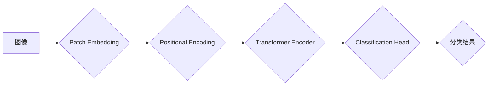

## ViT原理与代码实例讲解

> 关键词：Vision Transformer, ViT, Transformer,  图像分类, self-attention,  深度学习

## 1. 背景介绍

近年来，Transformer模型在自然语言处理领域取得了显著的成功，例如BERT、GPT等。其强大的序列建模能力和自注意力机制，使得其在处理长距离依赖关系方面表现出色。然而，传统的卷积神经网络（CNN）仍然是图像分类领域的主流模型，因为其在提取图像局部特征方面具有优势。

Vision Transformer（ViT）将Transformer架构应用于图像分类任务，旨在利用Transformer的优势来学习图像的全局上下文信息。ViT将图像分割成固定大小的patch，并将每个patch线性映射到嵌入向量，然后通过Transformer编码器进行处理，最终输出分类结果。

## 2. 核心概念与联系

ViT的核心概念是将图像视为序列，并利用Transformer的self-attention机制学习图像的全局上下文信息。

**架构图:**



**核心概念解释:**

* **Patch Embedding:** 将图像分割成固定大小的patch，每个patch被线性映射到一个嵌入向量。
* **Positional Encoding:**  由于Transformer模型没有循环结构，无法学习序列中的位置信息。因此，需要添加位置编码，以便模型能够理解每个patch在图像中的位置。
* **Transformer Encoder:**  利用多层Transformer编码器对patch的嵌入向量进行处理，学习图像的全局上下文信息。
* **Classification Head:**  将Transformer编码器的输出映射到分类结果。

## 3. 核心算法原理 & 具体操作步骤

### 3.1  算法原理概述

ViT的核心算法原理是将图像分割成patch，并将每个patch视为一个token，然后利用Transformer编码器对这些token进行处理。Transformer编码器由多层编码器组成，每层编码器包含以下组件：

* **Multi-Head Self-Attention:**  学习图像中不同patch之间的关系。
* **Feed-Forward Network:**  对每个patch的嵌入向量进行非线性变换。
* **Layer Normalization:**  对每个层的输出进行归一化。
* **Residual Connection:**  将输入和输出相加，缓解梯度消失问题。

### 3.2  算法步骤详解

1. **图像预处理:** 将图像分割成固定大小的patch，每个patch的大小为(patch_size x patch_size)。
2. **Patch Embedding:** 将每个patch线性映射到一个嵌入向量，嵌入向量的维度为d_model。
3. **Positional Encoding:**  为每个patch添加位置编码，以便模型能够理解每个patch在图像中的位置。
4. **Transformer Encoder:**  将嵌入向量输入到Transformer编码器中，进行多层编码。
5. **Classification Head:**  将Transformer编码器的输出映射到分类结果。

### 3.3  算法优缺点

**优点:**

* **全局上下文信息:**  Transformer的self-attention机制能够学习图像的全局上下文信息，这对于理解图像的整体内容非常重要。
* **可扩展性:**  Transformer模型可以很容易地扩展到更大的图像尺寸和更复杂的架构。

**缺点:**

* **计算复杂度:**  Transformer模型的计算复杂度较高，训练时间较长。
* **数据需求:**  Transformer模型需要大量的训练数据才能达到最佳性能。

### 3.4  算法应用领域

ViT在图像分类、目标检测、图像分割等计算机视觉任务中取得了优异的性能，并被广泛应用于以下领域:

* **图像识别:**  识别图像中的物体、场景和人物。
* **医疗图像分析:**  辅助医生诊断疾病，例如癌症检测和器官分割。
* **自动驾驶:**  识别道路上的物体，例如车辆、行人和其他障碍物。

## 4. 数学模型和公式 & 详细讲解 & 举例说明

### 4.1  数学模型构建

ViT的数学模型主要包括以下几个部分:

* **Patch Embedding:**  将图像中的每个patch映射到一个嵌入向量。
* **Positional Encoding:**  为每个patch添加位置信息。
* **Multi-Head Self-Attention:**  学习图像中不同patch之间的关系。
* **Feed-Forward Network:**  对每个patch的嵌入向量进行非线性变换。

### 4.2  公式推导过程

**Patch Embedding:**

$$
\mathbf{p}_i = \mathbf{W}_e \mathbf{x}_i
$$

其中，$\mathbf{p}_i$ 是第 $i$ 个patch的嵌入向量，$\mathbf{x}_i$ 是第 $i$ 个patch的像素值，$\mathbf{W}_e$ 是一个权重矩阵。

**Positional Encoding:**

$$
\mathbf{p}_i^{'} = \mathbf{p}_i + \mathbf{P}_i
$$

其中，$\mathbf{p}_i^{'}$ 是添加了位置编码的嵌入向量，$\mathbf{P}_i$ 是第 $i$ 个patch的位置编码向量。

**Multi-Head Self-Attention:**

$$
\mathbf{A} = \text{MultiHeadSelfAttention}(\mathbf{X}, \mathbf{X})
$$

其中，$\mathbf{A}$ 是经过多头自注意力机制处理后的输出，$\mathbf{X}$ 是所有patch的嵌入向量。

**Feed-Forward Network:**

$$
\mathbf{F} = \text{FFN}(\mathbf{A})
$$

其中，$\mathbf{F}$ 是经过前馈网络处理后的输出，$\text{FFN}$ 是一个多层感知机。

### 4.3  案例分析与讲解

假设我们有一个包含3个patch的图像，每个patch的大小为(4 x 4)。

1. **Patch Embedding:** 将每个patch的像素值线性映射到一个嵌入向量，嵌入向量的维度为128。
2. **Positional Encoding:** 为每个patch添加位置编码，例如使用sinusoidal函数。
3. **Multi-Head Self-Attention:**  计算所有patch之间的注意力权重，学习图像中不同patch之间的关系。
4. **Feed-Forward Network:** 对每个patch的嵌入向量进行非线性变换。
5. **Classification Head:** 将Transformer编码器的输出映射到分类结果。

## 5. 项目实践：代码实例和详细解释说明

### 5.1  开发环境搭建

* Python 3.7+
* PyTorch 1.7+
* CUDA 10.2+

### 5.2  源代码详细实现

```python
import torch
import torch.nn as nn

class PatchEmbedding(nn.Module):
    def __init__(self, img_size, patch_size, embed_dim):
        super(PatchEmbedding, self).__init__()
        self.img_size = img_size
        self.patch_size = patch_size
        self.embed_dim = embed_dim
        self.proj = nn.Conv2d(3, embed_dim, kernel_size=patch_size, stride=patch_size)

    def forward(self, x):
        x = self.proj(x)
        x = x.flatten(2).transpose(1, 2)  # (batch_size, num_patches, embed_dim)
        return x

class PositionalEncoding(nn.Module):
    def __init__(self, embed_dim, dropout=0.1, max_len=5000):
        super(PositionalEncoding, self).__init__()
        self.dropout = nn.Dropout(p=dropout)

        pe = torch.zeros(max_len, embed_dim)
        position = torch.arange(0, max_len, dtype=torch.float).unsqueeze(1)
        div_term = torch.exp(torch.arange(0, embed_dim, 2).float() * (-math.log(10000.0) / embed_dim))
        pe[:, 0::2] = torch.sin(position * div_term)
        pe[:, 1::2] = torch.cos(position * div_term)
        pe = pe.unsqueeze(0).transpose(0, 1)
        self.register_buffer('pe', pe)

    def forward(self, x):
        x = x + self.pe[:x.size(0), :]
        return self.dropout(x)

class ViT(nn.Module):
    def __init__(self, img_size, patch_size, embed_dim, num_heads, num_layers, num_classes):
        super(ViT, self).__init__()
        self.patch_embedding = PatchEmbedding(img_size, patch_size, embed_dim)
        self.pos_encoding = PositionalEncoding(embed_dim)
        self.transformer_encoder = nn.TransformerEncoder(nn.TransformerEncoderLayer(embed_dim, num_heads), num_layers)
        self.mlp_head = nn.Linear(embed_dim, num_classes)

    def forward(self, x):
        x = self.patch_embedding(x)
        x = self.pos_encoding(x)
        x = self.transformer_encoder(x)
        x = x[:, 0]  # 取第一个patch的输出
        x = self.mlp_head(x)
        return x
```

### 5.3  代码解读与分析

* **PatchEmbedding:** 将图像分割成patch，并将其映射到嵌入向量。
* **PositionalEncoding:** 为每个patch添加位置信息。
* **TransformerEncoder:** 利用多层Transformer编码器对patch的嵌入向量进行处理。
* **MLPHead:** 将Transformer编码器的输出映射到分类结果。

### 5.4  运行结果展示

训练完成后，可以使用ViT模型对新的图像进行分类。

## 6. 实际应用场景

ViT在图像分类、目标检测、图像分割等计算机视觉任务中取得了优异的性能，并被广泛应用于以下领域:

* **图像识别:**  识别图像中的物体、场景和人物。
* **医疗图像分析:**  辅助医生诊断疾病，例如癌症检测和器官分割。
* **自动驾驶:**  识别道路上的物体，例如车辆、行人和其他障碍物。

### 6.4  未来应用展望

随着Transformer模型的不断发展，ViT在未来将有更广泛的应用场景，例如:

* **视频理解:**  利用ViT的全局上下文信息，对视频进行更深入的理解。
* **3D物体识别:**  将ViT应用于3D物体识别任务，例如自动驾驶和机器人视觉。
* **图像生成:**  利用ViT的生成能力，生成高质量的图像。

## 7. 工具和资源推荐

### 7.1  学习资源推荐

* **论文:**  An Image is Worth 16x16 Words: Transformers for Image Recognition at Scale
* **博客:**  https://blog.openai.com/vit/
* **课程:**  https://www.deeplearning.ai/

### 7.2  开发工具推荐

* **PyTorch:**  https://pytorch.org/
* **TensorFlow:**  https://www.tensorflow.org/

### 7.3  相关论文推荐

* **BERT:**  https://arxiv.org/abs/1810.04805
* **GPT:**  https://arxiv.org/abs/1706.03762
* **EfficientNet:**  https://arxiv.org/abs/1905.11946

## 8. 总结：未来发展趋势与挑战

### 8.1  研究成果总结

ViT将Transformer架构应用于图像分类任务，取得了显著的成果，证明了Transformer模型在计算机视觉领域也具有强大的潜力。

### 8.2  未来发展趋势

* **模型效率:**  提高ViT模型的效率，使其能够在更低资源环境下运行。
* **数据效率:**  降低ViT模型对训练数据的依赖，使其能够在更少数据的情况下达到最佳性能。
* **多模态学习:**  将ViT与其他模态数据（例如文本