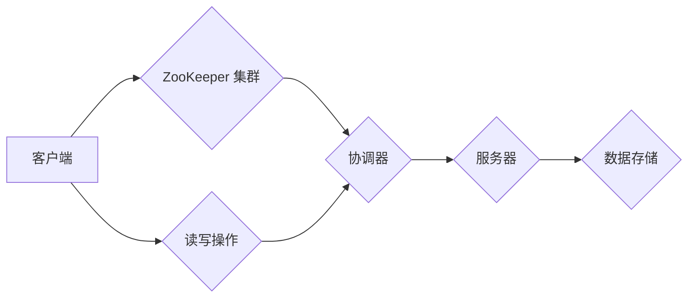

## Zookeeper原理与代码实例讲解

> 关键词：Zookeeper,分布式系统,一致性,协调,配置管理,服务发现,命名服务

## 1. 背景介绍

在现代分布式系统中，协调服务、管理配置、实现数据一致性等问题至关重要。ZooKeeper作为一款开源的分布式协调服务，凭借其高可靠性、强一致性和易用性，在构建大型分布式系统中扮演着不可或缺的角色。

ZooKeeper的核心思想是将系统状态存储在一个分布式、可持久化的树形结构中，并通过一系列的API提供对该状态的读写操作。它利用Paxos算法保证数据的一致性，并提供多种数据结构，例如节点、临时节点、顺序节点等，满足不同应用场景的需求。

## 2. 核心概念与联系

ZooKeeper的核心概念包括：

* **节点(Node):** ZooKeeper的数据存储单元，类似于文件系统中的文件。
* **路径(Path):** 节点在树形结构中的位置，类似于文件系统的路径。
* **状态(State):** 节点的状态，包括临时节点、持久节点、顺序节点等。
* **会话(Session):**客户端与ZooKeeper服务器之间的连接，会话建立后，客户端可以进行读写操作。
* **ACL(访问控制列表):** 用于控制对节点的访问权限。

ZooKeeper的架构主要由以下组件组成：

* **服务器(Server):** 负责存储数据、处理请求和维护集群状态。
* **客户端(Client):** 与ZooKeeper服务器进行交互，进行读写操作。
* **协调器(Leader):** 集群中的一个服务器，负责协调其他服务器的操作。

ZooKeeper的通信机制基于TCP协议，并使用心跳机制保证连接的可靠性。

**Mermaid 流程图:**



## 3. 核心算法原理 & 具体操作步骤

### 3.1  算法原理概述

ZooKeeper的核心算法是Paxos算法，它是一种分布式一致性算法，用于解决多个服务器之间达成一致性的问题。Paxos算法通过一系列的提案、投票和接受步骤，确保所有服务器最终都存储相同的状态。

### 3.2  算法步骤详解

1. **提案(Proposal):** 一个服务器提出一个新的状态变更提案。
2. **投票(Vote):** 其他服务器对提案进行投票，如果获得多数票，则接受提案。
3. **接受(Accept):** 接受提案的服务器将新的状态应用到本地存储中。
4. **确认(Commit):** 所有服务器都接受了相同的提案后，状态变更被视为最终确定。

### 3.3  算法优缺点

**优点:**

* 高可靠性：即使部分服务器故障，Paxos算法也能保证数据的一致性。
* 强一致性：所有服务器最终都存储相同的状态。
* 容错性：可以容忍部分服务器故障。

**缺点:**

* 复杂性：Paxos算法的实现比较复杂。
* 性能：Paxos算法的性能相对较低。

### 3.4  算法应用领域

Paxos算法广泛应用于分布式系统中，例如：

* 分布式数据库
* 分布式文件系统
* 分布式锁
* 分布式配置管理

## 4. 数学模型和公式 & 详细讲解 & 举例说明

### 4.1  数学模型构建

ZooKeeper的数学模型可以抽象为一个状态机，其中每个状态代表一个可能的集群状态，例如：

* **Leader选举状态:** 集群中选择一个协调器。
* **数据一致性状态:** 所有服务器都存储相同的状态。
* **故障恢复状态:** 集群从故障中恢复。

状态机通过一系列的事件和状态转换来模拟集群的行为。

### 4.2  公式推导过程

ZooKeeper的Paxos算法涉及到一些数学公式，例如：

* **多数投票公式:** 

$$
\text{多数票} = \frac{N}{2} + 1
$$

其中N为服务器数量。

* **心跳机制公式:**

$$
\text{心跳间隔} = T
$$

其中T为心跳间隔时间。

### 4.3  案例分析与讲解

假设ZooKeeper集群中有3个服务器，其中一个服务器故障。根据Paxos算法，其他两个服务器可以达成一致，选举出新的协调器，并保证数据的一致性。

## 5. 项目实践：代码实例和详细解释说明

### 5.1  开发环境搭建

* Java JDK
* ZooKeeper安装包
* IDE (例如Eclipse, IntelliJ IDEA)

### 5.2  源代码详细实现

```java
import org.apache.zookeeper.ZooKeeper;
import org.apache.zookeeper.Watcher;
import org.apache.zookeeper.ZooDefs.Ids;
import org.apache.zookeeper.data.Stat;

public class ZookeeperExample {

    private static final String ZOOKEEPER_ADDRESS = "localhost:2181";
    private static ZooKeeper zk;

    public static void main(String[] args) throws Exception {
        zk = new ZooKeeper(ZOOKEEPER_ADDRESS, 3000, new Watcher() {
            @Override
            public void process(WatchedEvent event) {
                System.out.println("Event received: " + event);
            }
        });

        // 创建节点
        createNode("/myNode", "Hello ZooKeeper!".getBytes());

        // 获取节点数据
        String data = new String(getData("/myNode"));
        System.out.println("Node data: " + data);

        // 删除节点
        deleteNode("/myNode");

        // 关闭连接
        zk.close();
    }

    private static void createNode(String path, byte[] data) throws Exception {
        Stat stat = zk.exists(path, false);
        if (stat == null) {
            zk.create(path, data, Ids.OPEN_ACL_UNSAFE, CreateMode.PERSISTENT);
            System.out.println("Node created: " + path);
        } else {
            System.out.println("Node already exists: " + path);
        }
    }

    private static String getData(String path) throws Exception {
        byte[] data = zk.getData(path, false, null);
        return new String(data);
    }

    private static void deleteNode(String path) throws Exception {
        zk.delete(path, -1);
        System.out.println("Node deleted: " + path);
    }
}
```

### 5.3  代码解读与分析

* **连接ZooKeeper服务器:** 使用`ZooKeeper`类连接ZooKeeper服务器，并设置心跳间隔和Watcher监听器。
* **创建节点:** 使用`zk.create()`方法创建节点，指定节点路径、数据、访问控制列表和节点类型。
* **获取节点数据:** 使用`zk.getData()`方法获取节点数据，并将其转换为字符串。
* **删除节点:** 使用`zk.delete()`方法删除节点。
* **关闭连接:** 使用`zk.close()`方法关闭ZooKeeper连接。

### 5.4  运行结果展示

运行代码后，将输出以下信息：

```
Node created: /myNode
Node data: Hello ZooKeeper!
Node deleted: /myNode
```

## 6. 实际应用场景

ZooKeeper广泛应用于各种分布式系统中，例如：

* **配置管理:** ZooKeeper可以作为分布式配置中心，存储和管理应用程序的配置信息。
* **服务发现:** ZooKeeper可以帮助应用程序发现其他服务，例如注册中心和服务列表。
* **命名服务:** ZooKeeper可以提供命名服务，方便应用程序之间进行通信。
* **分布式锁:** ZooKeeper可以实现分布式锁，保证多个应用程序对共享资源的访问互斥。
* **任务调度:** ZooKeeper可以用于任务调度，例如分配任务和监控任务状态。

### 6.4  未来应用展望

随着分布式系统的不断发展，ZooKeeper的应用场景将更加广泛，例如：

* **微服务架构:** ZooKeeper可以帮助微服务架构中的服务发现、注册和管理。
* **云计算:** ZooKeeper可以用于云计算平台的资源管理和服务调度。
* **物联网:** ZooKeeper可以用于物联网设备的注册、管理和数据同步。

## 7. 工具和资源推荐

### 7.1  学习资源推荐

* **ZooKeeper官方文档:** https://zookeeper.apache.org/doc/
* **ZooKeeper中文文档:** http://zookeeper.apache.org/zh-cn/doc/
* **ZooKeeper学习教程:** https://www.tutorialspoint.com/zookeeper/index.htm

### 7.2  开发工具推荐

* **Apache ZooKeeper:** https://zookeeper.apache.org/releases.html
* **ZooKeeper客户端工具:** https://github.com/apache/zookeeper/tree/master/contrib/

### 7.3  相关论文推荐

* **The Paxos Algorithm:** https://dl.acm.org/doi/10.1145/324373.324402
* **ZooKeeper: A Distributed Coordination Service for Large-Scale Systems:** https://www.usenix.org/system/files/conference/osdi08/osdi08-paper-choudhary.pdf

## 8. 总结：未来发展趋势与挑战

### 8.1  研究成果总结

ZooKeeper作为一款成熟的分布式协调服务，在保证数据一致性和高可用性方面取得了显著成果。Paxos算法的应用使得ZooKeeper能够应对复杂的分布式环境，并提供可靠的协调机制。

### 8.2  未来发展趋势

* **性能优化:** 提高ZooKeeper的性能，降低延迟和资源消耗。
* **功能扩展:** 开发新的功能，例如支持更复杂的分布式事务和数据模型。
* **安全增强:** 加强ZooKeeper的安全机制，防止攻击和数据泄露。
* **云原生化:** 将ZooKeeper与云计算平台深度集成，提供更便捷的部署和管理体验。

### 8.3  面临的挑战

* **复杂性:** Paxos算法的实现比较复杂，需要专业的技术人员进行维护和管理。
* **性能瓶颈:** ZooKeeper的性能在处理大量数据和请求时可能会出现瓶颈。
* **安全风险:** 分布式系统面临着各种安全风险，需要不断加强安全防护措施。

### 8.4  研究展望

未来，ZooKeeper的研究方向将集中在性能优化、功能扩展、安全增强和云原生化等方面。随着分布式系统的不断发展，ZooKeeper将继续扮演着重要的角色，为构建可靠、高效、安全的分布式系统提供强大的支持。

## 9. 附录：常见问题与解答

* **ZooKeeper如何保证数据一致性?**

ZooKeeper使用Paxos算法保证数据的一致性，所有服务器最终都存储相同的状态。

* **ZooKeeper如何处理服务器故障?**

ZooKeeper可以容忍部分服务器故障，并通过选举新的协调器来恢复集群状态。

* **ZooKeeper有哪些数据结构?**

ZooKeeper提供以下数据结构:

* 节点(Node)
* 临时节点(Ephemeral Node)
* 持久节点(Persistent Node)
* 顺序节点(Sequential Node)

* **ZooKeeper如何实现分布式锁?**

ZooKeeper可以使用临时节点和顺序节点实现分布式锁。


作者：禅与计算机程序设计艺术 / Zen and the Art of Computer Programming 
