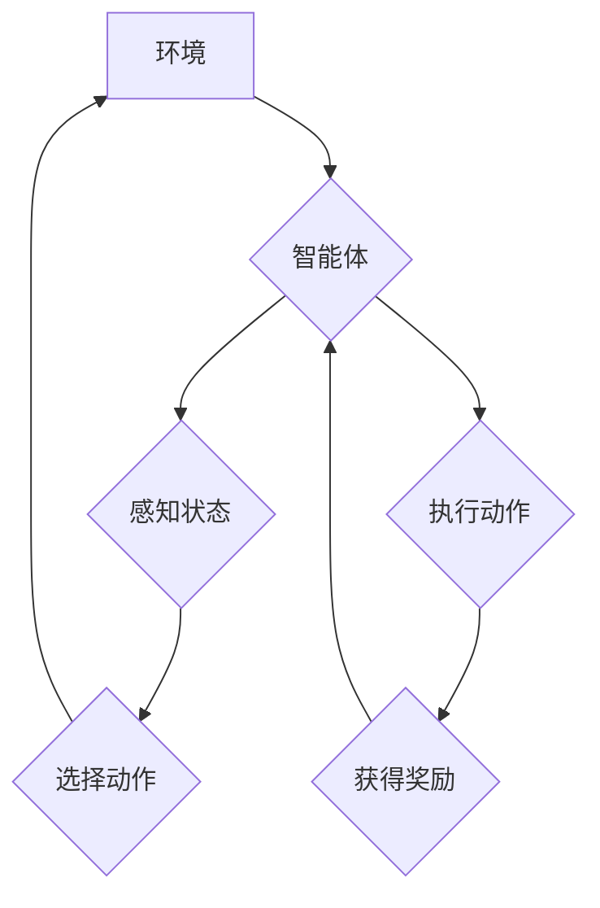

## 一切皆是映射：AI Q-learning在无人机路径规划的应用

> 关键词：无人机路径规划，Q-learning，强化学习，深度学习，状态空间，奖励函数，价值函数

## 1. 背景介绍

无人机技术近年来发展迅速，在物流运输、农业监测、灾害救援等领域展现出巨大的应用潜力。然而，无人机路径规划问题一直是该领域面临的挑战之一。传统的路径规划方法通常依赖于预先构建的静态地图和规则，难以应对复杂、动态的环境变化。

强化学习 (Reinforcement Learning, RL) 作为一种机器学习范式，能够通过与环境交互学习最优策略，在无人机路径规划领域展现出巨大的优势。其中，Q-learning 作为一种经典的 RL 算法，能够有效地学习状态-动作对的价值函数，从而指导无人机选择最优路径。

## 2. 核心概念与联系

### 2.1 强化学习

强化学习是一种基于交互学习的机器学习方法，其核心在于智能体通过与环境交互，不断学习最优策略以最大化累积奖励。

* **智能体 (Agent):**  执行动作并感知环境的实体，例如无人机。
* **环境 (Environment):** 智能体所处的外部世界，包括地图、障碍物、目标等。
* **状态 (State):** 智能体在环境中所处的具体情况，例如无人机的当前位置、速度、姿态等。
* **动作 (Action):** 智能体可以执行的操作，例如前进、后退、转弯等。
* **奖励 (Reward):** 环境对智能体动作的反馈，可以是正向奖励或负向惩罚。
* **策略 (Policy):**  智能体根据当前状态选择动作的规则。

### 2.2 Q-learning

Q-learning 是一种基于价值函数的强化学习算法，其目标是学习一个状态-动作对的价值函数，该函数估计在特定状态下执行特定动作的长期回报。

* **价值函数 (Value Function):**  估计在特定状态下执行特定动作的长期回报。
* **Q值 (Q-value):**  状态-动作对的价值函数，表示在特定状态下执行特定动作的期望累积奖励。

**Mermaid 流程图**



## 3. 核心算法原理 & 具体操作步骤

### 3.1 算法原理概述

Q-learning 算法的核心思想是通过迭代更新 Q 值，最终学习到最优策略。

* **初始化:**  将所有状态-动作对的 Q 值初始化为 0。
* **迭代更新:**  根据 Bellman 方程更新 Q 值，公式如下:

$$Q(s,a) = Q(s,a) + \alpha [r + \gamma \max_{a'} Q(s',a') - Q(s,a)]$$

其中:

* $Q(s,a)$: 状态 $s$ 下执行动作 $a$ 的 Q 值。
* $\alpha$: 学习率，控制学习速度。
* $r$:  执行动作 $a$ 后获得的奖励。
* $\gamma$:  折扣因子，控制未来奖励的权重。
* $s'$:  执行动作 $a$ 后进入的下一个状态。
* $a'$:  在下一个状态 $s'$ 中选择执行的动作。

* **策略选择:**  根据当前状态下 Q 值最大的动作选择执行。

### 3.2 算法步骤详解

1. **环境初始化:**  设置无人机初始位置、目标位置、地图信息等。
2. **状态空间定义:**  将无人机可能的运动状态定义为状态空间，例如位置、速度、姿态等。
3. **动作空间定义:**  定义无人机可以执行的动作，例如前进、后退、转弯等。
4. **Q 值初始化:**  将所有状态-动作对的 Q 值初始化为 0。
5. **迭代学习:**  
    *  根据当前状态选择动作。
    *  执行动作并获得奖励。
    *  根据 Bellman 方程更新 Q 值。
    *  重复以上步骤直到 Q 值收敛。
6. **策略选择:**  根据学习到的 Q 值，选择最优路径。

### 3.3 算法优缺点

**优点:**

*  能够学习复杂、动态的环境。
*  不需要预先构建地图和规则。
*  能够适应环境变化。

**缺点:**

*  学习过程可能需要大量的时间和数据。
*  容易陷入局部最优解。
*  需要设计合理的奖励函数。

### 3.4 算法应用领域

Q-learning 算法在无人机路径规划领域具有广泛的应用前景，例如:

*  避障路径规划
*  目标跟踪路径规划
*  多无人机协同路径规划
*  动态环境路径规划

## 4. 数学模型和公式 & 详细讲解 & 举例说明

### 4.1 数学模型构建

在无人机路径规划问题中，我们可以将环境建模为一个马尔可夫决策过程 (Markov Decision Process, MDP)。

*  **状态空间:**  无人机的当前位置、速度、姿态等。
*  **动作空间:**  无人机可以执行的动作，例如前进、后退、转弯等。
*  **转移概率:**  从一个状态到另一个状态的概率，取决于执行的动作。
*  **奖励函数:**  根据无人机在特定状态下执行特定动作获得的奖励。

### 4.2 公式推导过程

Q-learning 算法的核心是更新 Q 值的 Bellman 方程:

$$Q(s,a) = Q(s,a) + \alpha [r + \gamma \max_{a'} Q(s',a') - Q(s,a)]$$

其中:

* $Q(s,a)$: 状态 $s$ 下执行动作 $a$ 的 Q 值。
* $\alpha$: 学习率，控制学习速度。
* $r$:  执行动作 $a$ 后获得的奖励。
* $\gamma$:  折扣因子，控制未来奖励的权重。
* $s'$:  执行动作 $a$ 后进入的下一个状态。
* $a'$:  在下一个状态 $s'$ 中选择执行的动作。

### 4.3 案例分析与讲解

假设无人机需要从起点 A 到达终点 B，地图上存在障碍物。

*  **状态空间:**  无人机的当前位置 (x, y)。
*  **动作空间:**  前进、后退、转弯。
*  **奖励函数:**  到达终点 B 时获得最大奖励，撞到障碍物时获得负奖励。

通过 Q-learning 算法，无人机可以学习到最优路径，从起点 A 到达终点 B，同时避开障碍物。

## 5. 项目实践：代码实例和详细解释说明

### 5.1 开发环境搭建

*  操作系统: Ubuntu 20.04
*  Python 版本: 3.8
*  库依赖:  OpenCV, NumPy, TensorFlow

### 5.2 源代码详细实现

```python
import numpy as np
from tensorflow.keras.models import Sequential
from tensorflow.keras.layers import Dense

# 定义状态空间维度
state_size = 2  # x, y

# 定义动作空间维度
action_size = 3  # 前进、后退、转弯

# 定义 Q 值网络
model = Sequential()
model.add(Dense(64, activation='relu', input_shape=(state_size,)))
model.add(Dense(64, activation='relu'))
model.add(Dense(action_size, activation='linear'))

# 定义学习参数
learning_rate = 0.01
discount_factor = 0.99
exploration_rate = 0.1

# 定义奖励函数
def reward_function(state, action):
    #...

# 训练 Q 值网络
for episode in range(num_episodes):
    state = env.reset()
    done = False
    while not done:
        # 选择动作
        if np.random.rand() < exploration_rate:
            action = env.action_space.sample()
        else:
            action = np.argmax(model.predict(state.reshape(1, -1)))

        # 执行动作
        next_state, reward, done, _ = env.step(action)

        # 更新 Q 值
        target = reward + discount_factor * np.max(model.predict(next_state.reshape(1, -1)))
        target_f = model.predict(state.reshape(1, -1))
        target_f[0][action] = target
        model.fit(state.reshape(1, -1), target_f, epochs=1, verbose=0)

        # 更新状态
        state = next_state

# 保存训练好的 Q 值网络
model.save('q_learning_model.h5')

```

### 5.3 代码解读与分析

*  **状态空间和动作空间定义:**  根据无人机路径规划问题，定义状态空间和动作空间。
*  **Q 值网络构建:**  使用 TensorFlow 的 Keras 库构建 Q 值网络，包含多个隐藏层和输出层。
*  **学习参数设置:**  设置学习率、折扣因子和探索率。
*  **奖励函数定义:**  根据无人机路径规划问题，定义奖励函数。
*  **训练 Q 值网络:**  使用强化学习算法训练 Q 值网络，更新 Q 值，直到网络收敛。
*  **保存训练好的模型:**  保存训练好的 Q 值网络模型。

### 5.4 运行结果展示

训练好的 Q 值网络模型可以用于无人机路径规划。通过输入无人机的当前状态，模型可以输出最优动作，从而引导无人机完成路径规划任务。

## 6. 实际应用场景

### 6.1 农业监测

无人机可以利用 Q-learning 算法规划路径，在田间进行植株生长监测、病虫害识别等任务，提高农业生产效率。

### 6.2 灾害救援

在灾害发生后，无人机可以利用 Q-learning 算法规划路径，快速到达灾区，进行搜救、物资运输等工作，减轻灾害损失。

### 6.3 物流运输

无人机可以利用 Q-learning 算法规划路径，在城市之间进行快速、高效的物流运输，降低运输成本。

### 6.4 未来应用展望

随着人工智能技术的发展，Q-learning 算法在无人机路径规划领域的应用将更加广泛，例如:

*  **多无人机协同路径规划:**  多个无人机协同工作，完成更复杂的任务。
*  **动态环境路径规划:**  无人机能够在动态变化的环境中实时调整路径。
*  **自主学习路径规划:**  无人机能够通过自身经验不断学习，优化路径规划策略。

## 7. 工具和资源推荐

### 7.1 学习资源推荐

*  **书籍:**

    *  Reinforcement Learning: An Introduction by Sutton and Barto
    *  Deep Reinforcement Learning Hands-On by Maxim Lapan

*  **在线课程:**

    *  Deep Reinforcement Learning Specialization by DeepLearning.AI
    *  Reinforcement Learning by David Silver (University of DeepMind)

### 7.2 开发工具推荐

*  **Python:**  广泛用于机器学习和人工智能开发。
*  **TensorFlow:**  开源深度学习框架，用于构建和训练 Q 值网络。
*  **OpenCV:**  计算机视觉库，用于处理无人机图像和视频数据。

### 7.3 相关论文推荐

*  **Deep Q-Network (DQN):**  Mnih et al., 2015
*  **Double DQN:**  Hasselt et al., 2015
*  **Prioritized Experience Replay:**  Schaul et al., 201