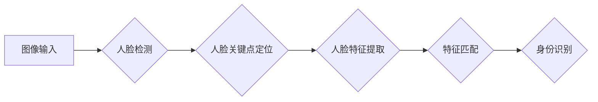

## 基于深度学习的人脸识别

> 关键词：深度学习、人脸识别、卷积神经网络、迁移学习、特征提取、生物识别

## 1. 背景介绍

人脸识别技术作为计算机视觉领域的重要分支，近年来取得了长足的进步，并广泛应用于安全监控、身份验证、人脸搜索等领域。传统的基于特征工程的人脸识别方法依赖于人工设计的特征，难以应对复杂的光照、姿态、表情变化等挑战。深度学习的兴起为人脸识别带来了新的机遇，通过学习数据中的特征表示，深度学习模型能够自动提取更鲁棒、更有效的特征，显著提升了人脸识别的准确率和泛化能力。

## 2. 核心概念与联系

### 2.1 人脸识别流程

人脸识别流程通常包括以下几个步骤：

1. **人脸检测:** 首先需要从图像或视频中检测出人脸区域。
2. **人脸关键点定位:**  定位人脸的关键点，例如眼睛、鼻子、嘴巴等，用于人脸姿态校正和特征提取。
3. **人脸特征提取:**  提取人脸的关键特征，用于描述人脸的独特属性。
4. **特征匹配:** 将提取的特征与数据库中的特征进行比较，识别身份。

### 2.2 深度学习在人脸识别中的应用

深度学习模型能够自动学习人脸特征，并进行高效的特征匹配，从而实现更准确、更鲁棒的人脸识别。

**流程图:**



## 3. 核心算法原理 & 具体操作步骤

### 3.1 算法原理概述

深度学习在人脸识别中的核心算法主要包括卷积神经网络（CNN）。CNN 是一种专门设计用于处理图像数据的深度神经网络，其结构由多个卷积层、池化层和全连接层组成。卷积层通过卷积核提取图像的局部特征，池化层降低特征图的维度，全连接层将提取的特征进行分类或回归。

### 3.2 算法步骤详解

1. **数据预处理:**  将人脸图像进行预处理，例如调整大小、归一化等，以适应模型的输入要求。
2. **模型训练:** 使用训练数据训练 CNN 模型，通过反向传播算法调整模型参数，使模型能够准确地提取人脸特征。
3. **模型评估:** 使用测试数据评估模型的性能，例如准确率、召回率、F1-score 等。
4. **模型部署:** 将训练好的模型部署到实际应用场景中，用于人脸识别任务。

### 3.3 算法优缺点

**优点:**

* **高准确率:** 深度学习模型能够学习到更复杂的特征，从而实现更高的识别准确率。
* **鲁棒性强:**  能够应对光照、姿态、表情等变化，具有较强的鲁棒性。
* **自动化程度高:**  无需人工设计特征，自动学习特征表示，降低了开发成本。

**缺点:**

* **数据依赖性强:**  深度学习模型需要大量的训练数据才能达到较好的性能。
* **计算资源消耗大:**  训练深度学习模型需要大量的计算资源和时间。
* **可解释性差:**  深度学习模型的决策过程较为复杂，难以解释其识别结果。

### 3.4 算法应用领域

* **人脸识别门禁系统:**  用于身份验证和安全控制。
* **人脸识别支付系统:**  用于便捷支付和身份认证。
* **人脸识别监控系统:**  用于安全监控和犯罪侦查。
* **人脸识别社交软件:**  用于人脸搜索和好友识别。

## 4. 数学模型和公式 & 详细讲解 & 举例说明

### 4.1 数学模型构建

深度学习模型的数学基础是神经网络，其核心是通过多层神经元进行特征提取和学习。

**神经网络模型:**

```latex
y = f(W_L * a_{L-1} + b_L)
```

其中：

* $y$ 是输出值
* $a_{L-1}$ 是上一层的激活值
* $W_L$ 是当前层的权重矩阵
* $b_L$ 是当前层的偏置向量
* $f$ 是激活函数

**卷积神经网络模型:**

CNN 模型主要由卷积层、池化层和全连接层组成。

* **卷积层:**  通过卷积核对输入图像进行卷积运算，提取图像的局部特征。

```latex
y_{i,j} = \sum_{m,n} x_{i+m,j+n} * w_{m,n} + b
```

其中：

* $y_{i,j}$ 是卷积输出的像素值
* $x_{i+m,j+n}$ 是输入图像的像素值
* $w_{m,n}$ 是卷积核的权重
* $b$ 是偏置值

* **池化层:**  对卷积输出进行下采样，降低特征图的维度，提高模型的鲁棒性。

* **全连接层:**  将提取的特征进行分类或回归。

### 4.2 公式推导过程

CNN 模型的训练过程是通过反向传播算法调整模型参数，使模型的输出与真实标签之间的误差最小化。

**损失函数:**

```latex
L = \frac{1}{N} \sum_{i=1}^{N} \left\| y_i - \hat{y}_i \right\|^2
```

其中：

* $L$ 是损失函数
* $N$ 是样本数量
* $y_i$ 是真实标签
* $\hat{y}_i$ 是模型预测的输出

**梯度下降算法:**

```latex
\theta = \theta - \alpha \nabla L(\theta)
```

其中：

* $\theta$ 是模型参数
* $\alpha$ 是学习率
* $\nabla L(\theta)$ 是损失函数对参数的梯度

### 4.3 案例分析与讲解

**人脸识别任务:**

假设我们有一个包含大量人脸图像的训练数据集，目标是训练一个 CNN 模型，能够识别不同人的脸。

**模型训练:**

1. 将训练数据预处理，例如调整大小、归一化等。
2. 使用 CNN 模型对训练数据进行训练，通过反向传播算法调整模型参数，使模型能够准确地识别不同人的脸。
3. 使用测试数据评估模型的性能，例如准确率、召回率、F1-score 等。

**模型部署:**

将训练好的模型部署到实际应用场景中，例如人脸识别门禁系统、人脸识别支付系统等。

## 5. 项目实践：代码实例和详细解释说明

### 5.1 开发环境搭建

* **操作系统:**  Windows、macOS、Linux
* **编程语言:**  Python
* **深度学习框架:**  TensorFlow、PyTorch
* **其他工具:**  Anaconda、Git

### 5.2 源代码详细实现

```python
# 使用 TensorFlow 框架实现人脸识别模型

import tensorflow as tf

# 定义模型结构
model = tf.keras.models.Sequential([
    tf.keras.layers.Conv2D(32, (3, 3), activation='relu', input_shape=(128, 128, 3)),
    tf.keras.layers.MaxPooling2D((2, 2)),
    tf.keras.layers.Conv2D(64, (3, 3), activation='relu'),
    tf.keras.layers.MaxPooling2D((2, 2)),
    tf.keras.layers.Flatten(),
    tf.keras.layers.Dense(10, activation='softmax')
])

# 编译模型
model.compile(optimizer='adam',
              loss='categorical_crossentropy',
              metrics=['accuracy'])

# 训练模型
model.fit(x_train, y_train, epochs=10)

# 评估模型
loss, accuracy = model.evaluate(x_test, y_test)
print('Loss:', loss)
print('Accuracy:', accuracy)
```

### 5.3 代码解读与分析

* **模型结构:**  定义了一个简单的 CNN 模型，包含两层卷积层、两层池化层和一层全连接层。
* **激活函数:**  使用 ReLU 激活函数，可以提高模型的学习能力。
* **损失函数:**  使用交叉熵损失函数，适合多分类任务。
* **优化器:**  使用 Adam 优化器，可以加速模型训练。
* **训练过程:**  使用训练数据训练模型，并设置训练轮数（epochs）。
* **评估过程:**  使用测试数据评估模型的性能，计算损失值和准确率。

### 5.4 运行结果展示

训练完成后，可以将模型部署到实际应用场景中，例如人脸识别门禁系统、人脸识别支付系统等。

## 6. 实际应用场景

### 6.1 人脸识别门禁系统

人脸识别门禁系统利用人脸识别技术，实现对人员身份的验证和控制。

### 6.2 人脸识别支付系统

人脸识别支付系统利用人脸识别技术，实现便捷支付和身份认证。

### 6.3 人脸识别监控系统

人脸识别监控系统利用人脸识别技术，实现对人员的识别和跟踪，提高安全监控效率。

### 6.4 未来应用展望

* **人脸识别医疗诊断:**  利用人脸识别技术，辅助医生进行疾病诊断。
* **人脸识别教育管理:**  利用人脸识别技术，实现学生考勤管理和身份验证。
* **人脸识别金融服务:**  利用人脸识别技术，提高金融服务的安全性。

## 7. 工具和资源推荐

### 7.1 学习资源推荐

* **书籍:**  《深度学习》
* **在线课程:**  Coursera、edX
* **博客:**  机器之心、AI 算法

### 7.2 开发工具推荐

* **深度学习框架:**  TensorFlow、PyTorch
* **图像处理库:**  OpenCV
* **数据可视化工具:**  Matplotlib、Seaborn

### 7.3 相关论文推荐

* **人脸识别论文:**  FaceNet: A Unified Embedding for Face Recognition and Clustering
* **深度学习论文:**  Deep Learning

## 8. 总结：未来发展趋势与挑战

### 8.1 研究成果总结

深度学习在人脸识别领域取得了显著的进展，显著提升了识别准确率和泛化能力。

### 8.2 未来发展趋势

* **模型更深更广:**  开发更深、更广的 CNN 模型，提高模型的表达能力。
* **迁移学习:**  利用预训练模型，减少训练数据需求。
* **对抗性学习:**  提高模型的鲁棒性，抵抗对抗攻击。

### 8.3 面临的挑战

* **数据隐私:**  人脸识别技术涉及到个人隐私问题，需要妥善处理。
* **算法公平性:**  人脸识别算法可能存在偏见，需要保证算法公平性。
* **可解释性:**  深度学习模型的决策过程较为复杂，难以解释其识别结果。

### 8.4 研究展望

未来研究方向包括：

* 开发更安全、更可靠的人脸识别算法。
* 探索人脸识别技术在更多领域的应用。
* 研究人脸识别技术带来的伦理和社会问题。

## 9. 附录：常见问题与解答

* **Q1: 人脸识别技术准确率如何？**

A1: 人脸识别技术的准确率不断提高，目前已达到很高的水平，但仍存在一定的误差。

* **Q2: 人脸识别技术是否安全？**

A2: 人脸识别技术存在一定的安全风险，例如数据泄露和身份盗窃。需要采取相应的安全措施来保护个人隐私。

* **Q3: 人脸识别技术是否会取代传统身份验证方式？**

A3: 人脸识别技术是一种