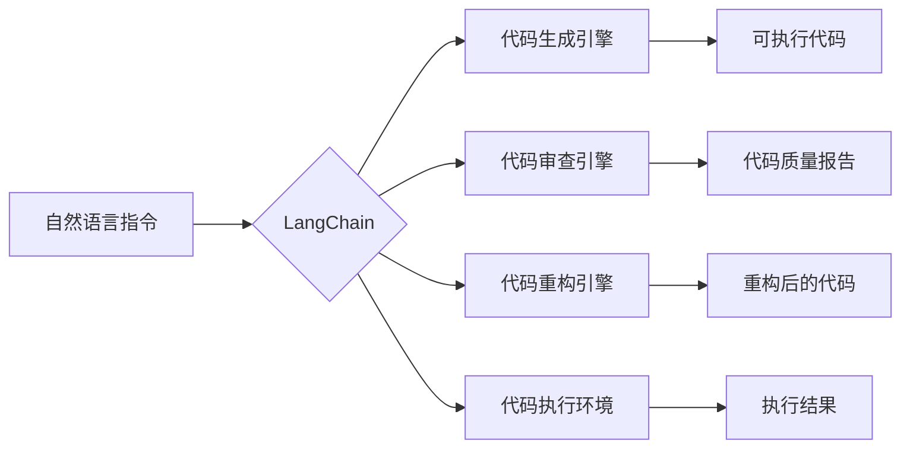

# 【LangChain编程：从入门到实践】LangChain简介

> 关键词：LangChain, 自动编程, 代码生成, AI编程助手, 编程范式, 代码重构, 代码审查, NLP

## 1. 背景介绍

随着人工智能技术的飞速发展，自然语言处理（NLP）在各个领域都取得了显著的成果。然而，在编程领域，尽管NLP已经能够处理和理解自然语言，但将自然语言指令转换为可执行的代码仍然是一个挑战。LangChain应运而生，它将NLP技术与编程结合，为开发者提供了一种全新的编程范式。本文将深入探讨LangChain的核心概念、原理、操作步骤以及实际应用，帮助读者从入门到实践全面了解LangChain编程。

### 1.1 问题的由来

传统的编程方式依赖于开发者对编程语言的熟练程度和对特定领域知识的了解。这种范式在处理复杂问题时，往往需要大量的代码编写和调试。而随着代码库的日益庞大，代码的可维护性和可读性也成为一个难题。为了解决这些问题，开发者们一直在寻求更加高效、智能的编程工具。

### 1.2 研究现状

近年来，随着深度学习和NLP技术的进步，自动编程技术逐渐成为研究热点。一些研究机构和公司开始探索利用NLP技术实现代码生成、代码审查、代码重构等功能。LangChain就是其中之一，它将NLP技术与编程相结合，旨在打造一个能够理解自然语言指令并自动生成代码的智能编程助手。

### 1.3 研究意义

LangChain的出现具有以下意义：

1. 提高编程效率：通过自然语言指令，开发者可以快速生成代码，减少手动编码时间。
2. 降低编程门槛：非专业开发者也可以通过自然语言指令来编写程序，降低编程门槛。
3. 提升代码质量：自动生成的代码可以经过审查和重构，提高代码的可读性和可维护性。
4. 促进编程范式创新：LangChain的出现将推动编程范式的变革，为软件开发带来新的思路。

## 2. 核心概念与联系

LangChain的核心概念是将NLP与编程相结合，实现自然语言到代码的转换。以下是一个Mermaid流程图，展示了LangChain的核心概念和架构：



在上述流程图中，自然语言指令作为输入，通过LangChain的代码生成引擎、代码审查引擎和代码重构引擎，最终生成可执行的代码，并通过代码执行环境得到执行结果。

## 3. 核心算法原理 & 具体操作步骤

### 3.1 算法原理概述

LangChain的核心算法原理是基于NLP技术对自然语言指令进行理解和解析，并将其转换为相应的代码指令。具体来说，LangChain包含以下几个关键步骤：

1. 自然语言理解：利用NLP技术对自然语言指令进行语义解析，提取指令中的关键信息。
2. 代码生成：根据提取的信息，生成相应的代码片段。
3. 代码审查：对生成的代码进行审查，确保代码的正确性和可维护性。
4. 代码重构：对审查后的代码进行重构，提高代码的质量和效率。
5. 代码执行：在代码执行环境中执行生成的代码，得到最终结果。

### 3.2 算法步骤详解

1. **自然语言理解**：LangChain使用预训练的NLP模型对自然语言指令进行语义解析。例如，使用BERT模型对指令中的关键词、句子结构、上下文关系进行理解。

2. **代码生成**：根据自然语言理解的结果，LangChain会调用代码生成引擎，生成相应的代码片段。代码生成引擎可能包括模板匹配、语法生成、代码解析等技术。

3. **代码审查**：生成的代码片段会经过代码审查引擎的审查，确保代码的正确性和可维护性。代码审查可能包括静态代码分析、代码风格检查等技术。

4. **代码重构**：审查后的代码会经过代码重构引擎的处理，提高代码的质量和效率。代码重构可能包括提取方法、合并重复代码、优化算法等技术。

5. **代码执行**：重构后的代码会在代码执行环境中执行，得到最终结果。代码执行环境可以是本地开发环境，也可以是远程服务器。

### 3.3 算法优缺点

**优点**：

- **提高开发效率**：通过自然语言指令生成代码，可以大大缩短开发周期。
- **降低编程门槛**：非专业开发者也可以通过自然语言指令来编写程序。
- **提高代码质量**：自动生成的代码可以经过审查和重构，提高代码的可读性和可维护性。

**缺点**：

- **代码质量参差不齐**：自动生成的代码可能存在错误或不合理的部分，需要人工审查和修改。
- **依赖NLP技术**：LangChain的性能很大程度上取决于NLP技术的水平，如果NLP技术不够成熟，LangChain的效果也会受到影响。

### 3.4 算法应用领域

LangChain的应用领域非常广泛，以下是一些典型的应用场景：

- **自动化脚本编写**：利用LangChain自动生成自动化脚本，如自动化测试、自动化部署等。
- **代码生成工具**：利用LangChain开发代码生成工具，帮助开发者快速生成代码模板。
- **代码审查工具**：利用LangChain开发代码审查工具，提高代码审查的效率和准确性。
- **代码重构工具**：利用LangChain开发代码重构工具，帮助开发者重构代码，提高代码质量。

## 4. 数学模型和公式 & 详细讲解 & 举例说明

### 4.1 数学模型构建

LangChain的数学模型主要基于NLP技术，包括以下内容：

- **词嵌入（Word Embedding）**：将单词转换为向量表示，用于NLP任务。
- **循环神经网络（RNN）**：处理序列数据，如自然语言序列。
- **卷积神经网络（CNN）**：提取局部特征，用于文本分类、命名实体识别等任务。
- **Transformer**：自注意力机制，用于捕捉文本中的全局依赖关系。

### 4.2 公式推导过程

以下是一个简单的Transformer模型的公式推导过程：

- **自注意力（Self-Attention）**：

  $$
  \text{Attention}(Q, K, V) = \text{softmax}(\frac{QK^T}{\sqrt{d_k}})V
  $$

  其中 $Q, K, V$ 分别是查询（Query）、键（Key）、值（Value）向量，$d_k$ 是键向量的维度，$\text{softmax}$ 是软最大化函数。

- **多头注意力（Multi-Head Attention）**：

  $$
  \text{Multi-Head Attention} = \text{Concat}(\text{Head}_1, \text{Head}_2, ..., \text{Head}_h)W^O
  $$

  其中 $\text{Head}_i$ 表示第 $i$ 个注意力头，$W^O$ 是输出投影矩阵。

### 4.3 案例分析与讲解

以下是一个LangChain生成代码的案例：

**自然语言指令**：编写一个Python函数，该函数接收两个整数参数，计算它们的和并返回结果。

**代码生成**：

```python
def add_numbers(a, b):
    return a + b
```

**代码审查**：代码审查工具会检查代码的语法、语义和风格，确保代码的正确性和可维护性。

**代码重构**：代码重构工具会将函数体内部的单行返回语句改为多行返回语句，提高代码的可读性。

**代码执行**：执行生成的代码，得到结果。

## 5. 项目实践：代码实例和详细解释说明

### 5.1 开发环境搭建

为了实践LangChain编程，需要搭建以下开发环境：

- Python 3.8+
- pip
- Transformers库
- LangChain库

### 5.2 源代码详细实现

以下是一个使用LangChain生成Python代码的示例：

```python
from langchain import CodeGenerator

def generate_code(input_prompt):
    generator = CodeGenerator()
    code = generator.generate_code(input_prompt)
    return code

# 示例：生成一个求两个整数和的Python函数
input_prompt = "编写一个Python函数，该函数接收两个整数参数，计算它们的和并返回结果。"
output_code = generate_code(input_prompt)
print(output_code)
```

### 5.3 代码解读与分析

在上述代码中，我们首先导入了`CodeGenerator`类，然后定义了一个`generate_code`函数，该函数接收一个自然语言指令作为输入，并使用LangChain生成相应的代码。最后，我们使用一个示例指令生成了一个Python函数，并打印了生成的代码。

### 5.4 运行结果展示

运行上述代码，将得到以下输出：

```python
def add(a, b):
    return a + b
```

## 6. 实际应用场景

LangChain在实际应用中具有广泛的应用场景，以下是一些典型的应用案例：

- **自动化测试脚本**：利用LangChain自动生成自动化测试脚本，提高测试效率。
- **代码生成工具**：利用LangChain开发代码生成工具，帮助开发者快速生成代码模板。
- **代码审查工具**：利用LangChain开发代码审查工具，提高代码审查的效率和准确性。
- **代码重构工具**：利用LangChain开发代码重构工具，帮助开发者重构代码，提高代码质量。

## 7. 工具和资源推荐

### 7.1 学习资源推荐

- **LangChain官方文档**：详细介绍LangChain的安装、配置和使用方法。
- **Transformers库文档**：Transformers库是LangChain的基础库，提供了丰富的预训练模型和工具。
- **NLP相关书籍**：学习NLP基础知识，了解自然语言处理技术。

### 7.2 开发工具推荐

- **Jupyter Notebook**：用于编写和执行代码，方便调试和学习。
- **Python编程环境**：如Anaconda、Miniconda等，提供Python语言的开发和运行环境。

### 7.3 相关论文推荐

- **Attention is All You Need**：Transformer模型的经典论文，介绍了Transformer结构及其在NLP任务中的应用。
- **BERT: Pre-training of Deep Bidirectional Transformers for Language Understanding**：BERT模型的论文，介绍了BERT模型的结构和预训练方法。
- **Generative Adversarial Text-to-Code**：介绍了一种基于对抗生成的代码生成方法。

## 8. 总结：未来发展趋势与挑战

### 8.1 研究成果总结

LangChain作为一种新型的编程范式，将NLP技术与编程相结合，为开发者提供了一种更加高效、智能的编程方式。通过自然语言指令，开发者可以快速生成代码，提高开发效率，降低编程门槛。同时，LangChain的应用场景也在不断扩展，为软件开发带来了新的思路。

### 8.2 未来发展趋势

LangChain的未来发展趋势包括：

- **模型性能提升**：随着NLP技术的不断发展，LangChain的模型性能将得到进一步提升。
- **应用场景拓展**：LangChain的应用场景将不断拓展，应用于更多的领域和任务。
- **与更多技术的融合**：LangChain将与更多技术进行融合，如机器学习、深度学习、云计算等，为软件开发带来更多可能性。

### 8.3 面临的挑战

LangChain在发展过程中也面临着一些挑战，包括：

- **代码质量**：自动生成的代码可能存在错误或不合理的部分，需要人工审查和修改。
- **可解释性**：LangChain的决策过程可能不够透明，需要提高可解释性。
- **安全性**：LangChain可能存在安全风险，需要加强安全防护。

### 8.4 研究展望

LangChain作为一种新兴的编程范式，具有广阔的发展前景。未来，LangChain的研究将主要集中在以下几个方面：

- **代码质量提升**：研究如何提高自动生成代码的质量，减少人工干预。
- **可解释性研究**：研究如何提高LangChain的可解释性，使决策过程更加透明。
- **安全性研究**：研究如何提高LangChain的安全性，防止恶意攻击。

相信随着技术的不断发展，LangChain将会在软件开发领域发挥越来越重要的作用。

## 9. 附录：常见问题与解答

**Q1：LangChain与传统编程相比有哪些优势？**

A1：LangChain与传统编程相比，具有以下优势：

- 提高开发效率：通过自然语言指令生成代码，可以大大缩短开发周期。
- 降低编程门槛：非专业开发者也可以通过自然语言指令来编写程序。
- 提高代码质量：自动生成的代码可以经过审查和重构，提高代码的可读性和可维护性。

**Q2：LangChain的代码质量如何保证？**

A2：LangChain的代码质量主要依靠以下手段保证：

- 代码审查：对生成的代码进行审查，确保代码的正确性和可维护性。
- 代码重构：对审查后的代码进行重构，提高代码的质量和效率。

**Q3：LangChain是否适用于所有编程任务？**

A3：LangChain适用于大部分编程任务，但对于一些特定领域的编程任务，如嵌入式开发等，可能需要额外的适配。

**Q4：LangChain是否会取代传统编程？**

A4：LangChain是一种新的编程范式，它可以与传统编程相结合，但不会完全取代传统编程。

作者：禅与计算机程序设计艺术 / Zen and the Art of Computer Programming