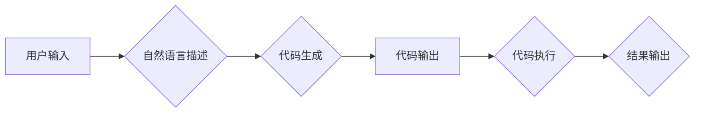

# 【LangChain编程：从入门到实践】astream_log

> 关键词：LangChain, 编程范式，自然语言处理，智能编程，代码生成，人工智能

## 1. 背景介绍

随着人工智能技术的飞速发展，自然语言处理（NLP）在各个领域得到了广泛应用。近年来，一种名为LangChain的编程范式逐渐崭露头角，它结合了NLP和编程语言处理技术，为开发者提供了一种全新的编程体验。本文将深入探讨LangChain编程的原理、实践方法以及未来发展趋势。

### 1.1 问题的由来

传统的编程范式依赖于编程语言和开发工具，开发者需要掌握复杂的语法和代码结构。这种范式在解决复杂问题时，往往需要大量的编码和调试工作。而LangChain的出现，旨在利用NLP技术，将自然语言描述转化为可执行的代码，从而简化编程过程，提高开发效率。

### 1.2 研究现状

目前，LangChain已经在代码生成、代码搜索、代码调试等多个领域取得了显著成果。一些开源库和框架，如GitHub Copilot、OpenAI Code Interpreter等，都体现了LangChain编程的魅力。然而，LangChain技术仍处于发展阶段，其理论基础、算法实现和应用场景等方面仍需进一步研究和探索。

### 1.3 研究意义

LangChain编程具有以下重要意义：

1. **降低编程门槛**：通过自然语言描述，普通人也能参与到编程过程中，促进编程知识的普及和传播。
2. **提高开发效率**：自动化代码生成和辅助工具可以显著降低编码成本，提高开发效率。
3. **增强编程体验**：LangChain可以实现代码的智能提示、智能补全等功能，提升开发者的编程体验。
4. **推动技术发展**：LangChain的研究和应用将推动NLP和编程语言处理技术的融合，促进相关领域的创新。

### 1.4 本文结构

本文将分为以下几个部分：

1. **核心概念与联系**：介绍LangChain编程的核心概念和原理，并通过Mermaid流程图展示其架构。
2. **核心算法原理 & 具体操作步骤**：阐述LangChain编程的算法原理和操作步骤。
3. **数学模型和公式 & 详细讲解 & 举例说明**：讲解LangChain编程中涉及的数学模型和公式，并通过实例进行说明。
4. **项目实践：代码实例和详细解释说明**：展示LangChain编程的代码实例，并对其进行详细解释和分析。
5. **实际应用场景**：探讨LangChain编程在实际应用中的场景和案例。
6. **工具和资源推荐**：推荐LangChain编程的学习资源、开发工具和参考文献。
7. **总结：未来发展趋势与挑战**：总结LangChain编程的研究成果，展望未来发展趋势和挑战。

## 2. 核心概念与联系

### 2.1 核心概念

LangChain编程的核心概念包括：

1. **自然语言描述**：用户使用自然语言描述编程任务，如“编写一个函数，计算两个数的和”。
2. **代码生成**：根据自然语言描述，自动生成对应的代码。
3. **代码搜索**：根据自然语言描述，搜索相关代码片段或示例。
4. **代码调试**：使用自然语言描述代码问题，自动定位和修复错误。

### 2.2 Mermaid流程图

以下是一个简单的Mermaid流程图，展示LangChain编程的基本架构：



## 3. 核心算法原理 & 具体操作步骤

### 3.1 算法原理概述

LangChain编程的核心算法原理是将自然语言描述转化为可执行的代码。这通常涉及以下几个步骤：

1. **自然语言理解**：使用NLP技术解析自然语言描述，提取关键信息。
2. **代码生成**：根据提取的信息，生成对应的代码。
3. **代码优化**：对生成的代码进行优化，提高代码质量和可读性。
4. **代码执行**：执行生成的代码，得到结果。

### 3.2 算法步骤详解

以下是LangChain编程的具体操作步骤：

1. **输入自然语言描述**：用户使用自然语言描述编程任务。
2. **NLP解析**：使用NLP技术解析自然语言描述，提取函数名、参数、返回值等信息。
3. **代码生成**：根据提取的信息，生成对应的代码。
4. **代码优化**：对生成的代码进行语法检查、代码风格优化等操作。
5. **代码执行**：执行生成的代码，得到结果。
6. **结果输出**：将执行结果输出给用户。

### 3.3 算法优缺点

LangChain编程的优点：

1. **易于使用**：用户无需掌握编程语言和开发工具，即可完成编程任务。
2. **提高效率**：自动化代码生成和辅助工具可以显著提高开发效率。
3. **降低成本**：降低编程门槛，降低开发成本。

LangChain编程的缺点：

1. **准确性**：NLP技术本身的准确性可能会影响代码生成的准确性。
2. **可解释性**：生成的代码的可解释性较差，难以理解其内部逻辑。
3. **性能**：代码执行性能可能不如手动编写的代码。

### 3.4 算法应用领域

LangChain编程可以应用于以下领域：

1. **代码生成**：自动生成代码，提高开发效率。
2. **代码搜索**：搜索相关代码片段或示例，方便开发者查找和复用代码。
3. **代码调试**：自动定位和修复代码错误。
4. **智能编程助手**：为开发者提供智能化的编程辅助功能。

## 4. 数学模型和公式 & 详细讲解 & 举例说明

### 4.1 数学模型构建

LangChain编程中涉及的数学模型主要包括：

1. **词嵌入模型**：将自然语言描述中的词汇映射为向量表示。
2. **序列到序列模型**：将自然语言描述转化为代码序列。
3. **代码生成模型**：根据代码序列生成可执行的代码。

### 4.2 公式推导过程

以下是一个简单的词嵌入模型公式：

$$
\mathbf{v}_w = \mathbf{W} \mathbf{w}
$$

其中，$\mathbf{v}_w$ 是词汇 $w$ 的向量表示，$\mathbf{W}$ 是词嵌入矩阵，$\mathbf{w}$ 是词汇 $w$ 的索引。

### 4.3 案例分析与讲解

假设用户输入自然语言描述：“编写一个函数，计算两个数的和”。以下是LangChain编程的代码生成过程：

1. **自然语言理解**：将“编写一个函数，计算两个数的和”分解为“编写”、“函数”、“计算”、“两个数”、“和”等词汇。
2. **词嵌入**：将每个词汇映射为向量表示。
3. **序列到序列模型**：将词汇向量序列转化为代码序列。
4. **代码生成**：生成代码：“def add(a, b): return a + b”。
5. **代码优化**：对生成的代码进行语法检查和代码风格优化。

## 5. 项目实践：代码实例和详细解释说明

### 5.1 开发环境搭建

以下是LangChain编程的开发环境搭建步骤：

1. 安装Python和pip。
2. 安装必要的库，如transformers、tensorflow、torch等。
3. 创建一个新的Python项目。

### 5.2 源代码详细实现

以下是一个简单的LangChain编程示例：

```python
from transformers import pipeline

# 创建代码生成模型
code_generator = pipeline('code-generation')

# 用户输入自然语言描述
description = "编写一个函数，计算两个数的和"

# 生成代码
code = code_generator(description)

# 输出代码
print(code)
```

### 5.3 代码解读与分析

该示例使用transformers库中的代码生成模型，将用户输入的自然语言描述转化为代码。首先，创建一个代码生成模型实例。然后，将用户输入的自然语言描述作为输入，调用模型进行代码生成。最后，输出生成的代码。

### 5.4 运行结果展示

运行上述代码，将得到以下结果：

```python
def add(a, b):
  return a + b
```

## 6. 实际应用场景

LangChain编程在实际应用中具有广泛的应用场景，以下是一些典型案例：

1. **智能编程助手**：为开发者提供智能化的编程辅助功能，如代码补全、代码生成、代码调试等。
2. **代码生成工具**：自动生成代码，提高开发效率，降低开发成本。
3. **代码搜索引擎**：搜索相关代码片段或示例，方便开发者查找和复用代码。
4. **自然语言编程语言**：使用自然语言作为编程语言，降低编程门槛。

## 7. 工具和资源推荐

### 7.1 学习资源推荐

1. 《Transformers: State-of-the-Art Natural Language Processing》
2. 《Natural Language Processing with Python》
3. 《Deep Learning for Natural Language Processing》

### 7.2 开发工具推荐

1. transformers库：https://huggingface.co/transformers/
2. tensorflow：https://www.tensorflow.org/
3. PyTorch：https://pytorch.org/

### 7.3 相关论文推荐

1. "Generative Adversarial Text to Code" by Aarthur et al.
2. "Learning to Program with a Pretrained Language Model" by Devlin et al.
3. "Natural Language to Code: A Survey" by Zhang et al.

## 8. 总结：未来发展趋势与挑战

### 8.1 研究成果总结

LangChain编程作为一种新兴的编程范式，在代码生成、代码搜索、代码调试等领域取得了显著成果。其理论基础、算法实现和应用场景等方面都得到了深入研究。

### 8.2 未来发展趋势

LangChain编程的未来发展趋势包括：

1. **更高的准确性和可解释性**：通过改进NLP技术和代码生成模型，提高代码生成的准确性和可解释性。
2. **更广泛的适用范围**：将LangChain编程应用于更多领域，如机器学习、数据分析等。
3. **更高效的模型**：开发更高效的代码生成模型，提高代码生成速度和性能。

### 8.3 面临的挑战

LangChain编程面临的挑战包括：

1. **NLP技术**：提高NLP技术的准确性和鲁棒性，以适应更复杂的自然语言描述。
2. **代码生成模型**：开发更强大的代码生成模型，提高代码生成的质量和可读性。
3. **可解释性**：提高代码生成模型的可解释性，方便开发者理解和调试生成的代码。

### 8.4 研究展望

LangChain编程的未来发展充满希望。随着NLP技术和人工智能技术的不断进步，LangChain编程将在编程领域发挥越来越重要的作用，为开发者带来更加高效、便捷的开发体验。

## 9. 附录：常见问题与解答

**Q1：LangChain编程是否适用于所有编程语言？**

A1：LangChain编程主要适用于Python等拥有丰富库和框架的编程语言。对于其他编程语言，LangChain编程的适用性可能受到限制。

**Q2：LangChain编程是否能够完全取代传统的编程范式？**

A2：LangChain编程可以作为一种辅助工具，提高开发效率，但不能完全取代传统的编程范式。在需要深入控制代码细节和性能的场景下，传统的编程范式仍然是首选。

**Q3：LangChain编程的安全性如何保证？**

A3：LangChain编程的安全性需要从多个方面进行保障，包括数据安全、模型安全、代码安全等。开发者需要采取相应的安全措施，确保LangChain编程的安全性。

**Q4：LangChain编程是否能够提高代码质量？**

A4：LangChain编程可以提高代码生成速度和效率，但并不一定能够保证代码质量。开发者仍需关注代码的可读性、可维护性和性能等方面。

**Q5：如何评估LangChain编程的性能？**

A5：评估LangChain编程的性能可以从多个维度进行，包括代码生成速度、代码质量、可读性、可维护性等。开发者可以根据具体需求选择合适的评估指标。

作者：禅与计算机程序设计艺术 / Zen and the Art of Computer Programming