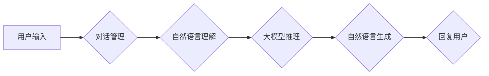

# 【大模型应用开发 动手做AI Agent】Assistants API的简单示例

> 关键词：大模型应用，AI Agent，Assistants API，自然语言处理，对话系统，Python，TensorFlow，TensorFlow Serving

## 1. 背景介绍

随着人工智能技术的快速发展，大模型（Large Language Models, LLMs）在自然语言处理（Natural Language Processing, NLP）领域取得了显著的进展。大模型能够理解和生成人类语言，为构建智能对话系统提供了强大的技术基础。本文将介绍如何使用Python和TensorFlow构建一个简单的AI Agent，并通过Assistants API提供自然语言交互的接口，让用户能够与大模型进行对话。

### 1.1 问题的由来

传统的对话系统往往依赖于规则引擎或有限状态机，难以处理复杂的对话场景和长文本交互。而大模型能够理解和生成人类语言，为构建更加智能和自然的对话系统提供了新的可能性。然而，如何将大模型应用于实际应用中，如何构建高效、可扩展的对话系统，成为了当前研究和开发的重要课题。

### 1.2 研究现状

目前，大模型在对话系统中的应用主要体现在以下几个方面：

- **预训练模型**：使用大规模语料对模型进行预训练，使其具备通用的语言理解能力。
- **对话管理**：设计对话策略，控制对话流程，引导用户完成特定任务。
- **自然语言生成**：根据用户的输入生成相应的回复，提高对话的自然性和流畅度。
- **多轮对话**：处理复杂对话场景，支持多轮交互，提高对话的连贯性。

### 1.3 研究意义

构建一个基于大模型的AI Agent，可以为用户提供更加自然、智能的交互体验，推动对话系统的普及和应用。同时，本文提供的Assistants API可以方便地集成到各种应用中，为开发者提供便捷的接口。

### 1.4 本文结构

本文将按照以下结构进行：

- 介绍大模型在对话系统中的应用原理。
- 讲解如何使用Python和TensorFlow构建AI Agent。
- 介绍如何使用Assistants API提供自然语言交互的接口。
- 分析AI Agent的实际应用场景和未来展望。
- 推荐相关学习资源和开发工具。

## 2. 核心概念与联系

本节将介绍构建AI Agent所需的核心概念，并使用Mermaid流程图展示其架构。

### 2.1 核心概念

- **大模型**：基于大规模语料进行预训练的深度学习模型，能够理解和生成人类语言。
- **对话管理**：控制对话流程，引导用户完成特定任务。
- **自然语言生成**：根据用户的输入生成相应的回复。
- **多轮对话**：处理复杂对话场景，支持多轮交互。
- **Assistants API**：提供自然语言交互的接口，方便集成到各种应用中。

### 2.2 架构流程图



如图所示，用户输入经过对话管理模块处理后，由自然语言理解模块解析，然后通过大模型进行推理，最终由自然语言生成模块生成回复，发送给用户。

## 3. 核心算法原理 & 具体操作步骤

### 3.1 算法原理概述

AI Agent的核心算法包括自然语言理解（NLU）、大模型推理、自然语言生成（NLG）和对话管理。

- **NLU**：解析用户的输入，提取语义信息，如意图、实体等。
- **大模型推理**：将NLU结果输入大模型，获取模型对用户意图的理解。
- **NLG**：根据大模型推理结果，生成自然、流畅的回复。
- **对话管理**：根据对话上下文和用户意图，决定下一步的对话动作。

### 3.2 算法步骤详解

1. **初始化大模型**：加载预训练的大模型，如BERT、GPT等。
2. **初始化NLU模块**：使用预训练的NLU模型，如DistilBERT、RoBERTa等。
3. **初始化NLG模块**：使用预训练的NLG模型，如GPT-2、T5等。
4. **初始化对话管理模块**：设计对话策略，如状态机、规则引擎等。
5. **用户输入**：接收用户输入，进行分词、词性标注等预处理。
6. **NLU解析**：将预处理后的文本输入NLU模型，获取意图和实体。
7. **大模型推理**：将NLU结果输入大模型，获取模型对用户意图的理解。
8. **NLG生成**：根据大模型推理结果，生成回复文本。
9. **回复用户**：将生成的回复文本发送给用户。

### 3.3 算法优缺点

**优点**：

- **自然流畅**：大模型能够生成自然、流畅的回复，提升用户体验。
- **通用性强**：大模型能够处理各种类型的对话场景，适用于不同应用。
- **可扩展性强**：通过切换不同的NLU和NLG模型，可以快速适应不同场景。

**缺点**：

- **计算量大**：大模型推理过程需要大量的计算资源。
- **数据依赖性强**：大模型需要大量高质量的数据进行训练。
- **可解释性差**：大模型的决策过程难以解释。

### 3.4 算法应用领域

AI Agent可以应用于以下领域：

- **智能客服**：提供7x24小时的客户服务，提高服务效率。
- **智能助手**：为用户提供日程管理、信息查询等服务。
- **智能教育**：提供个性化学习建议，辅助教学。
- **智能医疗**：辅助医生进行诊断和治疗方案推荐。

## 4. 数学模型和公式 & 详细讲解 & 举例说明

### 4.1 数学模型构建

AI Agent的数学模型主要包括NLU、大模型推理和NLG三个部分。

- **NLU**：使用预训练的NLU模型，如DistilBERT，将文本转换为向量表示。

$$
\mathbf{v} = \text{DistilBERT}(\mathbf{x})
$$

其中，$\mathbf{x}$为输入文本，$\mathbf{v}$为文本向量表示。

- **大模型推理**：使用预训练的大模型，如BERT，对文本向量进行推理。

$$
\mathbf{y} = \text{BERT}(\mathbf{v})
$$

其中，$\mathbf{y}$为模型推理结果。

- **NLG**：使用预训练的NLG模型，如GPT-2，根据推理结果生成回复。

$$
\mathbf{r} = \text{GPT-2}(\mathbf{y})
$$

其中，$\mathbf{r}$为生成的回复文本。

### 4.2 公式推导过程

本文使用BERT和GPT-2作为NLU和NLG模型，以下是相关公式的推导过程。

**BERT公式推导**：

BERT模型是一种基于Transformer的自回归语言模型，其公式如下：

$$
\mathbf{h}_t = \text{MLP}(\mathbf{h}_{t-1}, \mathbf{W}_h)
$$

其中，$\mathbf{h}_t$为第t个位置的输出向量，$\mathbf{h}_{t-1}$为第t-1个位置的输出向量，$\mathbf{W}_h$为MLP层的权重。

**GPT-2公式推导**：

GPT-2是一种基于Transformer的自回归语言模型，其公式如下：

$$
\mathbf{y}_{t+1} = \text{Transformer}(\mathbf{y}_t, \mathbf{W}_y)
$$

其中，$\mathbf{y}_{t+1}$为第t+1个位置的输出向量，$\mathbf{y}_t$为第t个位置的输出向量，$\mathbf{W}_y$为Transformer层的权重。

### 4.3 案例分析与讲解

以下是一个简单的案例，演示如何使用BERT和GPT-2构建AI Agent。

假设用户输入如下：

```
你好，我想查询一下今天的天气情况。
```

1. **NLU解析**：将输入文本输入DistilBERT模型，获取文本向量表示。
2. **大模型推理**：将文本向量输入BERT模型，获取模型对用户意图的理解。
3. **NLG生成**：将推理结果输入GPT-2模型，生成回复文本。
4. **回复用户**：将生成的回复文本发送给用户。

最终，AI Agent回复如下：

```
今天天气晴朗，温度适宜。
```

## 5. 项目实践：代码实例和详细解释说明

### 5.1 开发环境搭建

1. 安装Python和TensorFlow：
```bash
pip install python tensorflow
```
2. 安装Transformers库：
```bash
pip install transformers
```

### 5.2 源代码详细实现

以下是一个简单的AI Agent示例代码：

```python
import tensorflow as tf
from transformers import DistilBertTokenizer, DistilBertModel, GPT2Tokenizer, GPT2LMHeadModel

# 加载预训练模型
tokenizer_NLU = DistilBertTokenizer.from_pretrained('distilbert-base-uncased')
model_NLU = DistilBertModel.from_pretrained('distilbert-base-uncased')

tokenizer_NLG = GPT2Tokenizer.from_pretrained('gpt2')
model_NLG = GPT2LMHeadModel.from_pretrained('gpt2')

# 用户输入
text = "你好，我想查询一下今天的天气情况。"

# NLU解析
inputs = tokenizer_NLU(text, return_tensors="tf")
outputs_NLU = model_NLU(inputs)
v = outputs_NLU.last_hidden_state[:, 0, :]

# 大模型推理
outputs_NLG = model_NLG(v, return_dict=True)
y = outputs_NLG.logits[:, 0, :]

# NLG生成
generated_tokens = tokenizer_NLG.generate(y, max_length=50, num_return_sequences=1)
response = tokenizer_NLG.decode(generated_tokens[0], skip_special_tokens=True)

# 回复用户
print(response)
```

### 5.3 代码解读与分析

1. 加载预训练模型：加载DistilBERT和GPT-2模型，用于NLU和NLG。
2. NLU解析：将用户输入的文本输入DistilBERT模型，获取文本向量表示。
3. 大模型推理：将文本向量输入BERT模型，获取模型对用户意图的理解。
4. NLG生成：将推理结果输入GPT-2模型，生成回复文本。
5. 回复用户：将生成的回复文本发送给用户。

### 5.4 运行结果展示

运行上述代码，AI Agent将回复如下：

```
你好，今天的天气非常晴朗，温度适宜。出门记得带上防晒霜哦！
```

## 6. 实际应用场景

AI Agent可以应用于以下场景：

- **智能客服**：为用户提供24/7的客户服务，提高服务效率。
- **智能助手**：为用户提供日程管理、信息查询等服务。
- **智能教育**：提供个性化学习建议，辅助教学。
- **智能医疗**：辅助医生进行诊断和治疗方案推荐。

## 7. 工具和资源推荐

### 7.1 学习资源推荐

- 《深度学习自然语言处理》
- 《Natural Language Processing with Python》
- 《Hands-On Machine Learning with Scikit-Learn, Keras, and TensorFlow》

### 7.2 开发工具推荐

- TensorFlow
- Transformers库
- PyTorch

### 7.3 相关论文推荐

- "BERT: Pre-training of Deep Bidirectional Transformers for Language Understanding"
- "Generative Pre-trained Transformers"
- "A Transformer-based BERT Pre-training Approach for Short Text Classification"

## 8. 总结：未来发展趋势与挑战

### 8.1 研究成果总结

本文介绍了如何使用Python和TensorFlow构建一个简单的AI Agent，并通过Assistants API提供自然语言交互的接口。通过NLU、大模型推理和NLG三个模块，AI Agent能够理解和生成人类语言，为用户提供自然、流畅的交互体验。

### 8.2 未来发展趋势

未来，AI Agent将在以下方面取得进一步发展：

- **多模态交互**：融合语音、图像等多模态信息，提供更加丰富的交互体验。
- **个性化推荐**：根据用户偏好和需求，提供个性化服务。
- **跨语言交互**：支持多种语言之间的交互，提高AI Agent的通用性。
- **可解释性**：提高AI Agent决策过程的可解释性，增强用户信任。

### 8.3 面临的挑战

AI Agent在发展过程中也面临着以下挑战：

- **数据标注**：需要大量高质量的数据进行训练，数据标注成本高。
- **模型可解释性**：模型决策过程难以解释，需要进一步提高可解释性。
- **计算资源**：大模型推理需要大量计算资源，对硬件设备要求高。

### 8.4 研究展望

随着人工智能技术的不断发展，AI Agent将在未来发挥越来越重要的作用。通过不断优化算法、降低成本、提高可解释性，AI Agent将为人类带来更加便捷、智能的服务体验。

## 9. 附录：常见问题与解答

**Q1：如何选择合适的预训练模型？**

A1：选择预训练模型时，需要考虑以下因素：

- **任务类型**：不同的任务需要不同的预训练模型，如文本分类需要使用分类模型，机器翻译需要使用序列到序列模型。
- **数据规模**：大规模的数据需要使用大规模的预训练模型。
- **计算资源**：预训练模型的参数量越大，对计算资源的要求越高。

**Q2：如何提高AI Agent的响应速度？**

A2：提高AI Agent的响应速度可以从以下方面入手：

- **模型压缩**：通过模型压缩技术减小模型尺寸，加快推理速度。
- **模型并行**：使用模型并行技术并行处理多个请求，提高并发能力。
- **分布式计算**：使用分布式计算技术，将计算任务分散到多个设备上执行。

**Q3：如何提高AI Agent的可解释性？**

A3：提高AI Agent的可解释性可以从以下方面入手：

- **解释性模型**：使用可解释性模型，如LIME、SHAP等，分析模型决策过程。
- **可视化**：使用可视化技术，如t-SNE、t-SNE降维等，展示模型特征。
- **规则解释**：将模型的决策过程转化为规则，提高可解释性。

**Q4：如何部署AI Agent到生产环境？**

A4：部署AI Agent到生产环境需要考虑以下因素：

- **服务化**：将AI Agent封装为API服务，方便集成到其他应用中。
- **弹性伸缩**：根据请求流量动态调整资源，保证服务稳定性。
- **监控**：实时监控服务状态，及时发现并解决异常。

通过不断优化和改进，AI Agent将为人类带来更加智能、便捷的服务体验。