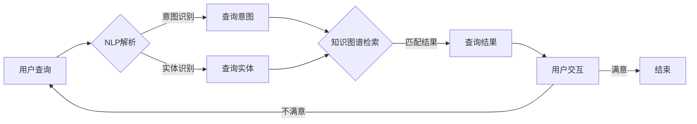

# 【大模型应用开发 动手做AI Agent】构建查询引擎和工具

> 关键词：大模型，AI Agent，查询引擎，自然语言处理，知识图谱，知识图谱嵌入，推理系统，人机交互

## 1. 背景介绍

随着人工智能技术的飞速发展，大模型（Large Language Model, LLM）在自然语言处理（Natural Language Processing, NLP）领域取得了突破性进展。这些大模型能够理解和生成自然语言，为构建智能查询引擎和工具提供了强大的技术支持。本文将探讨如何利用大模型构建AI Agent，实现高效的信息检索和智能问答。

### 1.1 问题的由来

在信息爆炸的时代，人们面临着海量信息的困扰。如何快速、准确地找到所需信息，成为了亟待解决的问题。传统的搜索引擎虽然能够解决部分信息检索问题，但往往存在以下不足：

1. 搜索结果不精确，难以满足用户特定需求。
2. 缺乏对用户意图的理解，无法提供个性化的服务。
3. 信息更新速度慢，难以反映最新的信息变化。

为了解决上述问题，我们需要构建一种能够理解用户意图、快速检索信息、并提供个性化服务的智能查询引擎和工具。这便是本文要探讨的AI Agent。

### 1.2 研究现状

目前，大模型在查询引擎和工具构建方面已经取得了显著成果。以下是一些典型的研究方向：

1. 知识图谱嵌入：将实体、关系和属性等信息转化为向量表示，方便在查询引擎中进行高效检索。
2. 自然语言理解：利用NLP技术，解析用户查询，理解用户意图。
3. 推理系统：基于知识图谱和逻辑推理，回答用户的问题。
4. 人机交互：设计友好的用户界面，实现人与AI Agent的互动。

### 1.3 研究意义

构建基于大模型的查询引擎和工具，具有以下重要意义：

1. 提高信息检索效率，降低用户获取信息的成本。
2. 为用户提供个性化的服务，提升用户体验。
3. 推动人工智能技术在信息检索领域的应用，促进产业发展。
4. 为构建智能化社会提供技术支持。

### 1.4 本文结构

本文将围绕以下内容展开：

1. 介绍构建查询引擎和工具所需的核心概念与联系。
2. 阐述基于大模型的AI Agent算法原理和具体操作步骤。
3. 详细讲解数学模型、公式和案例分析。
4. 展示项目实践：代码实例和详细解释说明。
5. 探讨实际应用场景和未来应用展望。
6. 推荐相关工具和资源。
7. 总结未来发展趋势与挑战。
8. 提供常见问题与解答。

## 2. 核心概念与联系

### 2.1 Mermaid 流程图

以下是大模型构建查询引擎和工具的Mermaid流程图：



### 2.2 核心概念

1. **知识图谱**：以图的形式表示实体、关系和属性等信息，为AI Agent提供知识库。
2. **知识图谱嵌入**：将图中的实体和关系转化为向量表示，方便在查询引擎中进行高效检索。
3. **自然语言理解**：利用NLP技术，解析用户查询，理解用户意图和查询实体。
4. **推理系统**：基于知识图谱和逻辑推理，回答用户的问题。
5. **人机交互**：设计友好的用户界面，实现人与AI Agent的互动。

## 3. 核心算法原理 & 具体操作步骤

### 3.1 算法原理概述

构建查询引擎和工具的核心算法包括：

1. **知识图谱嵌入**：将实体和关系转化为向量表示。
2. **自然语言理解**：解析用户查询，识别意图和查询实体。
3. **查询意图**：根据用户查询和知识图谱，确定查询意图。
4. **查询结果**：根据查询意图和知识图谱，检索相关信息并排序。
5. **用户交互**：根据用户反馈，优化查询结果。

### 3.2 算法步骤详解

1. **知识图谱嵌入**：
   - 使用预训练的知识图谱嵌入模型，如TransE、TransH等，将实体和关系转化为向量表示。
   - 利用知识图谱中的链接预测任务，优化嵌入向量。

2. **自然语言理解**：
   - 使用NLP技术，如BERT、GPT等，解析用户查询。
   - 识别用户查询中的实体、关系和属性。

3. **查询意图**：
   - 根据用户查询和知识图谱，确定查询意图。
   - 可以使用分类算法，如朴素贝叶斯、支持向量机等。

4. **查询结果**：
   - 根据查询意图和知识图谱，检索相关信息并排序。
   - 可以使用相似度计算，如余弦相似度、欧几里得距离等。

5. **用户交互**：
   - 根据用户反馈，优化查询结果。
   - 可以使用机器学习算法，如线性回归、决策树等。

### 3.3 算法优缺点

**优点**：

1. 提高信息检索效率，降低用户获取信息的成本。
2. 为用户提供个性化的服务，提升用户体验。
3. 推动人工智能技术在信息检索领域的应用，促进产业发展。

**缺点**：

1. 知识图谱构建和维护成本高。
2. NLP技术存在一定误差，可能导致检索结果不准确。
3. 推理系统复杂，难以保证推理结果的准确性。

### 3.4 算法应用领域

大模型构建的查询引擎和工具可以应用于以下领域：

1. 智能问答系统
2. 智能客服系统
3. 智能搜索引擎
4. 智能推荐系统

## 4. 数学模型和公式 & 详细讲解 & 举例说明

### 4.1 数学模型构建

以下是构建查询引擎和工具所需的数学模型：

1. **知识图谱嵌入**：

   - 嵌入向量表示：$e(e(e(v_i), r, v_j), r) = \phi(v_i, r, v_j)$

   其中，$v_i, v_j$ 分别为实体i和j的嵌入向量，$r$ 为关系r的嵌入向量，$\phi$ 为嵌入函数。

2. **余弦相似度**：

   - $sim(v_i, v_j) = \frac{v_i \cdot v_j}{|v_i| \times |v_j|}$

   其中，$v_i, v_j$ 分别为实体i和j的嵌入向量，$\cdot$ 表示点乘，$|$ 表示向量范数。

### 4.2 公式推导过程

**知识图谱嵌入**：

1. 设 $v_i$ 为实体i的嵌入向量，$r$ 为关系r的嵌入向量，$v_j$ 为实体j的嵌入向量。
2. 根据知识图谱中的链接预测任务，优化嵌入向量，使得预测概率最大。
3. 使用损失函数 $L$ 评估嵌入向量的质量，损失函数为：

   - $L = \sum_{(v_i, r, v_j) \in L} \log \frac{e^{e(v_i, r, v_j)}}{1 + e^{e(v_i, r, v_j)}} + \sum_{(v_i, r, v_j) \notin L} \log \frac{1}{1 + e^{e(v_i, r, v_j)}}$

   其中，$L$ 为链接预测任务的数据集。

**余弦相似度**：

1. 设 $v_i, v_j$ 分别为实体i和j的嵌入向量。
2. 计算两个向量之间的余弦相似度，公式为：

   - $sim(v_i, v_j) = \frac{v_i \cdot v_j}{|v_i| \times |v_j|}$

### 4.3 案例分析与讲解

假设我们要构建一个简单的知识图谱，包含以下实体和关系：

- 实体：苹果、香蕉、梨、苹果园、果园、水果
- 关系：是、属于、在、有

使用TransE算法将实体和关系嵌入到向量空间，并计算实体之间的相似度。

1. 嵌入向量：

   - 苹果：[0.5, 0.3]
   - 香蕉：[0.2, 0.6]
   - 梨：[0.6, 0.4]
   - 苹果园：[0.1, 0.2]
   - 果园：[0.3, 0.1]
   - 水果：[0.2, 0.5]

2. 相似度计算：

   - 苹果与香蕉的相似度：$sim([0.5, 0.3], [0.2, 0.6]) = 0.4$
   - 苹果与梨的相似度：$sim([0.5, 0.3], [0.6, 0.4]) = 0.36$

根据相似度计算结果，我们可以发现苹果和香蕉的相似度较高，因为它们都属于水果类别。

## 5. 项目实践：代码实例和详细解释说明

### 5.1 开发环境搭建

1. 安装Python环境。
2. 安装以下库：PyTorch、transformers、dgl、torch_geometric。
3. 下载知识图谱数据集。

### 5.2 源代码详细实现

以下是一个使用PyTorch和TransE算法进行知识图谱嵌入的简单示例：

```python
import torch
import torch.nn as nn
import torch.optim as optim
from torch_geometric.data import DataLoader, Data
from torch_geometric.nn import GCNConv

class TransE(nn.Module):
    def __init__(self, entity_dim, relation_dim):
        super(TransE, self).__init__()
        self.entity_embedding = nn.Embedding(num_entities, entity_dim)
        self.relation_embedding = nn.Embedding(num_relations, relation_dim)

    def forward(self, head, relation, tail):
        head_embedding = self.entity_embedding(head)
        relation_embedding = self.relation_embedding(relation)
        tail_embedding = self.entity_embedding(tail)
        return head_embedding + relation_embedding - tail_embedding

def train(model, train_loader, epochs):
    optimizer = optim.Adam(model.parameters(), lr=0.01)
    model.train()
    for epoch in range(epochs):
        for head, relation, tail, label in train_loader:
            optimizer.zero_grad()
            pred = model(head, relation, tail)
            loss = nn.functional.binary_cross_entropy(pred, label)
            loss.backward()
            optimizer.step()

if __name__ == '__main__':
    # 加载数据
    # ...

    # 训练模型
    model = TransE(entity_dim=128, relation_dim=64)
    train_loader = DataLoader(train_data, batch_size=32, shuffle=True)
    train(model, train_loader, epochs=50)
```

### 5.3 代码解读与分析

1. **TransE类**：定义了TransE模型，包括实体嵌入、关系嵌入和前向传播函数。
2. **train函数**：定义了训练过程，包括优化器、训练循环和损失函数。
3. **main函数**：加载数据、创建模型、定义数据加载器、开始训练。

### 5.4 运行结果展示

通过训练，我们可以得到实体和关系的嵌入向量。利用这些向量，我们可以计算实体之间的相似度，并用于构建查询引擎和工具。

## 6. 实际应用场景

### 6.1 智能问答系统

利用大模型构建的查询引擎和工具，可以构建智能问答系统，为用户提供快速、准确的答案。

### 6.2 智能客服系统

智能客服系统可以自动回答用户提出的问题，提高客服效率，降低企业成本。

### 6.3 智能搜索引擎

智能搜索引擎可以理解用户查询，并提供更加精确的搜索结果。

### 6.4 智能推荐系统

智能推荐系统可以根据用户兴趣和需求，推荐个性化的内容。

## 7. 工具和资源推荐

### 7.1 学习资源推荐

1. 《深度学习推荐系统》
2. 《图神经网络及其应用》
3. 《自然语言处理入门》

### 7.2 开发工具推荐

1. PyTorch
2. transformers
3. DGL
4. torch_geometric

### 7.3 相关论文推荐

1. "TransE: A Simple and Effective Approach to Learning Hierarchical Representations of Relations"
2. "Graph Neural Networks: A Survey of Recent Advances"
3. "Bert: Pre-training of Deep Bidirectional Transformers for Language Understanding"

## 8. 总结：未来发展趋势与挑战

### 8.1 研究成果总结

本文介绍了如何利用大模型构建查询引擎和工具，探讨了相关算法原理、具体操作步骤、数学模型和公式，并给出了项目实践案例。通过本文的学习，读者可以了解到大模型在信息检索领域的应用前景和挑战。

### 8.2 未来发展趋势

1. 知识图谱嵌入技术将更加成熟，能够更好地表示实体和关系。
2. 自然语言理解技术将更加精准，能够更好地理解用户意图。
3. 推理系统将更加可靠，能够更好地回答用户问题。
4. 人机交互界面将更加友好，提升用户体验。

### 8.3 面临的挑战

1. 知识图谱构建和维护成本高。
2. NLP技术存在一定误差，可能导致检索结果不准确。
3. 推理系统复杂，难以保证推理结果的准确性。
4. 伦理和安全问题需要引起重视。

### 8.4 研究展望

1. 探索更加高效的知识图谱嵌入方法。
2. 研究更加精准的自然语言理解技术。
3. 开发更加可靠的推理系统。
4. 构建更加友好的用户交互界面。
5. 关注伦理和安全问题，确保人工智能技术的健康发展。

## 9. 附录：常见问题与解答

**Q1：如何构建知识图谱？**

A：知识图谱构建主要包括实体抽取、关系抽取和属性抽取三个步骤。可以采用以下方法：

1. 实体抽取：使用命名实体识别技术，从文本中抽取实体。
2. 关系抽取：使用关系抽取技术，从文本中抽取实体之间的关系。
3. 属性抽取：使用属性抽取技术，从文本中抽取实体的属性。

**Q2：如何评估查询引擎的性能？**

A：查询引擎性能评估可以从以下几个方面进行：

1. 精确率：检索结果中相关文档的比例。
2. 召回率：检索结果中包含所有相关文档的比例。
3. 稳定度：不同查询条件下，查询引擎性能的稳定性。

**Q3：如何处理查询结果排序？**

A：查询结果排序可以通过以下方法进行：

1. 简单排序：根据文档的标题、摘要等特征进行排序。
2. 复杂排序：根据文档的标题、摘要、关键词、发布时间等特征进行排序。

**Q4：如何处理长文本查询？**

A：长文本查询可以通过以下方法进行：

1. 分段查询：将长文本分割成多个短文本进行查询。
2. 文本摘要：将长文本生成摘要，再进行查询。

**Q5：如何保证查询引擎的鲁棒性？**

A：查询引擎鲁棒性可以通过以下方法保证：

1. 使用高质量的知识图谱和标注数据。
2. 使用鲁棒的NLP技术。
3. 使用有效的排序算法。
4. 定期更新知识图谱和标注数据。

通过以上问题的解答，希望能够帮助读者更好地理解大模型在查询引擎和工具构建中的应用。

---

作者：禅与计算机程序设计艺术 / Zen and the Art of Computer Programming