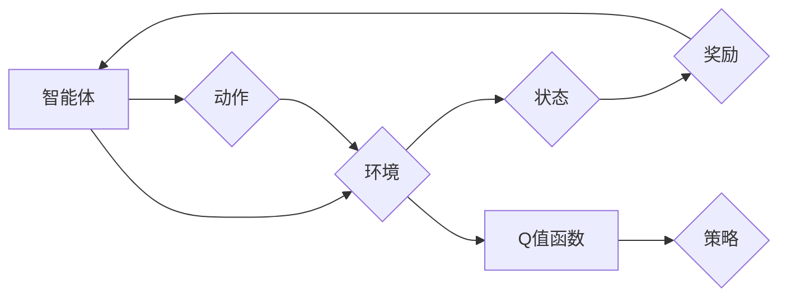

# 一切皆是映射：深入理解DQN的价值函数近似方法

> 关键词：深度Q网络，DQN，价值函数，近似方法，函数近似，神经网络，策略梯度，强化学习

## 1. 背景介绍

强化学习（Reinforcement Learning，RL）是机器学习的一个分支，它通过智能体与环境的交互来学习策略，以最大化长期累积奖励。在强化学习中，价值函数是一个核心概念，它描述了智能体在某个状态下的长期奖励。深度Q网络（Deep Q-Network，DQN）是强化学习领域的一个里程碑式模型，它利用深度神经网络对价值函数进行近似。本文将深入探讨DQN的价值函数近似方法，分析其原理、操作步骤、优缺点以及应用领域。

## 2. 核心概念与联系

### 2.1 核心概念

- **强化学习**：智能体通过与环境的交互来学习如何采取行动，以最大化累积奖励。
- **智能体**：在环境中进行决策的实体，如机器人、软件代理等。
- **环境**：智能体所在的环境，能够根据智能体的行动产生状态转移和奖励。
- **策略**：智能体采取行动的规则或方法。
- **价值函数**：描述了智能体在某个状态下的长期奖励。
- **Q值函数**：在给定状态下，采取某个动作的预期回报。
- **深度神经网络**：用于函数近似的神经网络结构，能够学习复杂的数据表示。

### 2.2 Mermaid 流程图



### 2.3 核心概念联系

在强化学习中，智能体通过与环境交互，不断更新其策略。价值函数（如Q值函数）用于评估策略的好坏，而深度神经网络则用于近似这些价值函数。

## 3. 核心算法原理 & 具体操作步骤

### 3.1 算法原理概述

DQN通过深度神经网络近似Q值函数，从而实现强化学习。在DQN中，每个状态-动作对都对应一个Q值，该值表示在给定状态下采取特定动作的预期回报。

### 3.2 算法步骤详解

1. **初始化**：设置智能体、环境、深度神经网络和经验回放缓冲区。
2. **选择动作**：智能体根据当前状态和策略选择一个动作。
3. **执行动作**：智能体在环境中执行所选动作，并观察新状态和奖励。
4. **存储经验**：将当前状态、动作、奖励、新状态和终止标志存储到经验回放缓冲区。
5. **经验回放**：从缓冲区中随机抽取一批经验，以减少样本的相关性。
6. **计算目标值**：使用目标网络计算每个状态-动作对的预期回报。
7. **更新Q值函数**：使用梯度下降算法更新Q值函数的参数。
8. **更新策略**：根据更新后的Q值函数调整智能体的策略。
9. **重复步骤2-8**：重复执行步骤，直到达到训练终止条件。

### 3.3 算法优缺点

**优点**：

- **函数近似**：使用深度神经网络对Q值函数进行近似，可以学习到复杂的状态-动作价值映射。
- **样本效率高**：通过经验回放和目标网络，DQN能够有效地利用样本，提高样本效率。
- **泛化能力强**：DQN能够泛化到未见过的状态和动作，提高模型的适应性。

**缺点**：

- **样本相关性强**：如果数据分布变化较大，DQN可能需要大量的样本进行训练。
- **方差问题**：梯度下降算法可能导致方差问题，影响模型收敛。
- **难以解释**：DQN的决策过程通常难以解释，难以理解模型为何做出特定决策。

### 3.4 算法应用领域

DQN及其变体在许多领域都有应用，包括：

- **游戏**：如Atari 2600游戏、Dota 2等。
- **机器人**：如无人驾驶、机器人导航等。
- **资源管理**：如数据中心能源管理、智能电网等。
- **推荐系统**：如电影推荐、音乐推荐等。

## 4. 数学模型和公式 & 详细讲解 & 举例说明

### 4.1 数学模型构建

DQN的数学模型可以表示为：

$$
Q(s,a;\theta) = \sum_{r \in R} r \pi(r|s)P(r|s,a)
$$

其中，$Q(s,a;\theta)$ 是在状态 $s$ 下采取动作 $a$ 的Q值，$\theta$ 是Q值函数的参数，$R$ 是奖励空间，$\pi(r|s)$ 是在状态 $s$ 下获得奖励 $r$ 的概率，$P(r|s,a)$ 是在状态 $s$ 下采取动作 $a$ 并获得奖励 $r$ 的概率。

### 4.2 公式推导过程

DQN的目标是最大化累积奖励，可以表示为：

$$
J(\theta) = \sum_{s \in S} \pi(s) \sum_{a \in A(s)} Q(s,a;\theta)
$$

其中，$S$ 是状态空间，$A(s)$ 是在状态 $s$ 下可采取的动作集合。

为了近似Q值函数，DQN使用深度神经网络：

$$
Q(s;\theta) = f_{\theta}(s)
$$

其中，$f_{\theta}(s)$ 是深度神经网络的输出，表示在状态 $s$ 下的Q值。

### 4.3 案例分析与讲解

以下是一个简单的DQN代码示例：

```python
import numpy as np

# 深度神经网络结构
class DQN(nn.Module):
    def __init__(self, input_dim, output_dim):
        super(DQN, self).__init__()
        self.fc1 = nn.Linear(input_dim, 64)
        self.fc2 = nn.Linear(64, output_dim)

    def forward(self, x):
        x = F.relu(self.fc1(x))
        x = self.fc2(x)
        return x

# DQN代理
class Agent:
    def __init__(self, input_dim, output_dim):
        self.model = DQN(input_dim, output_dim).to(device)
        self.optimizer = optim.Adam(self.model.parameters(), lr=0.001)

    def choose_action(self, state):
        state = torch.from_numpy(state).float().unsqueeze(0).to(device)
        with torch.no_grad():
            actions = self.model(state)
        return actions.argmax(1).item()

    def learn(self, state, action, reward, next_state, done):
        state = torch.from_numpy(state).float().unsqueeze(0).to(device)
        next_state = torch.from_numpy(next_state).float().unsqueeze(0).to(device)
        action = torch.tensor([action], device=device)
        reward = torch.tensor([reward], device=device)
        done = torch.tensor([done], device=device)

        # 预测Q值
        q_pred = self.model(state)
        q_pred[0, action] = reward

        # 目标Q值
        q_next = self.model(next_state)
        q_next = q_next.max(1)[0].unsqueeze(0)
        q_next[done] = 0.0

        # 损失函数
        loss = F.mse_loss(q_pred, q_next)

        # 反向传播和优化
        self.optimizer.zero_grad()
        loss.backward()
        self.optimizer.step()
```

在这个示例中，我们定义了一个简单的DQN模型，其中包含两个全连接层。`Agent` 类用于选择动作和更新模型。`learn` 方法用于根据经验更新模型的参数。

## 5. 项目实践：代码实例和详细解释说明

### 5.1 开发环境搭建

为了运行DQN代码示例，需要以下开发环境：

- Python 3.6+
- PyTorch 1.2+
- Numpy 1.16+

### 5.2 源代码详细实现

以下是一个简单的DQN环境示例：

```python
import numpy as np
import random

class Environment:
    def __init__(self):
        self.state_dim = 4
        self.action_dim = 2
        self.max_steps = 10

    def reset(self):
        self.state = np.random.randint(0, 2, self.state_dim)
        return self.state

    def step(self, action):
        if action == 0:
            self.state[0] = 1
        elif action == 1:
            self.state[0] = 0

        reward = -1 if self.state[0] == 1 else 0
        done = self.state[0] == 1

        return self.state, reward, done

    def render(self):
        print(self.state)
```

在这个示例中，我们定义了一个简单的环境，其中包含一个状态维度为4的离散状态空间和一个动作维度为2的离散动作空间。环境在每一步根据采取的动作更新状态，并返回奖励和下一个状态。

### 5.3 代码解读与分析

在这个示例中，我们首先定义了一个`Environment`类，它包含状态、动作和奖励信息。`reset` 方法用于初始化环境，`step` 方法用于执行动作并更新状态，`render` 方法用于显示当前状态。

### 5.4 运行结果展示

以下是运行DQN代码示例的示例代码：

```python
import torch

# 初始化环境
env = Environment()
agent = Agent(env.state_dim, env.action_dim)

# 运行环境
for _ in range(1000):
    state = env.reset()
    done = False
    while not done:
        action = agent.choose_action(state)
        next_state, reward, done = env.step(action)
        agent.learn(state, action, reward, next_state, done)
        state = next_state
```

在这个示例中，我们首先初始化环境，然后创建一个DQN代理。接下来，我们运行环境，智能体在环境中与环境交互，并使用经验更新其策略。

## 6. 实际应用场景

DQN及其变体在许多实际应用场景中都有应用，以下是一些例子：

- **机器人控制**：使用DQN训练机器人学习如何在环境中导航、抓取物体等。
- **游戏**：使用DQN训练智能体在Atari 2600游戏、Dota 2等游戏中取得优异成绩。
- **资源管理**：使用DQN训练智能体优化数据中心能源管理、智能电网等。

## 7. 工具和资源推荐

### 7.1 学习资源推荐

- 《Reinforcement Learning: An Introduction》
- 《Deep Reinforcement Learning Hands-On》
- 《Deep Learning with Python》

### 7.2 开发工具推荐

- PyTorch
- TensorFlow
- OpenAI Gym

### 7.3 相关论文推荐

- **DQN**:
  - Deep Q-Networks. H. Mnih, A. P. Badia, M. Mirza, A. Rockwell, T. Cox, Y. Chen, M. Kavukcuoglu, and D. Silver. arXiv preprint arXiv:1312.5602, 2013.
- **Dueling DQN**:
  - Dueling Network Architectures for Deep Reinforcement Learning. Van Hasselt, H., Silver, D., Szepesvári, C. arXiv preprint arXiv:1511.06581, 2015.
- **Prioritized Experience Replay**:
  - Prioritized Experience Replay. Silver, D., Whitted, N., Chen, T., Yeo, A., Schrittwieser, J., Antonoglou, I., & Silver, D. (2016). arXiv preprint arXiv:1511.05952.

## 8. 总结：未来发展趋势与挑战

### 8.1 研究成果总结

DQN及其变体在强化学习领域取得了显著的成果，推动了强化学习技术的发展。DQN的成功之处在于其函数近似能力、样本效率和高泛化能力。

### 8.2 未来发展趋势

- **元学习**：结合元学习和强化学习，使得智能体能够快速适应新环境和任务。
- **多智能体强化学习**：研究多智能体之间的交互，提高智能体在复杂环境中的协同能力。
- **模型可解释性**：提高模型的可解释性，使得决策过程更加透明和可信。

### 8.3 面临的挑战

- **样本效率**：如何提高样本效率，减少训练所需的样本数量。
- **探索-利用权衡**：如何平衡探索和利用，提高智能体的学习效率。
- **模型可解释性**：如何提高模型的可解释性，使得决策过程更加透明和可信。

### 8.4 研究展望

DQN及其变体将继续在强化学习领域发挥重要作用，并为其他领域的研究提供借鉴。随着研究的不断深入，强化学习技术将在更多领域得到应用，推动人工智能技术的发展。

## 9. 附录：常见问题与解答

**Q1：DQN为什么需要经验回放？**

A1：经验回放可以缓解样本相关性问题，提高样本效率。通过将经验存储在缓冲区中，并从缓冲区中随机抽取经验进行训练，可以减少样本之间的相关性，避免梯度下降过程中的方差问题。

**Q2：Dueling DQN与DQN有什么区别？**

A2：Dueling DQN是DQN的一个变种，它通过将Q值分解为状态价值函数和动作优势函数，提高了模型的性能。Dueling DQN可以更好地处理稀疏奖励问题，并提高模型的泛化能力。

**Q3：如何提高DQN的样本效率？**

A3：提高DQN的样本效率可以从以下几个方面进行：
- 使用经验回放缓冲区。
- 应用数据增强技术，如随机噪声、时间扭曲等。
- 使用半监督学习方法，利用未标记数据进行辅助训练。

**Q4：DQN在哪些领域有应用？**

A4：DQN及其变体在游戏、机器人控制、资源管理、推荐系统等领域都有应用。

**Q5：如何评估DQN的性能？**

A5：评估DQN的性能可以通过以下指标进行：
- 平均回报：评估智能体在环境中的平均累积奖励。
- 收敛速度：评估模型在训练过程中收敛的速度。
- 泛化能力：评估模型在未见过的环境中的表现。

---

作者：禅与计算机程序设计艺术 / Zen and the Art of Computer Programming