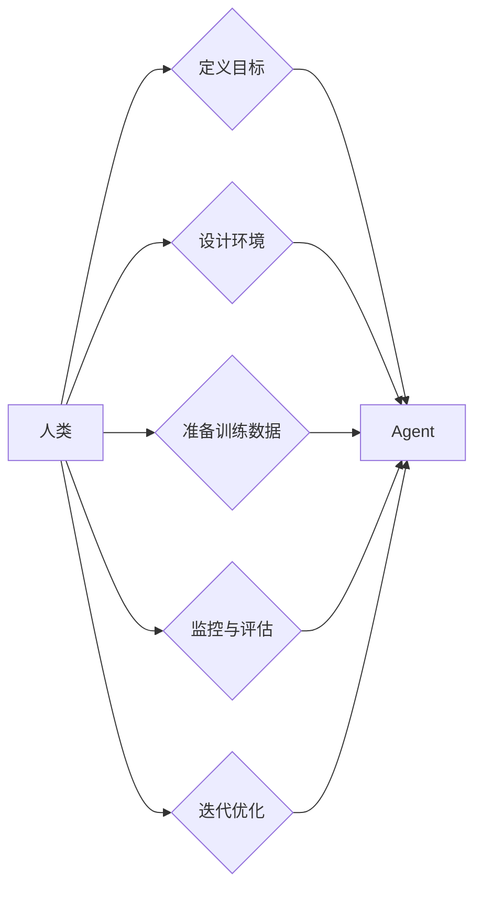

# 人类在 Agent 规划中的角色

> 关键词：Agent 规划，强化学习，人类监督，人类反馈，人机协作，决策支持系统，智能代理

## 1. 背景介绍

随着人工智能技术的飞速发展，智能代理（Agent）已成为人工智能领域的一个重要研究方向。智能代理是一种能够感知环境、自主决策并采取行动的实体，它们在自动化、决策支持、人机协作等领域有着广泛的应用前景。然而，在 Agent 规划和设计中，人类的角色和作用始终是一个关键议题。本文将探讨人类在 Agent 规划中的角色，分析其重要性和具体作用，并提出未来研究方向。

## 2. 核心概念与联系

### 2.1 智能代理（Agent）

智能代理是人工智能领域的一个基本概念，它指的是能够感知环境、理解自身状态、自主决策并采取行动的实体。智能代理可以是一个软件程序，也可以是一个机器人，甚至是人类自身。智能代理的核心特征包括：

- 感知：通过传感器收集环境信息。
- 理解：分析感知到的信息，形成对环境的理解。
- 决策：根据对环境的理解，选择合适的行动。
- 行动：执行决策，影响环境。

### 2.2 强化学习（Reinforcement Learning）

强化学习是 Agent 规划中的一个核心方法，它通过奖励和惩罚机制来指导 Agent 学习如何在环境中获得最大的累积奖励。强化学习的基本原理如下：

- **环境**：Agent 所处的环境，包括状态空间和动作空间。
- **Agent**：执行动作并从环境中获取反馈的实体。
- **奖励**：Agent 采取动作后，从环境中获得的奖励信号。
- **策略**：Agent 在每个状态下选择动作的规则。
- **价值函数**：衡量每个状态或状态-动作对的期望累积奖励。
- **策略迭代**：通过不断的尝试和错误，Agent 优化其策略，以期获得最大累积奖励。

### 2.3 人类在 Agent 规划中的角色

在 Agent 规划中，人类的作用主要体现在以下几个方面：

- **定义目标**：人类根据自身需求定义 Agent 的目标，如任务完成、资源优化、风险控制等。
- **设计环境**：人类设计 Agent 所处的环境，包括状态空间、动作空间、奖励函数等。
- **训练数据准备**：人类准备用于训练 Agent 的数据，如示例动作、环境状态、奖励信号等。
- **监控与评估**：人类监控 Agent 的行为，评估其性能和安全性。
- **迭代优化**：根据 Agent 的表现，人类调整其目标、环境、训练数据等，以优化 Agent 的性能。

### 2.4 Mermaid 流程图

以下是一个简单的 Mermaid 流程图，展示了人类在 Agent 规划中的角色：



## 3. 核心算法原理 & 具体操作步骤

### 3.1 算法原理概述

基于强化学习的 Agent 规划通常包括以下几个步骤：

1. **环境设计**：定义 Agent 所处的环境，包括状态空间、动作空间、奖励函数等。
2. **策略选择**：选择一个合适的策略，如确定性策略、ε-贪婪策略等。
3. **训练过程**：通过与环境交互，利用强化学习算法（如 Q-learning、Sarsa、Deep Q-Network 等）学习最优策略。
4. **评估与测试**：在测试环境中评估 Agent 的性能，并根据需要进行调整。

### 3.2 算法步骤详解

以下是一个基于 Q-learning 的强化学习算法的具体操作步骤：

1. **初始化**：初始化 Q-table 和探索率 ε。
2. **选择动作**：根据当前状态和策略选择动作。
3. **执行动作**：在环境中执行所选动作，获取奖励和新的状态。
4. **更新 Q-table**：根据 Q-learning 更新公式更新 Q-table 中对应状态-动作对的 Q 值。
5. **重复步骤 2-4**：重复以上步骤，直到达到终止条件（如达到预设的迭代次数或累计奖励达到预设阈值）。

### 3.3 算法优缺点

#### 优点

- **适应性**：强化学习算法能够适应不断变化的环境。
- **灵活性**：可以根据不同的任务和需求选择不同的强化学习算法。
- **自适应性**：Agent 能够通过与环境交互不断学习，无需大量人工干预。

#### 缺点

- **收敛速度**：一些强化学习算法可能需要很长时间才能收敛到最优策略。
- **稀疏奖励**：在许多实际任务中，奖励信号可能非常稀疏，难以学习。
- **复杂性**：强化学习算法的设计和实现相对复杂。

### 3.4 算法应用领域

强化学习在以下领域有着广泛的应用：

- **机器人导航**：如无人机、自动驾驶汽车等。
- **游戏**：如棋类游戏、视频游戏等。
- **推荐系统**：如电影推荐、商品推荐等。
- **智能体规划**：如调度、任务分配等。

## 4. 数学模型和公式 & 详细讲解 & 举例说明

### 4.1 数学模型构建

强化学习的数学模型主要包括以下概念：

- **状态空间 $S$**：Agent 所处的可能状态集合。
- **动作空间 $A$**：Agent 可执行的动作集合。
- **策略 $\pi(s)$**：在状态 $s$ 下选择动作 $a$ 的概率。
- **价值函数 $V(s)$**：衡量在状态 $s$ 下采取最优策略的期望累积奖励。
- **Q 函数 $Q(s,a)$**：在状态 $s$ 下采取动作 $a$ 的期望累积奖励。

### 4.2 公式推导过程

以下是一个基于 Q-learning 的强化学习算法的公式推导过程：

$$
Q(s,a) = \sum_{s' \in S} \gamma \max_{a' \in A} Q(s',a')
$$

其中，$\gamma$ 为折扣因子，表示对未来奖励的折现。

### 4.3 案例分析与讲解

以下是一个简单的强化学习案例：机器人抓取物体。

- **状态空间 $S$**：机器人的位置、朝向、物体位置等。
- **动作空间 $A$**：移动、旋转、抓取、放下等。
- **奖励函数**：抓取成功则奖励 +1，失败则奖励 -1。

通过 Q-learning 算法训练，机器人可以学习在给定状态下选择最优动作，以提高抓取物体的成功率。

## 5. 项目实践：代码实例和详细解释说明

### 5.1 开发环境搭建

本案例使用 Python 和 OpenAI 的 Gym 库进行强化学习。

```bash
pip install gym
```

### 5.2 源代码详细实现

以下是一个简单的 Q-learning 算法实现：

```python
import gym
import numpy as np

class QLearningAgent:
    def __init__(self, num_states, num_actions, alpha=0.1, gamma=0.99):
        self.num_states = num_states
        self.num_actions = num_actions
        self.alpha = alpha
        self.gamma = gamma
        self.Q = np.zeros((num_states, num_actions))

    def select_action(self, state):
        if np.random.rand() < self.epsilon:
            action = np.random.randint(self.num_actions)
        else:
            action = np.argmax(self.Q[state])
        return action

    def learn(self, state, action, reward, next_state):
        td_target = reward + self.gamma * np.max(self.Q[next_state])
        td_error = td_target - self.Q[state][action]
        self.Q[state][action] += self.alpha * td_error

# 创建环境
env = gym.make('CartPole-v1')

# 初始化 Agent
agent = QLearningAgent(num_states=env.observation_space.n, num_actions=env.action_space.n)

# 训练 Agent
for episode in range(1000):
    state = env.reset()
    done = False
    while not done:
        action = agent.select_action(state)
        next_state, reward, done, _ = env.step(action)
        agent.learn(state, action, reward, next_state)
        state = next_state

# 测试 Agent
state = env.reset()
done = False
while not done:
    action = agent.select_action(state)
    state, reward, done, _ = env.step(action)
```

### 5.3 代码解读与分析

上述代码定义了一个 Q-learning 算法的 Agent，并使用 Gym 库中的 CartPole 环境进行训练和测试。

- `QLearningAgent` 类定义了 Q-learning 算法的 Agent，包括初始化、选择动作和学习方法。
- `select_action` 方法根据当前状态和 ε-贪婪策略选择动作。
- `learn` 方法根据当前状态、动作、奖励和下一个状态更新 Q-table。
- `env` 是 Gym 库中的 CartPole 环境实例。
- `agent` 是使用 Q-learning 算法训练的 Agent 实例。
- `for` 循环用于训练 Agent，重复执行以下步骤：
  - 重置环境，获取初始状态。
  - 在环境中执行动作，获取奖励和下一个状态。
  - 使用 `learn` 方法更新 Q-table。
  - 将状态更新为下一个状态。
- `while` 循环用于测试 Agent，重复执行以下步骤：
  - 在环境中执行动作，获取奖励和下一个状态。
  - 将状态更新为下一个状态。

通过以上步骤，Agent 能够通过 Q-learning 算法学习 CartPole 环境中的最优策略，实现自动控制。

### 5.4 运行结果展示

运行上述代码，Agent 经过训练后能够在 CartPole 环境中稳定地完成任务。

## 6. 实际应用场景

### 6.1 机器人导航

强化学习在机器人导航领域有着广泛的应用，如无人机、自动驾驶汽车、机器人足球等。通过训练，机器人能够根据环境信息自主导航，避免障碍物，完成指定任务。

### 6.2 游戏人工智能

强化学习在游戏人工智能领域也有着丰富的应用，如棋类游戏、视频游戏、电子竞技等。通过训练，游戏 AI 能够根据游戏状态和对手行为，选择最优策略，提高游戏水平。

### 6.3 推荐系统

强化学习可以用于构建推荐系统，如电影推荐、商品推荐等。通过训练，推荐系统能够根据用户历史行为和兴趣，推荐用户可能感兴趣的内容。

### 6.4 智能体规划

强化学习在智能体规划领域也有着广泛的应用，如调度、任务分配、资源优化等。通过训练，智能体能够根据任务需求和资源限制，制定最优的调度策略和任务分配方案。

## 7. 工具和资源推荐

### 7.1 学习资源推荐

- 《Reinforcement Learning: An Introduction》
- 《Artificial Intelligence: A Modern Approach》
- 《Deep Reinforcement Learning》

### 7.2 开发工具推荐

- OpenAI Gym
- TensorFlow
- PyTorch
- Stable Baselines

### 7.3 相关论文推荐

- Q-learning: http://incompleteideas.net/rl/papers/sutton-1998.html
- Deep Q-Networks: https://arxiv.org/abs/1312.5602
- Policy Gradient Methods for Reinforcement Learning: https://www.jmlr.org/papers/v15/duchu15a.html

## 8. 总结：未来发展趋势与挑战

### 8.1 研究成果总结

本文探讨了人类在 Agent 规划中的角色，分析了强化学习算法的原理和应用，并给出了一些实际案例和代码实现。通过本文的学习，读者可以了解到人类在 Agent 规划中的重要作用，以及强化学习算法在各个领域的应用价值。

### 8.2 未来发展趋势

未来，强化学习在 Agent 规划中的应用将呈现以下发展趋势：

- **多智能体强化学习**：研究多智能体之间的协作、竞争和通信机制，提高系统的整体性能。
- **持续学习**：使 Agent 能够在新的环境中快速适应，学习新的技能和行为。
- **元学习**：使 Agent 能够从少量样本中学习，提高其泛化能力。

### 8.3 面临的挑战

尽管强化学习在 Agent 规划中具有巨大的潜力，但仍然面临着以下挑战：

- **稀疏奖励**：在许多实际任务中，奖励信号可能非常稀疏，难以学习。
- **样本效率**：强化学习通常需要大量的样本才能学习到有效的策略。
- **可解释性**：强化学习算法的决策过程难以解释，难以满足某些领域的应用需求。

### 8.4 研究展望

为了克服上述挑战，未来研究可以从以下几个方面进行：

- **设计新的强化学习算法**：提高算法的样本效率和泛化能力。
- **引入先验知识**：将先验知识融入 Agent 的学习过程中，提高其学习效率。
- **开发可解释的强化学习算法**：提高算法的可解释性和可信度。

通过不断的研究和创新，强化学习将在 Agent 规划领域发挥越来越重要的作用，推动人工智能技术的发展。

## 9. 附录：常见问题与解答

**Q1：强化学习与监督学习和无监督学习有何区别？**

A：强化学习、监督学习和无监督学习是三种不同的机器学习方法。

- **监督学习**：使用带标签的训练数据学习输入到输出的映射关系。
- **无监督学习**：使用不带标签的数据学习数据结构和特征。
- **强化学习**：使用奖励信号指导 Agent 学习最优策略。

**Q2：强化学习算法如何解决稀疏奖励问题？**

A：以下是一些解决稀疏奖励问题的方法：

- **奖励设计**：设计合理的奖励函数，提高奖励信号的密度。
- **多智能体强化学习**：通过多智能体之间的协作，提高样本效率。
- **模仿学习**：从人类或其他智能体那里学习策略。

**Q3：如何评估强化学习算法的性能？**

A：评估强化学习算法的性能可以从以下几个方面进行：

- **奖励累积值**：评估 Agent 在环境中的长期累积奖励。
- **策略稳定性和鲁棒性**：评估 Agent 在不同环境下的性能。
- **泛化能力**：评估 Agent 在未见过的环境下的性能。

**Q4：强化学习算法在现实世界中有哪些应用？**

A：强化学习算法在现实世界中有着广泛的应用，如：

- **机器人控制**：自动驾驶汽车、无人机、机器人足球等。
- **游戏人工智能**：棋类游戏、视频游戏、电子竞技等。
- **推荐系统**：电影推荐、商品推荐等。
- **智能体规划**：调度、任务分配、资源优化等。

**Q5：如何选择合适的强化学习算法？**

A：选择合适的强化学习算法需要考虑以下因素：

- **任务类型**：不同类型的任务可能需要不同的算法。
- **环境特点**：环境的动态性、不确定性等会影响算法的选择。
- **数据量**：数据量的大小会影响算法的收敛速度和效果。

通过以上解答，相信读者对人类在 Agent 规划中的角色以及强化学习算法有了更深入的了解。

---

作者：禅与计算机程序设计艺术 / Zen and the Art of Computer Programming