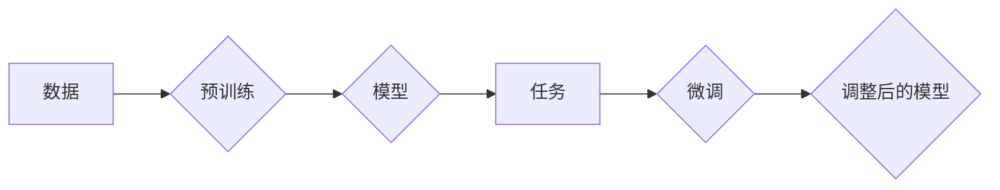

# 从零开始大模型开发与微调：人工智能的历史与未来

> 关键词：大模型，微调，人工智能，自然语言处理，深度学习，迁移学习，预训练

## 1. 背景介绍

自20世纪50年代人工智能（AI）诞生以来，经历了多个发展周期，其中最引人注目的当属深度学习的兴起。深度学习通过模拟人脑神经网络结构，实现了在图像识别、语音识别、自然语言处理（NLP）等领域的突破性进展。随着计算能力的提升和海量数据的积累，大模型（Large Language Models，LLMs）应运而生，它们能够处理和理解复杂的语言任务，成为AI领域的研究热点。本文将从零开始，探讨大模型的开发与微调过程，回顾其历史，展望其未来。

### 1.1 问题的由来

传统的人工智能系统往往针对特定任务进行设计，缺乏通用性和适应性。随着互联网和大数据时代的到来，人们开始探索如何构建能够理解和处理自然语言的通用模型。大模型的出现，正是为了解决这一问题。

### 1.2 研究现状

目前，大模型的开发与微调已成为AI领域的研究热点。预训练模型如BERT、GPT-3等，通过在海量数据上进行预训练，学习到了丰富的语言知识和模式，为下游任务提供了强大的基础。微调则是在预训练模型的基础上，利用少量标注数据进行调整，使其适应特定任务。

### 1.3 研究意义

大模型的开发与微调不仅对AI领域具有深远的影响，也对社会经济发展具有重要意义。它能够推动自然语言处理、智能对话、机器翻译等领域的发展，为人们的生活带来便利。

### 1.4 本文结构

本文将分为以下几个部分：
- 介绍大模型的背景、核心概念和联系。
- 深入探讨大模型的算法原理和具体操作步骤。
- 讲解数学模型和公式，并结合实例说明。
- 展示大模型的代码实例和运行结果。
- 探讨大模型在实际应用场景中的应用。
- 展望大模型未来的发展趋势和面临的挑战。
- 推荐相关工具和资源。
- 总结研究成果，展望未来。

## 2. 核心概念与联系

### 2.1 核心概念

- **大模型（Large Language Models，LLMs）**：指具有海量参数和强大语言理解能力的模型，如BERT、GPT-3等。
- **预训练（Pre-training）**：指在大量无标签数据上进行模型训练，使其学习到通用的语言知识和模式。
- **微调（Fine-tuning）**：指在预训练模型的基础上，利用少量标注数据进行调整，使其适应特定任务。
- **迁移学习（Transfer Learning）**：指将一个领域学习到的知识迁移应用到另一个相关领域。
- **自然语言处理（Natural Language Processing，NLP）**：指使计算机能够理解、解释和生成人类语言的技术。

### 2.2 Mermaid 流程图



## 3. 核心算法原理 & 具体操作步骤

### 3.1 算法原理概述

大模型开发与微调的过程主要包括预训练和微调两个阶段。

- **预训练**：在大量无标签数据上训练模型，使其学习到通用的语言知识和模式。
- **微调**：在预训练模型的基础上，利用少量标注数据进行调整，使其适应特定任务。

### 3.2 算法步骤详解

#### 预训练阶段

1. **数据准备**：收集大量文本数据，进行预处理，如分词、去噪等。
2. **模型选择**：选择合适的预训练模型架构，如BERT、GPT-3等。
3. **模型训练**：在预处理后的数据上训练模型，学习通用的语言知识和模式。

#### 微调阶段

1. **数据准备**：收集特定任务的标注数据，进行预处理。
2. **模型调整**：在预训练模型的基础上，调整模型结构或参数，使其适应特定任务。
3. **模型训练**：在标注数据上训练调整后的模型，使其适应特定任务。

### 3.3 算法优缺点

#### 优点

- **强大的语言理解能力**：通过预训练，大模型能够学习到丰富的语言知识和模式，具有较强的语言理解能力。
- **适应性强**：通过微调，大模型能够适应特定的任务，提高任务性能。
- **通用性**：大模型可以应用于多种NLP任务，具有较高的通用性。

#### 缺点

- **训练成本高**：大模型的训练需要大量的计算资源和数据。
- **过拟合风险**：在微调过程中，模型可能过拟合标注数据，导致泛化能力下降。

### 3.4 算法应用领域

大模型和微调技术在以下领域具有广泛的应用：

- **文本分类**：如情感分析、主题分类、实体识别等。
- **自然语言生成**：如文本生成、摘要生成、对话生成等。
- **机器翻译**：如自动翻译、机器同传等。
- **问答系统**：如知识图谱问答、对话式问答等。

## 4. 数学模型和公式 & 详细讲解 & 举例说明

### 4.1 数学模型构建

大模型的数学模型通常基于深度神经网络，其中最常用的模型架构是Transformer。

#### Transformer模型

Transformer模型是一种基于自注意力（Self-Attention）机制的深度神经网络模型，它能够有效地处理序列数据。

#### 自注意力机制

自注意力机制是一种处理序列数据的注意力机制，它能够捕捉序列中不同元素之间的关系。

### 4.2 公式推导过程

以下为自注意力机制的数学公式推导过程：

$$
Q = W_Q \cdot H
$$
$$
K = W_K \cdot H
$$
$$
V = W_V \cdot H
$$
$$
\text{Attention}(Q,K,V) = \text{softmax}(\frac{QK^T}{\sqrt{d_k}})V
$$
$$
\text{MultiHead}(Q,K,V) = \text{Concat}(\text{Head}_1,...,\text{Head}_h)\text{W_O}
$$
$$
\text{Transformer}(Q,K,V) = \text{LayerNorm}(M_{\text{Norm}}(M_{\text{Dropout}}(\text{MultiHead}(Q,K,V)) + M_{\text{FeedForward}(M_{\text{Norm}}(M_{\text{Dropout}}(H)))) + H)
$$

其中，$H$ 为输入序列，$W_Q$、$W_K$、$W_V$ 为查询、键、值矩阵，$W_O$ 为输出矩阵，$\text{softmax}$ 为softmax函数，$\text{Concat}$ 为拼接操作，$\text{LayerNorm}$ 为层归一化，$\text{Dropout}$ 为Dropout操作，$\text{FeedForward}$ 为前馈网络。

### 4.3 案例分析与讲解

以下以BERT模型为例，讲解如何使用预训练和微调技术进行文本分类任务。

#### BERT模型

BERT（Bidirectional Encoder Representations from Transformers）是一种基于Transformer的预训练模型，它能够有效地捕捉文本的上下文信息。

#### 文本分类任务

假设我们有一个文本分类任务，目标是判断文本属于哪个类别。

1. **预训练**：在大量文本语料上预训练BERT模型，学习通用的语言知识和模式。
2. **微调**：在预训练模型的基础上，添加一个分类器层，并使用少量标注数据进行微调，使其适应特定文本分类任务。

## 5. 项目实践：代码实例和详细解释说明

### 5.1 开发环境搭建

以下是使用PyTorch和Hugging Face Transformers库进行大模型微调的Python代码示例。

```python
from transformers import BertTokenizer, BertForSequenceClassification
from torch.utils.data import DataLoader, Dataset
import torch.optim as optim

# 加载预训练模型和分词器
model = BertForSequenceClassification.from_pretrained('bert-base-uncased')
tokenizer = BertTokenizer.from_pretrained('bert-base-uncased')

# 创建数据集
class TextDataset(Dataset):
    def __init__(self, texts, labels):
        self.texts = texts
        self.labels = labels

    def __len__(self):
        return len(self.texts)

    def __getitem__(self, item):
        text = self.texts[item]
        label = self.labels[item]
        encoding = tokenizer(text, padding=True, truncation=True, return_tensors='pt')
        return encoding['input_ids'], encoding['attention_mask'], label

# 创建数据加载器
train_dataset = TextDataset(train_texts, train_labels)
train_dataloader = DataLoader(train_dataset, batch_size=16, shuffle=True)

# 定义优化器
optimizer = optim.AdamW(model.parameters(), lr=2e-5)

# 训练模型
for epoch in range(3):
    model.train()
    for batch in train_dataloader:
        input_ids, attention_mask, labels = batch
        outputs = model(input_ids, attention_mask=attention_mask, labels=labels)
        loss = outputs.loss
        loss.backward()
        optimizer.step()
        optimizer.zero_grad()
```

### 5.2 源代码详细实现

以上代码展示了使用PyTorch和Hugging Face Transformers库进行大模型微调的完整流程。首先加载预训练模型和分词器，然后创建数据集和数据加载器，最后定义优化器并训练模型。

### 5.3 代码解读与分析

- `TextDataset`类：定义了一个文本数据集类，用于加载和处理文本数据和标签。
- `DataLoader`：用于将数据集分批次加载到内存中，并可以指定批大小、打乱顺序等参数。
- `optimizer`：定义了AdamW优化器，用于更新模型参数。
- `model.train()`：将模型设置为训练模式，启用梯度计算和Dropout机制。
- `outputs`：调用模型进行预测，得到输出和损失。
- `loss.backward()`：计算损失关于模型参数的梯度。
- `optimizer.step()`：更新模型参数。
- `optimizer.zero_grad()`：将梯度清零，为下一次迭代做准备。

### 5.4 运行结果展示

在训练完成后，可以在测试集上评估模型的性能。以下是一个简单的评估示例：

```python
# 评估模型
model.eval()
test_loss, test_accuracy = 0, 0
with torch.no_grad():
    for batch in test_dataloader:
        input_ids, attention_mask, labels = batch
        outputs = model(input_ids, attention_mask=attention_mask)
        loss = outputs.loss
        test_loss += loss.item()
        test_accuracy += (outputs.logits.argmax(dim=-1) == labels).float().mean().item()

print(f"Test Loss: {test_loss / len(test_dataloader)}")
print(f"Test Accuracy: {test_accuracy}")
```

## 6. 实际应用场景

大模型和微调技术在以下领域具有广泛的应用：

### 6.1 智能问答系统

大模型和微调技术可以用于构建智能问答系统，如搜索引擎、客服系统等。通过预训练模型学习大量知识，再通过微调使其适应特定领域，可以实现对用户问题的理解和回答。

### 6.2 机器翻译

大模型和微调技术可以用于构建高质量的机器翻译系统。通过预训练模型学习不同语言的语法、词汇和语义信息，再通过微调使其适应特定语言对，可以实现对不同语言文本的准确翻译。

### 6.3 文本生成

大模型和微调技术可以用于构建文本生成系统，如文章生成、对话生成等。通过预训练模型学习丰富的语言知识和模式，再通过微调使其适应特定任务，可以生成高质量的文本内容。

## 7. 工具和资源推荐

### 7.1 学习资源推荐

- **《深度学习》**：Goodfellow、Bengio和Courville所著，深度学习领域的经典教材。
- **《动手学深度学习》**：花书，提供了丰富的深度学习实践案例。
- **Hugging Face Transformers库**：提供丰富的预训练模型和微调工具。
- **arXiv**：人工智能领域的学术预印本平台。

### 7.2 开发工具推荐

- **PyTorch**：开源的深度学习框架。
- **TensorFlow**：由Google开发的深度学习框架。
- **Jupyter Notebook**：用于科学计算和机器学习的交互式计算环境。

### 7.3 相关论文推荐

- **Attention is All You Need**：Transformer模型的经典论文。
- **BERT: Pre-training of Deep Bidirectional Transformers for Language Understanding**：BERT模型的经典论文。
- **Generative Pre-trained Transformers**：GPT-3模型的经典论文。

## 8. 总结：未来发展趋势与挑战

### 8.1 研究成果总结

大模型和微调技术在近年来取得了显著的进展，为NLP领域带来了革命性的变化。通过预训练和微调，模型能够学习到丰富的语言知识和模式，并适应特定任务，实现了在多个NLP任务上的突破。

### 8.2 未来发展趋势

未来，大模型和微调技术将朝着以下方向发展：

- **模型规模更大**：随着计算能力的提升，模型规模将不断增大，模型参数量将进一步提高。
- **计算效率更高**：通过模型压缩、量化等技术，提高模型的计算效率，降低计算成本。
- **泛化能力更强**：通过改进模型结构和训练方法，提高模型的泛化能力，使其能够适应更广泛的场景。
- **可解释性更好**：通过引入可解释性技术，提高模型的可解释性，增强人们对模型的信任。

### 8.3 面临的挑战

大模型和微调技术在发展过程中也面临着以下挑战：

- **计算资源**：大模型训练需要大量的计算资源，如何降低计算成本是一个重要问题。
- **数据质量**：数据质量对模型性能有重要影响，如何获取高质量的数据是一个挑战。
- **过拟合**：模型容易过拟合，如何提高模型的泛化能力是一个难题。
- **可解释性**：如何提高模型的可解释性，增强人们对模型的信任是一个挑战。

### 8.4 研究展望

未来，大模型和微调技术将在以下方向进行深入研究：

- **多模态学习**：将文本、图像、语音等多模态信息进行整合，构建更加智能的模型。
- **知识增强**：将知识图谱、逻辑规则等知识融入到模型中，提高模型的理解能力。
- **可解释性**：研究可解释性技术，提高模型的可解释性。
- **伦理道德**：关注AI伦理道德问题，确保AI技术的发展符合人类价值观。

## 9. 附录：常见问题与解答

### 9.1 常见问题

**Q1：什么是预训练？**

A1：预训练指在大量无标签数据上训练模型，使其学习到通用的语言知识和模式。

**Q2：什么是微调？**

A2：微调指在预训练模型的基础上，利用少量标注数据进行调整，使其适应特定任务。

**Q3：大模型训练需要多少计算资源？**

A3：大模型训练需要大量的计算资源，包括GPU、TPU等。

**Q4：如何提高大模型的泛化能力？**

A4：可以通过以下方法提高大模型的泛化能力：增加训练数据量、改进模型结构、引入正则化技术等。

**Q5：如何提高大模型的可解释性？**

A5：可以通过以下方法提高大模型的可解释性：引入可解释性技术、可视化模型结构等。

### 9.2 解答

**A1**：预训练是指在没有标注数据的条件下，通过在大量文本语料上进行训练，让模型学习到通用的语言知识和模式。

**A2**：微调是指在预训练模型的基础上，利用少量标注数据进行调整，使其适应特定任务。

**A3**：大模型训练需要大量的计算资源，包括GPU、TPU等。具体所需的资源取决于模型的大小、训练数据量和训练时间。

**A4**：可以通过以下方法提高大模型的泛化能力：增加训练数据量、改进模型结构、引入正则化技术等。

**A5**：可以通过以下方法提高大模型的可解释性：引入可解释性技术、可视化模型结构等。

作者：禅与计算机程序设计艺术 / Zen and the Art of Computer Programming