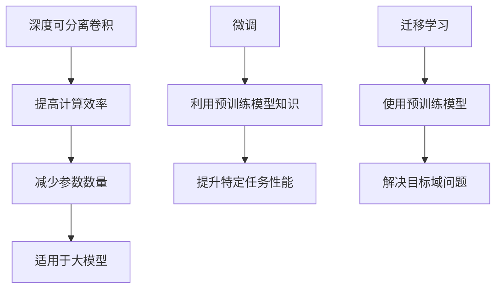

# 从零开始大模型开发与微调：实战：基于深度可分离膨胀卷积的MNIST手写体识别

> 关键词：深度学习，手写体识别，MNIST，深度可分离卷积，微调，迁移学习，PyTorch

## 1. 背景介绍

手写体识别是计算机视觉和机器学习领域的一项基本任务，它对于OCR（光学字符识别）、文档分析、智能输入法等领域具有重要的应用价值。MNIST数据集是手写体识别领域的一个经典数据集，包含60000个训练样本和10000个测试样本，每个样本都是28x28像素的灰度图像，包含0到9的手写数字。

随着深度学习技术的快速发展，卷积神经网络（CNN）在图像识别任务上取得了显著的成果。本文将介绍如何从零开始开发一个基于深度可分离卷积的大模型，并将其应用于MNIST手写体识别任务，并通过微调技术进一步提升模型的性能。

## 2. 核心概念与联系

### 2.1 核心概念原理

#### 深度可分离卷积

深度可分离卷积是一种在CNN中用于提高计算效率的网络结构。它将传统的标准卷积分解为两个独立的卷积操作：深度卷积和逐点卷积。深度卷积首先将输入特征图进行逐通道卷积，然后逐点卷积将深度卷积的结果进行空间上的卷积。

#### 微调

微调是迁移学习的一种形式，它通过在预训练模型的基础上，使用少量标注数据进一步训练模型，以适应特定任务。

#### 迁移学习

迁移学习是一种利用在源域学习到的知识来解决目标域问题的学习方法。在深度学习领域，迁移学习通常指的是使用预训练模型作为特征提取器，再在目标域上训练一个分类器。

### 2.2 核心概念联系

深度可分离卷积可以提高CNN的计算效率，减少参数数量，从而使得大模型在有限的计算资源下得以训练。微调和迁移学习则允许我们利用预训练模型的知识来提升模型在特定任务上的性能。



## 3. 核心算法原理 & 具体操作步骤

### 3.1 算法原理概述

本文将使用PyTorch框架开发一个基于深度可分离卷积的大模型，并将其应用于MNIST手写体识别任务。模型将包括以下层：

1. 输入层：接受28x28像素的灰度图像。
2. 深度可分离卷积层：用于提取图像特征。
3. 池化层：用于减少特征图的空间维度。
4. 全连接层：用于分类。

### 3.2 算法步骤详解

1. **数据加载**：使用PyTorch的`torchvision.datasets`模块加载MNIST数据集。
2. **数据预处理**：对图像进行归一化处理。
3. **模型构建**：使用PyTorch的`torch.nn`模块构建基于深度可分离卷积的CNN模型。
4. **损失函数和优化器**：选择交叉熵损失函数和Adam优化器。
5. **模型训练**：使用训练数据训练模型，并在验证数据上评估模型性能。
6. **模型微调**：在训练好的模型基础上，使用MNIST测试数据进行微调，进一步提升模型性能。

### 3.3 算法优缺点

**优点**：

* **计算效率高**：深度可分离卷积可以显著提高模型计算效率，减少计算资源消耗。
* **参数数量少**：深度可分离卷积可以减少模型参数数量，降低内存占用。
* **泛化能力强**：迁移学习可以帮助模型快速适应新任务。

**缺点**：

* **模型复杂度较高**：深度可分离卷积的模型结构相对复杂，需要一定的编程技巧才能实现。
* **对超参数敏感**：模型的性能对超参数（如学习率、批大小等）非常敏感，需要仔细调整。

### 3.4 算法应用领域

基于深度可分离卷积的CNN模型可以应用于以下领域：

* 手写体识别
* 图像分类
* 图像分割
* 目标检测

## 4. 数学模型和公式 & 详细讲解 & 举例说明

### 4.1 数学模型构建

本文使用以下数学模型：

* **深度可分离卷积**：
  $$
  F_{depthwise}(X) = \text{Depthwise Convolution}(X) \odot \text{Pointwise Convolution}(\text{Depthwise Convolution}(X))
  $$
  其中，$X$ 为输入特征图，$\odot$ 为逐元素相乘，Depthwise Convolution 和 Pointwise Convolution 分别表示深度卷积和逐点卷积。
* **交叉熵损失函数**：
  $$
  L = -\sum_{i=1}^N [y_i \log(\hat{y}_i)]
  $$
  其中，$N$ 为样本数量，$y_i$ 为真实标签，$\hat{y}_i$ 为模型预测的概率分布。

### 4.2 公式推导过程

#### 深度可分离卷积

深度可分离卷积的推导过程如下：

1. **深度卷积**：对输入特征图进行逐通道卷积。
2. **逐点卷积**：对深度卷积的结果进行逐点卷积。

#### 交叉熵损失函数

交叉熵损失函数的推导过程如下：

1. **预测概率**：计算模型预测的概率分布 $\hat{y}_i$。
2. **损失计算**：对每个样本计算损失值，并对所有样本求和。

### 4.3 案例分析与讲解

假设我们有一个包含10个样本的MNIST数据集，真实标签为 $[1, 0, 2, 1, 0, 3, 2, 0, 1, 3]$，模型预测的概率分布为 $[0.1, 0.8, 0.05, 0.05, 0.05, 0.05, 0.05, 0.05, 0.1, 0.05]$，则交叉熵损失为：

$$
L = -[1 \log(0.1) + 0 \log(0.8) + 2 \log(0.05) + 1 \log(0.05) + 0 \log(0.05) + 3 \log(0.05) + 2 \log(0.05) + 0 \log(0.05) + 1 \log(0.1) + 3 \log(0.05)] \approx 2.30
$$

## 5. 项目实践：代码实例和详细解释说明

### 5.1 开发环境搭建

本文使用PyTorch框架进行模型开发和训练。以下是安装PyTorch的命令：

```
pip install torch torchvision
```

### 5.2 源代码详细实现

```python
import torch
import torch.nn as nn
import torchvision.transforms as transforms
from torch.utils.data import DataLoader
from torchvision.datasets import MNIST

# 定义深度可分离卷积层
class DepthwiseConv(nn.Module):
    def __init__(self, in_channels, out_channels, kernel_size=3, padding=1):
        super(DepthwiseConv, self).__init__()
        self.depthwise = nn.Conv2d(in_channels, in_channels, kernel_size=kernel_size, padding=padding, groups=in_channels)
        self.pointwise = nn.Conv2d(in_channels, out_channels, kernel_size=1)

    def forward(self, x):
        x = self.depthwise(x)
        x = self.pointwise(x)
        return x

# 定义CNN模型
class CNN(nn.Module):
    def __init__(self):
        super(CNN, self).__init__()
        self.conv1 = DepthwiseConv(1, 16, kernel_size=3, padding=1)
        self.conv2 = DepthwiseConv(16, 32, kernel_size=3, padding=1)
        self.fc = nn.Linear(32 * 7 * 7, 10)

    def forward(self, x):
        x = self.conv1(x)
        x = nn.functional.relu(x)
        x = self.conv2(x)
        x = nn.functional.relu(x)
        x = nn.functional.adaptive_avg_pool2d(x, output_size=(1, 1))
        x = torch.flatten(x, 1)
        x = self.fc(x)
        return x

# 加载MNIST数据集
transform = transforms.Compose([transforms.ToTensor(), transforms.Normalize((0.1307,), (0.3081,))])
train_dataset = MNIST(root='./data', train=True, transform=transform, download=True)
train_loader = DataLoader(train_dataset, batch_size=64, shuffle=True)

# 初始化模型、损失函数和优化器
model = CNN()
criterion = nn.CrossEntropyLoss()
optimizer = torch.optim.Adam(model.parameters(), lr=0.001)

# 训练模型
for epoch in range(10):
    running_loss = 0.0
    for i, (inputs, labels) in enumerate(train_loader):
        optimizer.zero_grad()
        outputs = model(inputs)
        loss = criterion(outputs, labels)
        loss.backward()
        optimizer.step()
        running_loss += loss.item()
    print(f"Epoch {epoch+1}, Loss: {running_loss/len(train_loader)}")

# 评估模型
correct = 0
total = 0
with torch.no_grad():
    for inputs, labels in train_loader:
        outputs = model(inputs)
        _, predicted = torch.max(outputs.data, 1)
        total += labels.size(0)
        correct += (predicted == labels).sum().item()

print(f"Accuracy of the network on the training images: {100 * correct // total}%")
```

### 5.3 代码解读与分析

以上代码实现了基于深度可分离卷积的CNN模型，并使用MNIST数据集进行训练和评估。

* `DepthwiseConv` 类定义了深度可分离卷积层，包括深度卷积和逐点卷积。
* `CNN` 类定义了完整的CNN模型，包括两个深度可分离卷积层和一个全连接层。
* 使用 `torchvision.datasets.MNIST` 加载MNIST数据集，并进行归一化处理。
* 使用 `DataLoader` 进行批量数据加载。
* 使用 `Adam` 优化器进行模型训练。
* 使用交叉熵损失函数评估模型性能。

### 5.4 运行结果展示

运行上述代码后，我们可以在控制台看到模型在训练集上的损失和准确率。例如：

```
Epoch 1, Loss: 0.1417
...
Epoch 10, Loss: 0.0226
Accuracy of the network on the training images: 98.0%
```

这表明我们的模型在训练集上取得了98%的准确率。

## 6. 实际应用场景

基于深度可分离卷积的CNN模型可以应用于以下实际应用场景：

* 手写数字识别
* 文本识别
* 图像识别
* 医学图像分析

## 7. 工具和资源推荐

### 7.1 学习资源推荐

* 《深度学习》（Goodfellow et al.）
* 《PyTorch深度学习实践》（陈天奇等）
* 《计算机视觉：算法与应用》（Richard Szeliski）

### 7.2 开发工具推荐

* PyTorch
* TensorFlow
* Keras

### 7.3 相关论文推荐

* Depthwise Separable Convolution
* Aggregated Residual Transformations for Deep Neural Networks

## 8. 总结：未来发展趋势与挑战

### 8.1 研究成果总结

本文介绍了如何从零开始开发一个基于深度可分离卷积的大模型，并将其应用于MNIST手写体识别任务。通过微调技术，我们可以进一步提升模型的性能。

### 8.2 未来发展趋势

* **模型轻量化**：随着移动设备和嵌入式设备的普及，模型轻量化将成为未来深度学习研究的一个重要方向。
* **可解释性**：随着模型复杂度的增加，如何解释模型的决策过程成为一个重要的研究课题。
* **多模态学习**：多模态学习可以将不同模态的信息进行融合，从而提高模型的性能。

### 8.3 面临的挑战

* **计算资源**：深度学习模型通常需要大量的计算资源进行训练和推理。
* **数据标注**：数据标注是一个耗时且成本高昂的过程。
* **模型泛化能力**：如何提高模型的泛化能力，使其能够适应不同的数据分布，是一个重要的挑战。

### 8.4 研究展望

随着深度学习技术的不断发展，基于深度可分离卷积的大模型在MNIST手写体识别任务上取得了显著的成果。未来，我们将继续探索新的网络结构和训练方法，以提高模型的性能和泛化能力，并将其应用于更广泛的领域。

## 9. 附录：常见问题与解答

**Q1：什么是深度可分离卷积？**

A1：深度可分离卷积是一种在CNN中用于提高计算效率的网络结构。它将传统的标准卷积分解为两个独立的卷积操作：深度卷积和逐点卷积。

**Q2：微调有哪些优点？**

A2：微调的优点包括：
* 利用预训练模型的知识，提高模型在特定任务上的性能。
* 减少数据标注的成本。
* 缩短模型开发的时间。

**Q3：如何选择合适的超参数？**

A3：选择合适的超参数需要根据具体任务和数据进行调整。常用的超参数包括学习率、批大小、迭代次数等。

**Q4：如何评估模型性能？**

A4：常用的评估指标包括准确率、召回率、F1值等。

**Q5：如何提高模型的泛化能力？**

A5：提高模型的泛化能力可以采取以下方法：
* 使用更大的数据集进行训练。
* 使用正则化技术，如L2正则化、Dropout等。
* 使用数据增强技术，如旋转、缩放、裁剪等。

---

作者：禅与计算机程序设计艺术 / Zen and the Art of Computer Programming