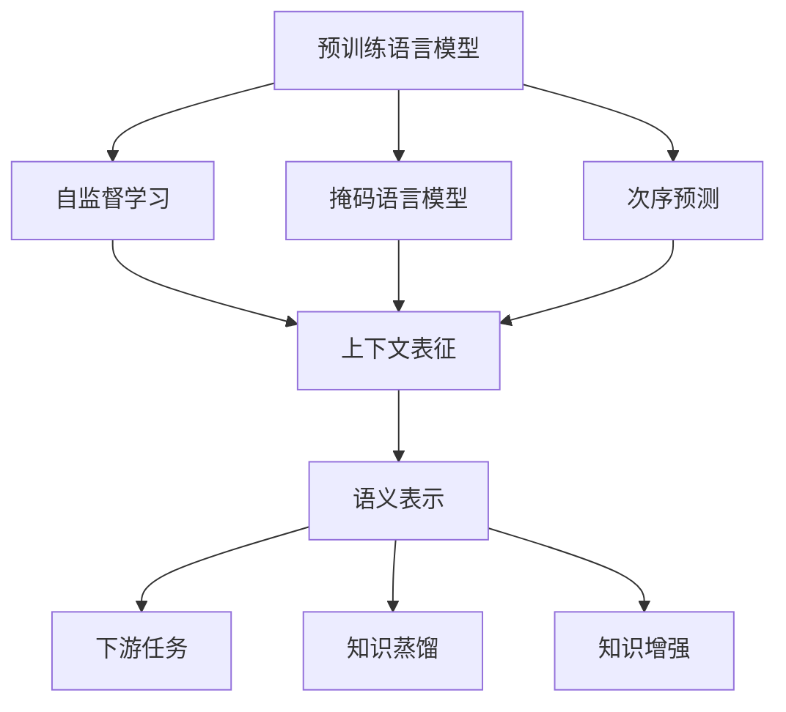
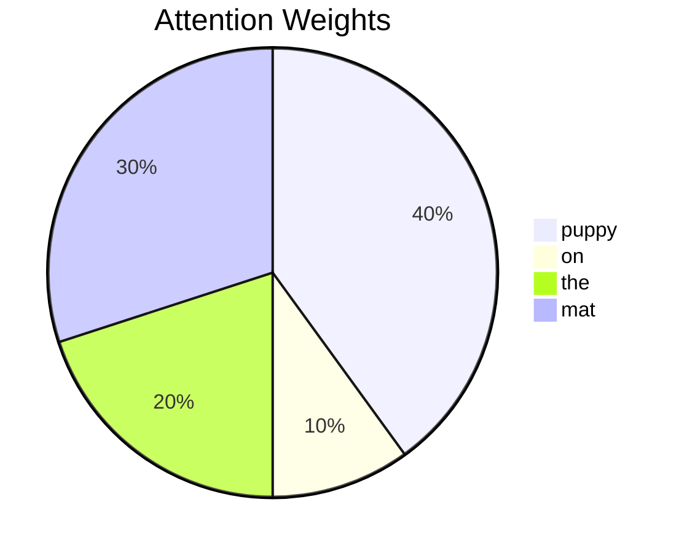

以下是《大语言模型原理与工程实践：预训练还有什么没有解决》的文章正文:

# 大语言模型原理与工程实践：预训练还有什么没有解决

## 1. 背景介绍

### 1.1 问题的由来

近年来,自然语言处理(NLP)领域取得了长足的进步,很大程度上归功于大规模预训练语言模型的出现和广泛应用。预训练语言模型通过在大量无监督文本数据上进行自监督训练,学习到丰富的语言知识和语义表示,从而为下游任务提供了强大的语义表示能力。

代表性的预训练语言模型有BERT、GPT、XLNet、ALBERT等,它们在各种NLP任务上取得了超越以往的性能。然而,尽管预训练语言模型取得了巨大成功,但仍然存在一些亟待解决的问题和挑战。

### 1.2 研究现状

目前,预训练语言模型主要存在以下几个问题:

1. **可解释性差**: 大型语言模型通常是黑盒模型,缺乏可解释性,难以理解模型内部是如何工作的。
2. **缺乏常识推理能力**: 虽然语言模型掌握了丰富的语言知识,但在常识推理、因果关系推理等方面能力有限。
3. **对抗性较差**: 语言模型容易受到对抗性攻击的影响,生成的文本可能存在不合理、不一致的地方。
4. **计算资源消耗大**: 训练大型语言模型需要消耗大量的计算资源,对硬件要求高,训练和推理成本昂贵。
5. **知识更新缓慢**: 语言模型的知识主要来自于静态的训练语料,难以及时获取最新知识。

### 1.3 研究意义

解决预训练语言模型存在的问题,对于提升自然语言处理技术的性能和应用前景至关重要。可解释性是确保模型可信赖的基础;常识推理能力是实现人机自然交互的关键;对抗性是保证模型鲁棒性的需求;高效的计算是大规模应用的前提;及时更新知识库使模型具备持续学习能力。因此,深入研究预训练语言模型的原理,探索解决上述问题的方法,对于推动NLP技术发展具有重要意义。

### 1.4 本文结构

本文将从以下几个方面深入探讨预训练语言模型:

1. 核心概念与联系
2. 核心算法原理与具体操作步骤
3. 数学模型和公式详细讲解与案例分析
4. 项目实践:代码实例和详细解释
5. 实际应用场景
6. 工具和资源推荐
7. 总结:未来发展趋势与挑战
8. 附录:常见问题与解答

## 2. 核心概念与联系

预训练语言模型(Pre-trained Language Model)是一种利用自监督学习(Self-Supervised Learning)方式在大规模无标注语料上进行预训练,获得通用语言表示的模型。主要的预训练任务包括:

1. **掩码语言模型(Masked Language Model,MLM)**: 随机掩码部分输入Token,模型需要预测被掩码的Token。
2. **次序预测(Next Sentence Prediction,NSP)**: 判断两个句子是否为连续句子。

通过上述预训练任务,模型可以学习到丰富的语义和上下文信息,形成通用的语言表示能力。预训练后的模型可以为下游任务(如文本分类、机器阅读理解等)提供强大的语义表示,并通过微调(Fine-tuning)适配到具体任务上。

此外,预训练语言模型的语义表示还可以用于知识蒸馏(Knowledge Distillation),将大模型的知识迁移到小模型;也可以通过知识增强(Knowledge Enhancement)的方式,注入外部知识,提升模型的表现。

## 3. 核心算法原理与具体操作步骤

### 3.1 算法原理概述

预训练语言模型的核心算法主要包括Transformer编码器、注意力机制和自监督预训练任务。

1. **Transformer编码器**:基于Self-Attention的Transformer编码器用于捕获输入序列的上下文信息。
2. **注意力机制**:通过注意力机制,模型可以自动学习输入序列中不同Token之间的相关性。
3. **自监督预训练任务**:掩码语言模型和次序预测等自监督任务,使模型学习到有效的语言表示。

在预训练阶段,模型基于自监督任务目标,通过编码器捕获输入序列的上下文表示,并利用注意力机制捕获Token间关系,最终学习到通用的语言表示。

### 3.2 算法步骤详解

以BERT为例,预训练算法的具体步骤如下:

1. **输入表示**:将输入序列分词,每个Token对应一个向量表示,并加入位置编码和分句标记。
2. **掩码语言模型**:随机选择15%的Token进行掩码,其中80%用[MASK]替换,10%用随机Token替换,10%保持不变。
3. **Transformer编码器**:输入序列通过多层Transformer编码器,每一层包含多头注意力和前馈神经网络。
4. **预测**:最后一层编码器输出对应的向量用于预测被掩码的Token。
5. **损失函数**:采用交叉熵损失函数,目标是最大化被掩码Token的预测概率。
6. **次序预测**(仅BERT):判断两个句子是否为连续句子,通过特殊的[CLS]标记向量进行二分类。
7. **模型更新**:基于损失函数,使用优化算法(如Adam)更新模型参数。

通过上述自监督预训练,BERT可以学习到通用的语义表示,为下游任务做好语义表示基础。

### 3.3 算法优缺点

**优点**:

1. 自监督方式,无需人工标注数据,可利用大规模语料进行预训练。
2. 学习到通用的语义表示,可迁移到多种下游任务。
3. 注意力机制捕获长距离依赖,有助于建模长序列。

**缺点**:

1. 预训练过程计算代价高,需要大量计算资源。
2. 生成式任务表现不佳,主要适用于判别式任务。
3. 缺乏常识推理和因果推理能力。

### 3.4 算法应用领域

预训练语言模型可广泛应用于自然语言处理的各个领域,包括但不限于:

- 文本分类
- 机器阅读理解
- 文本生成
- 对话系统
- 关系抽取
- 命名实体识别
- 语义相似度计算
- 知识图谱构建
- 低资源语言处理
- 多模态任务

通过微调或知识增强的方式,预训练语言模型可为上述任务提供强大的语义表示能力。

## 4. 数学模型和公式详细讲解与举例说明

### 4.1 数学模型构建

预训练语言模型的核心是基于Transformer的编码器结构。我们先介绍Transformer编码器的数学模型。

给定一个长度为 $n$ 的输入序列 $X = (x_1, x_2, ..., x_n)$,其中 $x_i$ 表示第 $i$ 个Token的embedding向量。Transformer编码器的计算过程如下:

$$
Z^0 = X \
Z^l = \text{Transformer-Encoder-Layer}(Z^{l-1}), l=1,...,L
$$

其中 $Z^l$ 表示第 $l$ 层编码器的输出,共有 $L$ 层编码器层。每一层编码器层的计算过程为:

$$
\begin{aligned}
\tilde{Z}^l &= Z^{l-1} + \text{Sublayer}(Z^{l-1}, \text{MultiHeadAttn}) \
Z^l &= \tilde{Z}^l + \text{Sublayer}(\tilde{Z}^l, \text{FeedForward})
\end{aligned}
$$

这里 $\text{Sublayer}$ 表示残差连接和层归一化操作, $\text{MultiHeadAttn}$ 表示多头注意力机制, $\text{FeedForward}$ 表示前馈神经网络。

### 4.2 公式推导过程

我们进一步推导多头注意力机制的计算过程:

单头注意力的计算公式为:

$$
\text{Attention}(Q, K, V) = \text{softmax}(\frac{QK^T}{\sqrt{d_k}})V
$$

其中 $Q$ 为查询向量, $K$ 为键向量, $V$ 为值向量, $d_k$ 为缩放因子。

多头注意力机制将输入 $X$ 线性映射为查询 $Q$、键 $K$ 和值 $V$ 矩阵:

$$
\begin{aligned}
Q &= XW_Q \
K &= XW_K \
V &= XW_V
\end{aligned}
$$

其中 $W_Q, W_K, W_V$ 为可学习的权重矩阵。然后并行计算 $h$ 个注意力头:

$$
\text{MultiHead}(Q, K, V) = \text{Concat}(head_1, ..., head_h)W_O
$$

其中:

$$
head_i = \text{Attention}(QW_i^Q, KW_i^K, VW_i^V)
$$

$W_i^Q, W_i^K, W_i^V$ 为第 $i$ 个注意力头的线性映射权重, $W_O$ 为最终的线性映射权重。

通过多头注意力机制,模型可以从不同的子空间捕获输入序列的不同表示,提高了模型的表达能力。

### 4.3 案例分析与讲解

我们以一个简单的句子作为案例,分析BERT的预训练过程:

**输入**: The puppy [MASK] on the mat.

在该句子中,我们随机掩码了一个Token。BERT的目标是预测被掩码的Token。

1. **输入表示**:将句子分词,每个Token对应一个embedding向量,并加入位置编码。
2. **Transformer编码器**:输入序列通过多层Transformer编码器,每一层包含多头注意力和前馈神经网络。
3. **注意力可视化**:我们可视化注意力权重,观察模型捕获了哪些依赖关系。如下图所示,模型学习到了"puppy"和被掩码Token之间的强相关性。

4. **预测**:最后一层编码器输出对应的向量用于预测被掩码的Token。模型预测的Top3结果为:

   1. lay
   2. sat
   3. slept

5. **正确答案**:lay

通过上述分析,我们可以看到BERT成功捕获了"puppy"和被掩码Token之间的语义关系,并正确预测了被掩码的Token。这展示了预训练语言模型学习到通用语言表示的能力。

### 4.4 常见问题解答

**Q1: 为什么要使用多头注意力机制?**

A1: 多头注意力机制可以从不同的子空间捕获输入序列的不同表示,提高了模型的表达能力。不同的注意力头可以关注输入序列的不同位置和不同的语义关系,然后将这些不同子空间的表示进行融合,从而获得更加丰富的特征表示。

**Q2: 预训练语言模型是如何捕获长距离依赖的?**

A2: Transformer编码器中的自注意力机制可以直接建模任意两个Token之间的关系,而不受距离的限制。与RNN相比,自注意力机制避免了长距离依赖问题,能够有效地捕获长序列中的长距离依赖关系。

**Q3: 预训练语言模型如何处理未见词元?**

A3: 对于未见词元,通常采用词元分词(Word Piece)或者字节对编码(Byte-Pair Encoding)等子词分词方法将其分解为已知的子词元序列。这样,即使遇到未见词元,模型也可以基于已学习的子词元表示对其进