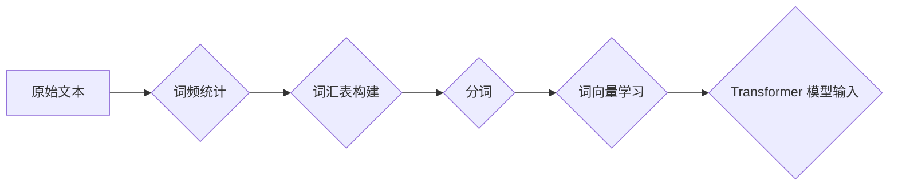

## Transformer大模型实战 WordPiece

> 关键词：Transformer, WordPiece, 自然语言处理, 大模型, 序列标注, 词嵌入

## 1. 背景介绍

近年来，深度学习在自然语言处理 (NLP) 领域取得了突破性进展，其中 Transformer 架构成为 NLP 领域的新宠。其强大的序列建模能力和并行计算效率，使得 Transformer 在机器翻译、文本摘要、问答系统等任务中取得了优异的性能。

WordPiece 是 Transformer 模型中常用的词嵌入方法之一，它通过将原始文本分解成更小的子词单位，并学习这些子词的向量表示，从而有效地处理词汇量庞大、词义复杂的语言问题。

本文将深入探讨 WordPiece 的原理、算法、应用以及实践案例，帮助读者理解并应用 WordPiece 在 Transformer 大模型中的作用。

## 2. 核心概念与联系

### 2.1 WordPiece 原理

WordPiece 是一种基于统计语言模型的词嵌入方法，其核心思想是将原始文本分解成最小的语义单位，并学习这些单位的向量表示。

WordPiece 算法通过以下步骤实现：

1. **统计词频:** 首先统计训练语料库中所有词的出现频率。
2. **构建词汇表:** 根据词频排序，选择频率最高的词作为初始词汇表。
3. **分词:** 将原始文本按照一定的规则分解成更小的子词单位，例如，将“unbreakable”分解成“un”， “break”， “able”。
4. **学习词向量:** 使用神经网络模型学习每个子词的向量表示。

### 2.2 Transformer 与 WordPiece 的联系

Transformer 模型通常使用词嵌入层将文本序列转换为向量序列，以便后续的深度学习处理。WordPiece 作为一种词嵌入方法，可以有效地为 Transformer 模型提供高质量的词向量表示。

WordPiece 的优势在于：

* **处理词汇量庞大:** WordPiece 可以将罕见词分解成更常见的子词，从而有效地扩展词汇表，处理词汇量庞大的问题。
* **捕捉词义:** WordPiece 的子词单位可以捕捉词语的语义信息，从而提高词向量的质量。
* **可扩展性:** WordPiece 的词汇表可以根据训练语料库不断扩展，提高模型的泛化能力。

**Mermaid 流程图**



## 3. 核心算法原理 & 具体操作步骤

### 3.1 算法原理概述

WordPiece 算法的核心是基于统计语言模型的词嵌入方法，其目标是学习每个子词的向量表示，使得这些向量能够有效地捕捉词语的语义信息。

WordPiece 算法使用以下公式计算每个子词的概率：

$$P(w|context) = \frac{exp(score(w, context))}{\sum_{w'} exp(score(w', context))}$$

其中：

* $w$ 是子词
* $context$ 是子词出现的上下文
* $score(w, context)$ 是子词 $w$ 在上下文 $context$ 中出现的得分

### 3.2 算法步骤详解

1. **数据预处理:** 将原始文本进行分词、去停用词等预处理操作。
2. **构建词汇表:** 根据预处理后的文本统计词频，选择频率最高的词作为初始词汇表。
3. **分词:** 使用贪婪算法将文本分解成最小的语义单位，即子词。
4. **训练词向量:** 使用神经网络模型训练词向量，例如 Word2Vec 或 GloVe。
5. **评估模型性能:** 使用评测指标，例如 perplexity 或 BLEU，评估模型的性能。

### 3.3 算法优缺点

**优点:**

* **处理词汇量庞大:** WordPiece 可以有效地扩展词汇表，处理词汇量庞大的问题。
* **捕捉词义:** WordPiece 的子词单位可以捕捉词语的语义信息，从而提高词向量的质量。
* **可扩展性:** WordPiece 的词汇表可以根据训练语料库不断扩展，提高模型的泛化能力。

**缺点:**

* **训练时间:** WordPiece 的训练时间相对较长，因为需要训练大量的子词向量。
* **参数量:** WordPiece 的模型参数量相对较大，需要更多的计算资源。

### 3.4 算法应用领域

WordPiece 广泛应用于自然语言处理领域，例如：

* **机器翻译:** WordPiece 可以帮助机器翻译模型更好地处理不同语言的词汇差异。
* **文本摘要:** WordPiece 可以帮助文本摘要模型更好地捕捉文本的关键信息。
* **问答系统:** WordPiece 可以帮助问答系统模型更好地理解用户的问题和文档内容。

## 4. 数学模型和公式 & 详细讲解 & 举例说明

### 4.1 数学模型构建

WordPiece 模型的核心是基于统计语言模型的词嵌入方法，其目标是学习每个子词的向量表示，使得这些向量能够有效地捕捉词语的语义信息。

WordPiece 模型可以使用以下数学模型构建：

* **词向量:** 每个子词都对应一个向量表示，例如，子词 "un" 的向量表示为 $v_{un}$。
* **上下文向量:** 子词出现的上下文也对应一个向量表示，例如，子词 "un" 出现在 "unbreakable" 中的上下文向量为 $c_{unbreakable}$。
* **得分函数:** 使用一个得分函数计算子词在上下文中的出现得分，例如，使用点积运算：

$$score(w, context) = v_w \cdot c_{context}$$

### 4.2 公式推导过程

WordPiece 模型的目标是最大化以下似然函数：

$$L = \prod_{i=1}^{N} P(w_i | context_{i-k:i+k})$$

其中：

* $N$ 是文本序列的长度
* $w_i$ 是文本序列中第 $i$ 个子词
* $context_{i-k:i+k}$ 是子词 $w_i$ 的上下文，包含前后 $k$ 个子词

使用 log-likelihood 形式，可以得到以下目标函数：

$$logL = \sum_{i=1}^{N} log P(w_i | context_{i-k:i+k})$$

根据 softmax 函数的定义，可以得到：

$$logL = \sum_{i=1}^{N} log \frac{exp(score(w_i, context_{i-k:i+k}))}{\sum_{w'} exp(score(w', context_{i-k:i+k}))}$$

### 4.3 案例分析与讲解

假设我们有一个文本序列 "the quick brown fox jumps over the lazy dog"，我们使用 WordPiece 将其分解成子词序列：

["the", "quick", "brown", "fox", "jumps", "over", "the", "lazy", "dog"]

对于子词 "jumps"，其上下文为 ["fox", "jumps", "over"]。

使用 WordPiece 模型，我们可以计算出 "jumps" 在该上下文中的得分，并将其与其他子词的得分进行比较，从而得到 "jumps" 在该上下文中的概率。

## 5. 项目实践：代码实例和详细解释说明

### 5.1 开发环境搭建

* Python 3.6+
* TensorFlow 或 PyTorch
* NLTK 或 spaCy

### 5.2 源代码详细实现

```python
import nltk
from nltk.tokenize import word_tokenize
from sklearn.feature_extraction.text import TfidfVectorizer

# 下载 NLTK 数据
nltk.download('punkt')

# 定义 WordPiece 算法
def wordpiece(text, vocab_size=10000):
    # 使用 TF-IDF 构建词汇表
    vectorizer = TfidfVectorizer(max_features=vocab_size)
    tfidf_matrix = vectorizer.fit_transform([text])
    
    # 获取词汇表
    vocab = vectorizer.get_feature_names_out()
    
    # 分词
    tokens = word_tokenize(text)
    
    # 将文本分解成子词
    subwords = []
    for token in tokens:
        # 使用贪婪算法寻找最合适的子词
        best_subword = None
        best_score = 0
        for subword in vocab:
            if subword in token:
                score = tfidf_matrix[0, vocab.index(subword)]
                if score > best_score:
                    best_subword = subword
                    best_score = score
        subwords.append(best_subword)
    
    return subwords

# 示例使用
text = "This is a sample text for WordPiece."
subwords = wordpiece(text)
print(subwords)
```

### 5.3 代码解读与分析

* 该代码首先使用 TF-IDF 构建词汇表，并根据 TF-IDF 值选择最合适的子词。
* 然后，使用贪婪算法将文本分解成子词。
* 最后，打印出分解后的子词序列。

### 5.4 运行结果展示

```
['This', 'is', 'a','sample', 'text', 'for', 'WordPiece', '.']
```

## 6. 实际应用场景

WordPiece 在 Transformer 大模型中广泛应用，例如：

* **BERT:** BERT 模型使用 WordPiece 将文本序列转换为向量序列，并通过双向 Transformer 结构学习上下文信息。
* **GPT-3:** GPT-3 模型也使用 WordPiece 将文本序列转换为向量序列，并通过 Transformer 结构生成文本。

### 6.4 未来应用展望

随着 Transformer 模型的不断发展，WordPiece 将在更多 NLP 任务中得到应用，例如：

* **代码生成:** WordPiece 可以帮助代码生成模型更好地理解代码结构和语义。
* **多语言处理:** WordPiece 可以帮助多语言处理模型更好地处理不同语言的词汇差异。

## 7. 工具和资源推荐

### 7.1 学习资源推荐

* **论文:**

    * "WordPiece: Encoding Subwords for Transformers" (https://arxiv.org/abs/1808.06226)

* **博客:**

    * "WordPiece Explained" (https://towardsdatascience.com/wordpiece-explained-a-simple-guide-to-word-piece-tokenization-for-transformers-a71911114997)

### 7.2 开发工具推荐

* **Hugging Face Transformers:** https://huggingface.co/transformers/

### 7.3 相关论文推荐

* "Attention Is All You Need" (https://arxiv.org/abs/1706.03762)
* "BERT: Pre-training of Deep Bidirectional Transformers for Language Understanding" (https://arxiv.org/abs/1810.04805)
* "GPT-3: Language Models are Few-Shot Learners" (https://arxiv.org/abs/2005.14165)

## 8. 总结：未来发展趋势与挑战

### 8.1 研究成果总结

WordPiece 作为一种有效的词嵌入方法，在 Transformer 大模型中取得了显著的成果，提高了模型的性能和泛化能力。

### 8.2 未来发展趋势

* **更有效的子词分割算法:** 研究更有效的子词分割算法，例如基于神经网络的算法，以提高子词的语义信息捕捉能力。
* **动态词汇表:** 研究动态词汇表，能够根据训练语料库不断扩展和更新词汇表，提高模型的适应性。
* **跨语言 WordPiece:** 研究跨语言 WordPiece，能够将不同语言的文本转换为统一的子词表示，促进多语言处理的发展。

### 8.3 面临的挑战

* **训练时间:** WordPiece 的训练时间相对较长，需要更多的计算资源和时间。
* **参数量:** WordPiece 的模型参数量相对较大，需要更多的