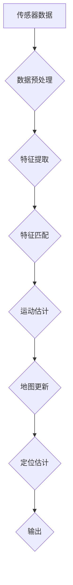

## simultaneous localization and mapping

> 关键词：SLAM, 机器人定位, 地图构建, 视觉SLAM, 滤波算法, 图优化

## 1. 背景介绍

在机器人领域，**Simultaneous Localization and Mapping (SLAM)** 是一项关键技术，它允许机器人同时构建环境地图并确定自身位置。SLAM 广泛应用于自主导航、机器人探索、增强现实 (AR) 和三维建模等领域。

传统的机器人定位方法依赖于已知的环境地图或外部参考系统，而 SLAM 则能够在未知环境中自主学习和构建地图，从而赋予机器人更强的自主性和适应性。

## 2. 核心概念与联系

SLAM 的核心概念是将机器人定位和地图构建任务结合起来，通过传感器数据和运动模型，实现对环境的感知和理解。

**2.1 SLAM 的核心要素**

* **传感器数据:** SLAM 系统依赖于各种传感器数据，例如激光雷达、摄像头、惯性测量单元 (IMU) 等，以感知环境信息。
* **运动模型:** 运动模型描述了机器人的运动状态，例如速度、加速度和方向等。
* **地图表示:** 地图表示方法用于存储和表示环境信息，常见的表示方法包括栅格地图、拓扑地图和三维点云地图等。
* **定位算法:** 定位算法根据传感器数据和运动模型，估计机器人的位置。
* **地图构建算法:** 地图构建算法根据传感器数据和定位结果，构建环境地图。

**2.2 SLAM 的工作流程**

SLAM 系统的工作流程通常包括以下步骤：

1. **数据采集:** 机器人使用传感器收集环境数据。
2. **数据预处理:** 对传感器数据进行预处理，例如去除噪声、校正畸变等。
3. **特征提取:** 从预处理后的数据中提取特征点，例如角点、边缘等。
4. **特征匹配:** 匹配当前帧图像中的特征点与之前帧图像中的特征点，建立特征点之间的关联关系。
5. **运动估计:** 根据特征点之间的关联关系，估计机器人的运动状态。
6. **地图更新:** 根据运动估计结果和传感器数据，更新环境地图。
7. **定位估计:** 根据地图信息和传感器数据，估计机器人的当前位置。

**2.3 SLAM 的架构**



## 3. 核心算法原理 & 具体操作步骤

### 3.1  算法原理概述

SLAM 算法的原理是基于**贝叶斯滤波**和**图优化**。

* **贝叶斯滤波:** 用于估计机器人位置和地图状态的概率分布。
* **图优化:** 用于优化地图和轨迹，提高定位和地图构建的精度。

### 3.2  算法步骤详解

1. **初始化:** 设置初始位置和地图状态。
2. **数据采集:** 使用传感器收集环境数据。
3. **特征提取:** 从传感器数据中提取特征点。
4. **特征匹配:** 匹配当前帧图像中的特征点与之前帧图像中的特征点。
5. **运动估计:** 根据特征点之间的关联关系，估计机器人的运动状态。
6. **地图更新:** 根据运动估计结果和传感器数据，更新环境地图。
7. **定位估计:** 根据地图信息和传感器数据，估计机器人的当前位置。
8. **图优化:** 使用图优化算法优化地图和轨迹。

### 3.3  算法优缺点

**优点:**

* 能够在未知环境中自主构建地图。
* 具有较高的定位精度。
* 能够适应各种复杂的环境。

**缺点:**

* 计算复杂度较高。
* 对传感器数据质量要求较高。
* 容易受到环境噪声和干扰的影响。

### 3.4  算法应用领域

* **自主导航:** 用于无人驾驶汽车、无人机、机器人等。
* **机器人探索:** 用于机器人探索未知环境。
* **增强现实 (AR):** 用于构建虚拟环境，并将其叠加到现实世界中。
* **三维建模:** 用于构建三维环境模型。

## 4. 数学模型和公式 & 详细讲解 & 举例说明

### 4.1  数学模型构建

SLAM 的数学模型通常基于以下假设：

* **传感器模型:** 传感器测量具有噪声的真实值。
* **运动模型:** 机器人的运动服从一定的物理规律。
* **地图模型:** 环境地图可以被表示为一个离散的集合。

### 4.2  公式推导过程

SLAM 算法的推导过程通常涉及以下公式：

* **状态估计:** 使用贝叶斯滤波估计机器人位置和地图状态。
* **运动预测:** 使用运动模型预测机器人的未来位置。
* **传感器更新:** 使用传感器模型更新状态估计。
* **地图构建:** 使用地图模型构建环境地图。

### 4.3  案例分析与讲解

例如，在视觉 SLAM 中，可以使用 **卡尔曼滤波** 来估计机器人位置和相机姿态。卡尔曼滤波是一个基于贝叶斯滤波的算法，它可以根据传感器数据和运动模型，估计系统状态的概率分布。

**卡尔曼滤波公式:**

$$
\hat{x}_{k} = \hat{x}_{k-1} + \mathbf{K}_{k} (z_{k} - h(\hat{x}_{k-1}))
$$

其中:

* $\hat{x}_{k}$ 是估计的系统状态。
* $\hat{x}_{k-1}$ 是上一个时刻的估计状态。
* $\mathbf{K}_{k}$ 是卡尔曼增益。
* $z_{k}$ 是传感器测量值。
* $h(\hat{x}_{k-1})$ 是传感器模型。

## 5. 项目实践：代码实例和详细解释说明

### 5.1  开发环境搭建

* **操作系统:** Ubuntu 18.04 或更高版本
* **编程语言:** Python 3.6 或更高版本
* **库:** OpenCV, NumPy, ROS (可选)

### 5.2  源代码详细实现

以下是一个简单的视觉 SLAM 代码示例，使用 OpenCV 库实现特征匹配和运动估计:

```python
import cv2

# 初始化相机
cap = cv2.VideoCapture(0)

# 提取特征描述符
orb = cv2.ORB_create()

# 前一帧图像
prev_frame = None

while True:
    # 读取图像
    ret, frame = cap.read()

    # 提取特征点和描述符
    kp1, des1 = orb.detectAndCompute(frame, None)

    # 如果是第一帧，则跳过
    if prev_frame is None:
        prev_frame = frame
        continue

    # 匹配特征点
    bf = cv2.BFMatcher(cv2.NORM_HAMMING, crossCheck=True)
    matches = bf.match(des1, prev_frame_des)

    # 绘制匹配特征点
    img_matches = cv2.drawMatches(frame, kp1, prev_frame, prev_kp, matches, None)

    # 显示图像
    cv2.imshow("SLAM", img_matches)

    # 退出条件
    if cv2.waitKey(1) & 0xFF == ord('q'):
        break

# 释放资源
cap.release()
cv2.destroyAllWindows()
```

### 5.3  代码解读与分析

* **特征提取:** 使用 ORB 算法提取图像特征点和描述符。
* **特征匹配:** 使用 Brute-Force Matcher 算法匹配当前帧图像和之前帧图像的特征点。
* **运动估计:** 根据匹配特征点之间的关系，估计机器人的运动状态。

### 5.4  运行结果展示

运行代码后，将显示匹配特征点和运动轨迹的图像。

## 6. 实际应用场景

### 6.1  自主导航

SLAM 技术广泛应用于自主导航领域，例如无人驾驶汽车、无人机、机器人等。

### 6.2  机器人探索

SLAM 能够帮助机器人探索未知环境，构建环境地图，并规划路径。

### 6.3  增强现实 (AR)

SLAM 技术可以用于构建虚拟环境，并将其叠加到现实世界中，实现增强现实效果。

### 6.4  未来应用展望

SLAM 技术在未来将有更广泛的应用，例如：

* **智能家居:** SLAM 可以帮助机器人了解家居环境，并完成各种家务任务。
* **医疗保健:** SLAM 可以用于机器人辅助手术、患者护理等。
* **工业自动化:** SLAM 可以用于机器人协作、物料搬运等。

## 7. 工具和资源推荐

### 7.1  学习资源推荐

* **书籍:**
    * "Probabilistic Robotics" by Sebastian Thrun, Wolfram Burgard, and Dieter Fox
    * "SLAM for Everyone" by Michael Milford
* **课程:**
    * Coursera: "Robotics: Perception and Mapping"
    * Udacity: "Self-Driving Car Engineer Nanodegree"

### 7.2  开发工具推荐

* **ROS (Robot Operating System):** 一个开源机器人操作系统，提供丰富的 SLAM 工具和库。
* **OpenCV:** 一个开源计算机视觉库，提供图像处理和特征提取功能。
* **g2o:** 一个开源图优化库，用于优化 SLAM 地图和轨迹。

### 7.3  相关论文推荐

* "Simultaneous Localization and Mapping" by S. Thrun, W. Burgard, and D. Fox
* "Visual Odometry" by S. Engel, T. Scharstein, and R. Z. Hartley
* "FastSLAM: A Factor Graph Approach to Monocular SLAM" by S. Thrun, W. Burgard, and D. Fox

## 8. 总结：未来发展趋势与挑战

### 8.1  研究成果总结

SLAM 技术在过去几十年取得了显著进展，从传统的基于激光雷达的 SLAM 到现在的基于视觉、惯性测量单元等多传感器融合的 SLAM，性能和应用范围不断扩展。

### 8.2  未来发展趋势

* **多传感器融合:** 将多个传感器数据融合，提高 SLAM 的鲁棒性和精度。
* **实时性:** 提高 SLAM 的实时性，满足实时应用的需求。
* **自主学习:** 使 SLAM 系统能够自主学习和适应新的环境。
* **云端 SLAM:** 将 SLAM 算法部署到云端，利用云计算资源提高处理能力。

### 8.3  面临的挑战

* **环境复杂性:** 复杂的环境，例如光照变化、遮挡、运动模糊等，会对 SLAM 算法造成挑战。
* **数据量:** SLAM 算法需要处理大量的传感器数据，这会带来计算和存储压力。
* **算法效率:** 提高 SLAM 算法的效率，使其能够在资源受限的设备上运行。

### 8.4  研究展望

未来 SLAM 研究将继续探索新的算法、新的传感器和新的应用场景，推动 SLAM 技术的进一步发展。


## 9. 附录：常见问题与解答

### 9.1  SLAM 和 GPS 的区别

SLAM 和 GPS 都是定位技术，但它们的工作原理和应用场景不同。

* **SLAM:** 在未知环境中自主构建地图并定位，不受 GPS 信号影响。
* **GPS:** 使用卫星信号定位，需要卫星信号覆盖，在室内或遮挡区域无法使用。

### 9.2  SLAM 的精度如何？

SLAM 的精度取决于多种因素，例如传感器精度、环境复杂度、算法选择等。一般来说，SLAM 的精度可以达到厘米级甚至毫米级。

### 9.3  SLAM 的应用领域有哪些？

SL