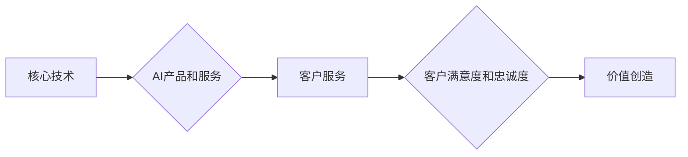

## 价值微笑曲线与AI公司的位置

> 关键词：价值微笑曲线、AI公司、技术竞争、商业模式、市场定位、技术创新、数据驱动

### 1. 背景介绍

在当今科技飞速发展的时代，人工智能（AI）正以惊人的速度改变着我们生活的方方面面。从自动驾驶汽车到智能语音助手，从医疗诊断到金融交易，AI技术的应用场景日益广泛。然而，在AI领域，并非所有公司都能获得成功。一些公司能够在激烈的竞争中脱颖而出，成为行业领军者，而另一些公司则逐渐被市场淘汰。

那么，是什么因素决定了AI公司的成功与否？

价值微笑曲线理论为我们提供了一个重要的视角。价值微笑曲线是指在产业链中，价值创造的分布呈现出“微笑”的形状。曲线两端，即**核心技术**和**客户服务**，创造着最大的价值，而中间环节，即**标准化产品和服务**，价值相对较低。

对于AI公司而言，价值微笑曲线同样适用。AI公司需要在核心技术和客户服务两端建立优势，才能在激烈的市场竞争中获得成功。

### 2. 核心概念与联系

**2.1 价值微笑曲线**

价值微笑曲线是一个描述产业链中价值创造分布的理论模型。它指出，在产业链中，价值创造的分布呈现出“微笑”的形状。

* **核心技术**: 拥有核心技术的公司能够控制关键资源，拥有强大的竞争优势。
* **标准化产品和服务**: 标准化产品和服务竞争激烈，利润空间较小。
* **客户服务**: 优质的客户服务能够提升客户满意度，增强客户忠诚度，创造价值。

**2.2 AI公司与价值微笑曲线**

AI公司在价值微笑曲线中的位置取决于其核心竞争力。

* **技术驱动型AI公司**: 这些公司专注于研发和创新，拥有强大的AI技术实力，例如OpenAI、DeepMind等。它们的核心竞争力在于其掌握的核心算法、模型和数据，能够创造出具有独特价值的AI产品和服务。
* **应用驱动型AI公司**: 这些公司将AI技术应用于特定行业或领域，例如医疗、金融、教育等。它们的核心竞争力在于其对特定行业的深入理解和应用场景的洞察力，能够将AI技术转化为实际价值。
* **数据驱动型AI公司**: 这些公司拥有海量的数据资源，能够利用数据训练和优化AI模型，提升AI模型的性能。例如Google、Facebook等。

**2.3 Mermaid 流程图**



### 3. 核心算法原理 & 具体操作步骤

**3.1 算法原理概述**

深度学习是AI领域的核心算法之一，其原理是通过多层神经网络模拟人类大脑的学习过程。深度学习算法能够从海量数据中自动提取特征，学习复杂的模式，从而实现对图像、语音、文本等数据的识别、分类、生成等任务。

**3.2 算法步骤详解**

1. **数据预处理**: 将原始数据进行清洗、转换、格式化等操作，使其适合深度学习算法的训练。
2. **网络结构设计**: 根据具体任务需求，设计深度神经网络的结构，包括神经元数量、层数、激活函数等。
3. **模型训练**: 使用训练数据训练深度神经网络模型，通过调整模型参数，使模型的预测结果与真实值尽可能接近。
4. **模型评估**: 使用测试数据评估模型的性能，例如准确率、召回率、F1-score等。
5. **模型调优**: 根据模型评估结果，调整模型参数、网络结构等，进一步提升模型性能。
6. **模型部署**: 将训练好的模型部署到实际应用场景中，用于进行预测或决策。

**3.3 算法优缺点**

**优点**:

* 能够自动提取特征，无需人工特征工程。
* 能够学习复杂的模式，实现高精度预测。
* 适用范围广泛，可应用于图像识别、语音识别、自然语言处理等多个领域。

**缺点**:

* 训练数据量要求高，需要大量的 labeled 数据。
* 计算资源消耗大，训练时间长。
* 模型解释性差，难以理解模型的决策过程。

**3.4 算法应用领域**

* **图像识别**: 人脸识别、物体检测、图像分类等。
* **语音识别**: 语音转文本、语音助手等。
* **自然语言处理**: 文本分类、情感分析、机器翻译等。
* **推荐系统**: 商品推荐、内容推荐等。
* **医疗诊断**: 病情诊断、疾病预测等。
* **金融风险控制**: 欺诈检测、信用评估等。

### 4. 数学模型和公式 & 详细讲解 & 举例说明

**4.1 数学模型构建**

深度学习模型通常采用多层神经网络结构，每个神经元接收多个输入信号，并通过激活函数进行处理，输出一个信号。神经网络的训练过程是通过调整神经元权重和偏置，使模型的输出与真实值尽可能接近。

**4.2 公式推导过程**

深度学习模型的训练过程通常使用反向传播算法。反向传播算法的核心思想是通过计算误差梯度，反向传播到各层神经元，并根据梯度更新神经元权重和偏置。

**损失函数**: 用于衡量模型预测结果与真实值的差距。常见的损失函数包括均方误差（MSE）、交叉熵损失（Cross-Entropy Loss）等。

**梯度下降**: 用于更新神经元权重和偏置的优化算法。

**4.3 案例分析与讲解**

假设我们训练一个简单的线性回归模型，用于预测房价。模型输入特征包括房屋面积、房间数量等，输出房价。

损失函数可以定义为均方误差：

$$
L = \frac{1}{n} \sum_{i=1}^{n} (y_i - \hat{y}_i)^2
$$

其中：

* $L$ 为损失函数值
* $n$ 为样本数量
* $y_i$ 为真实房价
* $\hat{y}_i$ 为模型预测的房价

梯度下降算法可以用来更新模型参数：

$$
\theta = \theta - \alpha \nabla L(\theta)
$$

其中：

* $\theta$ 为模型参数
* $\alpha$ 为学习率
* $\nabla L(\theta)$ 为损失函数对参数的梯度

通过不断迭代更新参数，模型的预测结果会逐渐逼近真实值。

### 5. 项目实践：代码实例和详细解释说明

**5.1 开发环境搭建**

* Python 3.x
* TensorFlow 或 PyTorch 等深度学习框架
* Jupyter Notebook 或 VS Code 等代码编辑器

**5.2 源代码详细实现**

```python
import tensorflow as tf

# 定义模型结构
model = tf.keras.models.Sequential([
    tf.keras.layers.Dense(64, activation='relu', input_shape=(784,)),
    tf.keras.layers.Dense(10, activation='softmax')
])

# 编译模型
model.compile(optimizer='adam',
              loss='sparse_categorical_crossentropy',
              metrics=['accuracy'])

# 训练模型
model.fit(x_train, y_train, epochs=10)

# 评估模型
loss, accuracy = model.evaluate(x_test, y_test)
print('Test loss:', loss)
print('Test accuracy:', accuracy)
```

**5.3 代码解读与分析**

* 代码首先定义了一个简单的深度学习模型，包含两层全连接神经网络。
* 模型使用 Adam 优化器，损失函数为交叉熵损失，评价指标为准确率。
* 使用训练数据训练模型，训练 epochs 为 10。
* 使用测试数据评估模型的性能。

**5.4 运行结果展示**

运行结果会显示测试集上的损失值和准确率。

### 6. 实际应用场景

**6.1 医疗诊断**

AI可以帮助医生更快、更准确地诊断疾病。例如，AI算法可以分析医学影像数据，识别肿瘤、骨折等异常情况。

**6.2 金融风险控制**

AI可以帮助金融机构识别欺诈交易、评估信用风险等。例如，AI算法可以分析客户交易数据，识别异常行为，并进行风险预警。

**6.3 自动驾驶**

AI是自动驾驶汽车的核心技术之一。AI算法可以帮助汽车感知周围环境、做出决策、控制车辆行驶。

**6.4 未来应用展望**

AI技术的应用场景还在不断扩展，未来将应用于更多领域，例如教育、娱乐、制造业等。

### 7. 工具和资源推荐

**7.1 学习资源推荐**

* **在线课程**: Coursera、edX、Udacity 等平台提供丰富的AI课程。
* **书籍**: 《深度学习》、《机器学习实战》等书籍。
* **开源项目**: TensorFlow、PyTorch 等深度学习框架的官方文档和示例代码。

**7.2 开发工具推荐**

* **Python**: 深度学习开发的主要编程语言。
* **Jupyter Notebook**: 用于代码编写、数据分析和可视化。
* **VS Code**: 代码编辑器，支持多种深度学习框架的插件。

**7.3 相关论文推荐**

* **《ImageNet Classification with Deep Convolutional Neural Networks》**: 
介绍了AlexNet模型，标志着深度学习在图像识别领域的突破。
* **《Attention Is All You Need》**: 
介绍了Transformer模型，改变了自然语言处理领域的格局。

### 8. 总结：未来发展趋势与挑战

**8.1 研究成果总结**

近年来，AI技术取得了长足的进步，在多个领域取得了突破性进展。深度学习算法成为AI领域的核心技术，并取得了令人瞩目的成果。

**8.2 未来发展趋势**

* **模型规模和能力的提升**: 未来，AI模型的规模和能力将继续提升，能够处理更复杂的任务。
* **模型解释性和可解释性的增强**: 如何理解和解释AI模型的决策过程，将成为未来研究的重要方向。
* **AI技术的普适化**: AI技术将应用于更多领域，并融入到人们生活的方方面面。

**8.3 面临的挑战**

* **数据安全和隐私保护**: AI模型的训练需要大量数据，如何保证数据安全和隐私保护，将是一个重要的挑战。
* **算法偏见和公平性**: AI算法可能存在偏见，导致不公平的结果。如何解决算法偏见和确保公平性，将是一个重要的研究课题。
* **AI伦理问题**: AI技术的快速发展引发了伦理问题，例如AI的责任归属、AI的控制等。

**8.4 研究展望**

未来，AI研究将继续朝着更安全、更可靠、更智能的方向发展。我们需要加强跨学科合作，解决AI技术带来的挑战，并推动AI技术更好地服务于人类社会。

### 9. 附录：常见问题与解答

**9.1 如何选择合适的深度学习框架？**

选择深度学习框架需要根据具体项目需求和个人经验进行考虑。TensorFlow 和 PyTorch 是目前最流行的深度学习框架，各有优缺点。

**9.2 如何解决过拟合问题？**

过拟合是指模型在训练数据上表现很好，但在测试数据上表现较差。解决过拟合问题的方法包括：

* 增加训练数据量
* 使用正则化技术
* 使用 dropout 技术
* 使用早停策略

**9.3 如何评估深度学习模型的性能？**

常用的深度学习模型性能评估指标包括：

* 准确率
* 召回率
* F1-score
* AUC

选择合适的评估指标需要根据具体任务需求进行考虑。


作者：禅与计算机程序设计艺术 / Zen and the Art of Computer Programming 
