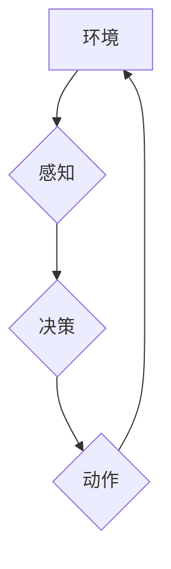

## 具身智能与客观世界的交互

> 关键词：具身智能、机器人、感知、动作、交互、学习、环境建模、深度学习

### 1. 背景介绍

人工智能（AI）的发展历程中，一直存在着一种追求：让机器能够像人类一样感知世界、理解世界，并与世界进行有效交互。传统的AI模型主要依赖于文本和数字数据，缺乏与物理世界的直接交互能力。而“具身智能”的概念则试图打破这一局限，赋予机器感知、行动和学习的能力，使其能够真正地融入和参与客观世界。

具身智能的核心思想是，智能的本质在于与环境的交互。通过感知环境信息、执行动作并根据反馈进行学习，机器能够逐渐构建对世界的理解，并最终实现自主决策和行为。这种与环境交互的方式与人类的学习过程非常相似，我们通过观察、触碰、实验等方式不断地学习和理解世界。

### 2. 核心概念与联系

**2.1 核心概念**

* **感知:** 机器通过传感器获取环境信息，例如视觉、听觉、触觉、嗅觉等。
* **动作:** 机器通过执行器与环境进行交互，例如移动、抓取、说话等。
* **交互:** 机器与环境之间进行信息交换和反馈，通过感知和动作来理解和改变环境。
* **学习:** 机器通过对环境交互的经验进行分析和总结，不断更新其对世界的理解，并改进其行为策略。

**2.2 架构图**



**2.3 联系**

感知、动作、交互和学习是具身智能的核心要素，它们相互关联，共同构成了机器与环境交互的完整循环。

* 感知是机器理解环境的基础，它为决策提供信息。
* 动作是机器与环境进行交互的手段，它可以改变环境状态。
* 交互是感知和动作的结合，它使得机器能够不断地学习和适应环境。
* 学习是机器不断完善其对环境理解和行为策略的关键，它使得机器能够在交互中不断进步。

### 3. 核心算法原理 & 具体操作步骤

**3.1 算法原理概述**

具身智能算法的核心是将感知信息转化为可理解的动作指令，并通过动作与环境进行交互，不断学习和优化行为策略。常见的具身智能算法包括：

* **强化学习:** 机器通过与环境交互，获得奖励和惩罚信号，并根据这些信号调整其行为策略，以最大化奖励。
* **深度强化学习:** 利用深度神经网络来学习复杂的感知和决策模型，能够处理更丰富和复杂的感知信息。
* **行为克隆:** 通过模仿人类或其他机器人的行为，学习有效的动作策略。

**3.2 算法步骤详解**

以强化学习为例，其基本步骤如下：

1. **环境建模:** 建立一个数学模型来描述环境的动态行为。
2. **状态空间定义:** 将环境的状态表示为一个有限的集合，每个状态代表环境的一种特定情况。
3. **动作空间定义:** 定义机器可以执行的动作集合。
4. **奖励函数设计:** 设计一个函数来评估机器在不同状态下执行不同动作的奖励。
5. **策略学习:** 利用强化学习算法，例如Q-learning或Deep Q-Network，学习一个策略函数，该函数能够根据当前状态预测最佳动作。
6. **动作执行:** 根据学习到的策略函数，机器选择并执行动作。
7. **环境反馈:** 环境根据机器的动作产生新的状态和奖励信号。
8. **迭代更新:** 将新的状态和奖励信号反馈到强化学习算法中，更新策略函数。

**3.3 算法优缺点**

* **优点:** 能够学习复杂的、非线性行为策略，适应动态变化的环境。
* **缺点:** 需要大量的训练数据和计算资源，学习过程可能很慢。

**3.4 算法应用领域**

* **机器人控制:** 训练机器人执行复杂的任务，例如导航、抓取、组装等。
* **游戏AI:** 开发能够与人类进行对抗性的游戏AI。
* **自动驾驶:** 训练自动驾驶汽车感知环境、做出决策和控制车辆。

### 4. 数学模型和公式 & 详细讲解 & 举例说明

**4.1 数学模型构建**

强化学习的数学模型通常由以下几个部分组成：

* **状态空间:** S = {s1, s2,..., sn}，表示环境可能存在的各种状态。
* **动作空间:** A = {a1, a2,..., am}，表示机器可以执行的各种动作。
* **奖励函数:** R(s, a)，表示机器在状态s执行动作a后获得的奖励。
* **策略函数:** π(s)，表示机器在状态s下选择动作的概率分布。

**4.2 公式推导过程**

强化学习的目标是找到一个最优的策略函数π*，使得机器在与环境交互的过程中获得最大的总奖励。常用的强化学习算法，例如Q-learning，利用Bellman方程来更新策略函数：

$$Q(s, a) = R(s, a) + \gamma \max_{a'} Q(s', a')$$

其中：

* Q(s, a) 表示在状态s执行动作a后获得的期望奖励。
* R(s, a) 表示在状态s执行动作a后获得的即时奖励。
* γ 表示折扣因子，控制未来奖励的权重。
* s' 表示执行动作a后进入的下一个状态。
* a' 表示在下一个状态s'中执行的动作。

**4.3 案例分析与讲解**

例如，训练一个机器人学习在迷宫中找到出口。

* 状态空间：迷宫中的每个位置。
* 动作空间：向上、向下、向左、向右四个方向移动。
* 奖励函数：到达出口时获得最大奖励，迷宫中其他位置获得较小的奖励，撞墙时获得惩罚。
* 策略函数：根据当前位置选择移动方向的概率分布。

通过Q-learning算法，机器人可以不断地学习更新策略函数，最终找到最优路径到达出口。

### 5. 项目实践：代码实例和详细解释说明

**5.1 开发环境搭建**

* Python 3.x
* TensorFlow 或 PyTorch 深度学习框架
* OpenAI Gym 机器人仿真环境

**5.2 源代码详细实现**

```python
import gym
import numpy as np
from tensorflow.keras.models import Sequential
from tensorflow.keras.layers import Dense

# 创建环境
env = gym.make('CartPole-v1')

# 定义神经网络模型
model = Sequential()
model.add(Dense(128, activation='relu', input_shape=(4,)))
model.add(Dense(64, activation='relu'))
model.add(Dense(2, activation='softmax'))

# 定义损失函数和优化器
model.compile(loss='categorical_crossentropy', optimizer='adam')

# 训练模型
for episode in range(1000):
    state = env.reset()
    done = False
    total_reward = 0

    while not done:
        # 选择动作
        action = np.argmax(model.predict(state.reshape(1, -1)))

        # 执行动作
        next_state, reward, done, _ = env.step(action)

        # 更新状态
        state = next_state

        # 更新奖励
        total_reward += reward

    # 更新模型
    model.fit(state.reshape(1, -1), np.eye(2)[action], epochs=1, verbose=0)

    # 打印奖励
    print(f'Episode {episode+1}: Total Reward = {total_reward}')

# 保存模型
model.save('cartpole_model.h5')
```

**5.3 代码解读与分析**

* 代码首先创建了一个CartPole-v1环境，这是一个经典的机器人控制任务。
* 然后定义了一个神经网络模型，用于学习策略函数。
* 使用Q-learning算法训练模型，通过与环境交互，不断更新策略函数。
* 最后保存训练好的模型。

**5.4 运行结果展示**

训练完成后，模型能够控制机器人平衡木杆，并保持平衡的时间越来越长。

### 6. 实际应用场景

**6.1 自动驾驶**

自动驾驶汽车需要感知周围环境、预测其他车辆和行人的行为，并做出安全有效的驾驶决策。具身智能算法可以帮助自动驾驶汽车学习复杂的驾驶策略，提高其安全性、可靠性和效率。

**6.2 机器人手术**

机器人手术需要机器人能够精确地控制手术工具，并根据手术过程中的反馈进行调整。具身智能算法可以帮助机器人学习复杂的医疗操作，提高手术的精度和安全性。

**6.3 物理交互式游戏**

物理交互式游戏需要游戏角色能够与游戏环境进行真实的物理交互，例如抓取物体、推开障碍物等。具身智能算法可以帮助游戏角色学习更逼真的物理行为，提升游戏的沉浸感和趣味性。

**6.4 未来应用展望**

随着人工智能技术的不断发展，具身智能将在更多领域得到应用，例如：

* **个性化教育:** 根据学生的学习情况，提供个性化的学习内容和教学方式。
* **智能家居:** 通过感知用户的需求，自动调节家居环境，例如温度、灯光、音乐等。
* **医疗辅助:** 帮助医生诊断疾病、制定治疗方案、进行手术辅助等。

### 7. 工具和资源推荐

**7.1 学习资源推荐**

* **书籍:**
    * 《Reinforcement Learning: An Introduction》 by Richard S. Sutton and Andrew G. Barto
    * 《Deep Reinforcement Learning Hands-On》 by Maxim Lapan
* **课程:**
    * Coursera: Reinforcement Learning Specialization
    * Udacity: Deep Reinforcement Learning Nanodegree

**7.2 开发工具推荐**

* **TensorFlow:** https://www.tensorflow.org/
* **PyTorch:** https://pytorch.org/
* **OpenAI Gym:** https://gym.openai.com/

**7.3 相关论文推荐**

* **Deep Q-Network (DQN):** https://arxiv.org/abs/1312.5602
* **Proximal Policy Optimization (PPO):** https://arxiv.org/abs/1707.06347
* **AlphaGo:** https://deepmind.com/blog/alphago-zero-starts-human-level-at-game-go

### 8. 总结：未来发展趋势与挑战

**8.1 研究成果总结**

近年来，具身智能领域取得了显著进展，例如AlphaGo、AlphaStar等项目展示了深度强化学习在复杂任务中的强大能力。

**8.2 未来发展趋势**

* **更强大的感知和动作能力:** 开发更先进的传感器和执行器，使机器能够感知和交互于更复杂的环境。
* **更有效的学习算法:** 研究更有效的强化学习算法，能够更快、更有效地学习复杂的策略。
* **更安全的交互机制:** 设计更安全的交互机制，确保机器与人类的交互安全可靠。

**8.3 面临的挑战**

* **数据获取和标注:** 训练具身智能模型需要大量的真实世界数据，获取和标注这些数据非常困难。
* **计算资源:** 训练复杂的具身智能模型需要大量的计算资源，这对于小型研究机构来说是一个挑战。
* **伦理问题:** 随着具身智能技术的进步，一些伦理问题也随之而来，例如机器人的责任、隐私保护等。

**8.4 研究展望**

未来，具身智能将继续朝着更智能、更安全、更可靠的方向发展，并将在更多领域发挥重要作用。


### 9. 附录：常见问题与解答

**9.1 如何选择合适的具身智能算法？**

选择合适的具身智能算法取决于具体的应用场景和任务需求。例如，对于简单的任务，行为克隆算法可能是一个不错的选择；而对于复杂的、动态变化的环境，强化学习算法可能更合适。

**9.2 如何解决数据获取和标注问题？**

可以利用模拟环境、数据增强技术等方法来解决数据获取和标注问题。

