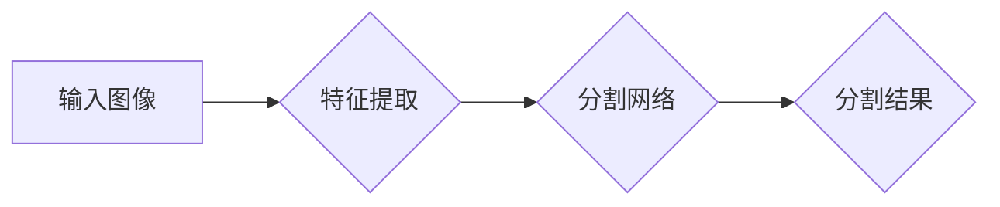

## 图像分割 (Image Segmentation) 原理与代码实例讲解

> 关键词：图像分割、卷积神经网络、U-Net、实例分割、语义分割、目标检测、深度学习

## 1. 背景介绍

图像分割是计算机视觉领域的核心任务之一，它旨在将图像划分为多个相互独立的区域，每个区域代表图像中不同的物体或场景。图像分割技术在许多领域都有广泛的应用，例如：

* **医学图像分析:** 用于识别和分割人体器官、肿瘤等，辅助医生诊断和治疗。
* **自动驾驶:** 用于识别道路、行人、车辆等，帮助车辆感知周围环境。
* **遥感图像分析:** 用于识别土地覆盖类型、植被覆盖率等，支持农业、环境监测等应用。
* **图像编辑:** 用于抠图、背景替换等，提高图像编辑效率。

随着深度学习技术的快速发展，基于卷积神经网络的图像分割算法取得了显著的进展，在精度、速度和鲁棒性方面都取得了突破。

## 2. 核心概念与联系

图像分割可以分为两种主要类型：

* **语义分割:** 将图像中的每个像素都分配到一个预定义的类别，例如天空、道路、人等。
* **实例分割:** 将图像中的每个实例都分割出来，例如识别出多个人的不同实例。

**Mermaid 流程图:**



## 3. 核心算法原理 & 具体操作步骤

### 3.1  算法原理概述

U-Net 是一种专门用于图像分割的卷积神经网络架构，它由两个部分组成：

* **编码器 (Encoder):** 用于提取图像的特征，类似于传统卷积神经网络的卷积层和池化层。
* **解码器 (Decoder):** 用于根据编码器提取的特征，生成分割结果。解码器部分采用转置卷积操作，将特征图的尺寸逐渐恢复到原始图像尺寸。

U-Net 的特点是：

* **跳跃连接 (Skip Connections):** 在解码器中，将编码器不同层的特征图与解码器对应层的特征图进行拼接，保留了图像的细节信息。
* **全卷积网络 (Fully Convolutional Network):** U-Net 的所有层都是全卷积层，因此可以处理任意大小的输入图像。

### 3.2  算法步骤详解

1. **输入图像预处理:** 将输入图像调整到合适的尺寸，并进行归一化处理。
2. **特征提取:** 将预处理后的图像输入到编码器中，通过一系列卷积层和池化层提取图像的特征。
3. **特征融合:** 将编码器不同层的特征图通过跳跃连接与解码器对应层的特征图进行拼接。
4. **分割结果生成:** 将融合后的特征图输入到解码器中，通过转置卷积操作生成分割结果。
5. **后处理:** 对分割结果进行一些后处理操作，例如去除噪声、填充边界等。

### 3.3  算法优缺点

**优点:**

* 精度高: U-Net 在图像分割任务上取得了很好的效果。
* 训练效率高: U-Net 的结构相对简单，训练速度较快。
* 可处理任意大小的图像: U-Net 是一个全卷积网络，可以处理任意大小的输入图像。

**缺点:**

* 对于大尺寸图像，内存占用较大。
* 对于复杂场景，分割效果可能不够理想。

### 3.4  算法应用领域

U-Net 广泛应用于以下领域:

* 医学图像分割: 识别肿瘤、器官、血管等。
* 语义分割: 分割图像中的不同场景，例如道路、天空、建筑物等。
* 实例分割: 分割图像中的不同实例，例如识别多个人的不同实例。
* 其他应用: 遥感图像分析、自动驾驶、图像编辑等。

## 4. 数学模型和公式 & 详细讲解 & 举例说明

### 4.1  数学模型构建

U-Net 的数学模型可以概括为一个多层卷积神经网络，其中包含编码器和解码器两部分。

* **编码器:** 使用一系列卷积层和池化层提取图像特征。卷积层使用卷积核对图像进行卷积操作，池化层使用最大池化或平均池化操作对特征图进行降维。
* **解码器:** 使用转置卷积层和上采样操作恢复特征图的尺寸，并最终生成分割结果。转置卷积层类似于卷积层，但其输出特征图的尺寸比输入特征图大。上采样操作可以将特征图的尺寸放大到原始图像尺寸。

### 4.2  公式推导过程

U-Net 的具体数学公式推导过程比较复杂，涉及到卷积、池化、转置卷积、激活函数等操作。

**卷积操作:**

$$
y_{i,j} = \sum_{m,n} x_{m,n} * w_{i-m,j-n} + b_i
$$

其中:

* $x_{m,n}$ 是输入图像的像素值。
* $w_{i-m,j-n}$ 是卷积核的权重值。
* $b_i$ 是卷积层的偏置值。
* $y_{i,j}$ 是卷积层的输出像素值。

**池化操作:**

$$
y_{i,j} = \max(x_{i*s,j*s}, x_{i*s+1,j*s},..., x_{i*s+s-1,j*s+s-1})
$$

其中:

* $x_{i*s,j*s}$ 是输入特征图的像素值。
* $s$ 是池化窗口的大小。
* $y_{i,j}$ 是池化层的输出像素值。

### 4.3  案例分析与讲解

假设我们有一个输入图像，其尺寸为 256x256，我们使用 U-Net 进行语义分割，目标是将图像分割成 3 个类别: 天空、道路、建筑物。

1. **编码器:** 将输入图像经过一系列卷积层和池化层，提取图像特征。
2. **解码器:** 将编码器提取的特征图经过转置卷积层和上采样操作，恢复特征图的尺寸。
3. **分类层:** 将解码器输出的特征图输入到分类层，分类层使用 softmax 函数将每个像素分配到 3 个类别中。

最终，我们得到一个分割结果，每个像素都对应一个类别。

## 5. 项目实践：代码实例和详细解释说明

### 5.1  开发环境搭建

* Python 3.6+
* TensorFlow 2.0+
* Keras 2.0+
* OpenCV 4.0+

### 5.2  源代码详细实现

```python
import tensorflow as tf
from tensorflow.keras.layers import Input, Conv2D, MaxPooling2D, UpSampling2D, concatenate
from tensorflow.keras.models import Model

def unet(input_shape=(256, 256, 3), num_classes=3):
    inputs = Input(input_shape)

    # Encoder
    conv1 = Conv2D(64, 3, activation='relu', padding='same')(inputs)
    conv1 = Conv2D(64, 3, activation='relu', padding='same')(conv1)
    pool1 = MaxPooling2D(pool_size=(2, 2))(conv1)

    conv2 = Conv2D(128, 3, activation='relu', padding='same')(pool1)
    conv2 = Conv2D(128, 3, activation='relu', padding='same')(conv2)
    pool2 = MaxPooling2D(pool_size=(2, 2))(conv2)

    conv3 = Conv2D(256, 3, activation='relu', padding='same')(pool2)
    conv3 = Conv2D(256, 3, activation='relu', padding='same')(conv3)
    pool3 = MaxPooling2D(pool_size=(2, 2))(conv3)

    conv4 = Conv2D(512, 3, activation='relu', padding='same')(pool3)
    conv4 = Conv2D(512, 3, activation='relu', padding='same')(conv4)
    pool4 = MaxPooling2D(pool_size=(2, 2))(conv4)

    # Bottleneck
    conv5 = Conv2D(1024, 3, activation='relu', padding='same')(pool4)
    conv5 = Conv2D(1024, 3, activation='relu', padding='same')(conv5)

    # Decoder
    up6 = UpSampling2D(size=(2, 2))(conv5)
    merge6 = concatenate([up6, conv4], axis=3)
    conv6 = Conv2D(512, 3, activation='relu', padding='same')(merge6)
    conv6 = Conv2D(512, 3, activation='relu', padding='same')(conv6)

    up7 = UpSampling2D(size=(2, 2))(conv6)
    merge7 = concatenate([up7, conv3], axis=3)
    conv7 = Conv2D(256, 3, activation='relu', padding='same')(merge7)
    conv7 = Conv2D(256, 3, activation='relu', padding='same')(conv7)

    up8 = UpSampling2D(size=(2, 2))(conv7)
    merge8 = concatenate([up8, conv2], axis=3)
    conv8 = Conv2D(128, 3, activation='relu', padding='same')(merge8)
    conv8 = Conv2D(128, 3, activation='relu', padding='same')(conv8)

    up9 = UpSampling2D(size=(2, 2))(conv8)
    merge9 = concatenate([up9, conv1], axis=3)
    conv9 = Conv2D(64, 3, activation='relu', padding='same')(merge9)
    conv9 = Conv2D(64, 3, activation='relu', padding='same')(conv9)

    outputs = Conv2D(num_classes, 1, activation='softmax')(conv9)

    model = Model(inputs=inputs, outputs=outputs)
    return model

# 实例化模型
model = unet(input_shape=(256, 256, 3), num_classes=3)

# 打印模型结构
model.summary()
```

### 5.3  代码解读与分析

* **unet 函数:** 定义了 U-Net 模型的结构。
* **Encoder:** 使用一系列卷积层和池化层提取图像特征。
* **Decoder:** 使用转置卷积层和上采样操作恢复特征图的尺寸。
* **跳跃连接:** 使用 `concatenate` 函数将编码器和解码器特征图进行拼接。
* **分类层:** 使用 `Conv2D` 层和 `softmax` 函数进行分类。
* **model.summary():** 打印模型结构信息。

### 5.4  运行结果展示

运行代码后，模型会输出分割结果，每个像素都对应一个类别。

## 6. 实际应用场景

### 6.1  医学图像分析

U-Net 在医学图像分析领域取得了显著的成果，例如：

* **肿瘤分割:** 识别和分割肿瘤区域，辅助医生诊断和治疗。
* **器官分割:** 识别和分割人体器官，例如心脏、肺、肝脏等，用于手术规划和疾病监测。
* **血管分割:** 识别和分割血管，