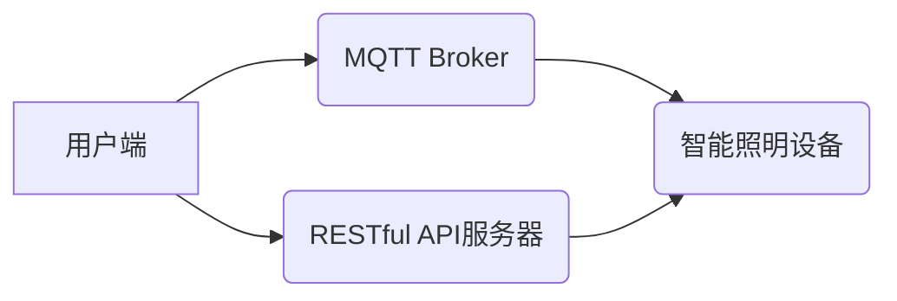

## 基于MQTT协议和RESTful API的智能照明控制系统设计

> 关键词：MQTT协议，RESTful API，智能照明，物联网，远程控制，数据传输，系统架构

## 1. 背景介绍

随着物联网技术的快速发展，智能家居已成为人们生活的重要组成部分。智能照明作为智能家居的核心应用之一，能够根据用户的需求和环境变化自动调节灯光亮度、颜色和模式，提升家居舒适度和生活品质。传统的照明控制方式通常依赖于物理开关，操作不便且缺乏智能化功能。基于MQTT协议和RESTful API的智能照明控制系统，能够实现远程控制、场景联动、智能调节等功能，为用户提供更加便捷、智能化的照明体验。

## 2. 核心概念与联系

### 2.1 MQTT协议

MQTT（Message Queuing Telemetry Transport）是一种轻量级的消息传输协议，专门设计用于物联网应用场景。它采用发布/订阅模式，允许设备之间进行可靠的数据传输，即使网络连接不稳定也能保证消息的传递。MQTT协议具有以下特点：

* 轻量级：协议本身非常简洁，占用资源少，适合资源受限的设备使用。
* 效率高：消息传输采用队列机制，能够有效减少网络流量。
* 可靠性强：消息确认机制保证消息的可靠传递。
* 跨平台：MQTT协议支持多种平台和编程语言。

### 2.2 RESTful API

RESTful API（Representational State Transfer Application Programming Interface）是一种基于互联网协议的架构风格，用于构建Web服务。它采用资源定位、HTTP方法和状态码等机制，提供一种简单、灵活、可扩展的接口设计方式。RESTful API具有以下特点：

* 基于资源：所有数据都以资源的形式表示，每个资源都有唯一的标识符。
* 使用HTTP方法：使用GET、POST、PUT、DELETE等HTTP方法进行数据操作。
* 状态转移：API操作会改变资源的状态，并返回相应的状态码。
* 无状态：每个请求都是独立的，服务器不需要记住之前的请求状态。

### 2.3 系统架构

基于MQTT协议和RESTful API的智能照明控制系统，通常采用以下架构：



* **用户端:** 用户可以通过手机、平板电脑等设备访问系统，进行灯光控制操作。
* **MQTT Broker:** 作为消息中间件，负责协调用户端和智能照明设备之间的通信。
* **智能照明设备:** 包括灯具、传感器等硬件设备，能够接收MQTT消息并执行相应的控制动作。
* **RESTful API服务器:** 提供RESTful API接口，允许用户端和第三方应用访问系统数据和功能。

## 3. 核心算法原理 & 具体操作步骤

### 3.1 算法原理概述

智能照明控制系统中，核心算法主要涉及以下几个方面：

* **灯光控制算法:** 根据用户指令或环境变化，计算并控制灯光亮度、颜色和模式。
* **场景联动算法:** 根据用户预设的场景，自动控制多个灯光设备的运行状态。
* **智能调节算法:** 利用传感器数据，例如光线强度、温度、湿度等，自动调节灯光亮度和颜色，提升用户舒适度。

### 3.2 算法步骤详解

**灯光控制算法:**

1. 接收用户指令或环境变化信息。
2. 根据指令或信息，确定目标灯光状态（亮度、颜色、模式等）。
3. 计算灯光控制参数，例如PWM值、RGB值等。
4. 发送控制指令到智能照明设备。

**场景联动算法:**

1. 用户预设场景，定义灯光设备的运行状态。
2. 系统识别场景触发条件，例如时间、地点、用户行为等。
3. 根据场景定义，自动控制相关灯光设备的运行状态。

**智能调节算法:**

1. 收集传感器数据，例如光线强度、温度、湿度等。
2. 根据传感器数据和用户偏好，计算目标灯光状态。
3. 发送控制指令到智能照明设备。

### 3.3 算法优缺点

**优点:**

* 能够实现灵活、智能的灯光控制。
* 提升用户舒适度和生活品质。
* 节能环保，降低能源消耗。

**缺点:**

* 算法设计复杂，需要专业知识。
* 系统部署和维护成本较高。
* 依赖网络连接，网络故障可能导致系统瘫痪。

### 3.4 算法应用领域

智能照明控制算法广泛应用于以下领域:

* 智能家居
* 商业照明
* 工业照明
* 城市照明
* 交通照明

## 4. 数学模型和公式 & 详细讲解 & 举例说明

### 4.1 数学模型构建

智能照明控制系统中，可以使用数学模型来描述灯光亮度、颜色和模式之间的关系。例如，可以使用RGB模型来表示灯光颜色，其中R、G、B分别代表红色、绿色和蓝色分量。

### 4.2 公式推导过程

**RGB模型:**

*  **亮度计算:**  亮度可以根据RGB分量的加权平均值计算，公式如下:

$$
L = \frac{R + G + B}{3}
$$

*  **颜色转换:** 可以使用不同的颜色空间转换公式，例如HSV（色调、饱和度、亮度）空间，来转换RGB颜色值。

### 4.3 案例分析与讲解

**场景：** 用户希望将房间灯光设置为暖色调，亮度为50%。

**操作步骤：**

1. 根据用户需求，确定目标颜色为暖色调，亮度为50%。
2. 使用RGB模型，计算目标RGB值。例如，暖色调可以设置为R=255, G=165, B=0。
3. 将目标RGB值发送到智能照明设备，控制灯光颜色和亮度。

## 5. 项目实践：代码实例和详细解释说明

### 5.1 开发环境搭建

* **操作系统:** Linux/Windows/macOS
* **编程语言:** Python/C++/Java
* **MQTT Broker:** Mosquitto/EMQX
* **RESTful API框架:** Flask/Django/Spring Boot

### 5.2 源代码详细实现

**Python代码示例 (使用MQTT和Flask):**

```python
# mqtt_client.py
import paho.mqtt.client as mqtt

# MQTT Broker配置
broker_address = "mqtt.example.com"
broker_port = 1883

# MQTT主题
topic = "smart_lighting/control"

def on_connect(client, userdata, flags, rc):
    if rc == 0:
        print("Connected to MQTT Broker!")
        client.subscribe(topic)
    else:
        print("Connection failed!")

def on_message(client, userdata, msg):
    print("Received message:", msg.payload.decode())
    # 处理接收到的消息，控制灯光

client = mqtt.Client()
client.on_connect = on_connect
client.on_message = on_message
client.connect(broker_address, broker_port)
client.loop_forever()

# app.py (Flask RESTful API)
from flask import Flask, request
from flask_restful import Resource, Api

app = Flask(__name__)
api = Api(app)

class LightingControl(Resource):
    def post(self):
        data = request.get_json()
        # 获取灯光控制指令
        brightness = data.get("brightness")
        color = data.get("color")
        # 发送MQTT消息控制灯光
        #...

api.add_resource(LightingControl, '/lighting')

if __name__<h1>

app.run(debug=True)
```

### 5.3 代码解读与分析

* **mqtt_client.py:** 使用paho-mqtt库连接MQTT Broker，订阅主题`smart_lighting/control`，接收来自用户端的控制指令。
* **app.py:** 使用Flask框架构建RESTful API，提供`/lighting`接口，接收用户发送的灯光控制指令，并通过MQTT消息发送到智能照明设备。

### 5.4 运行结果展示

用户可以通过手机APP或网页发送灯光控制指令到`/lighting`接口，例如：

```json
{
  "brightness": 50,
  "color": "warm"
}
```

系统会接收指令，并通过MQTT消息控制智能照明设备，将灯光亮度设置为50%，颜色设置为暖色调。

## 6. 实际应用场景

### 6.1 智能家居

智能照明控制系统可以集成到智能家居系统中，实现场景联动、语音控制、远程控制等功能，提升家居舒适度和生活品质。例如，用户可以设置“起床”场景，在早上自动打开窗帘并调节灯光亮度，模拟自然光线，唤醒用户。

### 6.2 商业照明

智能照明控制系统可以根据人流量、时间段等因素，自动调节灯光亮度和颜色，降低能源消耗，提升照明效率。例如，商场可以根据顾客流量自动调节灯光亮度，在人流量较少时降低亮度，节约能源。

### 6.3 工业照明

智能照明控制系统可以根据生产线操作需求，提供不同亮度和颜色照明的环境，提升生产效率和安全性。例如，工厂可以根据不同工序的需求，设置不同的灯光场景，例如，焊接工序需要高亮度白光，而组装工序则需要柔和的暖色光。

### 6.4 城市照明

智能照明控制系统可以根据城市环境和交通状况，自动调节灯光亮度和颜色，提升城市安全性和能源效率。例如，城市道路可以根据交通流量自动调节灯光亮度，在夜间人流量较少时降低亮度，节约能源。

### 6.5 未来应用展望

随着物联网技术的不断发展，智能照明控制系统将更加智能化、个性化和融合化。未来，智能照明控制系统将能够：

* 更精准地感知环境变化，例如光线强度、温度、湿度等，并根据用户需求自动调节灯光状态。
* 更广泛地应用于不同场景，例如医疗、教育、娱乐等领域。
* 与其他智能家居设备进行更深层次的联动，例如智能音箱、智能家居控制中心等。

## 7. 工具和资源推荐

### 7.1 学习资源推荐

* **MQTT协议:**
    * [MQTT官网](https://mqtt.org/)
    * [paho-mqtt库文档](https://pypi.org/project/paho-mqtt/)
* **RESTful API:**
    * [RESTful API设计原则](https://restfulapi.net/)
    * [Flask框架文档](https://flask.palletsprojects.com/en/2.2.x/)
    * [Django框架文档](https://docs.djangoproject.com/en/4.2/)

### 7.2 开发工具推荐

* **MQTT Broker:**
    * Mosquitto
    * EMQX
* **IDE:**
    * Visual Studio Code
    * PyCharm
* **云平台:**
    * AWS IoT Core
    * Azure IoT Hub
    * Google Cloud IoT Core

### 7.3 相关论文推荐

* [MQTT协议的应用研究](https://ieeexplore.ieee.org/document/8915742)
* [基于MQTT协议的智能家居照明控制系统设计](https://www.researchgate.net/publication/334921113_Design_of_a_Smart_Home_Lighting_Control_System_Based_on_MQTT_Protocol)

## 8. 总结：未来发展趋势与挑战

### 8.1 研究成果总结

基于MQTT协议和RESTful API的智能照明控制系统，能够实现灵活、智能的灯光控制，提升用户舒适度和生活品质。该系统架构简单、易于部署，并且具有良好的扩展性，能够满足不同场景的需求。

### 8.2 未来发展趋势

* **更智能的控制算法:** 利用人工智能技术，开发更智能