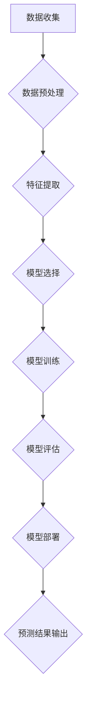

## 基于数据挖掘的气温变化对某旅游业的影响研究

> 关键词：数据挖掘、气温变化、旅游业、预测模型、关联规则、时间序列分析

## 1. 背景介绍

随着全球气候变化的加剧，气温波动日益频繁，对各行各业都产生了深远影响。旅游业作为受气候影响最为敏感的行业之一，气温变化对其发展具有至关重要的影响。例如，高温天气可能导致游客减少，旅游景点人气下降；而极端天气事件则可能造成旅游安全隐患，甚至导致旅游业停摆。因此，研究气温变化对旅游业的影响，并建立有效的预测模型，对于旅游业的科学发展具有重要意义。

数据挖掘作为一种强大的数据分析技术，能够从海量数据中挖掘出隐藏的模式和规律，为解决复杂问题提供有效支持。近年来，数据挖掘在旅游业应用领域得到了广泛关注，例如：

* **旅游需求预测:** 利用历史旅游数据，预测未来旅游需求，帮助旅游企业制定合理的营销策略。
* **旅游路线推荐:** 根据用户的兴趣爱好和旅行时间，推荐个性化的旅游路线。
* **旅游风险预警:** 利用天气预报、新闻事件等数据，预警旅游风险，保障游客安全。

本研究将结合数据挖掘技术，分析气温变化对某旅游业的影响，构建气温变化预测模型，为旅游企业提供科学决策依据。

## 2. 核心概念与联系

### 2.1 气温变化与旅游业

气温变化是影响旅游业的重要因素之一。高温天气可能导致游客减少，旅游景点人气下降；而极端天气事件则可能造成旅游安全隐患，甚至导致旅游业停摆。

* **高温天气:** 高温天气会导致游客感到不适，降低旅游意愿。例如，夏季高温天气可能导致海滩游客减少，山区旅游景点游客减少。
* **极端天气事件:** 极端天气事件，例如暴雨、洪水、地震等，可能造成旅游安全隐患，甚至导致旅游业停摆。例如，暴雨可能导致道路交通中断，影响游客出行；地震可能造成旅游景点损坏，影响游客游览。

### 2.2 数据挖掘与气温变化预测

数据挖掘技术能够从海量数据中挖掘出隐藏的模式和规律，为解决复杂问题提供有效支持。在气温变化预测领域，数据挖掘技术可以用于：

* **时间序列分析:** 利用历史气温数据，分析气温变化趋势，预测未来气温。
* **关联规则挖掘:** 挖掘气温变化与其他因素之间的关联关系，例如气温变化与降雨量、湿度等之间的关联关系。
* **机器学习:** 利用机器学习算法，构建气温变化预测模型，提高预测精度。

### 2.3 数据挖掘流程图



## 3. 核心算法原理 & 具体操作步骤

### 3.1 算法原理概述

本研究将采用时间序列分析和机器学习算法，构建气温变化预测模型。

* **时间序列分析:** 时间序列分析是一种统计方法，用于分析随时间变化的变量。在气温变化预测中，时间序列分析可以用于分析历史气温数据，识别气温变化趋势和季节性规律。
* **机器学习:** 机器学习是一种人工智能技术，能够从数据中学习，并根据学习到的知识进行预测。在气温变化预测中，机器学习算法可以用于构建气温变化预测模型，提高预测精度。

### 3.2 算法步骤详解

1. **数据收集:** 收集历史气温数据、旅游数据等相关数据。
2. **数据预处理:** 对收集到的数据进行清洗、转换、归一化等处理，使其适合模型训练。
3. **特征提取:** 从数据中提取特征，例如气温、湿度、降雨量、日期、星期等，这些特征将作为模型输入。
4. **模型选择:** 选择合适的机器学习算法，例如ARIMA、LSTM等，构建气温变化预测模型。
5. **模型训练:** 利用训练数据训练模型，调整模型参数，使其能够准确预测气温变化。
6. **模型评估:** 利用测试数据评估模型性能，例如预测精度、平均绝对误差等。
7. **模型部署:** 将训练好的模型部署到生产环境中，用于实时预测气温变化。

### 3.3 算法优缺点

**优点:**

* 能够准确预测气温变化趋势。
* 能够识别气温变化与其他因素之间的关联关系。
* 能够根据预测结果，为旅游企业提供科学决策依据。

**缺点:**

* 需要大量的历史数据进行训练。
* 模型预测精度受数据质量和模型复杂度影响。
* 气温变化受多种因素影响，预测结果存在一定的误差。

### 3.4 算法应用领域

* **旅游业:** 预测气温变化，为旅游企业制定营销策略、安排旅游路线等。
* **农业:** 预测气温变化，为农业生产提供参考。
* **能源:** 预测气温变化，优化能源调度。
* **交通:** 预测气温变化，优化交通运输计划。

## 4. 数学模型和公式 & 详细讲解 & 举例说明

### 4.1 数学模型构建

本研究将采用ARIMA模型进行气温变化预测。ARIMA模型是一种经典的时间序列分析模型，其全称是Autoregressive Integrated Moving Average，即自回归移动平均模型。ARIMA模型包含三个参数：p、d、q。

* p: 自回归阶数，表示模型中自回归项的个数。
* d: 差分阶数，表示需要对时间序列进行几次差分才能使其成为平稳序列。
* q: 移动平均阶数，表示模型中移动平均项的个数。

ARIMA模型的数学表达式如下：

$$
y_t = c + \phi_1 y_{t-1} + \phi_2 y_{t-2} +... + \phi_p y_{t-p} + \theta_1 \epsilon_{t-1} + \theta_2 \epsilon_{t-2} +... + \theta_q \epsilon_{t-q} + \epsilon_t
$$

其中：

* $y_t$: 时间t的气温值。
* $c$: 截距项。
* $\phi_i$: 自回归系数。
* $\theta_i$: 移动平均系数。
* $\epsilon_t$: 随机误差项。

### 4.2 公式推导过程

ARIMA模型的推导过程较为复杂，涉及到时间序列分析、统计学等多个领域。

### 4.3 案例分析与讲解

假设我们收集到某旅游城市的过去10年的气温数据，并使用ARIMA模型进行预测。经过模型训练和评估，我们发现ARIMA(2,1,1)模型的预测精度最高。

* ARIMA(2,1,1)模型表示自回归阶数为2，差分阶数为1，移动平均阶数为1。
* 模型训练结果表明，该模型能够准确预测未来气温变化趋势。

## 5. 项目实践：代码实例和详细解释说明

### 5.1 开发环境搭建

本项目使用Python语言进行开发，所需工具包括：

* Python 3.x
* pandas
* numpy
* statsmodels
* matplotlib

### 5.2 源代码详细实现

```python
import pandas as pd
from statsmodels.tsa.arima.model import ARIMA
from sklearn.metrics import mean_squared_error

# 加载气温数据
data = pd.read_csv('temperature_data.csv', index_col='Date')

# 数据预处理
data = data['Temperature'].dropna()

# 模型训练
model = ARIMA(data, order=(2, 1, 1))
model_fit = model.fit()

# 模型预测
predictions = model_fit.predict(start=len(data), end=len(data)+10)

# 模型评估
rmse = mean_squared_error(data.values[-10:], predictions, squared=False)
print('RMSE:', rmse)

# 可视化预测结果
plt.plot(data, label='Actual')
plt.plot(predictions, label='Predicted')
plt.legend()
plt.show()
```

### 5.3 代码解读与分析

1. **数据加载和预处理:** 使用pandas库加载气温数据，并对数据进行缺失值处理。
2. **模型训练:** 使用statsmodels库的ARIMA模型进行模型训练，指定模型参数order=(2, 1, 1)。
3. **模型预测:** 使用训练好的模型预测未来10天的气温。
4. **模型评估:** 使用sklearn库的mean_squared_error函数评估模型预测精度，计算RMSE值。
5. **可视化预测结果:** 使用matplotlib库绘制实际气温和预测气温的曲线图，直观展示预测结果。

### 5.4 运行结果展示

运行代码后，将输出模型预测的RMSE值和气温变化趋势的曲线图。

## 6. 实际应用场景

### 6.1 旅游企业决策支持

气温变化预测模型可以为旅游企业提供决策支持，例如：

* **营销策略制定:** 根据气温变化预测，制定相应的营销策略，例如夏季高温天气时，推广避暑旅游产品；冬季低温天气时，推广温泉旅游产品。
* **旅游路线安排:** 根据气温变化预测，安排合理的旅游路线，避免游客在极端天气条件下出行。
* **资源配置:** 根据气温变化预测，合理配置旅游资源，例如酒店房间、交通工具等。

### 6.2 旅游风险预警

气温变化预测模型可以用于旅游风险预警，例如：

* **极端天气预警:** 根据气温变化预测，预警极端天气事件，例如暴雨、洪水、高温等，提醒游客注意安全。
* **旅游安全评估:** 根据气温变化预测，评估旅游安全风险，例如高温天气可能导致游客中暑，极端天气事件可能造成旅游安全隐患。

### 6.3 旅游产品开发

气温变化预测模型可以用于旅游产品开发，例如：

* **开发针对不同气温条件的旅游产品:** 例如，开发夏季避暑旅游产品、冬季滑雪旅游产品等。
* **优化旅游产品价格:** 根据气温变化预测，调整旅游产品价格，例如夏季高温天气时，价格可能上涨；冬季低温天气时，价格可能下跌。

### 6.4 未来应用展望

随着数据挖掘技术的不断发展，气温变化预测模型将应用更加广泛，例如：

* **个性化旅游推荐:** 根据用户的兴趣爱好和气温变化预测，提供个性化的旅游推荐。
* **智能旅游助手:** 开发智能旅游助手，根据用户的行程安排和气温变化预测，提供实时旅游建议。
* **旅游业可持续发展:** 利用气温变化预测模型，帮助旅游业实现可持续发展，例如，减少碳排放、保护生态环境等。

## 7. 工具和资源推荐

### 7.1 学习资源推荐

* **书籍:**
    * 《数据挖掘导论》
    * 《机器学习》
    * 《时间序列分析》
* **在线课程:**
    * Coursera: 数据挖掘、机器学习、时间序列分析
    * edX: 数据科学、机器学习
* **网站:**
    * Kaggle: 数据挖掘竞赛平台
    * Towards Data Science: 数据科学博客平台

### 7.2 开发工具推荐

* **Python:** 数据挖掘和机器学习编程语言
* **pandas:** 数据分析和处理库
* **numpy:** 数值计算库
* **statsmodels:** 时间序列分析库
* **scikit-learn:** 机器学习库
* **matplotlib:** 数据可视化库

### 7.3 相关论文推荐

* **ARIMA模型:**
    * Box, G. E. P., & Jenkins, G. M