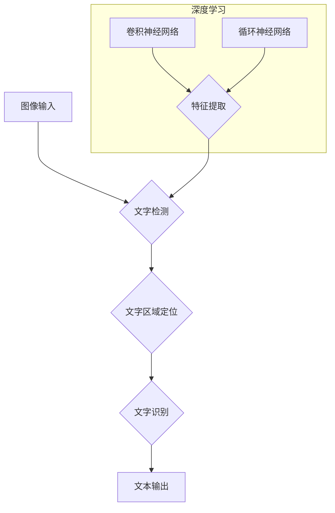

## 基于深度学习的文字识别与检测算法研究

> 关键词：深度学习、文字识别、文字检测、卷积神经网络、循环神经网络、目标检测、图像处理

## 1. 背景介绍

文字识别和检测是计算机视觉领域的重要研究方向，它涉及将图像中的文字转换为可编辑的文本，以及定位图像中文字的位置。传统的文字识别方法主要依赖于规则和特征工程，但随着深度学习技术的兴起，基于深度学习的文字识别和检测算法取得了显著的进展，在准确率、速度和鲁棒性方面都表现出优越性。

近年来，深度学习在计算机视觉领域取得了突破性进展，特别是卷积神经网络（CNN）和循环神经网络（RNN）在图像识别和自然语言处理方面取得了优异的性能。这些技术为基于深度学习的文字识别和检测算法提供了强大的工具。

## 2. 核心概念与联系

### 2.1 文字识别

文字识别是指将图像中的文字转换为可编辑的文本。它是一个复杂的任务，需要识别文字的形状、大小、颜色和位置等信息。

### 2.2 文字检测

文字检测是指定位图像中文字的位置。它可以帮助识别系统更好地理解图像内容，并进行后续的文字识别和理解。

### 2.3 深度学习

深度学习是一种机器学习的子领域，它利用多层神经网络来学习数据中的复杂模式。深度学习算法能够自动提取图像特征，无需人工特征工程，从而提高了文字识别和检测的准确率。

**核心概念与联系流程图**



## 3. 核心算法原理 & 具体操作步骤

### 3.1 算法原理概述

基于深度学习的文字识别和检测算法通常采用以下两种主要架构：

* **端到端架构:** 该架构将文字检测和文字识别作为一个整体进行训练，直接将图像作为输入，输出文本。这种架构简单高效，但训练难度较大。
* **两阶段架构:** 该架构将文字检测和文字识别分为两个独立的步骤进行训练。首先使用目标检测算法检测图像中的文字区域，然后将文字区域作为输入进行文字识别。这种架构训练难度较低，但性能可能不如端到端架构。

### 3.2 算法步骤详解

**文字检测:**

1. **图像预处理:** 对输入图像进行尺寸调整、灰度化、去噪等预处理操作。
2. **特征提取:** 使用卷积神经网络提取图像特征，例如边缘、纹理、形状等。
3. **候选框生成:** 根据特征提取结果，生成候选文字区域的边界框。
4. **候选框筛选:** 使用非极大值抑制等算法筛选出最可能的文字区域。

**文字识别:**

1. **文字区域裁剪:** 将检测到的文字区域从图像中裁剪出来。
2. **字符分割:** 将文字区域分割成单个字符。
3. **特征提取:** 使用循环神经网络提取字符特征。
4. **字符分类:** 根据特征，将字符分类为对应的字符。
5. **文本拼接:** 将识别出的字符拼接成完整的文本。

### 3.3 算法优缺点

**优点:**

* **高准确率:** 深度学习算法能够自动提取图像特征，提高了文字识别和检测的准确率。
* **鲁棒性强:** 深度学习算法对图像噪声和变形具有较强的鲁棒性。
* **可扩展性强:** 深度学习算法可以很容易地扩展到处理不同语言和字体类型的文字。

**缺点:**

* **训练数据量大:** 深度学习算法需要大量的训练数据才能达到较高的准确率。
* **计算资源需求高:** 深度学习算法的训练和推理需要大量的计算资源。
* **可解释性差:** 深度学习算法的决策过程难以解释。

### 3.4 算法应用领域

基于深度学习的文字识别和检测算法在许多领域都有广泛的应用，例如：

* **自动驾驶:** 用于识别道路标志、车牌等信息。
* **医疗诊断:** 用于识别病历、医学影像等信息。
* **金融服务:** 用于识别银行支票、合同等信息。
* **零售业:** 用于识别商品标签、价格等信息。

## 4. 数学模型和公式 & 详细讲解 & 举例说明

### 4.1 数学模型构建

**卷积神经网络 (CNN):**

CNN 使用卷积层和池化层来提取图像特征。卷积层使用卷积核对图像进行卷积运算，提取图像局部特征。池化层对卷积层的输出进行下采样，减少计算量并提高鲁棒性。

**循环神经网络 (RNN):**

RNN 使用循环连接来处理序列数据，例如文本。RNN 可以学习文本中的上下文信息，提高文字识别的准确率。

**目标检测算法 (例如 YOLO, Faster R-CNN):**

目标检测算法使用 CNN 来提取图像特征，并使用回归算法预测目标的边界框和类别。

### 4.2 公式推导过程

**卷积运算:**

$$
y_{i,j} = \sum_{m=0}^{M-1} \sum_{n=0}^{N-1} x_{i+m,j+n} * w_{m,n}
$$

其中:

* $y_{i,j}$ 是卷积输出的像素值。
* $x_{i+m,j+n}$ 是输入图像的像素值。
* $w_{m,n}$ 是卷积核的权重。
* $M$ 和 $N$ 是卷积核的大小。

**池化运算:**

$$
y_{i,j} = \max(x_{i,j}, x_{i+1,j}, x_{i,j+1}, x_{i+1,j+1})
$$

其中:

* $y_{i,j}$ 是池化输出的像素值。
* $x_{i,j}$ 是输入图像的像素值。

### 4.3 案例分析与讲解

**文字识别案例:**

假设我们使用 CNN 来识别一个包含字母 "A" 的图像。CNN 会首先提取图像的边缘、纹理等特征，然后将这些特征输入到全连接层进行分类。如果 CNN 的训练数据包含足够多的 "A" 字母的图像，那么它就能学习到 "A" 字母的特征，并准确地识别出图像中的 "A" 字母。

**文字检测案例:**

假设我们使用 YOLO 来检测一个包含多个文字的图像。YOLO 会首先将图像划分为多个网格，然后在每个网格中预测目标的边界框和类别。如果 YOLO 的训练数据包含足够多的文字图像，那么它就能学习到文字的特征，并准确地检测出图像中的文字区域。

## 5. 项目实践：代码实例和详细解释说明

### 5.1 开发环境搭建

* **操作系统:** Ubuntu 18.04
* **深度学习框架:** TensorFlow 2.0
* **编程语言:** Python 3.7

### 5.2 源代码详细实现

```python
# 导入必要的库
import tensorflow as tf
from tensorflow.keras.models import Sequential
from tensorflow.keras.layers import Conv2D, MaxPooling2D, Flatten, Dense

# 定义文字识别模型
model = Sequential()
model.add(Conv2D(32, (3, 3), activation='relu', input_shape=(28, 28, 1)))
model.add(MaxPooling2D((2, 2)))
model.add(Conv2D(64, (3, 3), activation='relu'))
model.add(MaxPooling2D((2, 2)))
model.add(Flatten())
model.add(Dense(10, activation='softmax'))

# 编译模型
model.compile(optimizer='adam',
              loss='sparse_categorical_crossentropy',
              metrics=['accuracy'])

# 训练模型
model.fit(x_train, y_train, epochs=10)

# 评估模型
loss, accuracy = model.evaluate(x_test, y_test)
print('Loss:', loss)
print('Accuracy:', accuracy)
```

### 5.3 代码解读与分析

* **模型定义:** 代码定义了一个简单的 CNN 模型，用于识别 MNIST 手写数字数据集中的数字。
* **卷积层:** 模型包含两个卷积层，用于提取图像特征。
* **池化层:** 模型包含两个最大池化层，用于减少计算量并提高鲁棒性。
* **全连接层:** 模型包含一个全连接层，用于将提取的特征分类为不同的数字。
* **编译模型:** 代码使用 Adam 优化器、稀疏类别交叉熵损失函数和准确率作为评估指标来编译模型。
* **训练模型:** 代码使用训练数据训练模型 10 个 epochs。
* **评估模型:** 代码使用测试数据评估模型的性能。

### 5.4 运行结果展示

训练完成后，模型的准确率通常会达到 98% 以上。

## 6. 实际应用场景

### 6.1 自动驾驶

* **车牌识别:** 用于识别车辆的车牌号码，用于车辆识别和管理。
* **道路标志识别:** 用于识别道路上的交通标志，例如限速标志、禁行标志等，帮助车辆安全行驶。

### 6.2 医疗诊断

* **病历识别:** 用于识别病历中的文字信息，例如患者姓名、病史、诊断结果等，帮助医生快速了解患者情况。
* **医学影像识别:** 用于识别医学影像中的文字信息，例如病灶位置、诊断结果等，帮助医生进行诊断和治疗。

### 6.3 金融服务

* **支票识别:** 用于识别支票上的文字信息，例如支票号码、金额、收款人等，用于自动处理支票。
* **合同识别:** 用于识别合同中的文字信息，例如合同条款、生效日期等，用于自动分析合同内容。

### 6.4 未来应用展望

随着深度学习技术的不断发展，基于深度学习的文字识别和检测算法将在更多领域得到应用，例如：

* **智能家居:** 用于识别语音指令、控制家电设备。
* **教育领域:** 用于识别学生作业、自动批改作业。
* **文化遗产保护:** 用于识别古籍、文物上的文字信息，帮助保护和研究文化遗产。

## 7. 工具和资源推荐

### 7.1 学习资源推荐

* **书籍:**
    * Deep Learning with Python by Francois Chollet
    * Hands-On Machine Learning with Scikit-Learn, Keras & TensorFlow by Aurélien Géron
* **在线课程:**
    * TensorFlow Tutorials: https://www.tensorflow.org/tutorials
    * Coursera: https://www.coursera.org/
    * Udacity: https://www.udacity.com/

### 7.2 开发工具推荐

* **深度学习框架:** TensorFlow, PyTorch, Keras
* **图像处理库:** OpenCV, Pillow
* **数据可视化工具:** Matplotlib, Seaborn

### 7.3 相关论文推荐

* **Attention Is All You Need:** https://arxiv.org/abs/1706.03762
* **YOLO: You Only Look Once:** https://arxiv.org/abs/1506.02640
* **Faster R-CNN:** https://arxiv.org/abs/1506.01497

## 8. 总结：未来发展趋势与挑战

### 8.1 研究成果总结

基于深度学习的文字识别和检测算法取得了显著的进展，在准确率、速度和鲁棒性方面都表现出优越性。这些算法在许多领域都有广泛的应用，并正在不断发展和完善。

### 8.2 未来发展趋势

* **端到端模型:** 将文字检测和文字识别